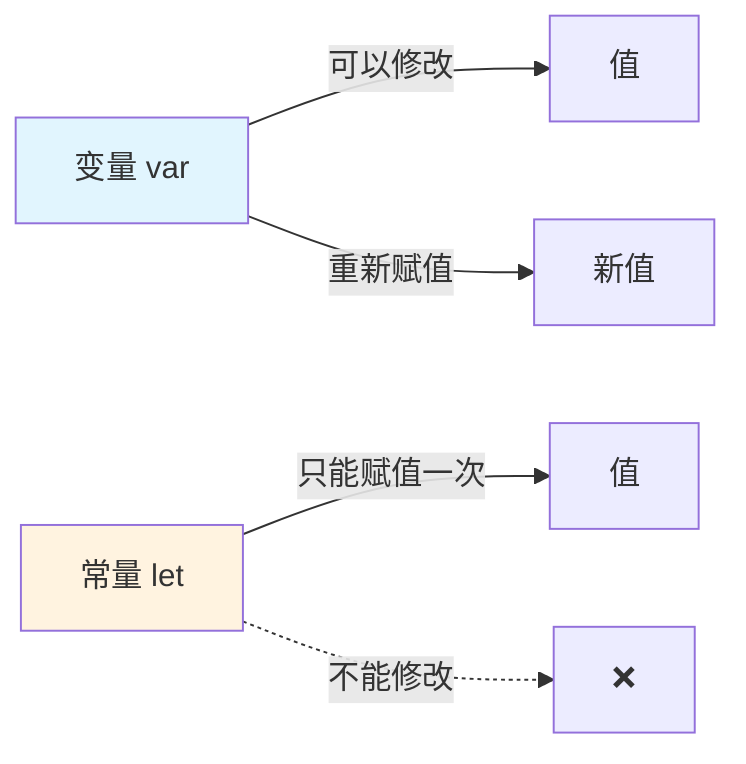
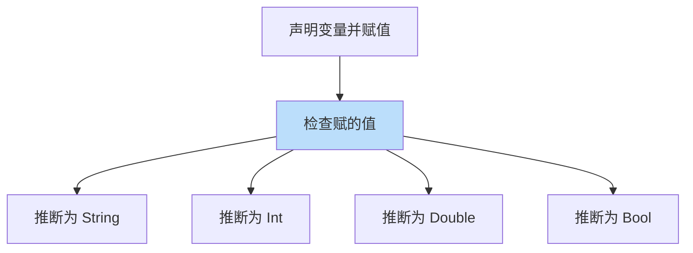
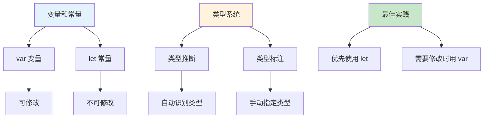

# 第01课：变量和常量

## 📖 学习目标
- 理解什么是变量和常量
- 学会使用 `var` 声明变量
- 学会使用 `let` 声明常量
- 了解命名规范和最佳实践

---

## 什么是变量和常量？

在编程中，我们需要存储数据。就像你有一个盒子，可以把东西放进去。

- **变量**：像一个可以反复打开的盒子，你可以改变里面的内容
- **常量**：像一个封死的盒子，一旦放进去就不能再改变了

### 图示理解



**关键区别对比：**

| 特性 | 变量 (var) | 常量 (let) |
|------|-----------|-----------|
| 关键字 | `var` | `let` |
| 能否修改 | ✅ 可以 | ❌ 不可以 |
| 使用场景 | 值会变化 | 值固定不变 |
| 推荐度 | 需要时使用 | 优先使用 |

---

## 变量（var）

使用 `var` 关键字声明变量。变量的值可以在程序运行过程中被修改。

**什么时候用变量？**
- 当你存储的值会变化时，比如用户的年龄、游戏的分数、计数器等
- 变量就像一个可以反复打开的盒子，你可以随时往里面放新东西

### 基本语法

```swift
var 变量名 = 值
```

**语法说明：**
- `var` 是关键字，告诉 Swift "我要创建一个变量"
- `变量名` 是你给变量起的名字，比如 `name`、`age`
- `=` 是赋值运算符，把右边的值放到左边的变量里
- `值` 是你要存储的数据

### 示例

让我们来看几个具体的例子：

```swift
// 声明一个字符串变量并赋值
var name = "小明"  // 创建一个叫 name 的变量，存储"小明"
print(name)        // 打印变量的值，输出：小明

// 修改变量的值
name = "小红"      // 把 name 的值改成"小红"
print(name)        // 再次打印，输出：小红

// 声明一个整数变量
var age = 18       // 创建一个叫 age 的变量，存储数字 18
print(age)         // 输出：18

// 修改数字变量
age = 19           // 把 age 的值改成 19
print(age)         // 输出：19
```

**代码解读：**
1. 第一行：我们用 `var` 创建了一个叫 `name` 的变量，并给它赋值为 `"小明"`
2. 第二行：用 `print()` 函数打印变量的值
3. 第三行：我们可以随时改变变量的值，这里改成了 `"小红"`
4. 后面的代码演示了数字变量的使用

### 同时声明多个变量

如果你想同时声明多个变量，可以用逗号分隔：

```swift
var x = 10, y = 20, z = 30  // 一行声明三个变量
print(x, y, z)  // 输出：10 20 30
```

**注意：** 虽然可以一行声明多个变量，但为了代码清晰，通常建议每行声明一个变量。

---

## 常量（let）

使用 `let` 关键字声明常量。常量一旦被赋值，就不能再被修改。

### 基本语法

```swift
let 常量名 = 值
```

### 示例

```swift
// 声明一个常量
let pi = 3.14159
print(pi)  // 输出：3.14159

// 尝试修改常量会报错！
// pi = 3.14  // ❌ 错误：不能修改常量的值

// 声明一个常量字符串
let greeting = "你好，Swift！"
print(greeting)  // 输出：你好，Swift！

// greeting = "Hello"  // ❌ 错误
```

---

## 类型标注

Swift 是类型安全的语言。你可以在声明时明确指定变量或常量的类型。

### 语法

```swift
var 变量名: 类型 = 值
let 常量名: 类型 = 值
```

### 示例

```swift
// 明确指定类型
var myName: String = "张三"
var myAge: Int = 25
var myHeight: Double = 1.75
var isStudent: Bool = true

print(myName)    // 输出：张三
print(myAge)     // 输出：25
print(myHeight)  // 输出：1.75
print(isStudent) // 输出：true
```

### 常见数据类型

| 类型 | 说明 | 示例 |
|------|------|------|
| `Int` | 整数 | `42`, `-10` |
| `Double` | 双精度浮点数 | `3.14`, `-0.5` |
| `Float` | 单精度浮点数 | `3.14` |
| `String` | 字符串 | `"Hello"` |
| `Bool` | 布尔值 | `true`, `false` |

---

## 命名规范

### 合法的命名

```swift
var myVariable = 10      // ✅ 使用驼峰命名法
var _count = 5           // ✅ 可以使用下划线开头
var numberOfStudents = 30 // ✅ 描述性命名
```

### 不合法的命名

```swift
// var 123abc = 10       // ❌ 不能以数字开头
// var my-variable = 10  // ❌ 不能包含连字符
// var my variable = 10  // ❌ 不能包含空格
// var let = 10          // ❌ 不能使用保留关键字
```

### 最佳实践

1. 使用有意义的变量名：`age` 比 `a` 好
2. 使用驼峰命名法：`firstName` 不是 `firstname` 或 `first_name`
3. 常量通常使用全大写：`let MAX_SIZE = 100`

---

## 什么时候用 var，什么时候用 let？

**原则：能用 `let` 就用 `let`，只有需要修改时才用 `var`**

```swift
// ✅ 好的做法
let birthYear = 1995    // 出生年份不会变
var currentAge = 29     // 年龄会随时间变化

// ❌ 不好的做法
var birthYear2 = 1995   // 用 var 声明不会被修改的值
```

---

## 类型推断

Swift 可以自动推断变量的类型，所以你不需要每次都写类型标注。

```swift
// Swift 自动推断类型
var name = "小明"        // 推断为 String
var age = 18            // 推断为 Int
var height = 1.75       // 推断为 Double
var isHappy = true      // 推断为 Bool

// 等同于
var name2: String = "小明"
var age2: Int = 18
var height2: Double = 1.75
var isHappy2: Bool = true
```

### 类型推断流程图



> ⚠️ **注意：** 类型一旦推断确定，就不能改变！
> ```swift
> var x = 10      // 推断为 Int
> x = "hello"     // ❌ 错误！不能把 String 赋给 Int 变量
> ```

---

## 打印输出

使用 `print()` 函数输出变量的值。

```swift
var city = "北京"
var population = 21000000

// 基本打印
print(city)  // 输出：北京

// 使用字符串插值
print("城市：\(city)")           // 输出：城市：北京
print("人口：\(population) 万")  // 输出：人口：21000000 万

// 多个值一起打印
print(city, population)  // 输出：北京 21000000
```

---

## 📝 练习题

### 练习1：声明变量
声明以下变量并打印它们：
- 你的名字（字符串）
- 你的年龄（整数）
- 你的身高（浮点数）
- 是否是学生（布尔值）

```swift
// 在这里写你的代码

```

### 练习2：修改变量
声明一个变量 `score` 初始值为 80，然后修改为 90，最后修改为 95，每次修改后都打印出来。

```swift
// 在这里写你的代码

```

### 练习3：使用常量
声明一个常量 `earthGravity` 值为 9.8，然后尝试修改它，看看会发生什么。

```swift
// 在这里写你的代码

```

### 练习4：类型标注
使用类型标注声明以下变量：
- 一个字符串变量 `productName` 值为 "iPhone"
- 一个整数常量 `price` 值为 999
- 一个双精度浮点变量 `discount` 值为 0.9
- 一个布尔常量 `isInStock` 值为 true

```swift
// 在这里写你的代码

```

### 练习5：字符串插值
声明两个变量 `firstName` 和 `lastName`，然后使用字符串插值打印出完整的姓名。

```swift
// 在这里写你的代码

```

### 练习6：温度转换
声明一个常量 `celsius` 值为 25.0，然后计算对应的华氏温度（公式：华氏 = 摄氏 × 9/5 + 32），将结果存储在变量 `fahrenheit` 中并打印。

```swift
// 在这里写你的代码

```

---

## ✅ 练习题参考答案

> 💡 **提示：** 建议先独立完成练习，再查看答案

---


### 练习1
```swift
var myName = "你的名字"
var myAge = 20
var myHeight = 1.70
var isStudent = true

print(myName)
print(myAge)
print(myHeight)
print(isStudent)
```

### 练习2
```swift
var score = 80
print(score)  // 80

score = 90
print(score)  // 90

score = 95
print(score)  // 95
```

### 练习3
```swift
let earthGravity = 9.8
print(earthGravity)  // 9.8

// earthGravity = 10.0  // ❌ 这行会报错
```

### 练习4
```swift
var productName: String = "iPhone"
let price: Int = 999
var discount: Double = 0.9
let isInStock: Bool = true

print(productName)
print(price)
print(discount)
print(isInStock)
```

### 练习5
```swift
var firstName = "小"
var lastName = "明"
var fullName = firstName + lastName
print("全名：\(fullName)")
```

### 练习6
```swift
let celsius = 25.0
var fahrenheit = celsius * 9 / 5 + 32
print("摄氏 \(celsius)° = 华氏 \(fahrenheit)°F")
```


---

## 🎯 小结



**核心要点：**
- ✅ 使用 `var` 声明变量（可修改）
- ✅ 使用 `let` 声明常量（不可修改）
- ✅ Swift 是类型安全的语言，会自动推断类型
- ✅ 使用字符串插值 `\()` 在字符串中嵌入变量
- ✅ **优先使用 `let`**，只在需要修改时用 `var`

**⚠️ 常见错误：**
```swift
let x = 10
x = 20  // ❌ 错误：不能修改常量

var y = 10
y = 20  // ✅ 正确：变量可以修改
```

---

**下一课：[第02课：数据类型](第02课：数据类型.md)**
