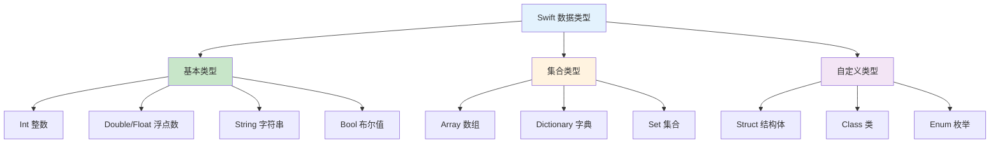

# 第02课：数据类型

## 📖 学习目标
- 掌握 Swift 的基本数据类型
- 理解整数、浮点数、字符串和布尔类型
- 学会类型转换
- 了解元组（Tuple）的使用

---

## 数据类型概览

Swift 是类型安全的语言，这意味着它会确保你不会把错误的类型赋给变量。

### 数据类型层次图



### 数据类型对比表

| 类型 | 说明 | 示例 | 内存占用 |
|------|------|------|----------|
| `Int` | 整数 | `42`, `-10` | 8 字节 |
| `Double` | 双精度浮点数 | `3.14` | 8 字节 |
| `Float` | 单精度浮点数 | `3.14` | 4 字节 |
| `String` | 字符串 | `"Hello"` | 动态 |
| `Bool` | 布尔值 | `true`, `false` | 1 字节 |

---

## Swift 的基本数据类型

Swift 是类型安全的语言，这意味着它会确保你不会把错误的类型赋给变量。

### 1. 整数类型（Integer）

整数是没有小数点的数字。

```swift
// Int - 根据平台自动选择 32 位或 64 位
var age: Int = 25
var temperature: Int = -10

// 明确指定位数
var a: Int8 = 127      // -128 到 127
var b: Int16 = 32767   // -32768 到 32767
var c: Int32 = 2147483647
var d: Int64 = 9223372036854775807

// 无符号整数（只能是正数或0）
var e: UInt = 100
var f: UInt8 = 255     // 0 到 255
```

#### 整数的最大值和最小值

```swift
print(Int.max)   // 9223372036854775807（64位系统）
print(Int.min)   // -9223372036854775808
print(UInt8.max) // 255
print(UInt8.min) // 0
```

#### 不同进制表示

```swift
let decimal = 17        // 十进制
let binary = 0b10001    // 二进制，等于 17
let octal = 0o21        // 八进制，等于 17
let hexadecimal = 0x11  // 十六进制，等于 17

print(decimal, binary, octal, hexadecimal)  // 都输出 17
```

#### 数字分隔符（提高可读性）

```swift
let oneMillion = 1_000_000
let creditCardNumber = 1234_5678_9012_3456
print(oneMillion)       // 1000000
print(creditCardNumber) // 1234567890123456
```

---

### 2. 浮点数类型（Floating-Point）

浮点数是带有小数点的数字。

```swift
// Double - 双精度浮点数（64位），推荐使用
var height: Double = 1.75
var pi: Double = 3.14159265358979

// Float - 单精度浮点数（32位）
var weight: Float = 65.5
var temperature: Float = 36.6

print(height)      // 1.75
print(pi)          // 3.14159265358979
print(weight)      // 65.5
print(temperature) // 36.6
```

#### 科学计数法

```swift
let e = 2.5e2      // 2.5 × 10² = 250.0
let f = 1.25e-2    // 1.25 × 10⁻² = 0.0125
let g = 0xFp2      // 15 × 2² = 60.0（十六进制科学计数法）

print(e)  // 250.0
print(f)  // 0.0125
print(g)  // 60.0
```

#### Double 和 Float 的选择

```swift
// 推荐使用 Double，精度更高
let preciseValue: Double = 0.1 + 0.2
print(preciseValue)  // 0.3（可能有微小误差）

// Float 精度较低
let lessPrecise: Float = 0.1 + 0.2
print(lessPrecise)   // 0.3
```

---

### 3. 布尔类型（Boolean）

布尔值只有两个：`true` 和 `false`。

```swift
var isStudent: Bool = true
var hasLicense: Bool = false

print(isStudent)   // true
print(hasLicense)  // false

// 布尔值常用于条件判断
if isStudent {
    print("这是学生")
} else {
    print("这不是学生")
}
```

#### 布尔运算

```swift
let a = true
let b = false

print(a && b)  // false（与运算）
print(a || b)  // true（或运算）
print(!a)      // false（非运算）
```

---

### 4. 字符串类型（String）

字符串是字符的有序集合。

```swift
// 声明字符串
var greeting: String = "Hello, World!"
var name = "小明"  // 类型推断为 String

// 空字符串
var emptyString1 = ""
var emptyString2 = String()
```

#### 字符串常用操作

```swift
var message = "Hello"

// 获取长度
print(message.count)  // 5

// 拼接字符串
message += " Swift"
print(message)  // Hello Swift

// 字符串插值
let age = 18
print("我今年 \(age) 岁")  // 我今年 18 岁

// 多行字符串
let multiLine = """
这是第一行
这是第二行
这是第三行
"""
print(multiLine)
```

#### 字符串方法

```swift
let str = "Hello, Swift!"

// 检查是否为空
print(str.isEmpty)  // false

// 是否包含某子串
print(str.contains("Swift"))  // true

// 是否以某字符串开头/结尾
print(str.hasPrefix("Hello"))  // true
print(str.hasSuffix("!"))      // true

// 转换大小写
print(str.uppercased())  // HELLO, SWIFT!
print(str.lowercased())  // hello, swift!

// 替换
let newStr = str.replacingOccurrences(of: "Swift", with: "World")
print(newStr)  // Hello, World!
```

---

### 5. 字符类型（Character）

字符是单个字符。

```swift
var letter: Character = "A"
var emoji: Character = "😀"

print(letter)  // A
print(emoji)   // 😀

// 遍历字符串中的字符
for char in "Hello" {
    print(char, terminator: " ")
}
// 输出：H e l l o
```

---

## 类型转换

不同类型之间不能直接运算，需要显式转换。

### 整数和浮点数转换

```swift
let intNum: Int = 42
let doubleNum: Double = 3.14

// ❌ 错误：不同类型不能直接运算
// let result = intNum + doubleNum

// ✅ 正确：显式转换
let result1 = Double(intNum) + doubleNum
print(result1)  // 45.14

let result2 = intNum + Int(doubleNum)  // 会丢失小数部分
print(result2)  // 45
```

### 字符串和数字转换

```swift
// 数字转字符串
let num = 100
let str1 = String(num)
print(str1)  // "100"

let pi = 3.14
let str2 = String(pi)
print(str2)  // "3.14"

// 字符串转数字
let str3 = "123"
if let num1 = Int(str3) {
    print(num1)  // 123
}

let str4 = "3.14"
if let num2 = Double(str4) {
    print(num2)  // 3.14
}

// 转换失败的情况
let str5 = "Hello"
if let num3 = Int(str5) {
    print(num3)
} else {
    print("转换失败")  // 会执行这行
}
```

---

## 元组（Tuple）

元组可以将多个值组合成一个复合值。

### 创建元组

```swift
// 创建元组
let httpError = (404, "Not Found")
print(httpError)  // (404, "Not Found")

// 访问元组元素（从0开始）
print(httpError.0)  // 404
print(httpError.1)  // Not Found

// 命名元组
let person = (name: "小明", age: 18, city: "北京")
print(person.name)  // 小明
print(person.age)   // 18
print(person.city)  // 北京
```

### 元组解构

```swift
// 解构元组
let (statusCode, statusMessage) = (404, "Not Found")
print(statusCode)     // 404
print(statusMessage)  // Not Found

// 忽略某些值
let (x, _, z) = (1, 2, 3)
print(x, z)  // 1 3
```

### 元组作为函数返回值

```swift
func getMinMax(array: [Int]) -> (min: Int, max: Int)? {
    guard let min = array.min(), let max = array.max() else {
        return nil
    }
    return (min, max)
}

if let result = getMinMax(array: [3, 1, 4, 1, 5, 9]) {
    print("最小值：\(result.min)，最大值：\(result.max)")
    // 输出：最小值：1，最大值：9
}
```

---

## 类型别名

使用 `typealias` 为现有类型创建别名。

```swift
// 为类型创建别名
typealias AudioSample = UInt16
typealias Point = (x: Double, y: Double)

// 使用别名
var sample: AudioSample = 32767
print(sample)  // 32767

let origin: Point = (0.0, 0.0)
print(origin.x, origin.y)  // 0.0 0.0
```

---

## 📝 练习题

### 练习1：整数练习
声明以下变量并打印：
- 一个 Int 变量 `score` 值为 95
- 一个 UInt 变量 `count` 值为 100
- 一个 Int8 变量 `temperature` 值为 -20

```swift
// 在这里写你的代码

```

### 练习2：浮点数练习
计算并打印：
- 圆的面积（半径 r = 5.0，面积 = π × r²）
- 球的体积（半径 r = 3.0，体积 = 4/3 × π × r³）

```swift
// 在这里写你的代码

```

### 练习3：类型转换
声明一个整数 `a = 10` 和一个浮点数 `b = 3.0`，计算 `a / b` 的结果（需要类型转换）。

```swift
// 在这里写你的代码

```

### 练习4：字符串操作
声明一个字符串 `sentence = "I love Swift programming"`，完成以下操作：
1. 打印字符串的长度
2. 检查是否包含 "Swift"
3. 将字符串转换为大写
4. 将 "Swift" 替换为 "Python"

```swift
// 在里写你的代码

```

### 练习5：元组练习
创建一个元组来存储一本书的信息：书名、作者、出版年份、价格。然后打印这些信息。

```swift
// 在这里写你的代码

```

### 练习6：类型别名
创建一个类型别名 `Temperature` 表示 `Double`，然后用它声明一个变量存储体温 36.6。

```swift
// 在这里写你的代码

```

### 练习7：综合练习
计算购物车的总价：
- 商品1：数量 2，单价 29.9
- 商品2：数量 1，单价 99.5
- 商品3：数量 3，单价 15.0

使用合适的类型声明变量，并计算总价。

```swift
// 在这里写你的代码

```

---

## ✅ 练习题参考答案

> 💡 **提示：** 建议先独立完成练习，再查看答案

---


### 练习1
```swift
var score: Int = 95
var count: UInt = 100
var temperature: Int8 = -20

print(score)       // 95
print(count)       // 100
print(temperature) // -20
```

### 练习2
```swift
let pi = 3.14159265358979

// 圆的面积
let r1: Double = 5.0
let area = pi * r1 * r1
print("圆的面积：\(area)")  // 78.5398163397448

// 球的体积
let r2: Double = 3.0
let volume = 4.0 / 3.0 * pi * r2 * r2 * r2
print("球的体积：\(volume)")  // 113.097335529233
```

### 练习3
```swift
let a = 10
let b = 3.0

// 方法1：将 Int 转换为 Double
let result1 = Double(a) / b
print(result1)  // 3.3333333333333335

// 方法2：将 Double 转换为 Int（会丢失小数）
let result2 = a / Int(b)
print(result2)  // 3
```

### 练习4
```swift
var sentence = "I love Swift programming"

// 1. 字符串长度
print("长度：\(sentence.count)")  // 24

// 2. 是否包含 Swift
print("包含 Swift：\(sentence.contains("Swift"))")  // true

// 3. 转换为大写
print("大写：\(sentence.uppercased())")

// 4. 替换
let newSentence = sentence.replacingOccurrences(of: "Swift", with: "Python")
print("替换后：\(newSentence)")
```

### 练习5
```swift
let book = (title: "Swift编程入门", author: "张三", year: 2024, price: 59.9)

print("书名：\(book.title)")
print("作者：\(book.author)")
print("出版年份：\(book.year)")
print("价格：\(book.price) 元")
```

### 练习6
```swift
typealias Temperature = Double

let bodyTemp: Temperature = 36.6
print("体温：\(bodyTemp)°C")  // 体温：36.6°C
```

### 练习7
```swift
// 商品1
let quantity1: Int = 2
let price1: Double = 29.9

// 商品2
let quantity2: Int = 1
let price2: Double = 99.5

// 商品3
let quantity3: Int = 3
let price3: Double = 15.0

// 计算总价
let total = Double(quantity1) * price1 + Double(quantity2) * price2 + Double(quantity3) * price3
print("总价：\(total) 元")  // 总价：204.3 元
```


---

## 🎯 小结

| 类型 | 说明 | 示例 |
|------|------|------|
| `Int` | 整数 | `42`, `-10` |
| `Double` | 双精度浮点数 | `3.14` |
| `Float` | 单精度浮点数 | `3.14` |
| `String` | 字符串 | `"Hello"` |
| `Bool` | 布尔值 | `true`, `false` |
| `Character` | 单个字符 | `"A"` |
| 元组 | 复合值 | `(1, "Hello")` |

- Swift 是类型安全的语言
- 不同类型之间需要显式转换
- 优先使用 `Double` 而不是 `Float`
- 元组可以组合多个值

---

**上一课：[第01课：变量和常量](第01课：变量和常量.md)**
**下一课：[第03课：字符串操作](第03课：字符串操作.md)**
