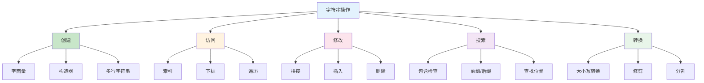

# 第03课：字符串操作

## 📖 学习目标
- 掌握字符串的创建和初始化
- 学会字符串的常用操作方法
- 理解字符串索引和切片
- 掌握字符串的比较和搜索

---

## 字符串概览

字符串是 Swift 中最常用的数据类型之一，用于处理文本数据。

### 字符串操作分类图



### 常用字符串方法速查表

| 操作 | 方法 | 示例 |
|------|------|------|
| 长度 | `.count` | `"Hello".count` → 5 |
| 是否为空 | `.isEmpty` | `"".isEmpty` → true |
| 包含 | `.contains()` | `"Hello".contains("ell")` → true |
| 前缀 | `.hasPrefix()` | `"Hello".hasPrefix("He")` → true |
| 后缀 | `.hasSuffix()` | `"Hello".hasSuffix("lo")` → true |
| 替换 | `.replacingOccurrences()` | 替换子串 |
| 分割 | `.components()` | 按分隔符分割 |
| 大写 | `.uppercased()` | `"hello".uppercased()` → "HELLO" |
| 小写 | `.lowercased()` | `"HELLO".lowercased()` → "hello" |

---

## 字符串基础

### 创建字符串

```swift
// 方式1：字面量
var greeting = "Hello, World!"

// 方式2：使用构造器
var emptyString1 = ""
var emptyString2 = String()

// 方式3：重复字符
let stars = String(repeating: "⭐", count: 5)
print(stars)  // ⭐⭐⭐⭐⭐

// 方式4：多行字符串
let multiLine = """
第一行
第二行
第三行
"""
print(multiLine)
```

### 判断字符串是否为空

```swift
var str1 = "Hello"
var str2 = ""

print(str1.isEmpty)  // false
print(str2.isEmpty)  // true

// 常用的判断方式
if !str1.isEmpty {
    print("字符串不为空")
}
```

### 获取字符串长度

```swift
let message = "Hello, Swift!"
print(message.count)  // 13

// 注意：中文字符和 emoji 也是一个 count
let chinese = "你好世界"
print(chinese.count)  // 4

let emoji = "😀🎉"
print(emoji.count)  // 2
```

---

## 字符串拼接

### 使用 + 运算符

```swift
let firstName = "小"
let lastName = "明"
let fullName = firstName + lastName
print(fullName)  // 小明

// 多个字符串拼接
let part1 = "Hello"
let part2 = ", "
let part3 = "World!"
let greeting = part1 + part2 + part3
print(greeting)  // Hello, World!
```

### 使用 += 运算符

```swift
var message = "Hello"
message += " Swift"
message += "!"
print(message)  // Hello Swift!
```

### 使用 append() 方法

```swift
var str = "Hello"
str.append(" World")
str.append("!")
print(str)  // Hello World!
```

### 字符串插值（推荐）

```swift
let name = "小明"
let age = 18
let score = 95.5

// 使用 \() 插值
print("姓名：\(name)")
print("年龄：\(age)")
print("分数：\(score)")

// 插值表达式
print("明年 \(age + 1) 岁")
print("分数是 \(Int(score)) 分")
```

---

## 字符串比较

### 相等性比较

```swift
let str1 = "Hello"
let str2 = "Hello"
let str3 = "hello"

// == 比较内容是否相同
print(str1 == str2)  // true
print(str1 == str3)  // false（区分大小写）

// != 比较内容是否不同
print(str1 != str3)  // true
```

### 大小写不敏感比较

```swift
let a = "Hello"
let b = "hello"

// 大小写不敏感比较
print(a.caseInsensitiveCompare(b) == .orderedSame)  // true
```

### 前缀和后缀检查

```swift
let filename = "document.pdf"

// 检查前缀
print(filename.hasPrefix("document"))  // true
print(filename.hasPrefix("doc"))       // true
print(filename.hasPrefix("pdf"))       // false

// 检查后缀
print(filename.hasSuffix(".pdf"))      // true
print(filename.hasSuffix(".txt"))      // false
```

---

## 字符串搜索

### 检查是否包含子串

```swift
let sentence = "I love Swift programming"

// 使用 contains()
print(sentence.contains("Swift"))      // true
print(sentence.contains("Python"))     // false

// 使用 range(of:) 查找位置
if let range = sentence.range(of: "Swift") {
    print("找到 Swift，在位置：\(range)")
}
```

### 查找子串位置

```swift
let text = "Hello, Swift, Hello, World"

// 查找第一次出现的位置
if let range = text.range(of: "Hello") {
    let position = text.distance(from: text.startIndex, to: range.lowerBound)
    print("第一次出现位置：\(position)")  // 0
}

// 查找最后一次出现的位置
if let range = text.range(of: "Hello", options: .backwards) {
    let position = text.distance(from: text.startIndex, to: range.lowerBound)
    print("最后一次出现位置：\(position)")  // 14
}
```

---

## 字符串截取和分割

### 使用前缀和后缀

```swift
let filename = "document.pdf"

// 获取前缀（去掉后缀）
let nameWithoutExtension = filename.prefix(while: { $0 != "." })
print(nameWithoutExtension)  // document

// 获取后缀
let dotIndex = filename.lastIndex(of: ".")!
let extension_ = filename[filename.index(after: dotIndex)...]
print(extension_)  // pdf
```

### 使用 components(separatedBy:) 分割

```swift
let csvData = "张三,李四,王五,赵六"
let names = csvData.components(separatedBy: ",")
print(names)  // ["张三", "李四", "王五", "赵六"]

// 遍历分割后的数组
for name in names {
    print(name)
}

// 按空格分割
let sentence = "Hello World Swift"
let words = sentence.components(separatedBy: " ")
print(words)  // ["Hello", "World", "Swift"]
```

### 使用 split() 方法

```swift
let text = "one,two,three,four"
let parts = text.split(separator: ",")
print(parts)  // ["one", "two", "three", "four"]

// 限制分割次数
let limited = text.split(separator: ",", maxSplits: 2)
print(limited)  // ["one", "two", "three,four"]
```

---

## 字符串替换

### 替换所有匹配项

```swift
var text = "Hello World World"
let newText = text.replacingOccurrences(of: "World", with: "Swift")
print(newText)  // Hello Swift Swift
```

### 替换特定范围

```swift
let text = "Hello World"
if let range = text.range(of: "World") {
    let newText = text.replacingCharacters(in: range, with: "Swift")
    print(newText)  // Hello Swift
}
```

### 使用正则表达式替换

```swift
let text = "My phone number is 123-456-7890"
let pattern = "\\d{3}-\\d{3}-\\d{4}"
let newText = text.replacingOccurrences(
    of: pattern,
    with: "***-***-****",
    options: .regularExpression
)
print(newText)  // My phone number is ***-***-****
```

---

## 字符串大小写转换

```swift
let text = "Hello, Swift!"

// 全大写
print(text.uppercased())  // HELLO, SWIFT!

// 全小写
print(text.lowercased())  // hello, swift!

// 首字母大写
print(text.capitalized)   // Hello, Swift!
```

---

## 字符串修剪

### 去除首尾空格

```swift
let text = "  Hello, World!  "

// 去除首尾空格
print(text.trimmingCharacters(in: .whitespaces))
// 输出：Hello, World!

// 去除首尾空格和换行符
let multiline = "\n  Hello  \n"
print(multiline.trimmingCharacters(in: .whitespacesAndNewlines))
// 输出：Hello
```

### 去除指定字符

```swift
let text = "***Hello***"

// 去除首尾的 *
let chars: CharacterSet = ["*"]
print(text.trimmingCharacters(in: chars))
// 输出：Hello
```

---

## 字符串与数组转换

### 字符串转字符数组

```swift
let text = "Hello"
let chars = Array(text)
print(chars)  // ["H", "e", "l", "l", "o"]

// 遍历字符
for char in text {
    print(char, terminator: " ")
}
// 输出：H e l l o
```

### 字符数组转字符串

```swift
let chars: [Character] = ["H", "e", "l", "l", "o"]
let text = String(chars)
print(text)  // Hello
```

### 字符串转字符串数组

```swift
let text = "Hello"
let stringArray = text.map { String($0) }
print(stringArray)  // ["H", "e", "l", "l", "o"]
```

---

## Unicode 和特殊字符

### 转义字符

```swift
// 常用转义字符
print("换行符：Hello\nWorld")
print("制表符：Name\tAge")
print("反斜杠：C:\\Users\\")
print("双引号：\"Hello\"")
print("单引号：\'Hello\'")
```

### Unicode 标量

```swift
// 使用 Unicode 标量
let heart = "\u{2665}"  // ♥
let smiley = "\u{1F600}"  // 😀
print(heart)
print(smiley)
```

---

## 📝 练习题

### 练习1：字符串拼接
声明两个字符串变量 `firstName` 和 `lastName`，使用三种不同的方式拼接成完整姓名并打印。

```swift
// 在这里写你的代码

```

### 练习2：字符串插值
声明变量 `name`、`age`、`height`，使用字符串插值打印一段自我介绍。

```swift
// 在这里写你的代码

```

### 练习3：字符串搜索
给定字符串 `"Hello, Swift, Hello, World"`，完成以下操作：
1. 检查是否包含 "Swift"
2. 查找 "Hello" 第一次出现的位置
3. 查找 "Hello" 最后一次出现的位置
4. 检查是否以 "Hello" 开头
5. 检查是否以 "World" 结尾

```swift
// 在这里写你的代码

```

### 练习4：字符串分割
给定 CSV 格式的字符串 `"张三,25,北京,95.5"`，使用逗号分割并分别打印每个人的信息。

```swift
// 在这里写你的代码

```

### 练习5：字符串替换
给定字符串 `"I love Java programming"`，将 "Java" 替换为 "Swift" 并打印结果。

```swift
// 在这里写你的代码

```

### 练习6：大小写转换
给定字符串 `"hello, WORLD!"`，完成以下操作并打印：
1. 转换为全大写
2. 转换为全小写
3. 转换为首字母大写

```swift
// 在这里写你的代码

```

### 练习7：去除空格
给定字符串 `"  Hello, World!  "`，去除首尾空格后打印，并打印原始长度和处理后的长度。

```swift
// 在这里写你的代码

```

### 练习8：密码验证
编写一个程序，检查密码是否满足以下条件：
- 长度至少 8 个字符
- 包含大写字母
- 包含小写字母
- 包含数字

```swift
// 在这里写你的代码

```

---

## ✅ 练习题参考答案

> 💡 **提示：** 建议先独立完成练习，再查看答案

---


### 练习1
```swift
let firstName = "小"
let lastName = "明"

// 方式1：+ 运算符
let fullName1 = firstName + lastName
print(fullName1)

// 方式2：字符串插值
let fullName2 = "\(firstName)\(lastName)"
print(fullName2)

// 方式3：append
var fullName3 = firstName
fullName3.append(lastName)
print(fullName3)
```

### 练习2
```swift
let name = "小明"
let age = 18
let height = 1.75

print("大家好，我叫\(name)，今年\(age)岁，身高\(height)米。")
```

### 练习3
```swift
let text = "Hello, Swift, Hello, World"

// 1. 是否包含
print(text.contains("Swift"))  // true

// 2. 第一次出现位置
if let range = text.range(of: "Hello") {
    let pos = text.distance(from: text.startIndex, to: range.lowerBound)
    print("第一次出现位置：\(pos)")
}

// 3. 最后一次出现位置
if let range = text.range(of: "Hello", options: .backwards) {
    let pos = text.distance(from: text.startIndex, to: range.lowerBound)
    print("最后一次出现位置：\(pos)")
}

// 4. 前缀检查
print(text.hasPrefix("Hello"))  // true

// 5. 后缀检查
print(text.hasSuffix("World"))  // true
```

### 练习4
```swift
let csv = "张三,25,北京,95.5"
let parts = csv.components(separatedBy: ",")

print("姓名：\(parts[0])")
print("年龄：\(parts[1])")
print("城市：\(parts[2])")
print("分数：\(parts[3])")
```

### 练习5
```swift
let text = "I love Java programming"
let newText = text.replacingOccurrences(of: "Java", with: "Swift")
print(newText)  // I love Swift programming
```

### 练习6
```swift
let text = "hello, WORLD!"

print(text.uppercased())    // HELLO, WORLD!
print(text.lowercased())    // hello, world!
print(text.capitalized)     // Hello, World!
```

### 练习7
```swift
let text = "  Hello, World!  "
let trimmed = text.trimmingCharacters(in: .whitespaces)

print("原始：「\(text)」长度：\(text.count)")
print("处理后：「\(trimmed)」长度：\(trimmed.count)")
```

### 练习8
```swift
func validatePassword(_ password: String) -> Bool {
    // 检查长度
    if password.count < 8 {
        return false
    }

    // 检查是否包含大写字母
    let uppercase = password.range(of: "[A-Z]", options: .regularExpression) != nil

    // 检查是否包含小写字母
    let lowercase = password.range(of: "[a-z]", options: .regularExpression) != nil

    // 检查是否包含数字
    let digit = password.range(of: "[0-9]", options: .regularExpression) != nil

    return uppercase && lowercase && digit
}

// 测试
let password1 = "Abc12345"
let password2 = "abc12345"
let password3 = "Abcdefgh"

print(password1, validatePassword(password1))  // true
print(password2, validatePassword(password2))  // false（没有大写）
print(password3, validatePassword(password3))  // false（没有数字）
```


---

## 🎯 小结

| 操作 | 方法 |
|------|------|
| 拼接 | `+`, `+=`, `append()` |
| 插值 | `\()` |
| 长度 | `.count` |
| 包含 | `.contains()` |
| 前缀/后缀 | `.hasPrefix()`, `.hasSuffix()` |
| 分割 | `.components(separatedBy:)`, `.split()` |
| 替换 | `.replacingOccurrences(of:with:)` |
| 大小写 | `.uppercased()`, `.lowercased()`, `.capitalized` |
| 修剪 | `.trimmingCharacters(in:)` |

---

**上一课：[第02课：数据类型](第02课：数据类型.md)**
**下一课：[第04课：运算符](第04课：运算符.md)**
