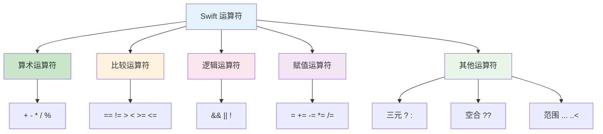
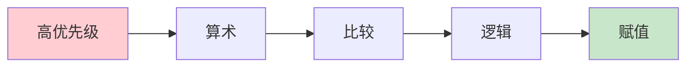

# 第04课：运算符

## 📖 学习目标
- 掌握算术运算符
- 掌握比较运算符
- 掌握逻辑运算符
- 了解赋值运算符
- 理解三元条件运算符

---

## 运算符概览

运算符用于对变量和值进行操作。

### 运算符分类图



### 运算符优先级



| 优先级 | 运算符 | 说明 |
|--------|--------|------|
| 高 | `*` `/` `%` | 乘除取余 |
| 中 | `+` `-` | 加减 |
| 中 | `==` `!=` `>` `<` | 比较 |
| 低 | `&&` | 逻辑与 |
| 最低 | `\|\|` | 逻辑或 |

---

## 算术运算符

用于执行基本的数学运算。

| 运算符 | 名称 | 示例 | 结果 |
|--------|------|------|------|
| `+` | 加法 | `5 + 3` | `8` |
| `-` | 减法 | `5 - 3` | `2` |
| `*` | 乘法 | `5 * 3` | `15` |
| `/` | 除法 | `5 / 3` | `1` |
| `%` | 取余 | `5 % 3` | `2` |

### 示例

```swift
let a = 10
let b = 3

print(a + b)   // 13
print(a - b)   // 7
print(a * b)   // 30
print(a / b)   // 3（整数除法，结果取整）
print(a % b)   // 1

// 浮点数除法
let x = 10.0
let y = 3.0
print(x / y)   // 3.3333333333333335
```

### 一元运算符

```swift
let number = 5

// 正号（通常省略）
let positive = +number
print(positive)  // 5

// 负号
let negative = -number
print(negative)  // -5
```

---

## 比较运算符

用于比较两个值，返回布尔值 `true` 或 `false`。

| 运算符 | 名称 | 示例 | 结果 |
|--------|------|------|------|
| `==` | 等于 | `5 == 5` | `true` |
| `!=` | 不等于 | `5 != 3` | `true` |
| `>` | 大于 | `5 > 3` | `true` |
| `<` | 小于 | `5 < 3` | `false` |
| `>=` | 大于等于 | `5 >= 5` | `true` |
| `<=` | 小于等于 | `5 <= 3` | `false` |

### 示例

```swift
let a = 10
let b = 20

print(a == b)   // false
print(a != b)   // true
print(a > b)    // false
print(a < b)    // true
print(a >= b)   // false
print(a <= b)   // true
```

### 字符串比较

```swift
let str1 = "Hello"
let str2 = "Hello"
let str3 = "World"

print(str1 == str2)  // true
print(str1 == str3)  // false
print(str1 < str3)   // true（按字母顺序）
```

---

## 逻辑运算符

用于组合多个布尔表达式。

| 运算符 | 名称 | 说明 |
|--------|------|------|
| `&&` | 逻辑与 | 两个都为 true 才为 true |
| `\|\|` | 逻辑或 | 有一个为 true 就为 true |
| `!` | 逻辑非 | 取反 |

### 逻辑与（&&）

```swift
let a = true
let b = false

print(a && b)    // false
print(a && true) // true
print(false && true) // false

// 实际应用
let age = 25
let hasID = true

if age >= 18 && hasID {
    print("可以进入")  // 输出：可以进入
}
```

### 逻辑或（||）

```swift
let a = true
let b = false

print(a || b)     // true
print(false || false) // false

// 实际应用
let isStudent = true
let isSenior = false

if isStudent || isSenior {
    print("享受优惠")  // 输出：享受优惠
}
```

### 逻辑非（!）

```swift
let a = true

print(!a)      // false
print(!false)  // true

// 实际应用
let isLoggedIn = false

if !isLoggedIn {
    print("请登录")  // 输出：请登录
}
```

### 组合使用

```swift
let age = 25
let hasLicense = true
let hasInsurance = true

// 必须满足所有条件
if age >= 18 && hasLicense && hasInsurance {
    print("可以上路驾驶")
}

// 满足任一条件
let isVIP = false
let isMember = true
let hasCoupon = false

if isVIP || isMember || hasCoupon {
    print("享受折扣")
}
```

---

## 赋值运算符

### 基本赋值

```swift
var a = 10
var b = 20

a = 30  // 将 30 赋值给 a
print(a)  // 30
```

### 复合赋值运算符

| 运算符 | 示例 | 等价于 |
|--------|------|--------|
| `+=` | `a += 5` | `a = a + 5` |
| `-=` | `a -= 5` | `a = a - 5` |
| `*=` | `a *= 5` | `a = a * 5` |
| `/=` | `a /= 5` | `a = a / 5` |
| `%=` | `a %= 5` | `a = a % 5` |

### 示例

```swift
var number = 100

number += 10   // number = number + 10 = 110
print(number)  // 110

number -= 20   // number = number - 20 = 90
print(number)  // 90

number *= 2    // number = number * 2 = 180
print(number)  // 180

number /= 3    // number = number / 3 = 60
print(number)  // 60

number %= 7    // number = number % 7 = 4
print(number)  // 4
```

---

## 三元条件运算符

### 语法

```swift
条件 ? 真值 : 假值
```

### 示例

```swift
let age = 20
let status = age >= 18 ? "成年人" : "未成年人"
print(status)  // 成年人

// 等价于
let status2: String
if age >= 18 {
    status2 = "成年人"
} else {
    status2 = "未成年人"
}
print(status2)  // 成年人
```

### 实际应用

```swift
// 获取两个数中的较大值
let a = 10
let b = 20
let max = a > b ? a : b
print(max)  // 20

// 根据成绩判断等级
let score = 85
let grade = score >= 90 ? "优秀" : score >= 80 ? "良好" : score >= 60 ? "及格" : "不及格"
print(grade)  // 良好

// 绝对值
let number = -5
let absoluteValue = number >= 0 ? number : -number
print(absoluteValue)  // 5
```

---

## 空合运算符（Nil Coalescing）

### 语法

```swift
可选值 ?? 默认值
```

### 示例

```swift
// 如果可选值为 nil，使用默认值
let name: String? = nil
let displayName = name ?? "匿名用户"
print(displayName)  // 匿名用户

let name2: String? = "小明"
let displayName2 = name2 ?? "匿名用户"
print(displayName2)  // 小明
```

### 实际应用

```swift
// 从字典获取值，如果不存在使用默认值
let scores = ["小明": 90, "小红": 85]
let score = scores["小张"] ?? 0
print(score)  // 0

// 可选绑定的简化
let userInput: String? = nil
let value = Int(userInput ?? "0") ?? 0
print(value)  // 0
```

---

## 范围运算符

### 闭区间运算符（...）

```swift
// 包含两端的值
for i in 1...5 {
    print(i, terminator: " ")
}
// 输出：1 2 3 4 5

// 检查值是否在范围内
let age = 25
if age >= 18 && age <= 60 {
    print("劳动年龄")
}
// 等价于
if 18...60 ~= age {
    print("劳动年龄")
}
```

### 半开区间运算符（..<）

```swift
// 包含起点，不包含终点
for i in 0..<5 {
    print(i, terminator: " ")
}
// 输出：0 1 2 3 4
```

### 单侧区间

```swift
let names = ["小明", "小红", "小刚", "小李", "小王"]

// 从某个索引到末尾
for name in names[2...] {
    print(name, terminator: " ")
}
// 输出：小刚 小李 小王

// 从开头到某个索引
for name in names[..<3] {
    print(name, terminator: " ")
}
// 输出：小明 小红 小刚
```

---

## 运算符优先级

从高到低：

| 优先级 | 运算符 |
|--------|--------|
| 最高 | `()`, `.` |
| 高 | `!`, `-`（一元） |
| 中高 | `*`, `/`, `%` |
| 中 | `+`, `-` |
| 中低 | `..<`, `...` |
| 低 | `==`, `!=`, `<`, `>`, `<=`, `>=` |
| 较低 | `&&` |
| 最低 | `\|\|` |
| 最低 | `?:`, `??`, `=` |

### 示例

```swift
// 乘法优先于加法
let result = 2 + 3 * 4
print(result)  // 14（不是 20）

// 使用括号改变优先级
let result2 = (2 + 3) * 4
print(result2)  // 20
```

---

## 📝 练习题

### 练习1：算术运算
声明两个变量 `a = 15` 和 `b = 4`，计算并打印它们的和、差、积、商和余数。

```swift
// 在这里写你的代码

```

### 练习2：比较运算
声明两个变量 `x = 25` 和 `y = 30`，使用所有比较运算符比较它们并打印结果。

```swift
// 在这里写你的代码

```

### 练习3：逻辑运算
给定三个布尔变量：
```swift
let isSunny = true
let isWarm = false
let isWeekend = true
```
判断并打印：
1. 既是晴天又是周末
2. 是晴天或者暖和
3. 不是周末

```swift
// 在这里写你的代码

```

### 练习4：三元运算符
声明一个变量 `temperature = 35`，使用三元运算符判断：
- 如果大于等于 30，打印 "天气炎热"
- 否则打印 "天气凉爽"

```swift
// 在这里写你的代码

```

### 练习5：复合赋值
声明一个变量 `score = 100`，依次执行以下操作并打印每次的结果：
1. 加 20
2. 减 30
3. 乘以 2
4. 除以 5
5. 除以 7 取余

```swift
// 在这里写你的代码

```

### 练习6：BMI 计算器
声明身高（米）和体重（千克），计算 BMI 并判断体重状况：
- BMI < 18.5：偏瘦
- 18.5 <= BMI < 24：正常
- 24 <= BMI < 28：偏胖
- BMI >= 28：肥胖

BMI = 体重 / (身高 × 身高)

```swift
// 在这里写你的代码

```

### 练习7：成绩等级
声明一个变量 `score`，使用嵌套的三元运算符判断等级：
- 90-100：A
- 80-89：B
- 70-79：C
- 60-69：D
- 0-59：F

```swift
// 在这里写你的代码

```

### 练习8：闰年判断
声明一个变量 `year`，判断是否是闰年。闰年的条件：
- 能被 4 整除且不能被 100 整除
- 或者能被 400 整除

```swift
// 在这里写你的代码

```

---

## ✅ 练习题参考答案

> 💡 **提示：** 建议先独立完成练习，再查看答案

---


### 练习1
```swift
let a = 15
let b = 4

print("和：\(a + b)")     // 19
print("差：\(a - b)")     // 11
print("积：\(a * b)")     // 60
print("商：\(a / b)")     // 3
print("余数：\(a % b)")   // 3
```

### 练习2
```swift
let x = 25
let y = 30

print("\(x) == \(y): \(x == y)")  // false
print("\(x) != \(y): \(x != y)")  // true
print("\(x) > \(y): \(x > y)")    // false
print("\(x) < \(y): \(x < y)")    // true
print("\(x) >= \(y): \(x >= y)")  // false
print("\(x) <= \(y): \(x <= y)")  // true
```

### 练习3
```swift
let isSunny = true
let isWarm = false
let isWeekend = true

print("晴天且周末：\(isSunny && isWeekend)")   // true
print("晴天或暖和：\(isSunny || isWarm)")     // true
print("不是周末：\(!isWeekend)")              // false
```

### 练习4
```swift
let temperature = 35
let weather = temperature >= 30 ? "天气炎热" : "天气凉爽"
print(weather)  // 天气炎热
```

### 练习5
```swift
var score = 100
print(score)   // 100

score += 20
print(score)   // 120

score -= 30
print(score)   // 90

score *= 2
print(score)   // 180

score /= 5
print(score)   // 36

score %= 7
print(score)   // 1
```

### 练习6
```swift
let height = 1.75
let weight = 70.0

let bmi = weight / (height * height)
print("BMI：\(bmi)")

let status: String
if bmi < 18.5 {
    status = "偏瘦"
} else if bmi < 24 {
    status = "正常"
} else if bmi < 28 {
    status = "偏胖"
} else {
    status = "肥胖"
}
print("体重状况：\(status)")
```

### 练习7
```swift
let score = 85

let grade = score >= 90 ? "A" :
            score >= 80 ? "B" :
            score >= 70 ? "C" :
            score >= 60 ? "D" : "F"

print("等级：\(grade)")  // B
```

### 练习8
```swift
let year = 2024

let isLeapYear = (year % 4 == 0 && year % 100 != 0) || (year % 400 == 0)
print("\(year)年是闰年：\(isLeapYear)")  // true
```


---

## 🎯 小结

| 类型 | 运算符 | 说明 |
|------|--------|------|
| 算术 | `+`, `-`, `*`, `/`, `%` | 数学计算 |
| 比较 | `==`, `!=`, `>`, `<`, `>=`, `<=` | 返回布尔值 |
| 逻辑 | `&&`, `\|\|`, `!` | 组合布尔表达式 |
| 赋值 | `=`, `+=`, `-=`, `*=`, `/=`, `%=` | 赋值 |
| 三元 | `? :` | 条件选择 |
| 空合 | `??` | 处理 nil |
| 范围 | `...`, `..<` | 表示范围 |

---

**上一课：[第03课：字符串操作](第03课：字符串操作.md)**
**下一课：[第05课：控制流 - 条件语句](第05课：控制流%20-%20条件语句.md)**
