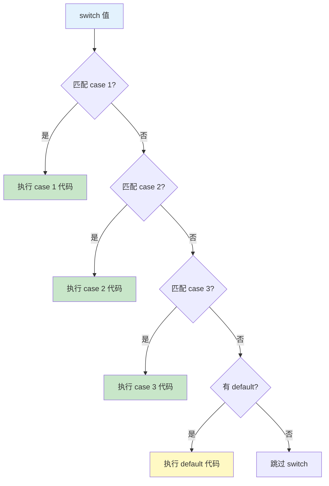

# 第05课：控制流 - 条件语句

## 📖 学习目标
- 掌握 if 语句的使用
- 掌握 if-else 语句
- 掌握 if-else if-else 语句
- 掌握 switch 语句的使用
- 理解 guard 语句

---

## if 语句

最简单的条件语句，当条件为 true 时执行代码。

### 语法

```swift
if 条件 {
    // 条件为 true 时执行的代码
}
```

### 示例

```swift
let age = 18

if age >= 18 {
    print("你已经成年了")
}

// 多条语句
let score = 95
if score >= 90 {
    print("优秀！")
    print("继续保持")
}
```

---

## if-else 语句

当条件为 true 时执行一个代码块，否则执行另一个代码块。

### 语法

```swift
if 条件 {
    // 条件为 true 时执行
} else {
    // 条件为 false 时执行
}
```

### 示例

```swift
let age = 15

if age >= 18 {
    print("你已经成年了")
} else {
    print("你还未成年")
}

// 实际应用
let temperature = 28
if temperature > 30 {
    print("天气炎热，注意防暑")
} else {
    print("天气凉爽，适合出行")
}
```

---

## if-else if-else 语句

用于检查多个条件。

### 语法

```swift
if 条件1 {
    // 条件1为 true 时执行
} else if 条件2 {
    // 条件2为 true 时执行
} else if 条件3 {
    // 条件3为 true 时执行
} else {
    // 以上条件都不满足时执行
}
```

### 示例

```swift
let score = 85

if score >= 90 {
    print("优秀")
} else if score >= 80 {
    print("良好")
} else if score >= 70 {
    print("中等")
} else if score >= 60 {
    print("及格")
} else {
    print("不及格")
}
// 输出：良好
```

### 实际应用：温度判断

```swift
let temperature = 15

if temperature >= 35 {
    print("高温预警！")
} else if temperature >= 28 {
    print("天气炎热")
} else if temperature >= 20 {
    print("天气温暖")
} else if temperature >= 10 {
    print("天气凉爽")
} else if temperature >= 0 {
    print("天气寒冷")
} else {
    print("冰冻天气！")
}
// 输出：天气凉爽
```

### 嵌套 if

```swift
let age = 25
let hasLicense = true

if age >= 18 {
    if hasLicense {
        print("可以开车")
    } else {
        print("需要先考驾照")
    }
} else {
    print("未成年不能开车")
}
```

---

## switch 语句

switch 语句用于将一个值与多个模式进行匹配。

### 基本语法

```swift
switch 值 {
case 模式1:
    // 匹配模式1时执行
case 模式2:
    // 匹配模式2时执行
default:
    // 以上都不匹配时执行
}
```

### switch 执行流程图



### 🔴 重要：switch 必须穷尽所有情况

```swift
let number = 5

// ❌ 错误：没有覆盖所有情况
// switch number {
// case 1:
//     print("一")
// case 2:
//     print("二")
// // 没有 default，编译器报错！
// }

// ✅ 正确：使用 default 处理其他情况
switch number {
case 1:
    print("一")
case 2:
    print("二")
default:
    print("其他数字")
}
```

> ⚠️ **重要区别：** Swift 的 switch 不会"贯穿"到下一个 case，不需要写 `break`！

### 示例

```swift
let grade = "B"

switch grade {
case "A":
    print("优秀")
case "B":
    print("良好")
case "C":
    print("中等")
case "D":
    print("及格")
case "F":
    print("不及格")
default:
    print("无效成绩")
}
// 输出：良好
```

### 多个值匹配

```swift
let day = "周三"

switch day {
case "周一", "周二", "周三", "周四", "周五":
    print("工作日")
case "周六", "周日":
    print("周末")
default:
    print("无效日期")
}
// 输出：工作日
```

### 范围匹配

```swift
let score = 85

switch score {
case 90...100:
    print("优秀")
case 80..<90:
    print("良好")
case 70..<80:
    print("中等")
case 60..<70:
    print("及格")
case 0..<60:
    print("不及格")
default:
    print("无效分数")
}
// 输出：良好
```

### 元组匹配

```swift
let point = (1, 1)

switch point {
case (0, 0):
    print("原点")
case (_, 0):
    print("在x轴上")
case (0, _):
    print("在y轴上")
case (-2...2, -2...2):
    print("在 2x2 范围内")
default:
    print("在范围外")
}
// 输出：在 2x2 范围内
```

### 值绑定

```swift
let point = (2, 0)

switch point {
case (let x, 0):
    print("在x轴上，x = \(x)")
case (0, let y):
    print("在y轴上，y = \(y)")
case let (x, y):
    print("x = \(x), y = \(y)")
}
// 输出：在x轴上，x = 2
```

### where 子句

```swift
let number = 15

switch number {
case let x where x % 2 == 0:
    print("\(number) 是偶数")
case let x where x % 2 != 0:
    print("\(number) 是奇数")
default:
    print("无效数字")
}
// 输出：15 是奇数

// 更多示例
let point = (1, -1)
switch point {
case let (x, y) where x == y:
    print("在对角线上")
case let (x, y) where x == -y:
    print("在反对角线上")
case let (x, y):
    print("(\(x), \(y))")
}
// 输出：在反对角线上
```

### fallthrough

```swift
let number = 5

switch number {
case 1...5:
    print("在 1-5 范围内")
    fallthrough
case 5:
    print("是 5")
default:
    print("其他数字")
}
// 输出：
// 在 1-5 范围内
// 是 5
```

### switch 注意事项

```swift
// 1. 必须穷尽所有情况
let color = "red"
switch color {
case "red":
    print("红色")
case "blue":
    print("蓝色")
default:
    print("其他颜色")  // 必须有 default
}

// 2. 不需要 break（不会贯穿）
// 3. case 不能为空
// switch color {
// case "red":
//     // 不能为空，至少要有一个语句
// default:
//     break
// }
```

---

## guard 语句

guard 语句用于提前退出，当条件不满足时执行 else 块。

### 语法

```swift
guard 条件 else {
    // 条件不满足时执行
    return  // 或 break, continue, throw
}
// 条件满足时继续执行
```

### 示例

```swift
func greet(name: String?) {
    guard let name = name else {
        print("没有提供名字")
        return
    }
    print("你好，\(name)！")
}

greet(name: "小明")  // 你好，小明！
greet(name: nil)     // 没有提供名字
```

### guard vs if

```swift
// 使用 if
func processAge1(age: Int?) {
    if let age = age {
        if age >= 18 {
            print("成年人")
        } else {
            print("未成年")
        }
    } else {
        print("年龄无效")
    }
}

// 使用 guard（更清晰）
func processAge2(age: Int?) {
    guard let age = age else {
        print("年龄无效")
        return
    }

    // 这里 age 已经解包，可以直接使用
    if age >= 18 {
        print("成年人")
    } else {
        print("未成年")
    }
}
```

### 多个条件

```swift
func processUser(name: String?, age: Int?) {
    guard let name = name, !name.isEmpty else {
        print("名字无效")
        return
    }

    guard let age = age, age >= 0 else {
        print("年龄无效")
        return
    }

    print("用户：\(name)，年龄：\(age)")
}

processUser(name: "小明", age: 25)  // 用户：小明，年龄：25
processUser(name: nil, age: 25)     // 名字无效
processUser(name: "小明", age: -1)  // 年龄无效
```

---

## 📝 练习题

### 练习1：奇偶判断
声明一个整数变量，判断它是奇数还是偶数。

```swift
// 在这里写你的代码

```

### 练习2：成绩等级
声明一个变量 `score`，使用 if-else if-else 语句判断等级：
- 90-100：A
- 80-89：B
- 70-79：C
- 60-69：D
- 0-59：F

```swift
// 在这里写你的代码

```

### 练习3：季节判断
声明一个变量 `month`（1-12），使用 switch 语句判断季节：
- 3-5：春季
- 6-8：夏季
- 9-11：秋季
- 12, 1, 2：冬季

```swift
// 在这里写你的代码

```

### 练习4：坐标判断
给定一个坐标点 (x, y)，判断它在哪个象限：
- 第一象限：x > 0, y > 0
- 第二象限：x < 0, y > 0
- 第三象限：x < 0, y < 0
- 第四象限：x > 0, y < 0
- 原点：x == 0, y == 0
- 坐标轴上

```swift
// 在这里写你的代码

```

### 练习5：计算器
使用 switch 语句实现一个简单计算器，接受两个数字和一个运算符（+, -, *, /），输出计算结果。

```swift
// 在这里写你的代码

```

### 练习6：guard 语句练习
编写一个函数 `divide(a:b:)`，使用 guard 语句检查：
1. 两个参数都不能为 nil
2. 除数不能为 0

如果检查通过，返回除法结果；否则打印错误信息。

```swift
// 在这里写你的代码

```

### 练习7：年龄分类
使用 switch 语句和范围对年龄进行分类：
- 0-2：婴儿
- 3-6：幼儿
- 7-12：儿童
- 13-17：青少年
- 18-64：成年人
- 65+：老年人

```swift
// 在这里写你的代码

```

### 练习8：密码强度检查
编写一个函数，检查密码强度：
- 长度 >= 12：强
- 长度 >= 8：中
- 长度 >= 4：弱
- 长度 < 4：太短

使用 guard 语句先检查密码不为空。

```swift
// 在这里写你的代码

```

---

## ✅ 练习题参考答案

> 💡 **提示：** 建议先独立完成练习，再查看答案

---


### 练习1
```swift
let number = 7

if number % 2 == 0 {
    print("\(number) 是偶数")
} else {
    print("\(number) 是奇数")
}
// 输出：7 是奇数
```

### 练习2
```swift
let score = 85

if score >= 90 {
    print("A")
} else if score >= 80 {
    print("B")
} else if score >= 70 {
    print("C")
} else if score >= 60 {
    print("D")
} else {
    print("F")
}
// 输出：B
```

### 练习3
```swift
let month = 8

switch month {
case 3...5:
    print("春季")
case 6...8:
    print("夏季")
case 9...11:
    print("秋季")
case 12, 1, 2:
    print("冬季")
default:
    print("无效月份")
}
// 输出：夏季
```

### 练习4
```swift
let point = (3, -2)

switch point {
case (0, 0):
    print("原点")
case (_, 0):
    print("在x轴上")
case (0, _):
    print("在y轴上")
case let (x, y) where x > 0 && y > 0:
    print("第一象限")
case let (x, y) where x < 0 && y > 0:
    print("第二象限")
case let (x, y) where x < 0 && y < 0:
    print("第三象限")
case let (x, y) where x > 0 && y < 0:
    print("第四象限")
default:
    print("坐标轴上")
}
// 输出：第四象限
```

### 练习5
```swift
let a = 10.0
let b = 3.0
let operator_ = "+"

switch operator_ {
case "+":
    print("\(a) + \(b) = \(a + b)")
case "-":
    print("\(a) - \(b) = \(a - b)")
case "*":
    print("\(a) × \(b) = \(a * b)")
case "/":
    if b != 0 {
        print("\(a) ÷ \(b) = \(a / b)")
    } else {
        print("错误：除数不能为0")
    }
default:
    print("无效运算符")
}
// 输出：10.0 + 3.0 = 13.0
```

### 练习6
```swift
func divide(a: Double?, b: Double?) -> Double? {
    guard let a = a else {
        print("错误：被除数为 nil")
        return nil
    }

    guard let b = b else {
        print("错误：除数为 nil")
        return nil
    }

    guard b != 0 else {
        print("错误：除数不能为 0")
        return nil
    }

    return a / b
}

if let result = divide(a: 10, b: 3) {
    print("结果：\(result)")  // 结果：3.3333333333333335
}

_ = divide(a: 10, b: 0)  // 错误：除数不能为 0
_ = divide(a: nil, b: 3)  // 错误：被除数为 nil
```

### 练习7
```swift
let age = 25

switch age {
case 0...2:
    print("婴儿")
case 3...6:
    print("幼儿")
case 7...12:
    print("儿童")
case 13...17:
    print("青少年")
case 18...64:
    print("成年人")
case 65...:
    print("老年人")
default:
    print("无效年龄")
}
// 输出：成年人
```

### 练习8
```swift
func checkPasswordStrength(_ password: String?) {
    guard let password = password, !password.isEmpty else {
        print("密码不能为空")
        return
    }

    switch password.count {
    case 12...:
        print("密码强度：强")
    case 8..<12:
        print("密码强度：中")
    case 4..<8:
        print("密码强度：弱")
    default:
        print("密码太短")
    }
}

checkPasswordStrength("123456789012")  // 密码强度：强
checkPasswordStrength("12345678")      // 密码强度：中
checkPasswordStrength("1234")          // 密码强度：弱
checkPasswordStrength("123")           // 密码太短
checkPasswordStrength("")              // 密码不能为空
```


---

## 🎯 小结

| 语句 | 用途 | 特点 |
|------|------|------|
| `if` | 简单条件判断 | 最基础 |
| `if-else` | 二选一 | 两种情况 |
| `if-else if-else` | 多选一 | 多种情况 |
| `switch` | 模式匹配 | 功能强大，需要穷尽 |
| `guard` | 提前退出 | 提高代码可读性 |

**最佳实践：**
- 简单条件用 `if-else`
- 多个值匹配用 `switch`
- 需要提前退出用 `guard`
- switch 的 case 必须穷尽所有情况

---

**上一课：[第04课：运算符](第04课：运算符.md)**
**下一课：[第06课：控制流 - 循环](第06课：控制流%20-%20循环.md)**
