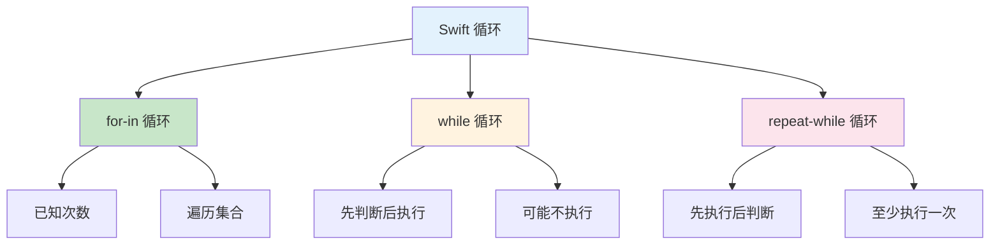
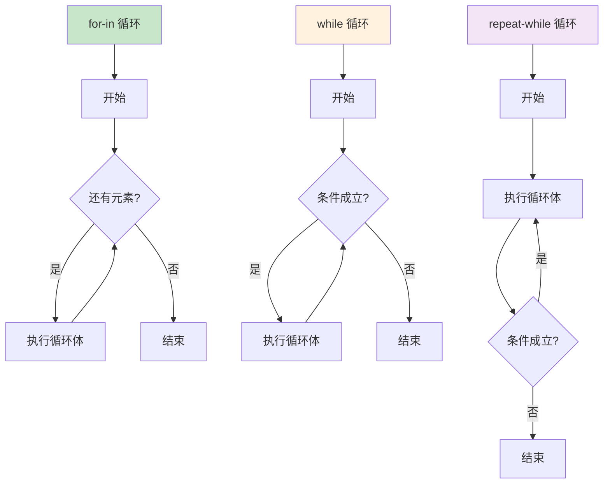

# 第06课：控制流 - 循环

## 📖 学习目标
- 掌握 for-in 循环
- 掌握 while 循环
- 掌握 repeat-while 循环
- 学会使用 break 和 continue
- 理解嵌套循环

---

## 循环类型概览

循环用于重复执行代码块，Swift 提供了三种循环类型。

### 循环类型对比图



### 循环选择指南

| 场景 | 推荐循环 | 原因 |
|------|----------|------|
| 遍历数组 | `for-in` | 语法简洁 |
| 已知次数 | `for-in` | 使用范围 |
| 条件循环 | `while` | 灵活判断 |
| 至少执行一次 | `repeat-while` | 保证执行 |

### 循环执行流程图



---

## for-in 循环

用于遍历序列（如数组、范围、字符串等）。

### 基本语法

```swift
for 变量 in 序列 {
    // 循环体
}
```

### 遍历范围

```swift
// 遍历 1 到 5
for i in 1...5 {
    print(i, terminator: " ")
}
// 输出：1 2 3 4 5

// 遍历 0 到 4（不包含5）
for i in 0..<5 {
    print(i, terminator: " ")
}
// 输出：0 1 2 3 4

// 使用下划线忽略变量
for _ in 1...3 {
    print("Hello!")
}
// 输出：Hello! Hello! Hello!
```

### 遍历数组

```swift
let fruits = ["苹果", "香蕉", "橙子", "葡萄"]

for fruit in fruits {
    print(fruit)
}
// 输出：
// 苹果
// 香蕉
// 橙子
// 葡萄

// 使用 enumerated() 获取索引和值
for (index, fruit) in fruits.enumerated() {
    print("\(index): \(fruit)")
}
// 输出：
// 0: 苹果
// 1: 香蕉
// 2: 橙子
// 3: 葡萄
```

### 遍历字符串

```swift
let text = "Hello"

for char in text {
    print(char, terminator: " ")
}
// 输出：H e l l o
```

### 遍历字典

```swift
let scores = ["小明": 90, "小红": 85, "小刚": 95]

for (name, score) in scores {
    print("\(name): \(score)分")
}
// 输出：
// 小明: 90分
// 小红: 85分
// 小刚: 95分

// 只遍历键
for name in scores.keys {
    print(name)
}

// 只遍历值
for score in scores.values {
    print(score)
}
```

### 步长遍历

```swift
// 使用 stride(from:to:by:) 不包含终点
for i in stride(from: 0, to: 10, by: 2) {
    print(i, terminator: " ")
}
// 输出：0 2 4 6 8

// 使用 stride(from:through:by:) 包含终点
for i in stride(from: 0, through: 10, by: 2) {
    print(i, terminator: " ")
}
// 输出：0 2 4 6 8 10

// 逆序遍历
for i in stride(from: 10, through: 0, by: -2) {
    print(i, terminator: " ")
}
// 输出：10 8 6 4 2 0
```

### 逆序遍历

```swift
for i in (1...5).reversed() {
    print(i, terminator: " ")
}
// 输出：5 4 3 2 1

// 或者使用 reversed()
for i in (0..<5).reversed() {
    print(i, terminator: " ")
}
// 输出：4 3 2 1 0
```

---

## while 循环

当条件为 true 时重复执行代码。

### 语法

```swift
while 条件 {
    // 循环体
}
```

### 示例

```swift
// 基本 while 循环
var count = 1
while count <= 5 {
    print(count, terminator: " ")
    count += 1
}
// 输出：1 2 3 4 5

// 猜数字游戏
var secretNumber = 7
var guess = 0
var attempts = 0

while guess != secretNumber {
    guess = Int.random(in: 1...10)
    attempts += 1
    print("猜测：\(guess)")
}
print("猜对了！用了 \(attempts) 次")
```

### 无限循环

```swift
// 使用 true 创建无限循环
var counter = 0
while true {
    print(counter)
    counter += 1
    if counter >= 5 {
        break  // 使用 break 退出循环
    }
}
```

---

## repeat-while 循环

先执行一次循环体，然后检查条件。至少执行一次。

### 语法

```swift
repeat {
    // 循环体
} while 条件
```

### 示例

```swift
// 基本 repeat-while 循环
var number = 1
repeat {
    print(number, terminator: " ")
    number += 1
} while number <= 5
// 输出：1 2 3 4 5

// 至少执行一次
var input = ""
repeat {
    print("请输入密码：", terminator: "")
    // 模拟输入
    input = "password123"
    print(input)
} while input != "password123"
print("登录成功！")
```

### while vs repeat-while

```swift
// while 可能不执行
var x = 10
while x < 5 {
    print("while: \(x)")  // 不会执行
    x += 1
}

// repeat-while 至少执行一次
var y = 10
repeat {
    print("repeat-while: \(y)")  // 执行一次
    y += 1
} while y < 5
```

---

## break 语句

立即退出循环。

### 示例

```swift
// 遇到 5 就停止
for i in 1...10 {
    if i == 5 {
        break
    }
    print(i, terminator: " ")
}
// 输出：1 2 3 4

// 在 while 循环中使用 break
var count = 0
while true {
    count += 1
    if count > 3 {
        break
    }
    print(count, terminator: " ")
}
// 输出：1 2 3
```

---

## continue 语句

跳过本次循环，继续下一次循环。

### 示例

```swift
// 跳过偶数，只打印奇数
for i in 1...10 {
    if i % 2 == 0 {
        continue
    }
    print(i, terminator: " ")
}
// 输出：1 3 5 7 9

// 跳过特定值
let fruits = ["苹果", "", "香蕉", "", "橙子"]
for fruit in fruits {
    if fruit.isEmpty {
        continue
    }
    print(fruit)
}
// 输出：
// 苹果
// 香蕉
// 橙子
```

---

## 嵌套循环

循环内部可以包含另一个循环。

### 示例

```swift
// 打印乘法表
for i in 1...9 {
    for j in 1...i {
        print("\(j)×\(i)=\(i*j)", terminator: "\t")
    }
    print()
}
// 输出：
// 1×1=1
// 1×2=2	2×2=4
// 1×3=3	2×3=6	3×3=9
// ...

// 打印三角形
let rows = 5
for i in 1...rows {
    // 打印空格
    for _ in 0..<(rows - i) {
        print(" ", terminator: "")
    }
    // 打印星号
    for _ in 1...i {
        print("*", terminator: " ")
    }
    print()
}
// 输出：
//     *
//    * *
//   * * *
//  * * * *
// * * * * *
```

### 嵌套循环中的 break

```swift
// break 只退出最内层循环
for i in 1...3 {
    for j in 1...3 {
        if j == 2 {
            break  // 只退出内层循环
        }
        print("(\(i), \(j))", terminator: " ")
    }
    print()
}
// 输出：
// (1, 1)
// (2, 1)
// (3, 1)
```

### 使用标签退出多层循环

```swift
// 使用标签退出外层循环
outerLoop: for i in 1...3 {
    for j in 1...3 {
        if i == 2 && j == 2 {
            break outerLoop  // 退出外层循环
        }
        print("(\(i), \(j))", terminator: " ")
    }
}
// 输出：(1, 1) (1, 2) (1, 3) (2, 1)
```

---

## 📝 练习题

### 练习1：数字求和
使用 for-in 循环计算 1 到 100 的和。

```swift
// 在这里写你的代码

```

### 练习2：阶乘计算
使用 while 循环计算 5 的阶乘（5! = 5 × 4 × 3 × 2 × 1）。

```swift
// 在这里写你的代码

```

### 练习3：打印偶数
使用 for-in 循环和 continue 语句，只打印 1 到 20 之间的偶数。

```swift
// 在这里写你的代码

```

### 练习4：九九乘法表
使用嵌套 for-in 循环打印完整的九九乘法表。

```swift
// 在这里写你的代码

```

### 练习5：斐波那契数列
使用 while 循环打印斐波那契数列的前 10 个数。
斐波那契数列：1, 1, 2, 3, 5, 8, 13, 21, 34, 55, ...

```swift
// 在这里写你的代码

```

### 练习6：质数判断
使用循环判断一个数是否是质数（只能被 1 和自身整除的数）。

```swift
// 在这里写你的代码

```

### 练习7：倒计时
使用 repeat-while 循环实现一个倒计时，从 10 倒数到 1，然后打印 "发射！"。

```swift
// 在这里写你的代码

```

### 练习8：打印菱形
使用嵌套循环打印一个由星号组成的菱形，例如：
```
    *
   ***
  *****
 *******
*********
 *******
  *****
   ***
    *
```

```swift
// 在这里写你的代码

```

---

## ✅ 练习题参考答案

> 💡 **提示：** 建议先独立完成练习，再查看答案

---


### 练习1
```swift
var sum = 0
for i in 1...100 {
    sum += i
}
print("1到100的和：\(sum)")  // 5050
```

### 练习2
```swift
var factorial = 1
var number = 5

while number > 0 {
    factorial *= number
    number -= 1
}

print("5! = \(factorial)")  // 120
```

### 练习3
```swift
for i in 1...20 {
    if i % 2 != 0 {
        continue
    }
    print(i, terminator: " ")
}
// 输出：2 4 6 8 10 12 14 16 18 20
```

### 练习4
```swift
for i in 1...9 {
    for j in 1...i {
        print("\(j)×\(i)=\(i*j)", terminator: "\t")
    }
    print()
}
```

### 练习5
```swift
var a = 1
var b = 1
var count = 2

print(a, terminator: " ")
print(b, terminator: " ")

while count < 10 {
    let next = a + b
    print(next, terminator: " ")
    a = b
    b = next
    count += 1
}
// 输出：1 1 2 3 5 8 13 21 34 55
```

### 练习6
```swift
let number = 17
var isPrime = true

if number <= 1 {
    isPrime = false
} else {
    for i in 2..<number {
        if number % i == 0 {
            isPrime = false
            break
        }
    }
}

if isPrime {
    print("\(number) 是质数")
} else {
    print("\(number) 不是质数")
}
// 输出：17 是质数
```

### 练习7
```swift
var countdown = 10

repeat {
    print("\(countdown)...")
    countdown -= 1
} while countdown >= 1

print("发射！")
```

### 练习8
```swift
let n = 5  // 菱形大小

// 上半部分
for i in 1...n {
    for _ in 0..<(n - i) {
        print(" ", terminator: "")
    }
    for _ in 1...(2 * i - 1) {
        print("*", terminator: "")
    }
    print()
}

// 下半部分
for i in stride(from: n - 1, through: 1, by: -1) {
    for _ in 0..<(n - i) {
        print(" ", terminator: "")
    }
    for _ in 1...(2 * i - 1) {
        print("*", terminator: "")
    }
    print()
}
```


---

## 🎯 小结

| 循环类型 | 语法 | 特点 |
|----------|------|------|
| `for-in` | `for x in sequence` | 遍历已知范围或集合 |
| `while` | `while condition` | 条件为 true 时循环 |
| `repeat-while` | `repeat { } while condition` | 至少执行一次 |

**控制语句：**
- `break`：立即退出循环
- `continue`：跳过本次循环
- 标签：用于控制嵌套循环

**最佳实践：**
- 已知次数用 `for-in`
- 未知次数用 `while`
- 至少执行一次用 `repeat-while`
- 能用 `for-in` 就不用 `while`

---

**上一课：[第05课：控制流 - 条件语句](第05课：控制流%20-%20条件语句.md)**
**下一课：[第07课：集合类型](第07课：集合类型.md)**
