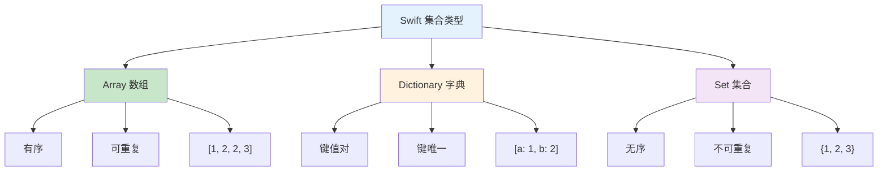
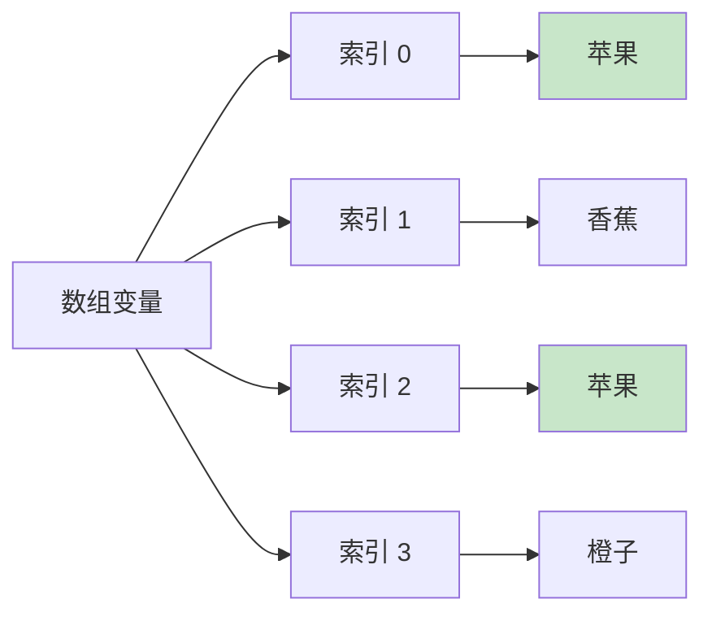

# 第07课：集合类型

## 📖 学习目标
- 掌握数组（Array）的创建和操作
- 掌握字典（Dictionary）的创建和操作
- 掌握集合（Set）的创建和操作
- 了解集合类型的性能特点

---

## 集合类型概览

Swift 提供三种主要的集合类型，每种都有不同的特点和用途。

### 三种集合类型对比图



### 集合类型对比表

| 特性 | Array | Dictionary | Set |
|------|-------|------------|-----|
| 顺序 | ✅ 有序 | ❌ 无序 | ❌ 无序 |
| 重复 | ✅ 允许 | ❌ 键唯一 | ❌ 不允许 |
| 访问方式 | 索引 `[0]` | 锵 `["key"]` | 遍历 |
| 用途 | 列表数据 | 键值映射 | 唯一值 |

---

## 数组（Array）

数组是**有序**的值集合，**可以包含重复值**。

**什么是数组？简单来说：**
数组就像一个**有序的购物清单**，你可以：
- 按顺序往里面添加东西
- 按位置找到某个东西
- 里面可以有重复的东西（比如买两个苹果）

**数组的特点：**
- **有序**：元素按顺序排列，第一个、第二个、第三个...
- **可重复**：同一个值可以出现多次
- **索引访问**：通过数字位置（索引）访问元素，从 0 开始

### 数组内存结构图



**图解说明：**
- 左边的 `数组变量` 是数组的名字
- 中间的 `索引 0, 1, 2, 3` 是元素的位置编号（从 0 开始）
- 右边的 `苹果、香蕉、苹果、橙子` 是实际存储的值
- 注意：`苹果` 出现了两次，这在数组中是允许的

### 创建数组

Swift 提供了多种创建数组的方式，让我们逐一了解：

```swift
// 方式1：直接赋值（最常用）
// 用方括号 [] 包裹元素，元素之间用逗号分隔
var numbers = [1, 2, 3, 4, 5]      // 整数数组
var fruits = ["苹果", "香蕉", "橙子"]  // 字符串数组

// 方式2：明确指定类型
// 有时候 Swift 无法自动推断类型，需要你明确告诉它
var scores: [Int] = [90, 85, 95, 88]  // 明确指定是 Int 类型的数组

// 方式3：创建空数组
// 当你不知道要存什么，或者稍后才添加元素时使用
var emptyArray1: [String] = []        // 空的字符串数组
var emptyArray2 = [Int]()             // 另一种写法
var emptyArray3 = Array<String>()     // 完整写法

// 方式4：创建包含默认值的数组
// 当你需要创建一个固定大小的数组，并且所有元素都是同一个值时使用
var zeros = [Int](repeating: 0, count: 5)  // 创建 5 个 0
print(zeros)  // 输出：[0, 0, 0, 0, 0]

var defaultNames = [String](repeating: "未知", count: 3)  // 创建 3 个"未知"
print(defaultNames)  // 输出：["未知", "未知", "未知"]
```

### 访问和修改元素

```swift
var fruits = ["苹果", "香蕉", "橙子", "葡萄"]

// 访问元素
print(fruits[0])   // 苹果
print(fruits[1])   // 香蕉
print(fruits.last!)  // 葡萄
print(fruits.first!)  // 苹果

// 修改元素
fruits[1] = "芒果"
print(fruits)  // ["苹果", "芒果", "橙子", "葡萄"]

// 获取数组信息
print(fruits.count)    // 4
print(fruits.isEmpty)  // false
```

### 添加和删除元素

**数组常用方法速查表：**

| 方法 | 用途 | 示例 |
|------|------|------|
| `append()` | 添加到末尾 | `array.append(4)` |
| `insert()` | 插入到指定位置 | `array.insert(0, at: 0)` |
| `remove(at:)` | 删除指定位置 | `array.remove(at: 0)` |
| `removeFirst()` | 删除第一个 | `array.removeFirst()` |
| `removeLast()` | 删除最后一个 | `array.removeLast()` |
| `removeAll()` | 删除所有 | `array.removeAll()` |

```swift
var numbers = [1, 2, 3]

// 添加元素
numbers.append(4)
print(numbers)  // [1, 2, 3, 4]

numbers.append(contentsOf: [5, 6])
print(numbers)  // [1, 2, 3, 4, 5, 6]

// 在指定位置插入
numbers.insert(0, at: 0)
print(numbers)  // [0, 1, 2, 3, 4, 5, 6]

// 删除元素
numbers.remove(at: 0)
print(numbers)  // [1, 2, 3, 4, 5, 6]

numbers.removeFirst()
print(numbers)  // [2, 3, 4, 5, 6]

numbers.removeLast()
print(numbers)  // [2, 3, 4, 5]

// 删除所有元素
numbers.removeAll()
print(numbers)  // []
print(numbers.isEmpty)  // true
```

### 数组遍历

```swift
let colors = ["红", "橙", "黄", "绿", "蓝"]

// 方式1：直接遍历
for color in colors {
    print(color, terminator: " ")
}
// 输出：红 橙 黄 绿 蓝

// 方式2：使用 enumerated() 获取索引和值
for (index, color) in colors.enumerated() {
    print("\(index): \(color)")
}
// 输出：
// 0: 红
// 1: 橙
// 2: 黄
// 3: 绿
// 4: 蓝

// 方式3：使用索引遍历
for i in 0..<colors.count {
    print(colors[i], terminator: " ")
}
// 输出：红 橙 黄 绿 蓝

// 逆序遍历
for color in colors.reversed() {
    print(color, terminator: " ")
}
// 输出：蓝 绿 黄 橙 红
```

### 数组排序

```swift
var numbers = [3, 1, 4, 1, 5, 9, 2, 6]

// 原地排序
numbers.sort()
print(numbers)  // [1, 1, 2, 3, 4, 5, 6, 9]

// 降序排序
numbers.sort(by: >)
print(numbers)  // [9, 6, 5, 4, 3, 2, 1, 1]

// 创建新数组（不改变原数组）
let sorted = numbers.sorted()
print(sorted)   // [1, 1, 2, 3, 4, 5, 6, 9]
print(numbers)  // [9, 6, 5, 4, 3, 2, 1, 1]

// 自定义排序
let names = ["张三", "李四", "王五", "赵六"]
let sortedByName = names.sorted()
print(sortedByName)  // ["张三", "李四", "王五", "赵六"]
```

### 数组常用方法

```swift
let numbers = [1, 2, 3, 4, 5, 6, 7, 8, 9, 10]

// 包含元素
print(numbers.contains(5))   // true
print(numbers.contains(11))  // false

// 查找元素
if let index = numbers.firstIndex(of: 5) {
    print("5 的索引：\(index)")  // 4
}

// 获取最大值和最小值
print(numbers.max()!)  // 10
print(numbers.min()!)  // 1

// 求和
let sum = numbers.reduce(0, +)
print(sum)  // 55

// 过滤
let evenNumbers = numbers.filter { $0 % 2 == 0 }
print(evenNumbers)  // [2, 4, 6, 8, 10]

// 映射
let doubled = numbers.map { $0 * 2 }
print(doubled)  // [2, 4, 6, 8, 10, 12, 14, 16, 18, 20]

// 切片
let slice = numbers[2...5]
print(Array(slice))  // [3, 4, 5, 6]
```

---

## 字典（Dictionary）

字典是键值对的无序集合，键必须唯一。

### 创建字典

```swift
// 方式1：字面量
var ages = ["小明": 18, "小红": 20, "小刚": 19]

// 方式2：指定类型
var scores: [String: Int] = ["数学": 90, "英语": 85, "物理": 95]

// 方式3：创建空字典
var emptyDict1: [String: Int] = [:]
var emptyDict2 = [String: Int]()
var emptyDict3 = Dictionary<String, Int>()
```

### 访问和修改值

```swift
var ages = ["小明": 18, "小红": 20, "小刚": 19]

// 访问值
print(ages["小明"]!)   // 18
print(ages["小红"]!)   // 20

// 使用可选值访问（键不存在时返回 nil）
print(ages["小张"] ?? "不存在")  // 不存在

// 修改值
ages["小明"] = 19
print(ages)  // ["小明": 19, "小红": 20, "小刚": 19]

// 添加新键值对
ages["小李"] = 21
print(ages)  // ["小明": 19, "小红": 20, "小刚": 19, "小李": 21]

// 使用 updateValue 修改
ages.updateValue(22, forKey: "小红")
print(ages)  // ["小明": 19, "小红": 22, "小刚": 19, "小李": 21]
```

### 删除键值对

```swift
var ages = ["小明": 18, "小红": 20, "小刚": 19]

// 删除指定键
ages.removeValue(forKey: "小红")
print(ages)  // ["小明": 18, "小刚": 19]

// 设置为 nil 也可以删除
ages["小刚"] = nil
print(ages)  // ["小明": 18]

// 删除所有
ages.removeAll()
print(ages)  // [:]
```

### 字典遍历

```swift
let scores = ["数学": 90, "英语": 85, "物理": 95, "化学": 88]

// 遍历键值对
for (subject, score) in scores {
    print("\(subject): \(score)分")
}

// 只遍历键
for subject in scores.keys {
    print(subject, terminator: " ")
}
// 输出：数学 英语 物理 化学

// 只遍历值
for score in scores.values {
    print(score, terminator: " ")
}
// 输出：90 85 95 88

// 将键或值转为数组
let subjects = Array(scores.keys)
let allScores = Array(scores.values)
print(subjects)  // ["数学", "英语", "物理", "化学"]
print(allScores) // [90, 85, 95, 88]
```

### 字典常用操作

```swift
let scores = ["数学": 90, "英语": 85, "物理": 95, "化学": 88]

// 获取信息
print(scores.count)    // 4
print(scores.isEmpty)  // false

// 检查是否包含某个键
print(scores.keys.contains("数学"))  // true
print(scores.keys.contains("生物"))  // false

// 获取最高分
if let maxScore = scores.values.max() {
    print("最高分：\(maxScore)")
}

// 获取最低分
if let minScore = scores.values.min() {
    print("最低分：\(minScore)")
}

// 计算平均分
let average = Double(scores.values.reduce(0, +)) / Double(scores.count)
print("平均分：\(average)")
```

---

## 集合（Set）

集合是无序的值集合，不能包含重复值。

### 创建集合

```swift
// 方式1：字面量
var numbers: Set = [1, 2, 3, 4, 5]

// 方式2：指定类型
var fruits: Set<String> = ["苹果", "香蕉", "橙子"]

// 方式3：创建空集合
var emptySet1: Set<Int> = []
var emptySet2 = Set<Int>()
```

### 集合操作

```swift
var fruits: Set = ["苹果", "香蕉", "橙子"]

// 添加元素
fruits.insert("葡萄")
print(fruits)  // ["苹果", "香蕉", "橙子", "葡萄"]（顺序可能不同）

// 删除元素
fruits.remove("香蕉")
print(fruits)

// 检查是否包含
print(fruits.contains("苹果"))   // true
print(fruits.contains("香蕉"))  // false

// 获取数量
print(fruits.count)    // 3
print(fruits.isEmpty)  // false
```

### 集合运算

```swift
let setA: Set = [1, 2, 3, 4, 5]
let setB: Set = [4, 5, 6, 7, 8]

// 并集
let union = setA.union(setB)
print(union)  // [1, 2, 3, 4, 5, 6, 7, 8]

// 交集
let intersection = setA.intersection(setB)
print(intersection)  // [4, 5]

// 差集
let subtracting = setA.subtracting(setB)
print(subtracting)  // [1, 2, 3]

// 对称差集（只在其中一个集合中）
let symmetricDifference = setA.symmetricDifference(setB)
print(symmetricDifference)  // [1, 2, 3, 6, 7, 8]
```

### 集合关系

```swift
let setA: Set = [1, 2, 3, 4, 5]
let setB: Set = [1, 2, 3]
let setC: Set = [6, 7, 8]

// 是否是子集
print(setB.isSubset(of: setA))   // true
print(setA.isSubset(of: setB))   // false

// 是否是超集
print(setA.isSuperset(of: setB))  // true

// 是否是真子集（不相等）
print(setB.isStrictSubset(of: setA))  // true

// 是否不相交
print(setA.isDisjoint(with: setC))    // true
print(setB.isDisjoint(with: setC))    // true
```

### 集合遍历

```swift
let numbers: Set = [3, 1, 4, 1, 5, 9, 2, 6]

// 遍历（顺序不确定）
for number in numbers.sorted() {
    print(number, terminator: " ")
}
// 输出：1 2 3 4 5 6 9
```

---

## 集合类型对比

| 特性 | Array | Dictionary | Set |
|------|-------|------------|-----|
| 有序 | ✅ | ❌ | ❌ |
| 可重复 | ✅ | 键不可重复 | ❌ |
| 访问方式 | 索引 | 键 | - |
| 用途 | 有序列表 | 键值映射 | 唯一值集合 |

---

## 📝 练习题

### 练习1：数组基础
创建一个包含 5 个学生姓名的数组，然后：
1. 打印数组
2. 添加一个新学生
3. 删除第二个学生
4. 打印学生总数

```swift
// 在这里写你的代码

```

### 练习2：数组遍历
创建一个包含 1 到 10 的数组，使用 for-in 循环计算所有元素的和。

```swift
// 在这里写你的代码

```

### 练习3：字典基础
创建一个字典存储 3 个学生的成绩，然后：
1. 打印某个学生的成绩
2. 修改一个学生的成绩
3. 添加一个新学生
4. 遍历打印所有学生成绩

```swift
// 在这里写你的代码

```

### 练习4：集合运算
给定两个集合：
```swift
let setA: Set = [1, 2, 3, 4, 5]
let setB: Set = [4, 5, 6, 7, 8]
```
计算并打印它们的并集、交集和差集。

```swift
// 在这里写你的代码

```

### 练习5：单词计数
给定一个字符串 `"hello world hello swift world hello"`，使用字典统计每个单词出现的次数。

```swift
// 在这里写你的代码

```

### 练习6：数组去重
给定一个数组 `[1, 2, 2, 3, 3, 3, 4, 4, 4, 4]`，使用集合去除重复元素，并保持原有顺序。

```swift
// 在这里写你的代码

```

### 练习7：成绩统计
给定一个字典存储多个学生的成绩：
```swift
let scores = ["小明": 90, "小红": 85, "小刚": 95, "小李": 88, "小王": 92]
```
计算并打印：
1. 最高分和最低分
2. 平均分
3. 成绩高于平均分的学生

```swift
// 在这里写你的代码

```

### 练习8：购物车
使用字典实现一个简单的购物车：
1. 添加商品（商品名: 数量）
2. 修改商品数量
3. 删除商品
4. 计算商品总数
5. 打印购物车内容

```swift
// 在这里写你的代码

```

---

## ✅ 练习题参考答案

> 💡 **提示：** 建议先独立完成练习，再查看答案

---


### 练习1
```swift
var students = ["张三", "李四", "王五", "赵六", "钱七"]
print(students)  // ["张三", "李四", "王五", "赵六", "钱七"]

students.append("孙八")
print(students)  // ["张三", "李四", "王五", "赵六", "钱七", "孙八"]

students.remove(at: 1)
print(students)  // ["张三", "王五", "赵六", "钱七", "孙八"]

print("学生总数：\(students.count)")  // 5
```

### 练习2
```swift
let numbers = Array(1...10)
var sum = 0

for number in numbers {
    sum += number
}

print("1到10的和：\(sum)")  // 55
```

### 练习3
```swift
var scores = ["小明": 90, "小红": 85, "小刚": 95]

// 打印某个学生的成绩
print("小明的成绩：\(scores["小明"] ?? 0)")

// 修改成绩
scores["小红"] = 88
print(scores)

// 添加新学生
scores["小李"] = 92
print(scores)

// 遍历
for (name, score) in scores {
    print("\(name): \(score)分")
}
```

### 练习4
```swift
let setA: Set = [1, 2, 3, 4, 5]
let setB: Set = [4, 5, 6, 7, 8]

let union = setA.union(setB)
print("并集：\(union)")

let intersection = setA.intersection(setB)
print("交集：\(intersection)")

let subtracting = setA.subtracting(setB)
print("差集（A-B）：\(subtracting)")
```

### 练习5
```swift
let text = "hello world hello swift world hello"
let words = text.components(separatedBy: " ")

var wordCount: [String: Int] = [:]

for word in words {
    wordCount[word, default: 0] += 1
}

for (word, count) in wordCount {
    print("\(word): \(count)次")
}
// 输出：
// hello: 3次
// world: 2次
// swift: 1次
```

### 练习6
```swift
let numbers = [1, 2, 2, 3, 3, 3, 4, 4, 4, 4]

var seen = Set<Int>()
var uniqueNumbers = [Int]()

for number in numbers {
    if !seen.contains(number) {
        seen.insert(number)
        uniqueNumbers.append(number)
    }
}

print(uniqueNumbers)  // [1, 2, 3, 4]
```

### 练习7
```swift
let scores = ["小明": 90, "小红": 85, "小刚": 95, "小李": 88, "小王": 92]

// 最高分和最低分
if let maxScore = scores.values.max(),
   let minScore = scores.values.min() {
    print("最高分：\(maxScore)")
    print("最低分：\(minScore)")
}

// 平均分
let average = Double(scores.values.reduce(0, +)) / Double(scores.count)
print("平均分：\(average)")

// 高于平均分的学生
print("高于平均分的学生：")
for (name, score) in scores {
    if Double(score) > average {
        print("\(name): \(score)分")
    }
}
```

### 练习8
```swift
var cart: [String: Int] = [:]

// 添加商品
cart["苹果"] = 3
cart["香蕉"] = 2
cart["橙子"] = 5
print(cart)  // ["苹果": 3, "香蕉": 2, "橙子": 5]

// 修改数量
cart["苹果"] = 4
print(cart)  // ["苹果": 4, "香蕉": 2, "橙子": 5]

// 删除商品
cart.removeValue(forKey: "香蕉")
print(cart)  // ["苹果": 4, "橙子": 5]

// 计算总数
let totalItems = cart.values.reduce(0, +)
print("商品总数：\(totalItems)")  // 9

// 打印购物车
print("购物车内容：")
for (item, quantity) in cart {
    print("\(item): \(quantity)个")
}
```


---

## 🎯 小结

| 集合类型 | 特点 | 创建方式 |
|----------|------|----------|
| Array | 有序、可重复 | `[1, 2, 3]` |
| Dictionary | 键值对、键唯一 | `["key": value]` |
| Set | 无序、不重复 | `Set([1, 2, 3])` |

**常用操作：**
- 数组：`append`, `remove`, `sort`, `filter`, `map`
- 字典：`updateValue`, `removeValue`, `keys`, `values`
- 集合：`union`, `intersection`, `subtracting`

---

**上一课：[第06课：控制流 - 循环](第06课：控制流%20-%20循环.md)**
**下一课：[第08课：函数](第08课：函数.md)**
