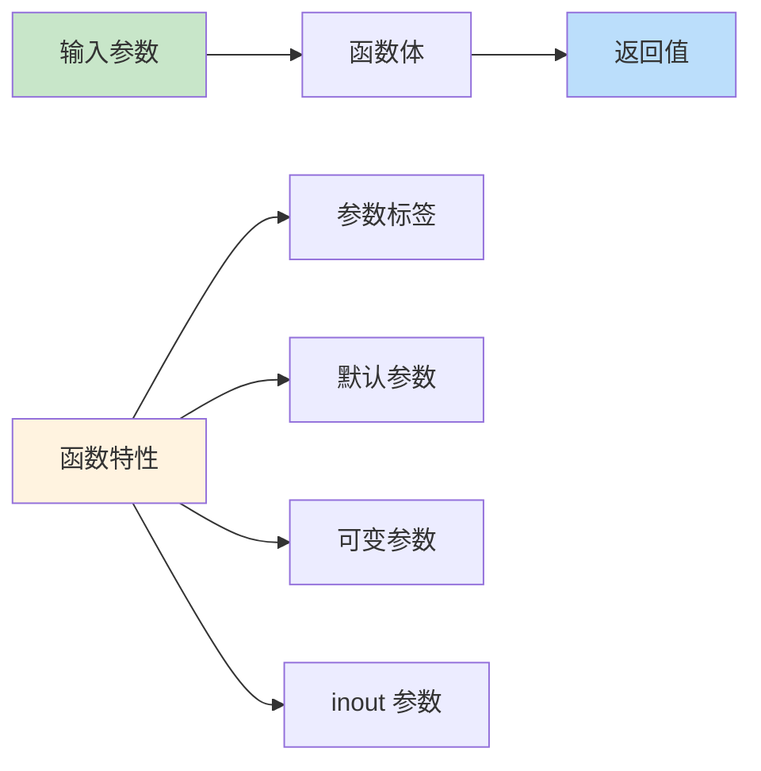
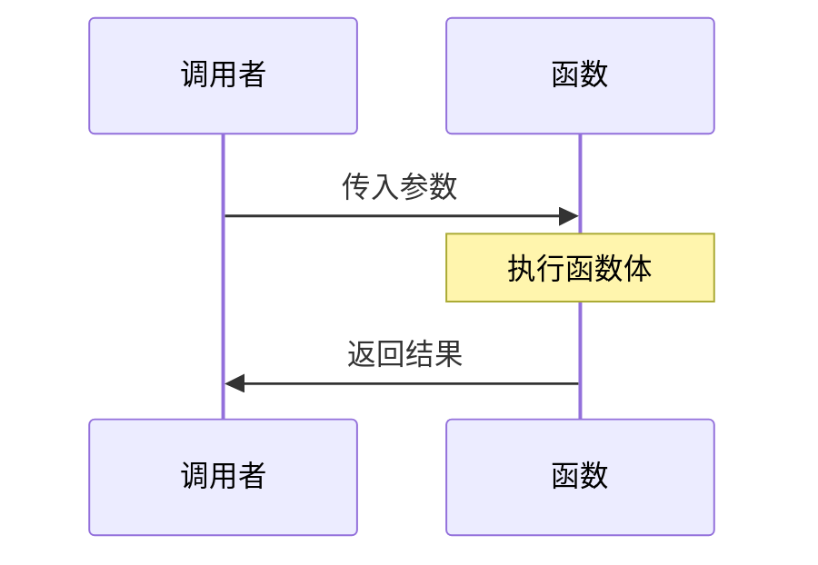

# 第08课：函数

## 📖 学习目标
- 学会定义和调用函数
- 理解函数参数和返回值
- 掌握参数标签和默认参数
- 了解可变参数和 inout 参数

---

## 函数概念图



### 函数类型对比

| 类型 | 说明 | 示例 |
|------|------|------|
| 无参数无返回值 | 简单执行 | `func greet() { }` |
| 有参数无返回值 | 接受输入 | `func print(name: String) { }` |
| 无参数有返回值 | 返回结果 | `func getNumber() -> Int { }` |
| 有参数有返回值 | 完整函数 | `func add(a: Int, b: Int) -> Int { }` |

### 函数执行流程图



---

## 函数基础

### 定义函数

```swift
func 函数名(参数列表) -> 返回类型 {
    // 函数体
    return 返回值
}
```

**语法解读：**
- `->` 是返回类型箭头，用于声明函数的返回类型。箭头右边写的就是函数输出值的类型。
- `{` 之前的整段称为**函数签名**（function signature），它包含了函数名、参数列表和返回类型，概括了函数"长什么样"以及"如何调用"。
- 如果函数不需要返回任何值，可以省略 `-> 返回类型` 部分。此时返回类型等价于 `Void`（即"空"），函数体中也不需要写 `return`。
- 如果函数需要返回值，则必须在 `->` 后面写明返回类型，并在函数体中使用 `return` 将结果返回。

### 无参数无返回值

```swift
func sayHello() {
    print("Hello, World!")
}

// 调用函数
sayHello()  // 输出：Hello, World!
```

### 有参数无返回值

```swift
func greet(name: String) {
    print("你好，\(name)！")
}

greet(name: "小明")  // 输出：你好，小明！
```

### 有参数有返回值

```swift
func add(a: Int, b: Int) -> Int {
    return a + b
}

let result = add(a: 5, b: 3)
print(result)  // 8
```

### 单表达式函数

```swift
// 可以省略 return
func multiply(a: Int, b: Int) -> Int {
    a * b
}

print(multiply(a: 4, b: 5))  // 20
```

**隐式返回（Implicit Return）：**
当函数体只包含**一条表达式**时，Swift 会自动将该表达式的计算结果作为返回值，此时可以省略 `return` 关键字。这在 Swift 中称为"隐式返回"。需要注意的是：
- 此特性同时适用于**函数**和**闭包**。
- 如果函数体包含**多条语句**（例如先声明变量再进行计算），则必须显式写出 `return`，Swift 无法自动判断哪一条语句是返回值。
- 即使省略了 `return`，函数的返回类型仍然需要在签名中正确声明。

---

## 参数标签

Swift 的参数标签是一个独特的特性，它能让函数调用更像自然语言。

**什么是参数标签？通俗地讲：**
参数标签就像是给参数起一个"外号"，让调用函数时更容易理解每个参数的含义。

**为什么需要参数标签？**
- 让代码更易读
- 让函数调用更像英语句子
- 可以让函数名更简洁

### 外部参数标签

外部参数标签在调用函数时使用，让代码更清晰：

```swift
// 定义函数时，to 是外部标签，name 是内部参数名
func greet(to name: String) {
    print("你好，\(name)！")
}

// 调用时使用外部标签
greet(to: "小明")  // 输出：你好，小明！
```

**代码解读：**
- `to` 是外部标签，调用时必须写
- `name` 是内部参数名，函数内部使用
- 这样写让代码读起来像英语："greet to 小明"

### 省略外部标签

如果你不想使用外部标签，可以用下划线 `_` 省略：

```swift
// 使用 _ 省略外部标签
func greet(_ name: String) {
    print("你好，\(name)！")
}

// 调用时不需要写标签
greet("小明")  // 输出：你好，小明！
```

**什么时候省略标签？**
- 当参数含义很明显时
- 当函数名已经说明参数用途时
- 当你想让调用更简洁时

### 同时使用内外标签

有时候，外部标签和内部参数名需要不同：

```swift
// from 是外部标签，source 是内部参数名
// to 是外部标签，destination 是内部参数名
func move(from source: String, to destination: String) {
    print("从 \(source) 移动到 \(destination)")
}

// 调用时使用外部标签
move(from: "北京", to: "上海")
// 输出：从 北京 移动到 上海
```

**为什么这样设计？**
- 外部标签让调用更易读："move from 北京 to 上海"
- 内部参数名让函数内部代码更清晰
- 这是 Swift 的设计哲学：代码应该像自然语言

---

## 默认参数

**默认参数是什么？可以这样理解：给参数一个"默认值"，调用时可以不传这个参数。**

```swift
// greeting 有默认值 "你好"
func greet(name: String, greeting: String = "你好") {
    print("\(greeting)，\(name)！")
}

// 不传 greeting，使用默认值
greet(name: "小明")              // 你好，小明！

// 传入 greeting，覆盖默认值
greet(name: "小红", greeting: "嗨")  // 嗨，小红！
```

### 多个默认参数

```swift
func printInfo(name: String, age: Int = 18, city: String = "北京") {
    print("\(name)，\(age)岁，来自\(city)")
}

// 只传必填参数
printInfo(name: "小明")              // 小明，18岁，来自北京

// 传部分参数
printInfo(name: "小红", age: 20)     // 小红，20岁，来自北京

// 传所有参数
printInfo(name: "小刚", age: 22, city: "上海")  // 小刚，22岁，来自上海
```

**什么时候用默认参数？**
- 参数有常用的默认值
- 想让函数调用更简洁
- 保持向后兼容性

---

## 可变参数

在参数类型的后面加上 `...` 就构成了**可变参数**（variadic parameter）。可变参数允许你向函数传入零个或多个同类型的值，而不必手动将它们包装成数组。在函数体内部，这个参数会被当作一个对应类型的数组来使用——例如 `Int...` 在函数体内就是 `[Int]` 类型，可以直接用 `for-in` 遍历或访问 `.count` 等属性。需要特别注意的是，**一个函数最多只能有一个可变参数**。

```swift
func sum(numbers: Int...) -> Int {
    var total = 0
    for number in numbers {
        total += number
    }
    return total
}

print(sum(numbers: 1, 2, 3))        // 6
print(sum(numbers: 1, 2, 3, 4, 5))  // 15
print(sum())                         // 0
```

### 可变参数示例

```swift
func average(_ numbers: Double...) -> Double {
    var total: Double = 0
    for number in numbers {
        total += number
    }
    return total / Double(numbers.count)
}

print(average(80, 90, 85))  // 85.0
print(average(100, 95))     // 97.5
```

---

## inout 参数

在 Swift 中，函数参数默认是**常量**——也就是说，你在函数体内不能修改参数的值。如果你确实需要在函数内部修改调用者传入的变量，就需要使用 `inout` 关键字将参数声明为"输入-输出参数"。

调用时在变量前加上 `&` 符号，这是一种**显式声明**，表示调用者清楚地知道这个变量可能会被函数修改。底层实现上，Swift 采用的是**复制进-复制出**（copy-in copy-out）的策略：调用函数时，先把变量的值复制一份传入函数；函数内部对这份副本进行修改；函数结束后，再把修改后的值写回到原始变量。因此，与引用传递不同，inout 参数并不是直接操作原始内存，而是通过值的副本来间接修改。

inout 参数可以在函数内部修改外部变量。

```swift
func swapValues(_ a: inout Int, _ b: inout Int) {
    let temp = a
    a = b
    b = temp
}

var x = 10
var y = 20
swapValues(&x, &y)
print(x, y)  // 20 10
```

### inout 示例

```swift
func double(_ number: inout Int) {
    number *= 2
}

var value = 5
double(&value)
print(value)  // 10

func appendTo(_ array: inout [Int], value: Int) {
    array.append(value)
}

var numbers = [1, 2, 3]
appendTo(&numbers, value: 4)
print(numbers)  // [1, 2, 3, 4]
```

---

## 返回多个值

### 使用元组

```swift
func getMinMax(array: [Int]) -> (min: Int, max: Int) {
    var min = array[0]
    var max = array[0]

    for number in array {
        if number < min {
            min = number
        }
        if number > max {
            max = number
        }
    }

    return (min, max)
}

let numbers = [3, 1, 4, 1, 5, 9, 2, 6]
let result = getMinMax(array: numbers)
print("最小值：\(result.min)，最大值：\(result.max)")
// 输出：最小值：1，最大值：9
```

### 可选返回值

```swift
func divide(_ a: Int, by b: Int) -> Int? {
    if b == 0 {
        return nil
    }
    return a / b
}

if let result = divide(10, by: 3) {
    print(result)  // 3
}

if let result = divide(10, by: 0) {
    print(result)
} else {
    print("不能除以0")
}
```

---

## 函数类型

在 Swift 中，每一个函数都有一个**类型**，这个类型由它的参数类型和返回类型共同决定。例如，一个接受两个 `Int` 参数并返回 `Int` 的函数，其类型就是 `(Int, Int) -> Int`。函数类型和 `Int`、`String` 一样，是一种完整的类型——它可以用来声明变量或常量、作为另一个函数的参数、作为函数的返回值，甚至放在数组或字典中。理解函数类型是掌握 Swift 函数式编程的关键基础。

函数也是一种类型，可以作为参数或返回值。

### 函数类型语法

```swift
(参数类型) -> 返回类型
```

### 示例

```swift
// 定义函数
func add(_ a: Int, _ b: Int) -> Int {
    return a + b
}

func subtract(_ a: Int, _ b: Int) -> Int {
    return a - b
}

// 函数类型变量
var mathFunction: (Int, Int) -> Int = add
print(mathFunction(5, 3))  // 8

mathFunction = subtract
print(mathFunction(5, 3))  // 2
```

### 函数作为参数

```swift
func calculate(_ a: Int, _ b: Int, using operation: (Int, Int) -> Int) -> Int {
    return operation(a, b)
}

func add(_ a: Int, _ b: Int) -> Int { a + b }
func multiply(_ a: Int, _ b: Int) -> Int { a * b }

print(calculate(5, 3, using: add))       // 8
print(calculate(5, 3, using: multiply))  // 15
```

### 函数作为返回值

```swift
func getOperation(isAdd: Bool) -> (Int, Int) -> Int {
    func add(_ a: Int, _ b: Int) -> Int { a + b }
    func subtract(_ a: Int, _ b: Int) -> Int { a - b }

    return isAdd ? add : subtract
}

let operation = getOperation(isAdd: true)
print(operation(5, 3))  // 8

let operation2 = getOperation(isAdd: false)
print(operation2(5, 3))  // 2
```

---

## 嵌套函数

函数内部可以定义函数。

```swift
func chooseFunction(forward: Bool) -> (Int) -> Int {
    func addOne(_ number: Int) -> Int {
        return number + 1
    }

    func subtractOne(_ number: Int) -> Int {
        return number - 1
    }

    return forward ? addOne : subtractOne
}

let function = chooseFunction(forward: true)
print(function(5))  // 6

let function2 = chooseFunction(forward: false)
print(function2(5))  // 4
```

---

## 递归函数

**递归**（recursion）是一种重要的问题解决技巧：函数在执行过程中直接或间接地调用自身。一个正确的递归函数必须包含两个核心部分：

1. **基准情况（base case）**：也叫终止条件，即一个不再递归调用自身、直接返回结果的分支。它确保递归会在某个时刻停下来。
2. **递归情况（recursive case）**：函数将问题分解为更小的子问题，然后调用自身来处理这些子问题。

**警告：** 如果缺少基准情况，或者递归调用无法逐步逼近基准情况，函数就会无限地调用自身，最终导致栈溢出（stack overflow）而崩溃。因此编写递归函数时，务必先确定终止条件，再编写递归逻辑。

函数调用自身。

```swift
func factorial(_ n: Int) -> Int {
    if n <= 1 {
        return 1
    }
    return n * factorial(n - 1)
}

print(factorial(5))   // 120
print(factorial(10))  // 3628800
```

### 递归示例：斐波那契数列

```swift
func fibonacci(_ n: Int) -> Int {
    if n <= 0 {
        return 0
    }
    if n == 1 {
        return 1
    }
    return fibonacci(n - 1) + fibonacci(n - 2)
}

for i in 0..<10 {
    print(fibonacci(i), terminator: " ")
}
// 输出：0 1 1 2 3 5 8 13 21 34
```

---

## 📝 练习题

### 练习1：基础函数
编写一个函数 `isEven(_ number: Int) -> Bool`，判断一个数是否是偶数。

```swift
// 在这里写你的代码

```

### 练习2：带参数标签
编写一个函数 `greet(person:from:)`，打印 "你好，[person]，来自[from]！"。

```swift
// 在这里写你的代码

```

### 练习3：默认参数
编写一个函数 `repeatString(_ str: String, times: Int = 3) -> String`，将字符串重复指定次数。

```swift
// 在这里写你的代码

```

### 练习4：可变参数
编写一个函数 `max(of numbers: Int...) -> Int`，返回所有参数中的最大值。

```swift
// 在这里写你的代码

```

### 练习5：inout 参数
编写一个函数 `increment(_ number: inout Int, by amount: Int = 1)`，将数字增加指定值。

```swift
// 在这里写你的代码

```

### 练习6：返回元组
编写一个函数 `divideWithRemainder(_ a: Int, by b: Int) -> (quotient: Int, remainder: Int)`，返回除法的商和余数。

```swift
// 在这里写你的代码

```

### 练习7：函数作为参数
编写一个函数 `applyToArray(_ array: [Int], using operation: (Int) -> Int) -> [Int]`，对数组中的每个元素应用操作。

```swift
// 在这里写你的代码

```

### 练习8：递归函数
编写一个递归函数 `sum(_ n: Int) -> Int`，计算 1 + 2 + ... + n 的和。

```swift
// 在这里写你的代码

```

---

## ✅ 练习题参考答案

> 💡 **提示：** 建议先独立完成练习，再查看答案

---


### 练习1
```swift
func isEven(_ number: Int) -> Bool {
    return number % 2 == 0
}

print(isEven(4))   // true
print(isEven(7))   // false
```

### 练习2
```swift
func greet(person: String, from city: String) {
    print("你好，\(person)，来自\(city)！")
}

greet(person: "小明", from: "北京")
// 输出：你好，小明，来自北京！
```

### 练习3
```swift
func repeatString(_ str: String, times: Int = 3) -> String {
    var result = ""
    for _ in 0..<times {
        result += str
    }
    return result
}

print(repeatString("Ha"))       // HaHaHa
print(repeatString("Hi", times: 5))  // HiHiHiHiHi
```

### 练习4
```swift
func max(of numbers: Int...) -> Int {
    var maxValue = numbers[0]
    for number in numbers {
        if number > maxValue {
            maxValue = number
        }
    }
    return maxValue
}

print(max(of: 1, 3, 2))        // 3
print(max(of: 10, 5, 8, 3))    // 10
```

### 练习5
```swift
func increment(_ number: inout Int, by amount: Int = 1) {
    number += amount
}

var value = 10
increment(&value)
print(value)  // 11

increment(&value, by: 5)
print(value)  // 16
```

### 练习6
```swift
func divideWithRemainder(_ a: Int, by b: Int) -> (quotient: Int, remainder: Int) {
    let quotient = a / b
    let remainder = a % b
    return (quotient, remainder)
}

let result = divideWithRemainder(17, by: 5)
print("商：\(result.quotient)，余数：\(result.remainder)")
// 输出：商：3，余数：2
```

### 练习7
```swift
func applyToArray(_ array: [Int], using operation: (Int) -> Int) -> [Int] {
    var result = [Int]()
    for element in array {
        result.append(operation(element))
    }
    return result
}

func double(_ x: Int) -> Int { x * 2 }
func square(_ x: Int) -> Int { x * x }

let numbers = [1, 2, 3, 4, 5]
print(applyToArray(numbers, using: double))  // [2, 4, 6, 8, 10]
print(applyToArray(numbers, using: square))  // [1, 4, 9, 16, 25]
```

### 练习8
```swift
func sum(_ n: Int) -> Int {
    if n <= 0 {
        return 0
    }
    return n + sum(n - 1)
}

print(sum(10))  // 55
print(sum(100)) // 5050
```


---

## 🎯 小结

| 概念 | 语法 | 说明 |
|------|------|------|
| 基本函数 | `func name() { }` | 无参数无返回值 |
| 带参数 | `func name(param: Type) { }` | 有参数 |
| 带返回值 | `func name() -> Type { }` | 有返回值 |
| 参数标签 | `func name(external internal: Type) { }` | 外部/内部标签 |
| 默认参数 | `func name(param: Type = default) { }` | 有默认值 |
| 可变参数 | `func name(params: Type...) { }` | 可变数量参数 |
| inout | `func name(_ param: inout Type) { }` | 可修改外部变量 |

**最佳实践：**
- 函数名应该描述函数的功能
- 使用参数标签提高可读性
- 函数应该只做一件事
- 优先使用常量参数（不用 inout）

---

**上一课：[第07课：集合类型](第07课：集合类型.md)**
**下一课：[第09课：闭包](第09课：闭包.md)**
