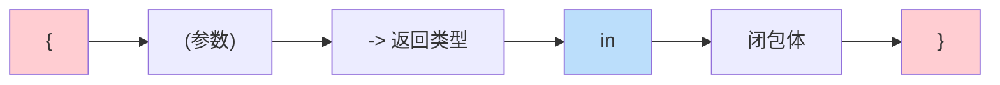
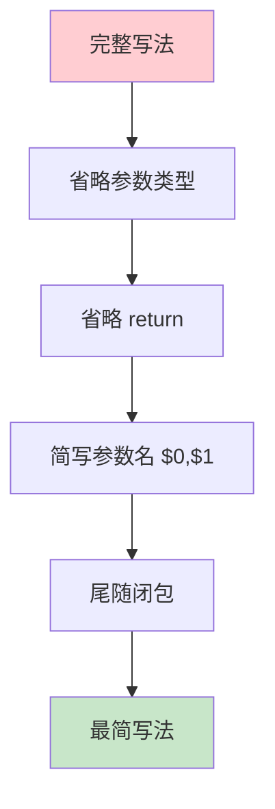

# 第09课：闭包

## 📖 学习目标
- 理解闭包的概念
- 学会闭包表达式语法
- 掌握尾随闭包
- 了解闭包的值捕获

---

## 什么是闭包？

**闭包是什么？简单来说，闭包就是一个"可以传递的代码块"。**

想象一下这个场景：

> 你去餐厅吃饭，服务员问你："您要吃什么？"
> - **函数**：你提前写好了一张菜单（有名字），递给服务员
> - **闭包**：你直接口头告诉服务员"我要一份宫保鸡丁"（没有写下来，但服务员能记住）

闭包和函数的区别就在这里：
- **函数**就像一张写好的菜谱，有名字，可以反复使用
- **闭包**就像你临时告诉厨师怎么做菜，没有名字，用完就扔

### 闭包的核心特性

**闭包可以"记住"它出生时的环境！**

```swift
// 生活例子：你去银行开户
func openAccount(initialDeposit: Int) -> () -> Int {
    var balance = initialDeposit  // 闭包"记住"了初始存款

    // 这个闭包记住了 balance 变量
    let checkBalance = {
        return balance  // 每次调用都能访问这个 balance
    }

    return checkBalance
}

// 开户时存了 1000 元
let myAccount = openAccount(initialDeposit: 1000)

// 查看余额 - 闭包"记住"了 1000
print(myAccount())  // 1000
```

**逐行解读返回类型 `-> () -> Int`：**

这个签名初看令人困惑，但拆开来看其实很有规律。Swift 的类型声明是从左到右读的：
- `func openAccount(initialDeposit: Int)` — 这是一个函数，接收一个 `Int` 参数
- `-> () -> Int` — 它的返回值本身是**另一个函数**，这个函数不接收任何参数 `()`，并且返回 `Int`

换句话说，调用 `openAccount` 不会直接给你一个数字，而是给你一个"查余额的机器"。你每次按这个机器的按钮，它才告诉你当前余额。

**`balance` 为什么能在 `openAccount` 返回后继续存在？**

通常情况下，一个函数执行完毕后，它内部的局部变量（比如 `balance`）就会被销毁。但这里不同：
1. `openAccount` 执行时，创建了局部变量 `balance = 1000`。
2. 紧接着定义了闭包 `checkBalance`，这个闭包的代码中使用了 `balance`。
3. Swift 发现闭包需要用到 `balance`，于是让闭包"捕获"这个变量——相当于闭包偷偷把 `balance` 存进了自己的"背包"里。
4. 函数返回了 `checkBalance` 这个闭包。虽然 `openAccount` 的栈帧被销毁了，但因为闭包的"背包"里还持有 `balance`，所以 `balance` 并没有被释放。
5. 之后每次调用 `myAccount()`，闭包从自己的"背包"中取出 `balance` 并返回。

这就是闭包"捕获值"的本质：**闭包延长了它所引用的外部变量的生命周期。**

**为什么闭包能"记住"？**

因为闭包在创建时，会把它看到的变量"拍照保存"下来。就像你拍了一张照片，以后每次看照片，都能看到当时的样子。

### 闭包 vs 函数对比

| 特性 | 函数 | 闭包 |
|------|------|------|
| 名字 | **必须有名字** | **可以没有名字** |
| 定义位置 | 独立定义 | 可以写在代码中间 |
| 能否"记住"环境 | ❌ 不能 | ✅ 可以捕获变量 |
| 代码量 | 较多 | 可以很简洁 |
| 使用场景 | 通用功能 | 临时、简短的操作 |

### 什么时候用闭包？

> **注意：** 下面的场景1和场景2展示了 iOS 开发中的真实代码模式。`UIView.animate` 和 `fetchData` 是实际开发中非常常见的 API，但这里仅用于说明闭包的用途，不能直接复制运行（需要 UIKit 环境和网络库支持）。场景3可以直接在 Swift Playground 中运行。

**场景1：作为参数传递**
```swift
// 就像你告诉服务员"菜好了叫我"
// 闭包就是那个"叫我"的动作
UIView.animate(withDuration: 0.3) {
    // 动画结束后要执行的代码
    view.alpha = 1.0
}
```

**场景2：网络请求的回调**
```swift
// 就像你点外卖，告诉骑手"送到后给我打电话"
// 闭包就是那个"打电话"的动作
fetchData { result in
    // 数据加载完成后执行
    print(result)
}
```

**场景3：排序和过滤**
```swift
let numbers = [3, 1, 4, 1, 5, 9]

// 闭包告诉排序算法"怎么比较两个数"
// 注意：这里的 $0 和 $1 是闭包的简写参数名，下文"闭包简化"一节会详细解释
let sorted = numbers.sorted { $0 < $1 }
```

### 闭包的语法结构

```swift
{ (参数列表) -> 返回类型 in
    // 闭包体
}
```

**语法拆解：**

| 部分 | 说明 | 示例 |
|------|------|------|
| `{` | 闭包开始 | - |
| `(参数)` | 接收什么数据 | `(name: String)` |
| `-> 返回类型` | 返回什么 | `-> Bool` |
| `in` | 分隔符，下面是代码 | - |
| 代码 | 具体做什么 | `return name.count > 0` |
| `}` | 闭包结束 | - |

### 闭包语法结构图



### 最简单的闭包

```swift
// 无参数无返回值的闭包
let sayHello = {
    print("Hello, World!")
}

sayHello()  // 输出：Hello, World!
```

---

## 闭包表达式

闭包表达式是闭包的具体写法。让我们从最完整的写法开始，然后逐步简化。

### 有参数有返回值

这是闭包的完整写法，包含参数、返回类型和函数体：

```swift
// 完整的闭包写法
let add = { (a: Int, b: Int) -> Int in
    return a + b  // 计算 a + b 并返回
}

// 调用闭包
let result = add(3, 5)
print(result)  // 输出：8
```

**代码解读：**
- `{ ... }` 是闭包的开始和结束
- `(a: Int, b: Int)` 是参数列表，说明闭包接受两个 Int 参数
- `-> Int` 是返回类型，说明闭包返回一个 Int 值
- `in` 是分隔符，后面是闭包的具体代码
- `return a + b` 是计算并返回结果

### 单表达式闭包

当闭包只有一行代码时，可以省略 `return` 关键字：

```swift
// 单表达式闭包（省略 return）
let multiply = { (a: Int, b: Int) -> Int in
    a * b  // 只有一行代码，Swift 自动返回这个值
}

print(multiply(4, 5))  // 输出：20
```

**为什么可以省略 return？**
因为 Swift 知道如果闭包只有一行代码，那这行代码的结果就是要返回的值。

### 闭包作为函数参数

闭包最强大的地方是它可以作为参数传递给其他函数。这在实际开发中非常常见：

```swift
// 定义一个函数，接受一个闭包作为参数
func calculate(_ a: Int, _ b: Int, using operation: (Int, Int) -> Int) -> Int {
    return operation(a, b)  // 调用传入的闭包
}

// 使用闭包作为参数
let result = calculate(10, 5, using: { (a: Int, b: Int) -> Int in
    return a + b
})
print(result)  // 输出：15
```

**代码解读：**
- `calculate` 函数接受三个参数：两个 Int 和一个闭包
- `using operation: (Int, Int) -> Int` 说明这个参数是一个闭包
- 我们传入的闭包 `{ (a: Int, b: Int) -> Int in return a + b }` 会执行加法

**为什么要这样设计？**
因为这样可以让函数更灵活。同一个 `calculate` 函数，传入不同的闭包就能做不同的运算：
- 传入加法闭包 → 计算加法
- 传入乘法闭包 → 计算乘法
- 传入任何其他运算 → 计算该运算

---

## 闭包简化（重要！）

**这是 Swift 语法的一大特色，也是初学者最容易困惑的地方。**

很多初学者看到 `$0`、`$1` 这样的符号会很困惑，其实它们只是参数的简写形式。

### 为什么要简化？

看看同一个功能的两种写法：

```swift
// 完整写法：很清楚，但很长
numbers.sort(by: { (a: Int, b: Int) -> Bool in
    return a < b
})

// 简化写法：很简洁，但新手看不懂
numbers.sort(by: { $0 < $1 })
```

**两者完全等价！** 简化只是为了写起来更方便。

### 闭包简化流程图



### 逐步简化（重要！跟着看）

让我们用一个例子，**一步一步简化**：

```swift
// 我们定义一个函数
func calculate(_ a: Int, _ b: Int, using operation: (Int, Int) -> Int) -> Int {
    return operation(a, b)
}
```

**第1步：完整写法**
```swift
let result1 = calculate(10, 5, using: { (a: Int, b: Int) -> Int in
    return a + b
})
print(result1)  // 15
```

**第2步：省略参数类型**（Swift 能推断出来）
```swift
let result2 = calculate(10, 5, using: { a, b in
    return a + b
})
print(result2)  // 15
```

**第3步：省略 return**（只有一行代码时可以省略）
```swift
let result3 = calculate(10, 5, using: { a, b in a + b })
print(result3)  // 15
```

**第4步：使用简写参数名 $0, $1**（第一个参数叫 $0，第二个叫 $1）
```swift
let result4 = calculate(10, 5, using: { $0 + $1 })
print(result4)  // 15
```

**第5步：尾随闭包**（闭包是最后一个参数时，可以写在括号外面）
```swift
let result5 = calculate(10, 5) { $0 + $1 }
print(result5)  // 15
```

### 🔴 闭包简化对照表

| 简化步骤 | 代码示例 | 说明 |
|----------|----------|------|
| 完整写法 | `{ (a: Int, b: Int) -> Int in return a + b }` | 最完整，新手友好 |
| 省略类型 | `{ a, b in return a + b }` | Swift 推断类型 |
| 省略 return | `{ a, b in a + b }` | 单表达式可省略 |
| 简写参数 | `{ $0 + $1 }` | $0=第一个参数，$1=第二个 |
| 尾随闭包 | `calculate(10, 5) { $0 + $1 }` | 写在括号外 |

### $0, $1 是什么？

**`$0` 就是"第一个参数"，`$1` 就是"第二个参数"，以此类推。**

```swift
// 等价关系
{ (a: Int, b: Int) -> Int in return a + b }
{ $0 + $1 }  // $0 就是 a，$1 就是 b

// 更多参数的例子
let numbers = [3, 1, 4, 1, 5, 9]
numbers.sorted(by: { $0 < $1 })  // $0 和 $1 是要比较的两个数
```

> 💡 **建议：** 初学者先掌握完整写法，熟练后再使用简化写法。代码可读性比简洁更重要！

---

## 尾随闭包

当闭包是函数的最后一个参数时，可以写在函数括号后面。

### 语法

```swift
// 普通写法
func someFunction(closure: () -> Void) {
    // ...
}

someFunction(closure: {
    // 闭包体
})

// 尾随闭包写法
someFunction() {
    // 闭包体
}

// 进一步简化（如果闭包是唯一参数）
someFunction {
    // 闭包体
}
```

### 示例

```swift
func performOperation(_ a: Int, _ b: Int, using operation: (Int, Int) -> Int) -> Int {
    return operation(a, b)
}

// 普通写法
let result1 = performOperation(10, 5, using: { $0 + $1 })

// 尾随闭包
let result2 = performOperation(10, 5) { $0 + $1 }

print(result1, result2)  // 15 15
```

### 多个尾随闭包

```swift
func loadData(success: () -> Void, failure: () -> Void) {
    // 模拟加载成功
    success()
}

// 使用多个尾随闭包
loadData {
    print("加载成功")
} failure: {
    print("加载失败")
}
```

---

## 闭包捕获值

**闭包捕获值是什么？通俗地讲，闭包可以"记住"它出生时看到的变量。**

### 生活类比

想象你拍了一张照片：
- 照片里有一个人和一只狗
- 以后每次看这张照片，你都能看到当时的人和狗
- 即使人和狗后来变了，照片里的还是当时的样子

闭包也是这样：它在创建时，会把它看到的变量"拍照保存"下来。

### 示例

```swift
func makeCounter() -> () -> Int {
    var count = 0  // 这个变量在函数内部

    // 闭包"记住"了 count 这个变量
    let counter: () -> Int = {
        count += 1  // 每次调用都会修改这个 count
        return count
    }
    return counter  // 返回这个闭包
}

// 创建一个计数器
let counter = makeCounter()
print(counter())  // 1（闭包记住了 count 是 0，加1后返回 1）
print(counter())  // 2（闭包记住了 count 是 1，加1后返回 2）
print(counter())  // 3（闭包记住了 count 是 2，加1后返回 3）

// 创建另一个独立的计数器
let counter2 = makeCounter()
print(counter2())  // 1（这是新的计数器，从 0 开始）
```

**代码解读：**
1. `makeCounter` 函数创建了一个闭包
2. 这个闭包"捕获"了 `count` 变量
3. 每次调用闭包，它都能访问并修改这个 `count`
4. 即使 `makeCounter` 函数已经执行完毕，闭包仍然记得 `count`

### 捕获多个值

```swift
func makeStepCounter(step: Int) -> () -> Int {
    var totalSteps = 0
    return {
        totalSteps += step  // 闭包同时捕获了 totalSteps 和 step
        return totalSteps
    }
}

let stepCounter = makeStepCounter(step: 5)
print(stepCounter())  // 5
print(stepCounter())  // 10
print(stepCounter())  // 15
```

**代码解读：**
- 闭包同时捕获了 `totalSteps` 和 `step` 两个变量
- 每次调用都会修改 `totalSteps`，但 `step` 始终是 5

---

## 闭包是引用类型

闭包是引用类型，赋值给变量时共享引用。

**什么是"引用类型"？**

Swift 中有两种类型：值类型（如 `Int`、`Array`、`Struct`）和引用类型（如闭包、Class）。它们的核心区别在于：
- **值类型**赋值时会复制一份副本。修改副本不影响原值。
- **引用类型**赋值时不会复制，两个变量指向内存中的同一个实例。通过任何一个变量修改，另一个变量也能看到变化。

闭包属于引用类型，这意味着当你说 `let alsoIncrementByTen = incrementByTen` 时，并没有创建一个新的闭包，而是让 `alsoIncrementByTen` 也指向了同一个闭包。它们共享同一个被捕获的 `total` 变量。

```swift
func makeIncrementer(incrementAmount: Int) -> () -> Int {
    var total = 0
    let incrementer: () -> Int = {
        total += incrementAmount
        return total
    }
    return incrementer
}

let incrementByTen = makeIncrementer(incrementAmount: 10)

// 两个变量指向同一个闭包
let alsoIncrementByTen = incrementByTen

print(incrementByTen())    // 10
print(alsoIncrementByTen()) // 20
print(incrementByTen())    // 30
```

**逐行分析输出：**

| 调用 | 操作 | `total` 变化 | 输出 | 说明 |
|------|------|-------------|------|------|
| `incrementByTen()` | `total += 10` | 0 -> 10 | **10** | 第一次调用，total 从 0 变为 10 |
| `alsoIncrementByTen()` | `total += 10` | 10 -> 20 | **20** | 虽然换了变量名，但调用的是同一个闭包，total 从 10 变为 20 |
| `incrementByTen()` | `total += 10` | 20 -> 30 | **30** | 再次用第一个变量调用，total 继续累加 |

关键点：`incrementByTen` 和 `alsoIncrementByTen` 并不是两个独立的计数器，它们是同一个闭包的两个"名字"。无论通过哪个变量调用，操作的都是同一个 `total`。如果把闭包换成 `Int`（值类型），`let also = incrementByTen` 就会复制一份，两个变量互不影响。

---

## 常用的闭包场景

### 1. 数组排序

```swift
var names = ["张三", "李四", "王五", "赵六"]

// 按字母顺序排序
names.sort()
print(names)

// 使用闭包自定义排序
names.sort { $0.count < $1.count }
print(names)  // 按姓名长度排序
```

### 2. 数组映射

```swift
let numbers = [1, 2, 3, 4, 5]

// 使用 map 转换每个元素
let doubled = numbers.map { $0 * 2 }
print(doubled)  // [2, 4, 6, 8, 10]

let strings = numbers.map { "数字\($0)" }
print(strings)  // ["数字1", "数字2", "数字3", "数字4", "数字5"]
```

### 3. 数组过滤

```swift
let numbers = [1, 2, 3, 4, 5, 6, 7, 8, 9, 10]

// 过滤出偶数
let evenNumbers = numbers.filter { $0 % 2 == 0 }
print(evenNumbers)  // [2, 4, 6, 8, 10]

// 过滤出大于 5 的数
let greaterThanFive = numbers.filter { $0 > 5 }
print(greaterThanFive)  // [6, 7, 8, 9, 10]
```

### 4. 数组归约

`reduce` 的作用是把数组中的所有元素"合并"成一个值。它需要两个东西：一个初始值，和一个描述"如何合并"的闭包。

```swift
let numbers = [1, 2, 3, 4, 5]

// 计算总和
let sum = numbers.reduce(0) { $0 + $1 }
print(sum)  // 15

// 计算乘积
let product = numbers.reduce(1) { $0 * $1 }
print(product)  // 120

// 拼接字符串
let names = ["张三", "李四", "王五"]
let allNames = names.reduce("") { $0.isEmpty ? $1 : $0 + "、" + $1 }
print(allNames)  // 张三、李四、王五
```

**`reduce(0) { $0 + $1 }` 逐步拆解：**

`reduce` 的闭包接收两个参数：
- `$0` — 累计值（running total），也就是到目前为止的计算结果，初始值为 `0`（就是 `reduce(0)` 中的 `0`）
- `$1` — 当前元素，即数组中正在被处理的那个数

让我们手动追踪每一步：

| 步骤 | `$0`（累计值） | `$1`（当前元素） | 计算 `$0 + $1` | 结果 |
|------|---------------|-----------------|----------------|------|
| 第1轮 | 0（初始值） | 1 | 0 + 1 | 1 |
| 第2轮 | 1（上轮结果） | 2 | 1 + 2 | 3 |
| 第3轮 | 3（上轮结果） | 3 | 3 + 3 | 6 |
| 第4轮 | 6（上轮结果） | 4 | 6 + 4 | 10 |
| 第5轮 | 10（上轮结果） | 5 | 10 + 5 | **15** |

所以 `reduce(0) { $0 + $1 }` 就是把数组所有元素加起来，等价于 `0 + 1 + 2 + 3 + 4 + 5 = 15`。

类似地，`reduce(1) { $0 * $1 }` 以 `1` 为初始值做乘法：`1 * 1 * 2 * 3 * 4 * 5 = 120`。

---

## 闭包与函数的关系

函数实际上是闭包的一种特殊形式。

```swift
// 函数
func add(_ a: Int, _ b: Int) -> Int {
    return a + b
}

// 等价的闭包
let addClosure = { (a: Int, b: Int) -> Int in
    return a + b
}

// 使用方式相同
print(add(3, 5))        // 8
print(addClosure(3, 5))  // 8
```

---

## 📝 练习题

### 练习1：基础闭包
创建一个闭包 `isPositive`，判断一个整数是否为正数。

```swift
// 在这里写你的代码

```

### 练习2：闭包作为参数
编写一个函数 `applyTo(_ number: Int, using operation: (Int) -> Int) -> Int`，然后使用闭包调用它来计算数字的平方。

```swift
// 在这里写你的代码

```

### 练习3：简化闭包
使用简化的闭包语法，对数组 `[5, 2, 8, 1, 9, 3]` 进行降序排序。

```swift
// 在这里写你的代码

```

### 练习4：map 使用
使用 `map` 和闭包将字符串数组 `["apple", "banana", "cherry"]` 转换为大写形式。

```swift
// 在这里写你的代码

```

### 练习5：filter 使用
使用 `filter` 和闭包从数组 `[1, 2, 3, 4, 5, 6, 7, 8, 9, 10]` 中筛选出所有奇数。

```swift
// 在这里写你的代码

```

### 练习6：reduce 使用
使用 `reduce` 和闭包计算数组 `[10, 20, 30, 40, 50]` 的平均值。

```swift
// 在这里写你的代码

```

### 练习7：闭包捕获值
创建一个函数 `makeAccumulator(initial:)`，返回一个闭包，该闭包每次被调用时将传入的值累加到初始值上并返回结果。

```swift
// 在这里写你的代码

```

### 练习8：综合练习
给定一个整数数组，使用闭包链完成以下操作：
1. 过滤出大于 10 的数
2. 将每个数乘以 2
3. 计算总和

```swift
// 在这里写你的代码

```

---

## ✅ 练习题参考答案

> 💡 **提示：** 建议先独立完成练习，再查看答案

---


### 练习1
```swift
let isPositive = { (number: Int) -> Bool in
    return number > 0
}

print(isPositive(5))   // true
print(isPositive(-3))  // false
print(isPositive(0))   // false
```

### 练习2
```swift
func applyTo(_ number: Int, using operation: (Int) -> Int) -> Int {
    return operation(number)
}

let square = applyTo(5) { $0 * $0 }
print(square)  // 25

let double = applyTo(5) { $0 * 2 }
print(double)  // 10
```

### 练习3
```swift
var numbers = [5, 2, 8, 1, 9, 3]
numbers.sort(by: >)
print(numbers)  // [9, 8, 5, 3, 2, 1]
```

### 练习4
```swift
let fruits = ["apple", "banana", "cherry"]
let uppercased = fruits.map { $0.uppercased() }
print(uppercased)  // ["APPLE", "BANANA", "CHERRY"]
```

### 练习5
```swift
let numbers = [1, 2, 3, 4, 5, 6, 7, 8, 9, 10]
let oddNumbers = numbers.filter { $0 % 2 != 0 }
print(oddNumbers)  // [1, 3, 5, 7, 9]
```

### 练习6
```swift
let numbers = [10, 20, 30, 40, 50]
let sum = numbers.reduce(0, +)
let average = Double(sum) / Double(numbers.count)
print("平均值：\(average)")  // 平均值：30.0
```

### 练习7
```swift
func makeAccumulator(initial: Double) -> (Double) -> Double {
    var total = initial
    return { value in
        total += value
        return total
    }
}

let accumulator = makeAccumulator(initial: 0)
print(accumulator(10))   // 10.0
print(accumulator(20))   // 30.0
print(accumulator(30))   // 60.0

let accumulator2 = makeAccumulator(initial: 100)
print(accumulator2(10))  // 110.0
print(accumulator2(20))  // 130.0
```

### 练习8
```swift
let numbers = [5, 12, 8, 15, 3, 20, 7, 25, 10, 18]

let result = numbers
    .filter { $0 > 10 }
    .map { $0 * 2 }
    .reduce(0, +)

print(result)  // 180

// 分步解释
let filtered = numbers.filter { $0 > 10 }
print(filtered)  // [12, 15, 20, 25, 18]

let mapped = filtered.map { $0 * 2 }
print(mapped)  // [24, 30, 40, 50, 36]

let sum = mapped.reduce(0, +)
print(sum)  // 180（24+30+40+50+36=180）
```


---

## 🎯 小结

| 概念 | 说明 |
|------|------|
| 闭包表达式 | `{ (params) -> ReturnType in body }` |
| 简化规则 | 省略类型、return、使用 $0, $1 |
| 尾随闭包 | 闭包写在函数括号后面 |
| 值捕获 | 闭包可以捕获外部变量 |
| 引用类型 | 闭包赋值是引用 |

**常用高阶函数：**
- `map`：转换每个元素
- `filter`：过滤元素
- `reduce`：归约为单个值
- `sort`：排序

---

**上一课：[第08课：函数](第08课：函数.md)**
**下一课：[第10课：结构体和类](第10课：结构体和类.md)**
