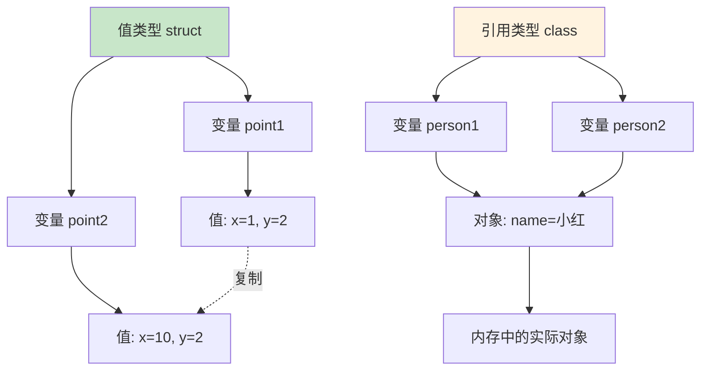

# 第10课：结构体和类

## 📖 学习目标
- 理解结构体和类的概念
- 学会定义和使用结构体
- 学会定义和使用类
- 理解值类型和引用类型的区别

---

## 结构体（struct）

结构体是值类型，用于封装相关属性和方法。

**什么是结构体？可以这样理解：**
结构体就像一个"数据包"，把相关的数据和操作打包在一起。比如：
- 一个"人"的信息：姓名、年龄、方法（介绍自己）
- 一个"点"的坐标：x、y
- 一个"矩形"的尺寸：宽度、高度、方法（计算面积）

**结构体的特点：**
- 是值类型（赋值时会复制）
- 可以有属性（存储数据）
- 可以有方法（执行操作）
- Swift 会自动生成构造器

### 定义结构体

```swift
struct Person {
    // 属性：存储数据
    var name: String  // 姓名
    var age: Int      // 年龄

    // 方法：执行操作
    func introduce() {
        print("我叫\(name)，今年\(age)岁")
    }
}
```

**代码解读：**
- `struct Person` 定义了一个叫 Person 的结构体
- `var name: String` 和 `var age: Int` 是属性，用来存储数据
- `func introduce()` 是方法，用来执行操作
- 结构体的名字通常用大写字母开头

### 创建实例

定义好结构体后，就可以创建具体的"实例"来使用它：

```swift
// 使用构造器创建实例
// Swift 会自动生成一个构造器，接受所有属性作为参数
var person1 = Person(name: "小明", age: 18)

// 访问属性
print(person1.name)  // 输出：小明
print(person1.age)   // 输出：18

// 调用方法
person1.introduce()  // 输出：我叫小明，今年18岁

// 修改属性
person1.age = 19
print(person1.age)   // 输出：19
```

**代码解读：**
1. `Person(name: "小明", age: 18)` 创建了一个 Person 实例
   - `name: "小明"` 给 name 属性赋值
   - `age: 18` 给 age 属性赋值
2. `person1.name` 访问 name 属性的值
3. `person1.introduce()` 调用 introduce 方法
4. `person1.age = 19` 修改 age 属性的值

**注意：** 因为 person1 是用 `var` 声明的，所以可以修改它的属性。如果用 `let` 声明，就不能修改了。

### 结构体的构造器

Swift 会自动为结构体生成成员构造器。

```swift
struct Point {
    var x: Double
    var y: Double
}

// 自动生成的构造器
let point = Point(x: 3.0, y: 4.0)
print(point)  // Point(x: 3.0, y: 4.0)
```

**成员构造器详解：**

Swift 会自动为结构体生成一个**成员构造器（memberwise initializer）**，它的规则如下：
- 构造器会包含结构体中**所有没有默认值的存储属性**作为参数。
- 如果某个属性在定义时已经赋予了默认值，那么在调用构造器时该参数就是**可选的**，可以省略。
- 这个自动生成的成员构造器**仅适用于结构体（struct）**，类（class）则必须手动编写 `init` 方法。

```swift
struct Size {
    var width: Double
    var height: Double
    var unit: String = "cm"  // 有默认值，构造时可省略
}

// 两种写法都可以
let size1 = Size(width: 10, height: 5)             // unit 使用默认值 "cm"
let size2 = Size(width: 10, height: 5, unit: "m")  // 自定义 unit
```

### 自定义构造器

```swift
struct Celsius {
    var temperature: Double

    // 自定义构造器
    init(fromFahrenheit fahrenheit: Double) {
        temperature = (fahrenheit - 32) / 1.8
    }

    init(fromKelvin kelvin: Double) {
        temperature = kelvin - 273.15
    }
}

let boilingPoint = Celsius(fromFahrenheit: 212)
print(boilingPoint.temperature)  // 100.0

let freezingPoint = Celsius(fromKelvin: 273.15)
print(freezingPoint.temperature)  // 0.0
```

**自定义构造器注意事项：**

1. **一旦你为结构体定义了任何自定义 `init` 方法，Swift 就不会再自动生成成员构造器。** 如果你仍然需要使用类似 `Celsius(temperature: 100)` 的方式来创建实例，必须自己额外编写一个接受 `temperature` 参数的构造器。

2. **所有存储属性在 `init` 返回之前必须被初始化。** 如果 `temperature` 没有默认值，就必须在 `init` 中给它赋值，否则编译器会报错。

3. **`self` 是对当前实例的引用。** 在构造器内部，`self.temperature` 指的是"正在被创建的这个实例"的 `temperature` 属性。当参数名和属性名相同时，必须用 `self` 来区分，例如 `self.name = name`。

### 结构体方法

```swift
struct Rectangle {
    var width: Double
    var height: Double

    // 计算面积
    func area() -> Double {
        return width * height
    }

    // 计算周长
    func perimeter() -> Double {
        return 2 * (width + height)
    }

    // 判断是否是正方形
    func isSquare() -> Bool {
        return width == height
    }
}

let rect = Rectangle(width: 10, height: 5)
print("面积：\(rect.area())")      // 50.0
print("周长：\(rect.perimeter())")  // 30.0
print("是正方形：\(rect.isSquare())") // false
```

### 可变方法

使用 `mutating` 关键字修改属性。

```swift
struct Counter {
    var count = 0

    // 可变方法
    mutating func increment() {
        count += 1
    }

    mutating func increment(by amount: Int) {
        count += amount
    }

    mutating func reset() {
        count = 0
    }
}

var counter = Counter()
counter.increment()
print(counter.count)  // 1

counter.increment(by: 5)
print(counter.count)  // 6

counter.reset()
print(counter.count)  // 0
```

**为什么需要 `mutating` 关键字？**

因为结构体是**值类型**，Swift 默认不允许方法修改结构体自身的属性。这就好比你拿到一份文件的复印件，你不能通过复印件去修改原件——它们是独立的。

`mutating` 关键字的作用是告诉 Swift："这个方法会修改结构体自身的数据。"使用时需要注意：
- 调用 `mutating` 方法的结构体实例必须用 `var` 声明，不能用 `let`（因为 `let` 表示不可变）。
- 这是**结构体独有的要求**。类（class）是引用类型，多个变量共享同一个对象，所以类的方法**不需要** `mutating` 关键字就可以直接修改属性。

```swift
// 类不需要 mutating
class ClassCounter {
    var count = 0
    func increment() {  // 不需要 mutating
        count += 1
    }
}
```

---

## 类（class）

类是引用类型，用于定义对象的蓝图。

### 定义类

```swift
class Student {
    // 属性
    var name: String
    var age: Int
    var grade: String

    // 构造器
    init(name: String, age: Int, grade: String) {
        self.name = name
        self.age = age
        self.grade = grade
    }

    // 方法
    func introduce() {
        print("我叫\(name)，今年\(age)岁，读\(grade)年级")
    }
}
```

**代码解读：**

- **类必须显式定义 `init` 构造器。** 与结构体不同，Swift 不会为类自动生成成员构造器。即使类的每个属性都有默认值，你仍然需要手动编写 `init`（除非所有属性都有默认值且不需要自定义初始化逻辑）。
- **`self.name = name` 中的 `self` 用于消除歧义。** 当构造器的参数名（`name`）与属性名（`name`）相同时，Swift 无法自动区分它们。`self.name` 指的是"当前实例的属性"，而等号右边的 `name` 指的是"传入的参数"。

### 创建实例

```swift
let student = Student(name: "小明", age: 18, grade: "高三")
student.introduce()  // 我叫小明，今年18岁，读高三年级

// 修改属性
student.name = "小红"
student.introduce()  // 我叫小红，今年18岁，读高三年级
```

### 类的继承

```swift
class Animal {
    var name: String

    init(name: String) {
        self.name = name
    }

    func speak() {
        print("\(name) 发出声音")
    }
}

class Dog: Animal {
    func fetch() {
        print("\(name) 去捡球")
    }

    override func speak() {
        print("\(name) 汪汪叫")
    }
}

class Cat: Animal {
    func purr() {
        print("\(name) 呼噜呼噜")
    }

    override func speak() {
        print("\(name) 喵喵叫")
    }
}
```

**继承相关要点：**

- **`class Dog: Animal`** 表示 `Dog` 继承自 `Animal`，`Dog` 是子类，`Animal` 是父类（也叫超类）。
- **`override` 关键字是必需的。** 当子类重新定义（重写）父类中已经存在的方法时，必须在方法前加上 `override`。这告诉编译器"我是故意要替换父类的实现"，而不是不小心写了一个同名方法。如果父类没有这个方法，就不能用 `override`。
- **`super.init(name: name)` 调用父类的构造器。** 子类的构造器必须确保父类也完成了初始化。通常做法是先初始化子类自己新增的属性，然后调用 `super.init(...)` 来初始化从父类继承的属性。注意在上面的 `Dog` 和 `Cat` 中，它们没有新增存储属性，所以没有显式定义自己的 `init`，而是直接使用了从父类继承的 `init(name:)` 构造器。

```swift

let dog = Dog(name: "旺财")
dog.speak()   // 旺财 汪汪叫
dog.fetch()   // 旺财 去捡球

let cat = Cat(name: "咪咪")
cat.speak()   // 咪咪 喵喵叫
cat.purr()    // 咪咪 呼噜呼噜
```

---

## 值类型 vs 引用类型（重要！）

**这是 Swift 中最核心的概念之一！理解它们的区别，能帮你避免很多莫名其妙的 bug。**

### 用生活例子来理解

**值类型（结构体）= 复印文件**

想象你有一份文件，你去复印了一份：
- 你拿到的是**复印件**
- 你在复印件上写字，**原件不会变**
- 你把复印件给别人，别人改了，**你的原件也不会变**

```swift
struct Document {
    var content: String
}

var original = Document(content: "合同内容")
var copy = original  // 复印一份

copy.content = "修改后的合同"

print(original.content)  // "合同内容"  ← 原件没变！
print(copy.content)      // "修改后的合同"
```

**引用类型（类）= 共享文档**

想象你和同事共享一个在线文档：
- 你们看的是**同一份文档**
- 同事改了内容，**你看到的也会变**
- 你改了内容，**同事看到的也会变**

```swift
class OnlineDocument {
    var content: String

    init(content: String) {
        self.content = content
    }
}

var myDoc = OnlineDocument(content: "会议记录")
var colleagueDoc = myDoc  // 共享同一份文档

colleagueDoc.content = "修改后的会议记录"

print(myDoc.content)      // "修改后的会议记录"  ← 也被改了！
print(colleagueDoc.content) // "修改后的会议记录"
```

### 🔴 核心区别对比表

| 特性 | 结构体 (struct) | 类 (class) |
|------|----------------|------------|
| 类型 | **值类型** | **引用类型** |
| 赋值 | **复制**一份新的 | **共享**同一个对象 |
| 修改影响 | ❌ 不影响原变量 | ✅ 影响所有引用 |
| 生活类比 | 复印文件 | 共享文档 |
| 推荐 | 优先使用 | 需要继承时使用 |

### 什么时候用结构体？什么时候用类？

**用结构体的情况：**
```swift
// 1. 简单的数据
struct Point {
    var x: Double
    var y: Double
}

// 2. 不需要继承
struct Size {
    var width: Double
    var height: Double
}

// 3. 希望赋值时是独立的副本
struct Color {
    var red: Double
    var green: Double
    var blue: Double
}
```

**用类的情况：**
```swift
// 1. 需要继承
class Animal {
    func speak() { print("...") }
}
class Dog: Animal {
    override func speak() { print("汪汪") }
}

// 2. 需要多个变量指向同一个对象
class BankAccount {
    var balance: Double = 0
}

// 两个变量共享同一个账户
let account1 = BankAccount()
let account2 = account1  // account2 和 account1 是同一个账户！

account2.balance = 1000
print(account1.balance)  // 1000  ← 也被改了！
```

### 图解理解



### 💡 记忆口诀

> - **结构体 = 复印机**（每次赋值都复制一份）
> - **类 = 共享文档**（多人指向同一份文档）

### 代码验证

```swift
// 值类型验证
struct ValueExample {
    var value: Int
}

var a = ValueExample(value: 10)
var b = a
b.value = 20
print(a.value)  // 10 ✅ 不受影响
print(b.value)  // 20

// 引用类型验证
class ReferenceExample {
    var value: Int

    init(value: Int) {
        self.value = value
    }
}

let c = ReferenceExample(value: 10)
let d = c
d.value = 20
print(c.value)  // 20 ⚠️ 被影响了！
print(d.value)  // 20
```

### 对比示例

```swift
// 结构体是值类型
struct ValueExample {
    var value: Int
}

var a = ValueExample(value: 10)
var b = a
b.value = 20
print(a.value)  // 10
print(b.value)  // 20

// 类是引用类型
class ReferenceExample {
    var value: Int

    init(value: Int) {
        self.value = value
    }
}

let c = ReferenceExample(value: 10)
let d = c
d.value = 20
print(c.value)  // 20
print(d.value)  // 20
```

---

## 属性

### 存储属性

```swift
struct FixedLengthRange {
    var firstValue: Int
    let length: Int
}

var range = FixedLengthRange(firstValue: 0, length: 3)
range.firstValue = 5
// range.length = 10  // 错误：let 属性不能修改
```

### 计算属性

```swift
struct Circle {
    var radius: Double

    // 计算属性
    var area: Double {
        return Double.pi * radius * radius
    }

    var circumference: Double {
        return 2 * Double.pi * radius
    }
}

let circle = Circle(radius: 5)
print("面积：\(circle.area)")           // 78.53981633974483
print("周长：\(circle.circumference)")  // 31.41592653589793
```

**计算属性详解：**

计算属性**不存储任何值**，而是每次访问时通过代码动态计算结果。它本质上是一个"伪装成属性的函数"。

- 计算属性必须用 `var` 声明（因为它的值会变化），不能用 `let`。
- 只读计算属性只有 `get`（获取），如上面的 `area` 和 `circumference`。如果需要同时支持赋值，还可以定义 `set`（设置）。
- 由于每次访问都会重新计算，如果计算逻辑很复杂且频繁调用，可以考虑将结果缓存到存储属性中以提高性能。

### 属性观察器

```swift
class StepCounter {
    var totalSteps: Int = 0 {
        willSet {
            print("将要设置步数为 \(newValue)")
        }
        didSet {
            if totalSteps > oldValue {
                print("增加了 \(totalSteps - oldValue) 步")
            }
        }
    }
}

let counter = StepCounter()
counter.totalSteps = 100
// 输出：
// 将要设置步数为 100
// 增加了 100 步

counter.totalSteps = 250
// 输出：
// 将要设置步数为 250
// 增加了 150 步
```

**属性观察器详解：**

属性观察器让你在属性值发生变化时执行额外的代码，非常适合用于触发 UI 更新、日志记录或数据验证等场景。

- **`willSet`** 在属性值**即将被修改之前**调用。Swift 自动提供一个隐含变量 `newValue`，代表即将设置的新值。
- **`didSet`** 在属性值**已经被修改之后**调用。Swift 自动提供一个隐含变量 `oldValue`，代表修改之前的旧值。
- `newValue` 和 `oldValue` 都是 Swift 自动生成的隐含变量，不需要手动声明，可以直接在 `willSet` / `didSet` 的花括号内使用。
- 你也可以自定义这些隐含变量的名称，例如 `willSet(newSteps)`，此时 `newSteps` 就替代了默认的 `newValue`。

---

## 类型属性

使用 `static` 关��字定义类型属性。

```swift
struct SomeStructure {
    static var storedTypeProperty = "Some value."
    static var computedTypeProperty: Int {
        return 1
    }
}

print(SomeStructure.storedTypeProperty)  // Some value.
SomeStructure.storedTypeProperty = "Another value."
print(SomeStructure.storedTypeProperty)  // Another value.

class SomeClass {
    static var storedTypeProperty = "Some value."
    static var computedTypeProperty: Int {
        return 1
    }

    // 子类可以重写
    class var overridableComputedTypeProperty: Int {
        return 107
    }
}
```

**类型属性详解：**

类型属性使用 `static` 关键字定义，它**属于类型本身，而不是某个具体的实例**。

- 访问类型属性时，直接使用**类型名**调用，例如 `SomeStructure.storedTypeProperty`，而不需要先创建实例。
- 类型属性在整个程序中只有一份，所有实例共享同一个值，非常适合用来存储全局配置、常量或共享状态。
- 在类中，如果希望子类能够重写某个计算类型的属性，可以用 `class` 替代 `static`（如上面的 `overridableComputedTypeProperty`）。
- 类型属性可以是存储属性（有固定值）也可以是计算属性（动态计算），但存储类型的类型属性必须在定义时赋予初始值。

---

## 📝 练习题

### 练习1：定义结构体
定义一个 `Book` 结构体，包含属性：`title`（书名）、`author`（作者）、`pages`（页数），以及一个方法 `describe()` 打印书籍信息。

```swift
// 在这里写你的代码

```

### 练习2：结构体方法
定义一个 `Temperature` 结构体，包含属性 `celsius`（摄氏度），以及：
1. 一个计算属性 `fahrenheit`（华氏度）
2. 一个方法 `isBoiling()` 判断是否沸腾（>=100°C）

```swift
// 在这里写你的代码

```

### 练习3：可变方法
定义一个 `BankAccount` 结构体，包含属性 `balance`（余额），以及：
1. `deposit(_ amount:)` 存款方法
2. `withdraw(_ amount:)` 取款方法（余额不足时不能取款）
3. `getBalance()` 查询余额方法

```swift
// 在这里写你的代码

```

### 练习4：类继承
定义一个 `Vehicle` 基类，包含属性 `brand`（品牌）和方法 `describe()`。
然后定义 `Car` 和 `Motorcycle` 子类，添加各自的属性和方法。

```swift
// 在这里写你的代码

```

### 练习5：值类型 vs 引用类型
分别使用结构体和类实现一个 `Score` 类型，包含属性 `value`，然后演示赋值后修改原对象对新对象的影响。

```swift
// 在这里写你的代码

```

### 练习6：计算属性
定义一个 `Rectangle` 结构体，包含属性 `width` 和 `height`，以及计算属性：
1. `area`（面积）
2. `perimeter`（周长）
3. `isSquare`（是否是正方形）

```swift
// 在这里写你的代码

```

### 练习7：属性观察器
定义一个 `Level` 类，包含属性 `currentLevel`，当等级变化时打印提示信息（如 "升级了！" 或 "降级了！"）。

```swift
// 在这里写你的代码

```

### 练习8：综合练习
设计一个简单的图书馆系统：
1. 定义 `Book` 结构体（书名、作者、是否借出）
2. 定义 `Library` 类，包含方法：
   - `addBook(_:)` 添加书籍
   - `borrowBook(title:)` 借书
   - `returnBook(title:)` 还书
   - `listAvailableBooks()` 列出可借书籍

```swift
// 在这里写你的代码

```

---

## ✅ 练习题参考答案

> 💡 **提示：** 建议先独立完成练习，再查看答案

---


### 练习1
```swift
struct Book {
    var title: String
    var author: String
    var pages: Int

    func describe() {
        print("《\(title)》，作者：\(author)，共\(pages)页")
    }
}

let book = Book(title: "Swift编程入门", author: "张三", pages: 300)
book.describe()
// 输出：《Swift编程入门》，作者：张三，共300页
```

### 练习2
```swift
struct Temperature {
    var celsius: Double

    var fahrenheit: Double {
        return celsius * 9 / 5 + 32
    }

    func isBoiling() -> Bool {
        return celsius >= 100
    }
}

let temp = Temperature(celsius: 100)
print("华氏温度：\(temp.fahrenheit)")  // 212.0
print("是否沸腾：\(temp.isBoiling())")  // true

let temp2 = Temperature(celsius: 50)
print("华氏温度：\(temp2.fahrenheit)")  // 122.0
print("是否沸腾：\(temp2.isBoiling())")  // false
```

### 练习3
```swift
struct BankAccount {
    var balance: Double = 0

    mutating func deposit(_ amount: Double) {
        if amount > 0 {
            balance += amount
            print("存入 \(amount) 元，余额 \(balance) 元")
        } else {
            print("存款金额必须大于0")
        }
    }

    mutating func withdraw(_ amount: Double) {
        if amount <= 0 {
            print("取款金额必须大于0")
        } else if amount > balance {
            print("余额不足，当前余额 \(balance) 元")
        } else {
            balance -= amount
            print("取出 \(amount) 元，余额 \(balance) 元")
        }
    }

    func getBalance() -> Double {
        return balance
    }
}

var account = BankAccount()
account.deposit(1000)     // 存入 1000.0 元，余额 1000.0 元
account.withdraw(500)     // 取出 500.0 元，余额 500.0 元
account.withdraw(600)     // 余额不足，当前余额 500.0 元
print(account.getBalance())  // 500.0
```

### 练习4
```swift
class Vehicle {
    var brand: String

    init(brand: String) {
        self.brand = brand
    }

    func describe() {
        print("这是\(brand)品牌的车辆")
    }
}

class Car: Vehicle {
    var doors: Int

    init(brand: String, doors: Int) {
        self.doors = doors
        super.init(brand: brand)
    }

    override func describe() {
        print("这是\(brand)品牌的汽车，有\(doors)个门")
    }
}

class Motorcycle: Vehicle {
    var hasSidecar: Bool

    init(brand: String, hasSidecar: Bool) {
        self.hasSidecar = hasSidecar
        super.init(brand: brand)
    }

    override func describe() {
        let sidecarText = hasSidecar ? "有" : "没有"
        print("这是\(brand)品牌的摩托车，\(sidecarText)边车")
    }
}

let car = Car(brand: "丰田", doors: 4)
car.describe()  // 这是丰田品牌的汽车，有4个门

let motorcycle = Motorcycle(brand: "本田", hasSidecar: false)
motorcycle.describe()  // 这是本田品牌的摩托车，没有边车
```

### 练习5
```swift
// 结构体（值类型）
struct ValueScore {
    var value: Int
}

var score1 = ValueScore(value: 90)
var score2 = score1
score2.value = 95
print(score1.value)  // 90（不受影响）
print(score2.value)  // 95

// 类（引用类型）
class ReferenceScore {
    var value: Int

    init(value: Int) {
        self.value = value
    }
}

let score3 = ReferenceScore(value: 90)
let score4 = score3
score4.value = 95
print(score3.value)  // 95（受影响）
print(score4.value)  // 95
```

### 练习6
```swift
struct Rectangle {
    var width: Double
    var height: Double

    var area: Double {
        return width * height
    }

    var perimeter: Double {
        return 2 * (width + height)
    }

    var isSquare: Bool {
        return width == height
    }
}

let rect = Rectangle(width: 10, height: 5)
print("面积：\(rect.area)")        // 50.0
print("周长：\(rect.perimeter)")    // 30.0
print("是正方形：\(rect.isSquare)") // false

let square = Rectangle(width: 5, height: 5)
print("是正方形：\(square.isSquare)") // true
```

### 练习7
```swift
class Level {
    var currentLevel: Int = 1 {
        willSet {
            if newValue > currentLevel {
                print("即将升级到 \(newValue) 级！")
            } else if newValue < currentLevel {
                print("即将降级到 \(newValue) 级...")
            }
        }
        didSet {
            if currentLevel > oldValue {
                print("升级成功！当前等级：\(currentLevel)")
            } else if currentLevel < oldValue {
                print("降级了...当前等级：\(currentLevel)")
            }
        }
    }
}

let level = Level()
level.currentLevel = 2
// 输出：
// 即将升级到 2 级！
// 升级成功！当前等级：2

level.currentLevel = 5
// 输出：
// 即将升级到 5 级！
// 升级成功！当前等级：5

level.currentLevel = 3
// 输出：
// 即将降级到 3 级...
// 降级了...当前等级：3
```

### 练习8
```swift
struct Book {
    var title: String
    var author: String
    var isBorrowed: Bool = false
}

class Library {
    var books: [Book] = []

    func addBook(_ book: Book) {
        books.append(book)
        print("已添加《\(book.title)》")
    }

    func borrowBook(title: String) {
        if let index = books.firstIndex(where: { $0.title == title && !$0.isBorrowed }) {
            books[index].isBorrowed = true
            print("成功借出《\(title)》")
        } else {
            print("《\(title)》不可借")
        }
    }

    func returnBook(title: String) {
        if let index = books.firstIndex(where: { $0.title == title && $0.isBorrowed }) {
            books[index].isBorrowed = false
            print("已归还《\(title)》")
        } else {
            print("《\(title)》未被借出")
        }
    }

    func listAvailableBooks() {
        let availableBooks = books.filter { !$0.isBorrowed }
        print("可借书籍：")
        for book in availableBooks {
            print("- 《\(book.title)》，作者：\(book.author)")
        }
    }
}

let library = Library()
library.addBook(Book(title: "Swift入门", author: "张三"))
library.addBook(Book(title: "iOS开发", author: "李四"))
library.addBook(Book(title: "编程思想", author: "王五"))

library.listAvailableBooks()
// 输出：
// 可借书籍：
// - 《Swift入门》，作者：张三
// - 《iOS开发》，作者：李四
// - 《编程思想》，作者：王五

library.borrowBook(title: "Swift入门")
// 输出：成功借出《Swift入门》

library.listAvailableBooks()
// 输出：
// 可借书籍：
// - 《iOS开发》，作者：李四
// - 《编程思想》，作者：王五

library.returnBook(title: "Swift入门")
// 输出：已归还《Swift入门》
```


---

## 🎯 小结

| 特性 | 结构体（struct） | 类（class） |
|------|-----------------|-------------|
| 类型 | 值类型 | 引用类型 |
| 继承 | 不支持 | 支持 |
| 构造器 | 自动生成成员构造器 | 需要手动定义 |
| 可变方法 | 需要 `mutating` | 不需要 |
| 析构器 | 不支持 | 支持 |

**选择建议：**
- 优先使用结构体
- 需要继承或引用语义时使用类
- 值类型更安全，引用类型更灵活

---

**上一课：[第09课：闭包](第09课：闭包.md)**
**下一课：[第11课：枚举](第11课：枚举.md)**
