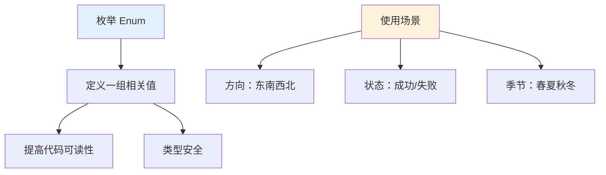
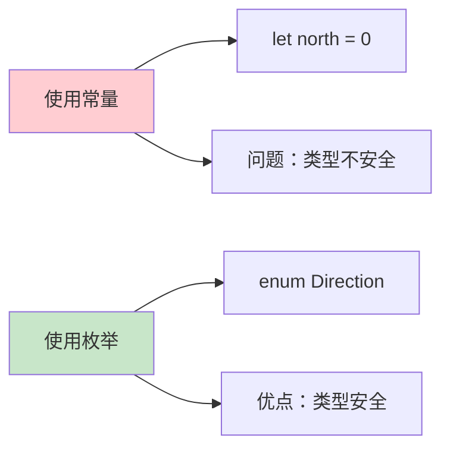
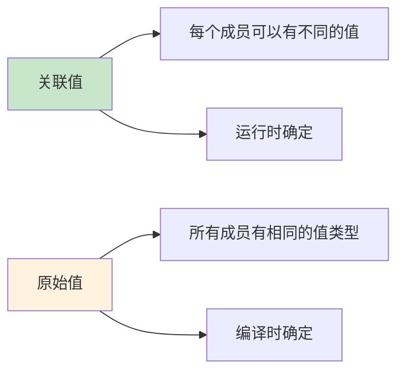

# 第11课：枚举

## 📖 学习目标
- 理解枚举的概念和用途
- 学会定义和使用枚举
- 掌握关联值和原始值
- 了解枚举方法和计算属性

---

## 什么是枚举？

枚举定义了一组**相关的值**，使你可以在代码中以**安全的方式**使用这些值。

### 枚举概念图



### 枚举 vs 常量



### 枚举的优势

| 特性 | 说明 |
|------|------|
| 类型安全 | 编译器检查，避免无效值 |
| 代码可读 | 语义清晰，易于理解 |
| 易于扩展 | 可以添加方法和属性 |
| 模式匹配 | 配合 switch 使用 |

---

### 基本语法

```swift
enum 枚举名 {
    case 值1
    case 值2
    case 值3
}
```

### 示例

```swift
enum Direction {
    case north
    case south
    case east
    case west
}

// 使用枚举
var direction = Direction.north
print(direction)  // north

// 简化写法（类型已知时）
direction = .south
print(direction)  // south
```

**代码解读：**
- `var direction = Direction.north` 首次赋值时，必须写完整的 `Direction.north`，因为此时编译器还不知道 `direction` 的类型。
- 一旦 `direction` 的类型被确立为 `Direction`（即"类型已知"），后续赋值就可以省略类型名，直接写 `.south`。编译器会自动推断出 `.south` 就是 `Direction.south`。
- 这个特性不仅让代码更简洁，在 `switch` 语句和函数参数中也经常用到。例如 `switch` 的 `case .north:` 就是因为匹配的值类型已经由 `switch` 后面的表达式确定了。

---

## 枚举与 switch

```swift
enum Season {
    case spring
    case summer
    case autumn
    case winter
}

let season = Season.summer

switch season {
case .spring:
    print("春天")
case .summer:
    print("夏天")
case .autumn:
    print("秋天")
case .winter:
    print("冬天")
}
// 输出：夏天
```

### 使用 if-case

```swift
let direction = Direction.north

if case .north = direction {
    print("朝北")
}

// 检查是否匹配
if direction == .north {
    print("朝北")
}
```

---

## 关联值

**关联值是什么？简单来说，每个枚举成员可以携带额外的信息。**

与原始值（raw values）不同，关联值允许每个枚举成员在创建实例时携带不同类型、不同数量的数据。原始值是在枚举定义时就固定的（例如 `case earth = "地球"`），所有实例的原始值都一样；而关联值是在创建枚举实例时动态传入的，同一个枚举成员的不同实例可以携带完全不同的关联值。这使得关联值非常适合表示"同一个类别、不同数据"的场景，比如一个条形码可以是 UPC 格式（4个整数），也可以是 QR 码格式（一个字符串）。

### 关联值 vs 原始值



| 特性 | 关联值 | 原始值 |
|------|--------|--------|
| 值类型 | 可以不同 | 必须相同 |
| 何时确定 | 运行时 | 编译时 |
| 用途 | 携带额外信息 | 提供默认值 |

### 示例

```swift
enum Barcode {
    case upc(Int, Int, Int, Int)  // 关联 4 个 Int
    case qrCode(String)          // 关联 1 个 String
}

// 使用关联值
var productBarcode = Barcode.upc(8, 85909, 51226, 3)
productBarcode = .qrCode("ABCDEFGHIJKLMNOP")

// 获取关联值
switch productBarcode {
case .upc(let system, let manufacturer, let product, let check):
    print("UPC: \(system)-\(manufacturer)-\(product)-\(check)")
case .qrCode(let code):
    print("QR Code: \(code)")
}
// 输出：QR Code: ABCDEFGHIJKLMNOP
```

**代码解读：**
- `case upc(Int, Int, Int, Int)` - upc 关联 4 个整数
- `case qrCode(String)` - qrCode 关联一个字符串
- 使用 `let` 提取关联值
- `case .upc(let system, let manufacturer, let product, let check)` 这行代码的作用是：当 `productBarcode` 匹配到 `.upc` 这个成员时，将它关联的 4 个整数值分别提取到名为 `system`、`manufacturer`、`product`、`check` 的局部常量中，这样就可以在 `case` 分支内部使用这些值了。这个过程叫做"值绑定"（value binding）。如果所有关联值都需要提取为 `let` 常量，也可以简写为 `case let .upc(system, manufacturer, product, check)`

### 多个关联值

```swift
enum NetworkResult {
    case success(data: String, statusCode: Int)
    case failure(error: String, statusCode: Int)
}

let result = NetworkResult.success(data: "Hello", statusCode: 200)

switch result {
case .success(let data, let statusCode):
    print("成功：\(data)，状态码：\(statusCode)")
case .failure(let error, let statusCode):
    print("失败：\(error)，状态码：\(statusCode)")
}
// 输出：成功：Hello，状态码：200
```

---

## 原始值

枚举成员可以有预填的默认值（原始值）。

### 字符串原始值

```swift
enum Planet: String {
    case mercury = "水星"
    case venus = "金星"
    case earth = "地球"
    case mars = "火星"
    case jupiter = "木星"
    case saturn = "土星"
    case uranus = "天王星"
    case neptune = "海王星"
}

let planet = Planet.earth
print(planet.rawValue)  // 地球

// 从原始值创建枚举
if let planet = Planet(rawValue: "火星") {
    print(planet)  // mars
}

// 原始值不存在时返回 nil
if let planet = Planet(rawValue: "冥王星") {
    print(planet)
} else {
    print("冥王星不是行星")  // 会执行这行
}
```

### 整数原始值

```swift
enum Month: Int {
    case january = 1
    case february = 2
    case march = 3
    case april = 4
    case may = 5
    case june = 6
    case july = 7
    case august = 8
    case september = 9
    case october = 10
    case november = 11
    case december = 12
}

let month = Month.june
print(month.rawValue)  // 6

// 从原始值创建
if let month = Month(rawValue: 12) {
    print("月份：\(month)")  // december
}
```

### 自动递增的原始值

```swift
enum Direction: Int {
    case north = 0
    case east = 1
    case south = 2
    case west = 3
}

// 或者使用自动递增
enum Priority: Int {
    case low      // 0
    case medium   // 1
    case high     // 2
    case critical // 3
}

print(Priority.high.rawValue)  // 2
```

---

## 枚举方法

枚举可以定义方法。

### 实例方法

```swift
enum TrafficLight {
    case red
    case yellow
    case green

    func description() -> String {
        switch self {
        case .red:
            return "红灯停"
        case .yellow:
            return "黄灯等"
        case .green:
            return "绿灯行"
        }
    }
}

let light = TrafficLight.red
print(light.description())  // 红灯停
```

### 可变方法

```swift
enum Switch {
    case off
    case on

    mutating func toggle() {
        switch self {
        case .off:
            self = .on
        case .on:
            self = .off
        }
    }
}

var light = Switch.off
light.toggle()
print(light)  // on
light.toggle()
print(light)  // off
```

---

## 计算属性

枚举可以有计算属性。

```swift
enum Season {
    case spring
    case summer
    case autumn
    case winter

    var temperature: String {
        switch self {
        case .spring:
            return "温暖"
        case .summer:
            return "炎热"
        case .autumn:
            return "凉爽"
        case .winter:
            return "寒冷"
        }
    }

    var months: String {
        switch self {
        case .spring:
            return "3-5月"
        case .summer:
            return "6-8月"
        case .autumn:
            return "9-11月"
        case .winter:
            return "12-2月"
        }
    }
}

let season = Season.summer
print("温度：\(season.temperature)")  // 温度：炎热
print("月份：\(season.months)")      // 月份：6-8月
```

---

## 静态方法

```swift
enum TemperatureUnit {
    case celsius
    case fahrenheit
    case kelvin

    static func description(of unit: TemperatureUnit) -> String {
        switch unit {
        case .celsius:
            return "摄氏度"
        case .fahrenheit:
            return "华氏度"
        case .kelvin:
            return "开尔文"
        }
    }
}

print(TemperatureUnit.description(of: .celsius))  // 摄氏度
```

---

## 枚举遍历

使用 `CaseIterable` 协议可以遍历所有枚举值。

```swift
enum Color: CaseIterable {
    case red
    case green
    case blue
    case yellow
    case purple
}

// 遍历所有颜色
for color in Color.allCases {
    print(color)
}
// 输出：
// red
// green
// blue
// yellow
// purple

print("共有 \(Color.allCases.count) 种颜色")  // 共有 5 种颜色
```

---

## 嵌套枚举

```swift
enum Character {
    enum Weapon {
        case sword
        case bow
        case staff
    }

    enum Armor {
        case leather
        case chainmail
        case plate
    }

    case warrior(weapon: Weapon, armor: Armor)
    case mage(weapon: Weapon, armor: Armor)
}

let hero = Character.warrior(weapon: .sword, armor: .plate)
```

---

## 递归枚举

使用 `indirect` 关键字定义递归枚举。

**什么是递归枚举？** 递归枚举是指枚举的某个成员的关联值中包含该枚举自身的类型。在上面的算术表达式例子中，`addition` 的两个关联值本身就是 `ArithmeticExpression`，也就是说一个表达式可以嵌套另一个表达式。

**为什么需要 `indirect` 关键字？** 这是 Swift 的内存布局决定的。枚举在内存中需要知道自己占用多少空间，但如果一个枚举成员关联了自身的类型，就会形成无限嵌套（表达式里套表达式里套表达式...），编译器无法计算出固定的大小。`indirect` 关键字告诉 Swift："不要直接在这个枚举内部存储关联值，而是在堆（heap）上分配一块间接存储空间，通过引用来访问"。这样就打破了大小的无限递归，使得递归枚举成为可能。你也可以在整个枚举前加 `indirect`，表示所有 case 都使用间接存储。

```swift
enum ArithmeticExpression {
    case number(Int)
    indirect case addition(ArithmeticExpression, ArithmeticExpression)
    indirect case multiplication(ArithmeticExpression, ArithmeticExpression)
}

func evaluate(_ expression: ArithmeticExpression) -> Int {
    switch expression {
    case .number(let value):
        return value
    case .addition(let left, let right):
        return evaluate(left) + evaluate(right)
    case .multiplication(let left, let right):
        return evaluate(left) * evaluate(right)
    }
}

// (5 + 3) * 2
let expression = ArithmeticExpression.multiplication(
    .addition(.number(5), .number(3)),
    .number(2)
)

print(evaluate(expression))  // 16
```

---

## 📝 练习题

### 练习1：基本枚举
定义一个 `Weekday` 枚举，包含周一到周日，然后使用 switch 语句判断今天是工作日还是周末。

```swift
// 在这里写你的代码

```

### 练习2：带原始值的枚举
定义一个 `HttpMethod` 枚举，原始值为字符串，包含 GET、POST、PUT、DELETE。

```swift
// 在这里写你的代码

```

### 练习3：关联值枚举
定义一个 `Result` 枚举，包含：
- `success(data: String)`
- `failure(error: String, code: Int)`

然后创建两个示例并打印信息。

```swift
// 在这里写你的代码

```

### 练习4：枚举方法
定义一个 `Calculator` 枚举，包含 `add`、`subtract`、`multiply`、`divide` 四个操作，每个操作关联两个 Double 值。添加一个 `calculate()` 方法返回计算结果。

```swift
// 在这里写你的代码

```

### 练习5：枚举遍历
定义一个 `Planet` 枚举，使用 `CaseIterable` 协议，然后遍历打印所有行星及其与太阳的距离（使用计算属性）。

```swift
// 在这里写你的代码

```

### 练习6：递归枚举
定义一个递归枚举 `Expression` 来表示简单的数学表达式：
- `number(Double)` 数字
- `addition(Expression, Expression)` 加法
- `subtraction(Expression, Expression)` 减法

编写一个函数计算表达式的结果。

```swift
// 在这里写你的代码

```

### 练习7：状态机
使用枚举实现一个简单的交通灯状态机：
- 定义 `TrafficLight` 枚举（红、黄、绿）
- 添加 `next()` 方法返回下一个状态
- 添加 `duration()` 方法返回每个状态的持续时间（秒）

```swift
// 在这里写你的代码

```

### 练习8：综合练习
设计一个简单的扑克牌系统：
1. 定义 `Suit` 枚举（花色：红桃、黑桃、方块、梅花）
2. 定义 `Rank` 枚举（点数：A, 2-10, J, Q, K）
3. 定义 `Card` 结构体，包含花色和点数
4. 创建一副牌并打印

```swift
// 在这里写你的代码

```

---

## ✅ 练习题参考答案

> 💡 **提示：** 建议先独立完成练习，再查看答案

---


### 练习1
```swift
enum Weekday {
    case monday
    case tuesday
    case wednesday
    case thursday
    case friday
    case saturday
    case sunday
}

let today = Weekday.wednesday

switch today {
case .monday, .tuesday, .wednesday, .thursday, .friday:
    print("今天是工作日")
case .saturday, .sunday:
    print("今天是周末")
}
// 输出：今天是工作日
```

### 练习2
```swift
enum HttpMethod: String {
    case get = "GET"
    case post = "POST"
    case put = "PUT"
    case delete = "DELETE"
}

let method = HttpMethod.post
print(method.rawValue)  // POST

if let method = HttpMethod(rawValue: "GET") {
    print(method)  // get
}
```

### 练习3
```swift
enum Result {
    case success(data: String)
    case failure(error: String, code: Int)
}

let result1 = Result.success(data: "Hello, World!")
let result2 = Result.failure(error: "Not Found", code: 404)

switch result1 {
case .success(let data):
    print("成功：\(data)")
case .failure(let error, let code):
    print("失败：\(error)，错误码：\(code)")
}
// 输出：成功：Hello, World!

switch result2 {
case .success(let data):
    print("成功：\(data)")
case .failure(let error, let code):
    print("失败：\(error)，错误码：\(code)")
}
// 输出：失败：Not Found，错误码：404
```

### 练习4
```swift
enum Calculator {
    case add(Double, Double)
    case subtract(Double, Double)
    case multiply(Double, Double)
    case divide(Double, Double)

    func calculate() -> Double {
        switch self {
        case .add(let a, let b):
            return a + b
        case .subtract(let a, let b):
            return a - b
        case .multiply(let a, let b):
            return a * b
        case .divide(let a, let b):
            return b != 0 ? a / b : 0
        }
    }
}

let calc1 = Calculator.add(10, 5)
print("10 + 5 = \(calc1.calculate())")  // 15

let calc2 = Calculator.multiply(4, 3)
print("4 × 3 = \(calc2.calculate())")  // 12

let calc3 = Calculator.divide(10, 0)
print("10 ÷ 0 = \(calc3.calculate())")  // 0
```

### 练习5
```swift
enum Planet: CaseIterable {
    case mercury
    case venus
    case earth
    case mars
    case jupiter
    case saturn
    case uranus
    case neptune

    var distanceFromSun: String {
        switch self {
        case .mercury: return "5790万公里"
        case .venus: return "1.082亿公里"
        case .earth: return "1.496亿公里"
        case .mars: return "2.279亿公里"
        case .jupiter: return "7.783亿公里"
        case .saturn: return "14.27亿公里"
        case .uranus: return "28.71亿公里"
        case .neptune: return "44.97亿公里"
        }
    }
}

for planet in Planet.allCases {
    print("\(planet) - \(planet.distanceFromSun)")
}
```

### 练习6
```swift
enum Expression {
    case number(Double)
    indirect case addition(Expression, Expression)
    indirect case subtraction(Expression, Expression)

    func evaluate() -> Double {
        switch self {
        case .number(let value):
            return value
        case .addition(let left, let right):
            return left.evaluate() + right.evaluate()
        case .subtraction(let left, let right):
            return left.evaluate() - right.evaluate()
        }
    }
}

// (10 + 5) - 3
let expr = Expression.subtraction(
    .addition(.number(10), .number(5)),
    .number(3)
)
print(expr.evaluate())  // 12.0
```

### 练习7
```swift
enum TrafficLight {
    case red
    case yellow
    case green

    func next() -> TrafficLight {
        switch self {
        case .red:
            return .green
        case .green:
            return .yellow
        case .yellow:
            return .red
        }
    }

    func duration() -> Int {
        switch self {
        case .red:
            return 60
        case .yellow:
            return 5
        case .green:
            return 45
        }
    }
}

var light = TrafficLight.red
for _ in 0..<6 {
    print("\(light) - \(light.duration())秒")
    light = light.next()
}
// 输出：
// red - 60秒
// green - 45秒
// yellow - 5秒
// red - 60秒
// green - 45秒
// yellow - 5秒
```

### 练习8
```swift
enum Suit: String, CaseIterable {
    case hearts = "♥"
    case diamonds = "♦"
    case clubs = "♣"
    case spades = "♠"
}

enum Rank: Int, CaseIterable {
    case ace = 1
    case two = 2
    case three = 3
    case four = 4
    case five = 5
    case six = 6
    case seven = 7
    case eight = 8
    case nine = 9
    case ten = 10
    case jack = 11
    case queen = 12
    case king = 13

    var symbol: String {
        switch self {
        case .ace: return "A"
        case .jack: return "J"
        case .queen: return "Q"
        case .king: return "K"
        default: return "\(rawValue)"
        }
    }
}

struct Card {
    let suit: Suit
    let rank: Rank

    var description: String {
        return "\(suit.rawValue)\(rank.symbol)"
    }
}

// 创建一副牌
var deck = [Card]()
for suit in Suit.allCases {
    for rank in Rank.allCases {
        deck.append(Card(suit: suit, rank: rank))
    }
}

// 打印前 13 张牌（红桃）
print("红桃：")
for i in 0..<13 {
    print(deck[i].description, terminator: " ")
}
print()
// 输出：红桃：
// ♥A ♥2 ♥3 ♥4 ♥5 ♥6 ♥7 ♥8 ♥9 ♥10 ♥J ♥Q ♥K

print("共 \(deck.count) 张牌")  // 共 52 张牌
```


---

## 🎯 小结

| 概念 | 说明 |
|------|------|
| 基本枚举 | `enum Name { case value }` |
| 原始值 | `enum Name: RawValueType { case value = rawValue }` |
| 关联值 | `case value(Type1, Type2)` |
| 枚举方法 | 可以定义实例方法和静态方法 |
| 计算属性 | 可以定义计算属性 |
| 遍历 | 实现 `CaseIterable` 协议 |
| 递归枚举 | 使用 `indirect` 关键字 |

**最佳实践：**
- 使用枚举表示有限的选项集合
- 使用原始值提供默认值
- 使用关联值存储额外信息
- 优先使用枚举而不是字符串常量

---

**上一课：[第10课：结构体和类](第10课：结构体和类.md)**
**下一课：[第12课：协议](第12课：协议.md)**
