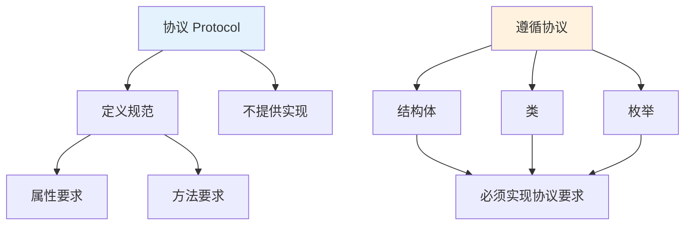
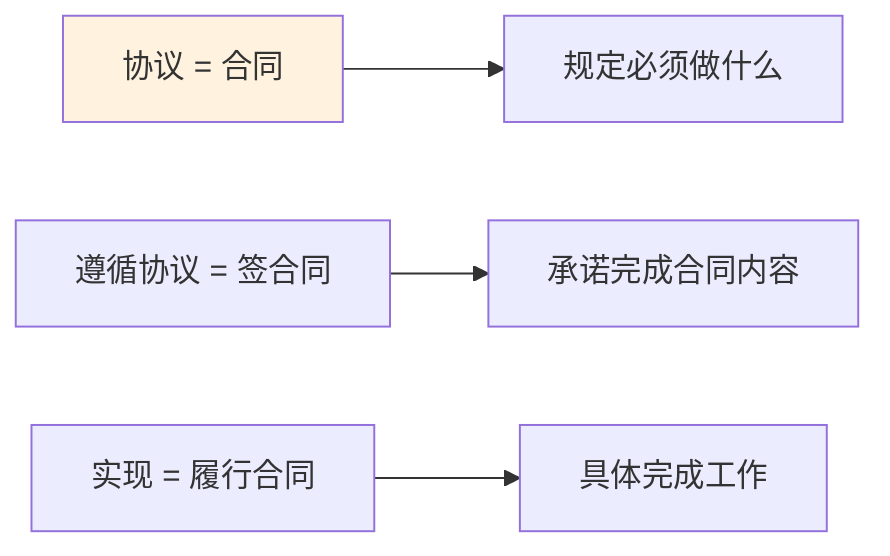

# 第12课：协议

## 📖 学习目标
- 理解协议的概念和用途
- 学会定义和遵循协议
- 掌握协议的属性和方法要求
- 了解协议继承和组合

---

## 什么是协议？

**协议是什么？通俗地讲，协议就是一份"合同"或"规范"。**

想象一下这个生活场景：

> 你要招聘程序员，你列出了一份**招聘要求**：
> 1. 必须会写代码
> 2. 必须会用 Git
> 3. 必须会写文档
>
> 这份"招聘要求"就是**协议**！
>
> 来应聘的人（结构体、类、枚举）必须满足这些要求，否则编译器（HR）不让你通过！

### 协议的核心思想

**协议只规定"要做什么"，不规定"怎么做"。**

```swift
// 定义一个"可飞行"的协议
protocol Flyable {
    func fly()  // 只说"要会飞"，不说怎么飞
}

// 不同的东西用不同的方式飞
struct Bird: Flyable {
    func fly() {
        print("煽动翅膀飞")  // 鸟用翅膀飞
    }
}

struct Airplane: Flyable {
    func fly() {
        print("用引擎飞")  // 飞机用引擎飞
    }
}

struct Superman: Flyable {
    func fly() {
        print("用超能力飞")  // 超人用超能力飞
    }
}
```

**为什么要这样设计？**

因为"飞"这个动作，不同东西有不同的实现方式。协议只定义了"要飞"这个要求，具体怎么飞，让每个类型自己决定。

### 协议的生活类比

**类比1：插座和电器**
```
协议 = 插座标准（220V，两孔）
电器 = 遵循协议的类型

- 电视插上插座 → 能用
- 冰箱插上插座 → 能用
- 手机充电器插上 → 能用

插座（协议）不关心你是什么电器，只关心你有没有正确的插头（实现）
```

**类比2：驾照和司机**
```
协议 = 驾照要求
- 要通过理论考试
- 要通过路考
- 要年满18岁

司机 = 遵循协议的类型
- 张三有驾照 → 可以开车
- 李四有驾照 → 可以开车

不管你是谁，只要满足驾照要求（协议），就能开车
```

**类比3：餐厅菜单**
```
协议 = 菜单上的菜品要求
宫保鸡丁协议：
- 必须有鸡肉
- 必须有花生
- 必须是辣的

厨师 = 遵循协议的类型
- 厨师A做宫保鸡丁 → 用鸡胸肉
- 厨师B做宫保鸡丁 → 用鸡腿肉

只要满足"宫保鸡丁协议"的要求，怎么做都行
```

### 协议 vs 基类

| 特性 | 协议 | 基类 |
|------|------|------|
| 本质 | **规范/合同** | **模板/父亲** |
| 能否提供实现 | ❌ 不能（可以扩展） | ✅ 可以 |
| 多继承 | ✅ 可以遵循多个协议 | ❌ 只能继承一个类 |
| 值类型 | ✅ 结构体、枚举也能遵循 | ❌ 只能类继承 |
| 用途 | 定义"要做什么" | 提供"怎么做" |

**什么时候用协议？什么时候用继承？**

```swift
// 用协议：定义"能做什么"
protocol Drawable {
    func draw()
}
protocol Movable {
    func move()
}

// 一个类型可以遵循多个协议
struct Character: Drawable, Movable {
    func draw() { print("绘制角色") }
    func move() { print("移动角色") }
}

// 用继承：复用"怎么做"
class Animal {
    func breathe() { print("呼吸") }  // 复用呼吸的代码
}

class Dog: Animal {
    func bark() { print("汪汪") }
}
```

### 协议概念图



### 协议的类比理解



### 定义协议

```swift
protocol 协议名 {
    // 属性要求
    // 方法要求
}
```

### 示例

```swift
protocol Greetable {
    var name: String { get }
    func greet() -> String
}
```

---

## 遵循协议

### 结构体遵循协议

```swift
protocol Greetable {
    var name: String { get }
    func greet() -> String
}

struct Person: Greetable {
    var name: String

    func greet() -> String {
        return "你好，我是\(name)"
    }
}

let person = Person(name: "小明")
print(person.greet())  // 你好，我是小明
```

### 类遵循协议

```swift
protocol Greetable {
    var name: String { get }
    func greet() -> String
}

class Student: Greetable {
    var name: String

    init(name: String) {
        self.name = name
    }

    func greet() -> String {
        return "我是学生\(name)"
    }
}

let student = Student(name: "小红")
print(student.greet())  // 我是学生小红
```

---

## 属性要求

### 只读属性

```swift
protocol FullyNamed {
    var fullName: String { get }
}

struct Person: FullyNamed {
    var firstName: String
    var lastName: String

    var fullName: String {
        return "\(firstName) \(lastName)"
    }
}

let person = Person(firstName: "张", lastName: "三")
print(person.fullName)  // 张 三
```

### 可读写属性

```swift
protocol Named {
    var name: String { get set }
}

class User: Named {
    var name: String

    init(name: String) {
        self.name = name
    }
}

let user = User(name: "小明")
print(user.name)  // 小明
user.name = "小红"
print(user.name)  // 小红
```

### 类型属性

```swift
protocol SomeProtocol {
    static var someProperty: String { get }
}

struct SomeStruct: SomeProtocol {
    static var someProperty: String = "Hello"
}

print(SomeStruct.someProperty)  // Hello
```

---

## 方法要求

### 实例方法

```swift
protocol Drawable {
    func draw()
}

struct Circle: Drawable {
    var radius: Double

    func draw() {
        print("绘制圆形，半径：\(radius)")
    }
}

struct Rectangle: Drawable {
    var width: Double
    var height: Double

    func draw() {
        print("绘制矩形，宽：\(width)，高：\(height)")
    }
}

let circle = Circle(radius: 5)
circle.draw()  // 绘制圆形，半径：5.0

let rect = Rectangle(width: 10, height: 5)
rect.draw()  // 绘制矩形，宽：10.0，高：5.0
```

### 可变方法

```swift
protocol Togglable {
    mutating func toggle()
}

enum Switch: Togglable {
    case off
    case on

    mutating func toggle() {
        switch self {
        case .off:
            self = .on
        case .on:
            self = .off
        }
    }
}

var light = Switch.off
light.toggle()
print(light)  // on
```

### 类型方法

```swift
protocol SomeProtocol {
    static func someMethod()
}

struct SomeStruct: SomeProtocol {
    static func someMethod() {
        print("静态方法")
    }
}

SomeStruct.someMethod()  // 静态方法
```

---

## 初始化器要求

```swift
protocol Initializable {
    init(name: String)
}

struct Person: Initializable {
    var name: String

    init(name: String) {
        self.name = name
    }
}

class Animal: Initializable {
    var name: String

    required init(name: String) {
        self.name = name
    }
}
```

**为什么类需要 `required` 关键字，而结构体不需要？**

这是因为类支持继承。想象一下：如果 `Animal` 的子类 `Dog` 继承了 `Animal`，但没有实现 `init(name:)`，那么 `Dog` 就无法满足 `Initializable` 协议的要求。Swift 通过 `required` 关键字来保证：任何继承 `Animal` 的子类都**必须**拥有这个初始化器（要么继承父类的实现，要么自己重写）。这样，即使你持有一个 `Dog` 类型的变量，也能确保 `init(name:)` 一定可用。

结构体不存在继承的问题，所以不需要 `required`。编译器会自动为结构体生成协议要求的初始化器，或者由开发者手动实现即可，不存在"子类可能遗漏"的隐患。

---

## 协议作为类型

协议可以作为类型使用，实现多态。

**什么是多态？** 多态（polymorphism）的意思是"同一个接口，不同的行为"。当你用协议作为参数类型或变量类型时，你不需要关心具体的类型是什么，只需要关心它"能做什么"。例如，`printDescription(_ item: Describable)` 这个函数不关心传入的是 `Car` 还是 `Book`，只要它遵循了 `Describable` 协议、能调用 `describe()` 方法就行。这带来的实际好处是：你可以写出通用的、可复用的代码，而不需要为每种具体类型都写一遍。以后新增一个 `Phone` 类型，只要遵循 `Describable`，就可以直接传入 `printDescription`，无需修改这个函数。

### 协议作为参数类型

```swift
protocol Describable {
    func describe() -> String
}

struct Car: Describable {
    var brand: String

    func describe() -> String {
        return "汽车品牌：\(brand)"
    }
}

struct Book: Describable {
    var title: String

    func describe() -> String {
        return "书名：\(title)"
    }
}

func printDescription(_ item: Describable) {
    print(item.describe())
}

let car = Car(brand: "丰田")
let book = Book(title: "Swift入门")

printDescription(car)   // 汽车品牌：丰田
printDescription(book)  // 书名：Swift入门
```

### 协议作为返回类型

```swift
protocol Shape {
    func area() -> Double
}

struct Circle: Shape {
    var radius: Double

    func area() -> Double {
        return Double.pi * radius * radius
    }
}

struct Square: Shape {
    var side: Double

    func area() -> Double {
        return side * side
    }
}

func createShape(isRound: Bool) -> Shape {
    if isRound {
        return Circle(radius: 5)
    } else {
        return Square(side: 5)
    }
}

let shape = createShape(isRound: true)
print("面积：\(shape.area())")  // 面积：78.53981633974483
```

### 协议集合

```swift
protocol Payable {
    func calculatePay() -> Double
}

struct Employee: Payable {
    var name: String
    var hourlyRate: Double
    var hoursWorked: Double

    func calculatePay() -> Double {
        return hourlyRate * hoursWorked
    }
}

struct Contractor: Payable {
    var name: String
    var projectFee: Double

    func calculatePay() -> Double {
        return projectFee
    }
}

// 协议类型的数组
let workers: [Payable] = [
    Employee(name: "张三", hourlyRate: 50, hoursWorked: 160),
    Contractor(name: "李四", projectFee: 10000)
]

for worker in workers {
    print("工资：\(worker.calculatePay())")
}
// 输出：
// 工资：8000.0
// 工资：10000.0
```

---

## 协议继承

协议可以继承其他协议。

**协议继承与类继承有什么区别？** 类继承是"is-a"关系（Dog is an Animal），强调身份和代码复用；协议继承是"can-do"关系，强调能力的组合。协议继承最大的优势是支持多继承：一个协议可以继承多个父协议，一个类型也可以遵循多个协议。这在类继承中是做不到的（Swift 的类只支持单继承）。

在实际开发中，协议继承常用于将大型协议拆分为多个小协议，再通过继承组合起来。例如，你可以先定义 `Named`（有名字）和 `Aged`（有年龄）两个独立的协议，然后用 `PersonProtocol: Named, Aged` 将它们组合在一起。这样做的好处是：`Named` 和 `Aged` 可以被单独使用（比如只要求"有名字"的场景），也可以组合使用（同时要求"有名字且有年龄"的场景），提高了协议的复用性。

```swift
protocol Named {
    var name: String { get }
}

protocol Aged {
    var age: Int { get }
}

// 继承多个协议
protocol PersonProtocol: Named, Aged {
    func introduce() -> String
}

struct Person: PersonProtocol {
    var name: String
    var age: Int

    func introduce() -> String {
        return "我叫\(name)，今年\(age)岁"
    }
}

let person = Person(name: "小明", age: 18)
print(person.introduce())  // 我叫小明，今年18岁
```

---

## 协议组合

使用 `&` 组合多个协议。

```swift
protocol Named {
    var name: String { get }
}

protocol Aged {
    var age: Int { get }
}

func wishHappyBirthday(to celebrator: Named & Aged) {
    print("生日快乐，\(celebrator.name)！你已经\(celebrator.age)岁了！")
}

struct Person: Named, Aged {
    var name: String
    var age: Int
}

let person = Person(name: "小明", age: 20)
wishHappyBirthday(to: person)
// 输出：生日快乐，小明！你已经20岁了！
```

---

## 协议扩展

可以为协议提供默认实现。

**协议扩展和默认实现是什么？** 通过 `extension` 为协议添加方法实现，所有遵循该协议的类型都会自动获得这个方法，无需自己编写。这就是"默认实现"（default implementation）。如果某个类型需要不同的行为，它仍然可以选择自己重新实现该方法来覆盖默认实现（如上面代码中的 `Student`）。

**静态派发 vs 动态派发：** 这是一个重要的进阶概念。当你直接在协议扩展中调用方法时（变量类型是具体类型），Swift 使用静态派发（编译时就确定调用哪个方法，性能更好）。但当你通过协议类型调用方法时（变量类型是协议），Swift 使用动态派发（运行时才确定调用哪个方法）。这意味着：如果一个类型覆盖了协议扩展的默认实现，只有在以协议类型调用时才会调用覆盖版本。在大多数情况下，这不会影响你的代码，但在性能敏感的场景下值得注意。
protocol Greetable {
    var name: String { get }
    func greet() -> String
}

// 提供默认实现
extension Greetable {
    func greet() -> String {
        return "你好，我是\(name)"
    }
}

struct Person: Greetable {
    var name: String
    // 不需要实现 greet()，使用默认实现
}

struct Student: Greetable {
    var name: String

    // 可以覆盖默认实现
    func greet() -> String {
        return "我是学生\(name)"
    }
}

let person = Person(name: "小明")
print(person.greet())  // 你好，我是小明

let student = Student(name: "小红")
print(student.greet())  // 我是学生小红
```

---

## 检查协议遵循

### 使用 is 检查

```swift
protocol Describable {
    func describe() -> String
}

struct Car: Describable {
    var brand: String
    func describe() -> String { "汽车：\(brand)" }
}

struct Dog {
    var name: String
}

let car: Any = Car(brand: "丰田")
let dog: Any = Dog(name: "旺财")

if car is Describable {
    print("car 遵循 Describable")
}

if dog is Describable {
    print("dog 遵循 Describable")
} else {
    print("dog 不遵循 Describable")
}
```

### 使用 as? 转换

```swift
protocol Describable {
    func describe() -> String
}

struct Car: Describable {
    var brand: String
    func describe() -> String { "汽车：\(brand)" }
}

struct Dog {
    var name: String
}

func describeItem(_ item: Any) {
    if let describable = item as? Describable {
        print(describable.describe())
    } else {
        print("无法描述")
    }
}

describeItem(Car(brand: "丰田"))  // 汽车：丰田
describeItem(Dog(name: "旺财"))    // 无法描述
```

---

## 📝 练习题

### 练习1：基本协议
定义一个 `Printable` 协议，包含一个 `printDescription()` 方法。然后让 `Book` 和 `Movie` 结构体遵循该协议。

```swift
// 在这里写你的代码

```

### 练习2：协议属性
定义一个 `AreaCalculable` 协议，包含一个只读计算属性 `area: Double`。然后让 `Circle` 和 `Rectangle` 结构体遵循该协议。

```swift
// 在这里写你的代码

```

### 练习3：协议作为参数
定义一个 `Comparable` 协议，包含一个 `isGreaterThan(_ other: Self) -> Bool` 方法。编写一个函数找到数组中的最大元素。

```swift
// 在这里写你的代码

```

### 练习4：协议继承
定义一个 `Vehicle` 协议和一个 `ElectricVehicle` 协议（继承自 Vehicle），然后实现一个电动车类。

```swift
// 在这里写你的代码

```

### 练习5：协议扩展
定义一个 `Validatable` 协议，包含一个 `isValid() -> Bool` 方法。通过协议扩展提供默认实现，让 `Email` 和 `Password` 类型遵循该协议。

```swift
// 在这里写你的代码

```

### 练习6：协议组合
定义 `Walkable` 和 `Swimmable` 协议，然后创建一个函数，接受同时遵循这两个协议的参数。

```swift
// 在这里写你的代码

```

### 练习7：协议集合
定义一个 `Payable` 协议，创建不同类型的员工（全职、兼职、合同工），将它们存储在协议类型的数组中，计算总工资。

```swift
// 在这里写你的代码

```

### 练习8：综合练习
设计一个简单的图形系统：
1. 定义 `Shape` 协议（包含 `area` 和 `perimeter` 属性）
2. 实现 `Circle`、`Rectangle`、`Triangle` 结构体
3. 创建一个函数打印任意图形的信息
4. 使用协议扩展提供默认的 `describe()` 方法

```swift
// 在这里写你的代码

```

---

## ✅ 练习题参考答案

> 💡 **提示：** 建议先独立完成练习，再查看答案

---


### 练习1
```swift
protocol Printable {
    func printDescription()
}

struct Book: Printable {
    var title: String
    var author: String

    func printDescription() {
        print("《\(title)》，作者：\(author)")
    }
}

struct Movie: Printable {
    var title: String
    var director: String

    func printDescription() {
        print("电影《\(title)》，导演：\(director)")
    }
}

let book = Book(title: "Swift入门", author: "张三")
book.printDescription()  // 《Swift入门》，作者：张三

let movie = Movie(title: "星际穿越", director: "诺兰")
movie.printDescription()  // 电影《星际穿越》，导演：诺兰
```

### 练习2
```swift
protocol AreaCalculable {
    var area: Double { get }
}

struct Circle: AreaCalculable {
    var radius: Double

    var area: Double {
        return Double.pi * radius * radius
    }
}

struct Rectangle: AreaCalculable {
    var width: Double
    var height: Double

    var area: Double {
        return width * height
    }
}

let circle = Circle(radius: 5)
print("圆形面积：\(circle.area)")  // 78.53981633974483

let rect = Rectangle(width: 10, height: 5)
print("矩形面积：\(rect.area)")  // 50.0
```

### 练习3
```swift
protocol MyComparable {
    func isGreaterThan(_ other: Self) -> Bool
}

struct Number: MyComparable {
    var value: Int

    func isGreaterThan(_ other: Number) -> Bool {
        return self.value > other.value
    }
}

func findMax<T: MyComparable>(in array: [T]) -> T? {
    guard var max = array.first else { return nil }
    for item in array.dropFirst() {
        if item.isGreaterThan(max) {
            max = item
        }
    }
    return max
}

let numbers = [Number(value: 3), Number(value: 1), Number(value: 4), Number(value: 1), Number(value: 5)]
if let max = findMax(in: numbers) {
    print("最大值：\(max.value)")  // 最大值：5
}
```

### 练习4
```swift
protocol Vehicle {
    var brand: String { get }
    func start()
    func stop()
}

protocol ElectricVehicle: Vehicle {
    var batteryLevel: Double { get set }
    func charge()
}

class Tesla: ElectricVehicle {
    var brand: String
    var batteryLevel: Double

    init(brand: String, batteryLevel: Double) {
        self.brand = brand
        self.batteryLevel = batteryLevel
    }

    func start() {
        print("\(brand) 启动")
    }

    func stop() {
        print("\(brand) 停止")
    }

    func charge() {
        batteryLevel = 100
        print("\(brand) 充电完成，电量：\(batteryLevel)%")
    }
}

let tesla = Tesla(brand: "Tesla", batteryLevel: 50)
tesla.start()     // Tesla 启动
tesla.charge()    // Tesla 充电完成，电量：100.0%
tesla.stop()      // Tesla 停止
```

### 练习5
```swift
protocol Validatable {
    func isValid() -> Bool
}

extension Validatable {
    func validate() -> String {
        return isValid() ? "有效" : "无效"
    }
}

struct Email: Validatable {
    var address: String

    func isValid() -> Bool {
        return address.contains("@") && address.contains(".")
    }
}

struct Password: Validatable {
    var value: String

    func isValid() -> Bool {
        return value.count >= 8
    }
}

let email = Email(address: "test@example.com")
print("邮箱 \(email.validate())")  // 邮箱 有效

let password = Password(value: "123456")
print("密码 \(password.validate())")  // 密码 无效

let password2 = Password(value: "12345678")
print("密码 \(password2.validate())")  // 密码 有效
```

### 练习6
```swift
protocol Walkable {
    func walk()
}

protocol Swimmable {
    func swim()
}

struct Human: Walkable, Swimmable {
    var name: String

    func walk() {
        print("\(name) 正在走路")
    }

    func swim() {
        print("\(name) 正在游泳")
    }
}

struct Dog: Walkable, Swimmable {
    var name: String

    func walk() {
        print("\(name) 正在跑")
    }

    func swim() {
        print("\(name) 正在狗刨")
    }
}

func doActivity(_ creature: Walkable & Swimmable) {
    creature.walk()
    creature.swim()
}

let human = Human(name: "小明")
doActivity(human)
// 输出：
// 小明 正在走路
// 小明 正在游泳

let dog = Dog(name: "旺财")
doActivity(dog)
// 输出：
// 旺财 正在跑
// 旺财 正在狗刨
```

### 练习7
```swift
protocol Payable {
    func calculatePay() -> Double
}

struct FullTimeEmployee: Payable {
    var name: String
    var monthlySalary: Double

    func calculatePay() -> Double {
        return monthlySalary
    }
}

struct PartTimeEmployee: Payable {
    var name: String
    var hourlyRate: Double
    var hoursWorked: Double

    func calculatePay() -> Double {
        return hourlyRate * hoursWorked
    }
}

struct Contractor: Payable {
    var name: String
    var projectFee: Double

    func calculatePay() -> Double {
        return projectFee
    }
}

let employees: [Payable] = [
    FullTimeEmployee(name: "张三", monthlySalary: 10000),
    PartTimeEmployee(name: "李四", hourlyRate: 50, hoursWorked: 80),
    Contractor(name: "王五", projectFee: 15000)
]

var totalPay: Double = 0
for employee in employees {
    let pay = employee.calculatePay()
    totalPay += pay
    print("\(employee) 工资：\(pay)")
}
print("总工资：\(totalPay)")
// 输出：
// 总工资：29000.0
```

### 练习8
```swift
protocol Shape {
    var area: Double { get }
    var perimeter: Double { get }
}

extension Shape {
    func describe() -> String {
        return "面积：\(String(format: "%.2f", area))，周长：\(String(format: "%.2f", perimeter))"
    }
}

struct Circle: Shape {
    var radius: Double

    var area: Double {
        return Double.pi * radius * radius
    }

    var perimeter: Double {
        return 2 * Double.pi * radius
    }
}

struct Rectangle: Shape {
    var width: Double
    var height: Double

    var area: Double {
        return width * height
    }

    var perimeter: Double {
        return 2 * (width + height)
    }
}

struct Triangle: Shape {
    var a: Double
    var b: Double
    var c: Double

    var area: Double {
        let s = (a + b + c) / 2
        return sqrt(s * (s - a) * (s - b) * (s - c))
    }

    var perimeter: Double {
        return a + b + c
    }
}

func printShapeInfo(_ shape: Shape) {
    print(shape.describe())
}

let circle = Circle(radius: 5)
printShapeInfo(circle)
// 输出：面积：78.54，周长：31.42

let rect = Rectangle(width: 10, height: 5)
printShapeInfo(rect)
// 输出：面积：50.00，周长：30.00

let triangle = Triangle(a: 3, b: 4, c: 5)
printShapeInfo(triangle)
// 输出：面积：6.00，周长：12.00
```


---

## 🎯 小结

| 概念 | 说明 |
|------|------|
| 协议定义 | `protocol Name { }` |
| 遵循协议 | `struct Name: Protocol { }` |
| 属性要求 | `var name: String { get set }` |
| 方法要求 | `func method()` |
| 协议继承 | `protocol Child: Parent { }` |
| 协议组合 | `Protocol1 & Protocol2` |
| 协议扩展 | `extension Protocol { }` |

**最佳实践：**
- 使用协议定义接口
- 优先使用协议而不是基类
- 使用协议扩展提供默认实现
- 使用协议组合实现多继承

---

**上一课：[第11课：枚举](第11课：枚举.md)**
**下一课：[第13课：错误处理](第13课：错误处理.md)**
