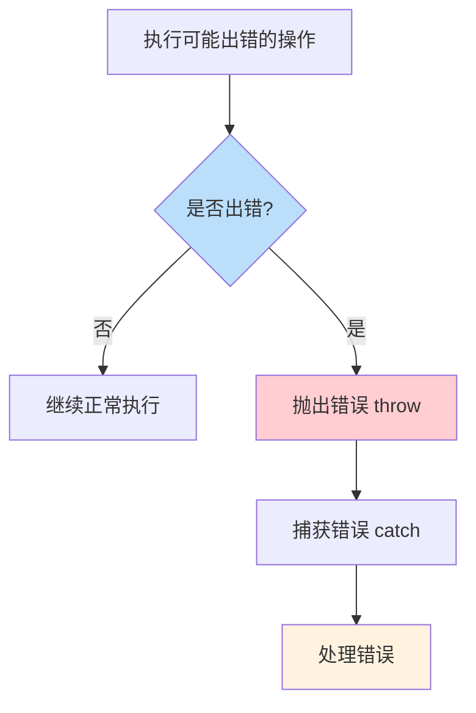
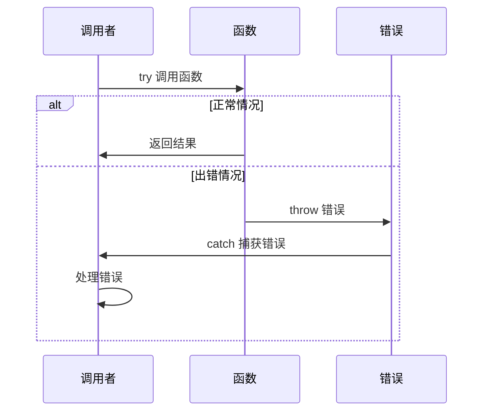
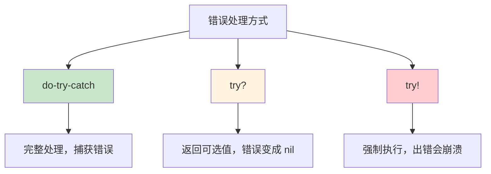

# 第13课：错误处理

## 📖 学习目标
- 理解错误处理的概念
- 学会定义错误类型
- 掌握 throw、try、catch 的使用
- 了解 defer 语句

---

## 什么是错误处理？

错误处理是响应程序中错误条件的过程。Swift 提供了一套完整的错误处理机制。

### 错误处理流程图



### 错误处理关键字

| 关键字 | 作用 | 示例 |
|--------|------|------|
| `Error` | 定义错误类型协议 | `enum MyError: Error` |
| `throw` | 抛出错误 | `throw MyError.notFound` |
| `throws` | 标记函数可能出错 | `func load() throws` |
| `try` | 调用可能出错的函数 | `try loadData()` |
| `catch` | 捕获并处理错误 | `catch { print(error) }` |
| `do` | 包裹可能出错的代码 | `do { ... }` |

### 错误处理示例图



### 定义错误类型

使用枚举定义错误类型，遵循 `Error` 协议。

**为什么推荐用枚举来定义错误类型？** 首先，`Error` 协议本身是一个空的"标记协议"（marker protocol），它没有任何必须实现的方法或属性——它的作用仅仅是在类型系统中标记"这是一个错误类型"。任何遵循 `Error` 的类型都可以被 `throw`。枚举之所以是定义错误的最佳选择，是因为枚举天生适合表示一组有限的、固定的可能情况。每种错误就是枚举的一个 `case`，语义清晰，不会出现"未知的错误值"。此外，枚举的关联值可以携带额外的错误信息（比如 `serverError(code: Int)` 可以附带服务器返回的状态码），而 `switch` 语句可以确保你处理了每一种错误情况，编译器会帮你检查是否遗漏。

```swift
enum NetworkError: Error {
    case invalidURL
    case noData
    case decodingFailed
    case serverError(code: Int)
}
```

### 示例

```swift
enum ValidationError: Error {
    case emptyField(fieldName: String)
    case tooShort(fieldName: String, minLength: Int)
    case tooLong(fieldName: String, maxLength: Int)
    case invalidFormat(fieldName: String)
}
```

---

## 抛出错误

使用 `throw` 关键字抛出错误。当函数可能出错时，需要在函数名后面加上 `throws` 关键字。

**什么时候需要抛出错误？**
- 当函数执行的操作可能失败时
- 当需要通知调用者出现了问题时
- 当需要调用者决定如何处理错误时

### 示例：密码验证函数

```swift
// 定义错误类型
enum PasswordError: Error {
    case tooShort      // 密码太短
    case noUppercase   // 没有大写字母
    case noDigit       // 没有数字
}

// 验证密码的函数
// 注意：函数名后面有 throws，表示这个函数可能抛出错误
func validatePassword(_ password: String) throws -> String {
    // 检查密码长度
    if password.count < 8 {
        throw PasswordError.tooShort  // 密码太短，抛出错误
    }

    // 检查是否包含大写字母
    // .regularExpression 让 range(of:) 把搜索字符串当作正则表达式来匹配
    // "[A-Z]" 表示"任意一个大写字母"，如果匹配不到就返回 nil
    if password.range(of: "[A-Z]", options: .regularExpression) == nil {
        throw PasswordError.noUppercase  // 没有大写字母，抛出错误
    }

    // 检查是否包含数字
    if password.range(of: "[0-9]", options: .regularExpression) == nil {
        throw PasswordError.noDigit  // 没有数字，抛出错误
    }

    // 所有检查都通过，返回成功信息
    return "密码有效"
}
```

**代码解读：**
1. 我们定义了一个 `PasswordError` 枚举，包含三种可能的错误
2. `validatePassword` 函数用 `throws` 标记，表示可能抛出错误
3. 函数内部依次检查密码的各个条件
4. 如果某个条件不满足，就用 `throw` 抛出对应的错误
5. 如果所有条件都满足，返回成功信息

**为什么要这样设计？**
- 让调用者知道这个函数可能会失败
- 调用者必须处理这些错误，否则程序会报错
- 代码更安全，不会忽略潜在的问题

---

## 处理错误

### do-try-catch

```swift
do {
    let result = try validatePassword("abc")
    print(result)
} catch PasswordError.tooShort {
    print("密码太短")
} catch PasswordError.noUppercase {
    print("密码需要包含大写字母")
} catch PasswordError.noDigit {
    print("密码需要包含数字")
} catch {
    print("未知错误：\(error)")
}
// 输出：密码太短
```

### 多个 catch 子句

```swift
enum CalculationError: Error {
    case divisionByZero
    case negativeNumber
    case overflow
}

func divide(_ a: Double, by b: Double) throws -> Double {
    if b == 0 {
        throw CalculationError.divisionByZero
    }
    return a / b
}

do {
    let result = try divide(10, by: 0)
    print(result)
} catch CalculationError.divisionByZero {
    print("错误：除数不能为零")
} catch CalculationError.negativeNumber {
    print("错误：数字不能为负")
} catch {
    print("其他错误：\(error)")
}
// 输出：错误：除数不能为零
```

---

## try? 和 try!

**除了 do-try-catch，Swift 还提供了两种更简洁的错误处理方式。**

### 三种错误处理方式对比



| 方式 | 语法 | 错误处理 | 使用场景 |
|------|------|----------|----------|
| do-try-catch | `do { try ... } catch { }` | 捕获并处理 | 需要详细处理错误 |
| try? | `let x = try? func()` | 变成 nil | 不关心具体错误 |
| try! | `let x = try! func()` | 崩溃 | 确定不会出错 |

### try?（可选值）

**通俗地讲：** "试试看，如果出错就算了，给我 nil"

```swift
enum DataError: Error {
    case invalidData
}

func fetchData() throws -> String {
    throw DataError.invalidData  // 模拟失败
}

// 使用 try?
let result = try? fetchData()
print(result ?? "无数据")  // 无数据（因为出错了，结果是 nil）

// 等价于
let result2: String?
do {
    result2 = try fetchData()
} catch {
    result2 = nil  // 出错时返回 nil
}
```

**什么时候用 try?？**
- 不关心具体是什么错误
- 只想知道成功还是失败
- 网络请求等场景

### try!（强制尝试）

**简单来说：** "我确定不会出错，如果出错就崩溃"

```swift
func safeFunction() throws -> String {
    return "安全的数据"
}

// 使用 try!（如果抛出错误会崩溃）
let result = try! safeFunction()
print(result)  // 安全的数据

// ⚠️ 谨慎使用！如果确实会抛出错误，程序会崩溃
// let result2 = try! fetchData()  // 会崩溃！
```

**什么时候用 try!？**
- 100% 确定不会出错
- 例如：解析本地确定存在的文件
- **尽量避免使用，除非非常确定**
```

---

## 将错误传递给调用者

函数可以将错误传递给调用它的函数。

**错误传播（error propagation）模式：** 当一个标记为 `throws` 的函数内部调用了另一个 `throws` 函数时，你必须在调用前加上 `try` 关键字。如果你不想在当前函数中处理这个错误，可以直接写 `try`（不加 `do-catch`），这样错误会自动"冒泡"（propagate）到调用当前函数的上一层函数。注意：只有标记了 `throws` 的函数才能传播错误——如果当前函数没有 `throws` 标记，就必须在内部用 `do-catch` 处理掉错误，否则编译器会报错。这种机制确保了错误一定会被某个层级处理，不会被无声地忽略。

在下面的例子中，`processFile` 调用了 `readFile`，它用 `try readFile(atPath: path)` 调用可能出错的函数，但自己不做 `catch`——错误就沿着调用链传递给了 `processFile` 的调用者，由最外层的 `do-catch` 来捕获和处理。

```swift
enum FileError: Error {
    case notFound
    case unreadable
}

func readFile(atPath path: String) throws -> String {
    if path.isEmpty {
        throw FileError.notFound
    }
    // 模拟读取文件
    return "文件内容"
}

func processFile(atPath path: String) throws -> String {
    // 不处理错误，直接传递给调用者
    let content = try readFile(atPath: path)
    return content.uppercased()
}

do {
    let result = try processFile(atPath: "test.txt")
    print(result)
} catch FileError.notFound {
    print("文件未找到")
} catch FileError.unreadable {
    print("文件无法读取")
} catch {
    print("其他错误")
}
```

---

## defer 语句

**defer 是什么？可以这样理解：defer 就是"收拾烂摊子"的代码，不管发生什么，它都会执行。**

### 生活类比

想象你去餐厅吃饭：
1. 你坐下（开始操作）
2. 你点菜（执行代码）
3. 不管你吃得好不好，最后都要**付钱**（defer 代码）
4. 你离开（结束操作）

`defer` 就是那个"付钱"的步骤，不管发生什么，最后都会执行。

### 基本用法

```swift
func processFile() {
    print("打开文件")
    defer {
        print("关闭文件")  // 总会执行，不管中间发生什么
    }
    print("处理文件")
    // 函数结束前执行 defer
}
// 输出：
// 打开文件
// 处理文件
// 关闭文件
```

**代码解读：**
- `defer` 中的代码会在函数结束前执行
- 不管函数是正常结束还是出错退出，`defer` 都会执行
- 常用于资源清理（关闭文件、释放资源等）

### 多个 defer

```swift
func doSomething() {
    print("开始")
    defer { print("defer 1") }
    defer { print("defer 2") }
    defer { print("defer 3") }
    print("结束")
}
// 输出：
// 开始
// 结束
// defer 3  ← 最后定义的最先执行
// defer 2
// defer 1  ← 最先定义的最后执行
// 注意：defer 按照后进先出的顺序执行（像堆栈一样）
```

### 在错误处理中使用 defer

```swift
enum DatabaseError: Error {
    case connectionFailed
    case queryFailed
}

func queryDatabase() throws -> [String] {
    print("连接数据库")
    defer {
        print("关闭数据库连接")  // 无论成功还是失败都会执行
    }

    // 模拟可能失败的操作
    throw DatabaseError.queryFailed

    return ["数据1", "数据2"]
}

do {
    let results = try queryDatabase()
    print(results)
} catch {
    print("查询失败：\(error)")
}
// 输出：
// 连接数据库
// 关闭数据库连接
// 查询失败：queryFailed
```

---

## 自定义错误信息

```swift
enum AppError: Error, LocalizedError {
    case networkUnavailable
    case invalidInput(field: String)
    case unauthorized

    var errorDescription: String? {
        switch self {
        case .networkUnavailable:
            return "网络不可用，请检查网络连接"
        case .invalidInput(let field):
            return "输入无效：\(field)"
        case .unauthorized:
            return "未授权，请重新登录"
        }
    }
}

func doSomething() throws {
    throw AppError.invalidInput(field: "邮箱")
}

do {
    try doSomething()
} catch {
    print(error.localizedDescription)  // 输入无效：邮箱
}
```

---

## 实际应用示例

### 用户注册验证

```swift
enum RegistrationError: Error {
    case emptyUsername
    case emptyEmail
    case emptyPassword
    case invalidEmail
    case passwordTooShort(minLength: Int)
    case usernameAlreadyExists
}

struct User {
    var username: String
    var email: String
    var password: String
}

func registerUser(_ user: User) throws -> String {
    // 验证用户名
    if user.username.isEmpty {
        throw RegistrationError.emptyUsername
    }

    // 验证邮箱
    if user.email.isEmpty {
        throw RegistrationError.emptyEmail
    }
    if !user.email.contains("@") {
        throw RegistrationError.invalidEmail
    }

    // 验证密码
    if user.password.isEmpty {
        throw RegistrationError.emptyPassword
    }
    if user.password.count < 8 {
        throw RegistrationError.passwordTooShort(minLength: 8)
    }

    // 模拟检查用户名是否存在
    if user.username == "admin" {
        throw RegistrationError.usernameAlreadyExists
    }

    return "注册成功！欢迎，\(user.username)"
}

// 测试
let user1 = User(username: "小明", email: "xiaoming@example.com", password: "12345678")
do {
    let result = try registerUser(user1)
    print(result)  // 注册成功！欢迎，小明
} catch {
    print("注册失败：\(error)")
}

let user2 = User(username: "admin", email: "admin@example.com", password: "12345678")
do {
    let result = try registerUser(user2)
    print(result)
} catch RegistrationError.usernameAlreadyExists {
    print("用户名已存在")  // 用户名已存在
} catch {
    print("注册失败：\(error)")
}
```

---

## 📝 练习题

### 练习1：定义错误类型
定义一个 `TemperatureError` 枚举，包含：
- `belowAbsoluteZero`（低于绝对零度）
- `aboveBoilingPoint`（高于沸点）

```swift
// 在这里写你的代码

```

### 练习2：抛出和捕获错误
编写一个函数 `setTemperature(_ temp: Double) throws -> String`，根据温度范围抛出相应错误或返回描述信息。

```swift
// 在这里写你的代码

```

### 练习3：使用 try?
编写一个函数 `parseAge(_ input: String) throws -> Int`，将字符串转换为年龄。使用 `try?` 处理可能的错误。

```swift
// 在这里写你的代码

```

### 练习4：多个错误类型
定义 `FileError` 和 `NetworkError` 两个错误类型，编写一个函数可能抛出这两种错误，使用不同的 catch 子句处理。

```swift
// 在这里写你的代码

```

### 练习5：defer 使用
编写一个函数模拟文件操作，在函数开始时打开文件，使用 `defer` 确保无论成功还是失败都关闭文件。

```swift
// 在这里写你的代码

```

### 练习6：错误传递
编写三个函数形成调用链：`fetchData()` -> `processData()` -> `saveData()`，错误从底层函数传递到顶层函数处理。

```swift
// 在这里写你的代码

```

### 练习7：自定义错误信息
定义一个 `AppError` 枚举，遵循 `LocalizedError` 协议，为每个错误提供中文描述。

```swift
// 在这里写你的代码

```

### 练习8：综合练习
设计一个简单的银行账户系统：
1. 定义 `BankError` 错误类型（余额不足、账户冻结、无效金额等）
2. 创建 `BankAccount` 结构体
3. 实现 `deposit()`、`withdraw()`、`transfer()` 方法，都使用 `throws`
4. 使用 `defer` 记录每次操作

```swift
// 在这里写你的代码

```

---

## ✅ 练习题参考答案

> 💡 **提示：** 建议先独立完成练习，再查看答案

---


### 练习1
```swift
enum TemperatureError: Error {
    case belowAbsoluteZero
    case aboveBoilingPoint
}
```

### 练习2
```swift
enum TemperatureError: Error {
    case belowAbsoluteZero
    case aboveBoilingPoint
}

func setTemperature(_ temp: Double) throws -> String {
    if temp < -273.15 {
        throw TemperatureError.belowAbsoluteZero
    }
    if temp > 100 {
        throw TemperatureError.aboveBoilingPoint
    }
    return "温度设置为 \(temp)°C"
}

// 测试
do {
    let result = try setTemperature(25)
    print(result)  // 温度设置为 25.0°C
} catch TemperatureError.belowAbsoluteZero {
    print("错误：温度不能低于绝对零度")
} catch TemperatureError.aboveBoilingPoint {
    print("错误：温度不能高于沸点")
} catch {
    print("其他错误：\(error)")
}

do {
    _ = try setTemperature(-300)
} catch {
    print(error)  // belowAbsoluteZero
}
```

### 练习3
```swift
enum AgeError: Error {
    case invalidFormat
    case negativeAge
    case unreasonablyOld
}

func parseAge(_ input: String) throws -> Int {
    guard let age = Int(input) else {
        throw AgeError.invalidFormat
    }
    if age < 0 {
        throw AgeError.negativeAge
    }
    if age > 150 {
        throw AgeError.unreasonablyOld
    }
    return age
}

// 使用 try?
let age1 = try? parseAge("25")
print(age1 ?? "解析失败")  // 25

let age2 = try? parseAge("abc")
print(age2 ?? "解析失败")  // 解析失败

let age3 = try? parseAge("-5")
print(age3 ?? "解析失败")  // 解析失败
```

### 练习4
```swift
enum FileError: Error {
    case notFound
    case unreadable
}

enum NetworkError: Error {
    case timeout
    case noConnection
}

func fetchAndSave(url: String, toFile file: String) throws -> String {
    if url.isEmpty {
        throw NetworkError.noConnection
    }
    if file.isEmpty {
        throw FileError.notFound
    }
    return "数据已保存到 \(file)"
}

do {
    let result = try fetchAndSave(url: "https://example.com", toFile: "data.txt")
    print(result)
} catch is NetworkError {
    print("网络错误")
} catch is FileError {
    print("文件错误")
} catch {
    print("其他错误：\(error)")
}
```

### 练习5
```swift
enum FileError: Error {
    case notFound
    case permissionDenied
}

func processFile(named filename: String) throws -> String {
    print("打开文件：\(filename)")
    defer {
        print("关闭文件：\(filename)")
    }

    if filename.isEmpty {
        throw FileError.notFound
    }

    // 模拟处理
    return "文件内容"
}

do {
    let content = try processFile(named: "test.txt")
    print(content)
} catch {
    print("错误：\(error)")
}
// 输出：
// 打开文件：test.txt
// 文件内容
// 关闭文件：test.txt

do {
    _ = try processFile(named: "")
} catch {
    print("错误：\(error)")
}
// 输出：
// 打开文件：
// 关闭文件：
// 错误：notFound
```

### 练习6
```swift
enum DataError: Error {
    case fetchFailed
    case processFailed
    case saveFailed
}

func fetchData() throws -> String {
    // 模拟可能失败
    throw DataError.fetchFailed
    return "原始数据"
}

func processData(_ data: String) throws -> String {
    let processed = try fetchData()  // 传递错误
    return processed.uppercased()
}

func saveData(_ data: String) throws {
    let processed = try processData(data)  // 传递错误
    print("保存：\(processed)")
}

do {
    try saveData("test")
} catch DataError.fetchFailed {
    print("获取数据失败")
} catch DataError.processFailed {
    print("处理数据失败")
} catch DataError.saveFailed {
    print("保存数据失败")
} catch {
    print("其他错误：\(error)")
}
// 输出：获取数据失败
```

### 练习7
```swift
enum AppError: Error, LocalizedError {
    case networkUnavailable
    case invalidInput(field: String)
    case unauthorized
    case serverError(code: Int)

    var errorDescription: String? {
        switch self {
        case .networkUnavailable:
            return "网络不可用，请检查网络连接"
        case .invalidInput(let field):
            return "输入无效：\(field)格式不正确"
        case .unauthorized:
            return "未授权，请重新登录"
        case .serverError(let code):
            return "服务器错误，错误码：\(code)"
        }
    }
}

do {
    throw AppError.invalidInput(field: "邮箱")
} catch {
    print(error.localizedDescription)  // 输入无效：邮箱格式不正确
}
```

### 练习8
```swift
enum BankError: Error {
    case insufficientBalance
    case accountFrozen
    case invalidAmount
    case sameAccount
}

struct BankAccount {
    var owner: String
    private(set) var balance: Double
    var isFrozen: Bool = false

    mutating func deposit(_ amount: Double) throws -> String {
        guard amount > 0 else {
            throw BankError.invalidAmount
        }

        defer {
            print("[日志] \(owner) 存款 \(amount) 元，余额 \(balance) 元")
        }

        balance += amount
        return "存款成功，余额 \(balance) 元"
    }

    mutating func withdraw(_ amount: Double) throws -> String {
        guard !isFrozen else {
            throw BankError.accountFrozen
        }
        guard amount > 0 else {
            throw BankError.invalidAmount
        }
        guard amount <= balance else {
            throw BankError.insufficientBalance
        }

        defer {
            print("[日志] \(owner) 取款 \(amount) 元，余额 \(balance) 元")
        }

        balance -= amount
        return "取款成功，余额 \(balance) 元"
    }

    mutating func transfer(to other: inout BankAccount, amount: Double) throws -> String {
        guard self.owner != other.owner else {
            throw BankError.sameAccount
        }

        _ = try withdraw(amount)
        _ = try other.deposit(amount)

        return "转账成功"
    }
}

var account1 = BankAccount(owner: "张三", balance: 1000)
var account2 = BankAccount(owner: "李四", balance: 500)

do {
    print(try account1.deposit(500))
    print(try account1.withdraw(200))
    print(try account1.transfer(to: &account2, amount: 300))
} catch BankError.insufficientBalance {
    print("余额不足")
} catch BankError.invalidAmount {
    print("无效金额")
} catch {
    print("错误：\(error)")
}

print("张三余额：\(account1.balance)")
print("李四余额：\(account2.balance)")
```


---

## 🎯 小结

| 概念 | 说明 |
|------|------|
| `Error` 协议 | 错误类型遵循的协议 |
| `throw` | 抛出错误 |
| `do-try-catch` | 处理错误 |
| `try?` | 将错误转换为可选值 |
| `try!` | 确信不会出错时使用 |
| `defer` | 延迟执行，总会执行 |

**最佳实践：**
- 使用枚举定义错误类型
- 使用 `throws` 标记可能出错的函数
- 使用 `defer` 进行清理工作
- 提供有用的错误描述信息

---

**上一课：[第12课：协议](第12课：协议.md)**
**下一课：[第14课：泛型](第14课：泛型.md)**
