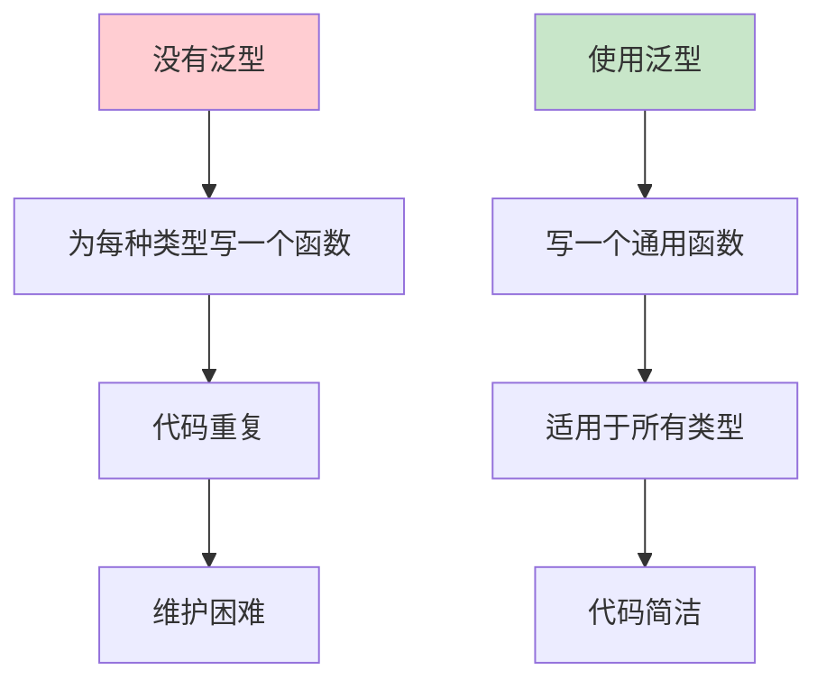
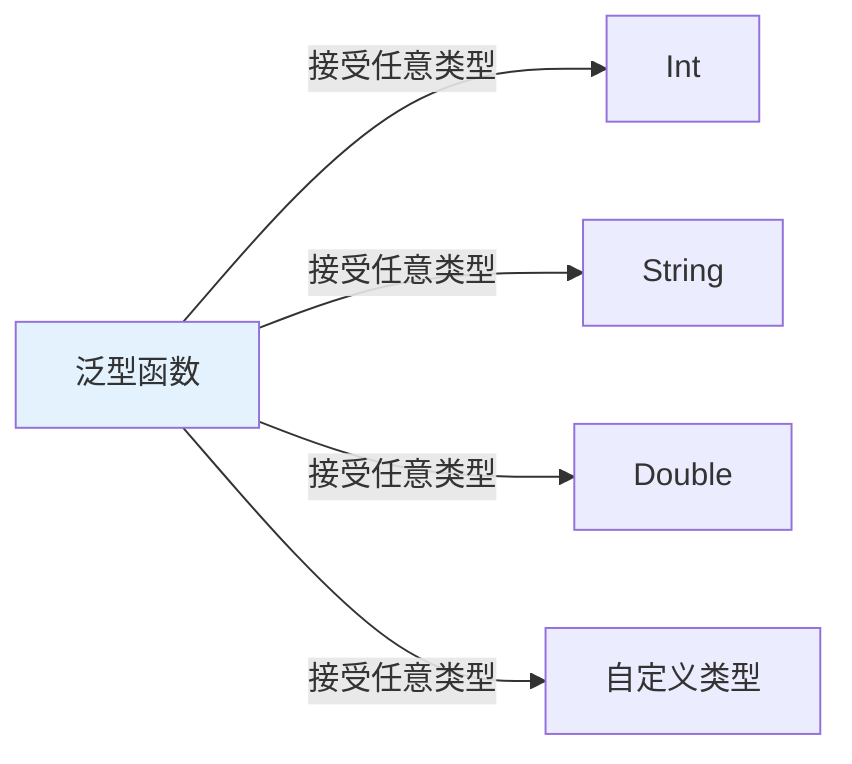
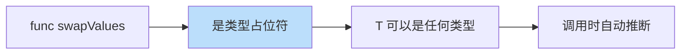

# 第14课：泛型

## 📖 学习目标
- 理解泛型的概念和用途
- 学会定义泛型函数
- 学会定义泛型类型
- 了解泛型约束

---

## 什么是泛型？

**泛型是什么？简单来说，泛型就是一个"万能模板"，可以适用于任何类型。**

### 生活类比：万能遥控器

想象一下：
- **没有泛型**：你有一个遥控器只能控制电视，另一个只能控制空调，还有一个只能控制机顶盒...
- **有泛型**：你有一个**万能遥控器**，可以控制所有电器！

泛型就是代码中的"万能遥控器"。

### 泛型概念图



### 泛型的作用



### 问题：没有泛型时

```swift
// 交换两个 Int
func swapInts(_ a: inout Int, _ b: inout Int) {
    let temp = a
    a = b
    b = temp
}

// 交换两个 String
func swapStrings(_ a: inout String, _ b: inout String) {
    let temp = a
    a = b
    b = temp
}

// 交换两个 Double
func swapDoubles(_ a: inout Double, _ b: inout Double) {
    let temp = a
    a = b
    b = temp
}

// 需要为每种类型写一个函数...太麻烦了！
```

**问题很明显：**
- 代码重复（三个函数几乎一样）
- 维护困难（改一个地方要改三处）
- 扩展性差（新类型又要写一个）

### 解决方案：泛型

```swift
// 一个泛型函数搞定所有类型！
func swapValues<T>(_ a: inout T, _ b: inout T) {
    let temp = a
    a = b
    b = temp
}

// 交换 Int
var x = 10
var y = 20
swapValues(&x, &y)
print(x, y)  // 20 10

// 交换 String
var a = "Hello"
var b = "World"
swapValues(&a, &b)
print(a, b)  // World Hello

// 交换 Double
var c = 1.5
var d = 2.5
swapValues(&c, &d)
print(c, d)  // 2.5 1.5
```

### 泛型语法说明



**语法拆解：**

```swift
func swapValues<T>(_ a: inout T, _ b: inout T) {
//               ^  ^         ^        ^
//               |  |         |        |
//               |  |         |        └── 参数类型也是 T
//               |  |         └── 参数类型是 T
//               |  └── T 是类型占位符
//               └── 声明一个泛型参数 T
}
```

**类型参数命名惯例：**

Swift 社区对泛型类型参数的命名有一些约定俗成的惯例：
- **单字母大写**（`T`、`U`、`V`）：适用于简短的泛型函数，含义由上下文即可理解。`T` 通常代表"Type"（类型），是最常见的泛型参数名。
- **语义化名称**（`Element`、`Key`、`Value`、`Item`）：当泛型出现在数据结构或更复杂的上下文中时，使用有意义的名称能让代码更易读。例如，`Array<Element>` 中的 `Element` 清楚地表示"数组中存储的元素类型"；`Dictionary<Key, Value>` 中的 `Key` 和 `Value` 分别表示键和值的类型。
- **多个泛型参数**时，如果它们之间的关系不明显，推荐使用语义化名称。例如 `func pair<T, U>` 可以接受，但如果是 `struct Cache<Key: Hashable, Value>` 则比 `struct Cache<T: Hashable, U>` 更容易理解。

### 泛型的更多例子

**例子1：打印任意类型**
```swift
// 没有泛型：需要为每种类型写一个打印函数
func printInt(_ value: Int) { print(value) }
func printString(_ value: String) { print(value) }
func printDouble(_ value: Double) { print(value) }

// 有泛型：一个函数搞定
func printValue<T>(_ value: T) {
    print(value)
}

printValue(42)          // 42
printValue("Hello")     // Hello
printValue(3.14)        // 3.14
printValue(true)        // true
```

**例子2：获取数组的第一个元素**
```swift
// 没有泛型：需要为每种数组写一个函数
func firstOfIntArray(_ array: [Int]) -> Int? { return array.first }
func firstOfStringArray(_ array: [String]) -> String? { return array.first }

// 有泛型：一个函数搞定
func firstElement<T>(of array: [T]) -> T? {
    return array.first
}

let numbers = [1, 2, 3]
let strings = ["Hello", "World"]

print(firstElement(of: numbers) ?? 0)      // 1
print(firstElement(of: strings) ?? "")     // Hello
```

---

## 泛型函数

泛型函数是使用泛型参数的函数，可以处理任意类型的输入。

### 基本语法

```swift
func 函数名<泛型参数>(参数) -> 返回类型 {
    // 函数体
}
```

**语法说明：**
- `<T>` 声明一个泛型参数 T
- T 可以是任何名字，通常用大写字母
- 可以有多个泛型参数：`<T, U, V>`

### 示例

```swift
// 定义一个泛型打印函数
// T 是类型占位符，可以是任何类型
func printValue<T>(_ value: T) {
    print("值：\(value)")
}

// 这个函数可以接受任何类型的参数
printValue(42)          // 输出：值：42
printValue("Hello")     // 输出：值：Hello
printValue(3.14)        // 输出：值：3.14
printValue(true)        // 输出：值：true
```

**代码解读：**
1. `<T>` 声明了一个泛型参数 T
2. `value: T` 表示 value 的类型是 T
3. 调用时，Swift 自动推断 T 的实际类型
4. 一个函数就能处理多种类型

### 多个泛型参数

有时候你需要处理多种不同类型的参数：

```swift
// 定义一个接受两个不同类型参数的函数
func pair<T, U>(_ first: T, _ second: U) -> (T, U) {
    return (first, second)
}

// T 是 Int，U 是 String
let p1 = pair(1, "Hello")
print(p1)  // 输出：(1, "Hello")

// T 是 String，U 是 Double
let p2 = pair("Swift", 3.14)
print(p2)  // 输出：("Swift", 3.14)
```

**代码解读：**
- `<T, U>` 声明了两个泛型参数
- T 和 U 可以是不同类型
- 函数返回一个元组，包含两个参数

---

## 泛型类型

### 泛型结构体

```swift
struct Stack<Element> {
    var items: [Element] = []

    mutating func push(_ item: Element) {
        items.append(item)
    }

    mutating func pop() -> Element? {
        return items.isEmpty ? nil : items.removeLast()
    }

    var top: Element? {
        return items.last
    }

    var isEmpty: Bool {
        return items.isEmpty
    }

    var count: Int {
        return items.count
    }
}

// 使用泛型栈
var intStack = Stack<Int>()
intStack.push(1)
intStack.push(2)
intStack.push(3)
print(intStack.top!)    // 3
print(intStack.pop()!)  // 3
print(intStack.count)   // 2

var stringStack = Stack<String>()
stringStack.push("Hello")
stringStack.push("World")
print(stringStack.top!)  // World
```

### 泛型类

```swift
class Box<T> {
    var value: T

    init(value: T) {
        self.value = value
    }

    func getValue() -> T {
        return value
    }

    func setValue(_ newValue: T) {
        value = newValue
    }
}

let intBox = Box(value: 42)
print(intBox.getValue())  // 42
intBox.setValue(100)
print(intBox.getValue())  // 100

let stringBox = Box(value: "Swift")
print(stringBox.getValue())  // Swift
```

### 泛型枚举

```swift
enum Result<T, E> {
    case success(T)
    case failure(E)
}

let success: Result<Int, String> = .success(42)
let failure: Result<Int, String> = .failure("出错了")

switch success {
case .success(let value):
    print("成功：\(value)")
case .failure(let error):
    print("失败：\(error)")
}
// 输出：成功：42
```

---

## 泛型约束

**泛型约束是什么？通俗地讲，给泛型"加限制"，告诉编译器这个类型必须满足什么条件。**

### 为什么要加约束？

```swift
// ❌ 问题：不是所有类型都能用 == 比较
// 下面这段伪代码无法编译通过：
// func findIndex<T>(of value: T, in array: [T]) -> Int? {
//     for (index, item) in array.enumerated() {
//         if item == value { return index }  // 编译错误！T 可能不能用 == 比较
//     }
//     return nil
// }

// ✅ 解决：要求 T 遵循 Equatable 协议
func findIndex<T: Equatable>(of value: T, in array: [T]) -> Int? {
    for (index, item) in array.enumerated() {
        if item == value { return index }  // 现在可以用 == 了
    }
    return nil
}
```

上面的对比说明了泛型约束的必要性：如果不加约束，编译器不知道 `T` 支持 `==` 运算符，所以会报错。加上 `: Equatable` 约束后，编译器确认 `T` 至少支持相等比较，代码就能通过编译了。

### 类型约束语法

```swift
func 函数名<T: 协议名>(参数) -> 返回类型 {
    // T 必须遵循指定的协议
}
```

### 示例

```swift
// 要求 T 遵循 Equatable 协议（可以比较相等）
func findIndex<T: Equatable>(of value: T, in array: [T]) -> Int? {
    for (index, item) in array.enumerated() {
        if item == value {
            return index
        }
    }
    return nil
}

// 可以用于 Int
let numbers = [1, 2, 3, 4, 5]
if let index = findIndex(of: 3, in: numbers) {
    print("找到索引：\(index)")  // 找到索引：2
}

// 可以用于 String
let names = ["Alice", "Bob", "Charlie"]
if let index = findIndex(of: "Bob", in: names) {
    print("找到索引：\(index)")  // 找到索引：1
}
```

### 常用约束

| 约束 | 含义 | 使用场景 |
|------|------|----------|
| `T: Equatable` | 可以比较相等 | 使用 `==` |
| `T: Comparable` | 可以比较大小 | 使用 `<` `>` |
| `T: Hashable` | 可以哈希 | 用作字典键 |
| `T: Codable` | 可以编解码 | JSON 处理 |

### 多个约束

```swift
func process<T: Comparable & CustomStringConvertible>(_ value: T) -> String {
    return "值：\(value)，可比较"
}

print(process(42))      // 值：42，可比较
print(process("Hello")) // 值：Hello，可比较
```

### 协议约束

以下是一个使用 `where` 子句约束泛型类型的完整示例，我们先逐行拆解函数签名：

```swift
func allMatch<C1: Container, C2: Container>(_ c1: C1, _ c2: C2) -> Bool
    where C1.Item == C2.Item, C1.Item: Equatable {
```

逐行解读：
- `func allMatch` — 函数名，表示"检查两个容器是否完全匹配"。
- `<C1: Container, C2: Container>` — 声明两个泛型参数 `C1` 和 `C2`，它们都必须遵循 `Container` 协议。这里用语义化名称 `C1`/`C2` 表示"容器1"和"容器2"。
- `(_ c1: C1, _ c2: C2)` — 两个参数，分别是 `C1` 类型和 `C2` 类型。
- `-> Bool` — 返回布尔值，表示两个容器是否匹配。
- `where C1.Item == C2.Item` — 约束条件：两个容器的元素类型必须相同。没有这个约束的话，你无法用 `==` 比较一个 `Int` 和一个 `String`。
- `, C1.Item: Equatable` — 再加一个约束：元素类型必须支持相等比较。有了这两个约束，函数体中才能用 `c1[i] != c2[i]` 来逐个比较元素。

以下是完整的示例代码：

```swift
protocol Container {
    associatedtype Item
    mutating func append(_ item: Item)
    var count: Int { get }
    subscript(i: Int) -> Item { get }
}

struct IntContainer: Container {
    var items: [Int] = []

    mutating func append(_ item: Int) {
        items.append(item)
    }

    var count: Int {
        return items.count
    }

    subscript(i: Int) -> Int {
        return items[i]
    }
}

func allMatch<C1: Container, C2: Container>(_ c1: C1, _ c2: C2) -> Bool
    where C1.Item == C2.Item, C1.Item: Equatable {
    if c1.count != c2.count {
        return false
    }
    for i in 0..<c1.count {
        if c1[i] != c2[i] {
            return false
        }
    }
    return true
}
```

---

## 关联类型

### 关联类型 vs 泛型类型参数

关联类型（associated type）和泛型类型参数（generic type parameter）都能实现"类型抽象"，但它们的使用场景不同：
- **泛型类型参数**用于函数、结构体、类、枚举等具体类型。调用方在使用时指定具体类型，例如 `Stack<Int>()`。
- **关联类型**用于协议内部。它表示"遵循这个协议的类型会决定这个关联类型的具体是什么"。遵循协议的类型通过具体实现（或 Swift 的类型推断）来确定关联类型的值。

简单来说，泛型参数是"由外部指定"的，关联类型是"由遵循者自行决定"的。关联类型让协议更加灵活——同一个类型可以以不同的方式遵循同一个协议（只要关联类型匹配即可）。

### 定义关联类型

```swift
protocol Stackable {
    associatedtype Element

    mutating func push(_ item: Element)
    mutating func pop() -> Element?
    var top: Element? { get }
}

struct IntStack: Stackable {
    typealias Element = Int  // 可以省略，Swift 会推断

    var items: [Int] = []

    mutating func push(_ item: Int) {
        items.append(item)
    }

    mutating func pop() -> Int? {
        return items.isEmpty ? nil : items.removeLast()
    }

    var top: Int? {
        return items.last
    }
}
```

### 泛型遵循协议

```swift
struct AnyStack<T>: Stackable {
    var items: [T] = []

    mutating func push(_ item: T) {
        items.append(item)
    }

    mutating func pop() -> T? {
        return items.isEmpty ? nil : items.removeLast()
    }

    var top: T? {
        return items.last
    }
}

var stack = AnyStack<String>()
stack.push("Hello")
stack.push("World")
print(stack.top!)  // World
```

---

## where 子句

使用 `where` 子句添加更多约束。

`where` 子句在 Swift 中有多种使用场景，作用都是对泛型或关联类型添加额外的约束条件：
- **在泛型函数中**：`func allEqual<T: Equatable>(...) -> Bool` 可以用 `where` 改写为 `func allEqual<T>(...) -> Bool where T: Equatable`，两者完全等价。当约束条件较长时，`where` 写法更清晰。
- **在泛型类型的扩展中**：`extension Array where Element: Equatable` 表示只为那些元素类型遵循 `Equatable` 的数组添加方法。这就是为什么 `[1, 1, 1].allEqual()` 能编译通过，而自定义类型不遵循 `Equatable` 时调用 `allEqual()` 会报错。
- **在协议中约束关联类型**：例如 `protocol Container where Element: Equatable` 可以要求所有遵循者的元素类型都必须可比较。

```swift
func allEqual<T: Equatable>(_ array: [T]) -> Bool {
    guard let first = array.first else { return true }
    return array.allSatisfy { $0 == first }
}

print(allEqual([1, 1, 1]))     // true
print(allEqual([1, 2, 1]))     // false
print(allEqual(["a", "a"]))    // true
```

### 带 where 的扩展

```swift
extension Array where Element: Equatable {
    func allEqual() -> Bool {
        guard let first = first else { return true }
        return allSatisfy { $0 == first }
    }
}

print([1, 1, 1].allEqual())   // true
print([1, 2, 1].allEqual())   // false
```

---

## 泛型的实际应用

### 泛型数据结构：队列

```swift
struct Queue<T> {
    private var elements: [T] = []

    mutating func enqueue(_ element: T) {
        elements.append(element)
    }

    mutating func dequeue() -> T? {
        return elements.isEmpty ? nil : elements.removeFirst()
    }

    var front: T? {
        return elements.first
    }

    var isEmpty: Bool {
        return elements.isEmpty
    }

    var count: Int {
        return elements.count
    }
}

var queue = Queue<Int>()
queue.enqueue(1)
queue.enqueue(2)
queue.enqueue(3)
print(queue.front!)     // 1
print(queue.dequeue()!) // 1
print(queue.count)      // 2
```

### 泛型字典

```swift
struct TypedDictionary<Key: Hashable, Value> {
    private var storage: [Key: Value] = [:]

    subscript(key: Key) -> Value? {
        get { storage[key] }
        set { storage[key] = newValue }
    }

    mutating func updateValue(_ value: Value, forKey key: Key) {
        storage[key] = value
    }

    mutating func removeValue(forKey key: Key) {
        storage.removeValue(forKey: key)
    }

    var keys: [Key] { Array(storage.keys) }
    var values: [Value] { Array(storage.values) }
    var count: Int { storage.count }
}

var dict = TypedDictionary<String, Int>()
dict["age"] = 25
dict["score"] = 100
print(dict["age"] ?? 0)  // 25
```

---

## 📝 练习题

### 练习1：泛型函数
编写一个泛型函数 `first<T>(_ array: [T]) -> T?`，返回数组的第一个元素。

```swift
// 在这里写你的代码

```

### 练习2：泛型函数 - 约束
编写一个泛型函数 `max<T: Comparable>(_ a: T, _ b: T) -> T`，返回两个值中的较大值。

```swift
// 在这里写你的代码

```

### 练习3：泛型结构体
定义一个泛型 `Pair<T>` 结构体，包含两个相同类型的属性 `first` 和 `second`，以及一个 `swap()` 方法。

```swift
// 在这里写你的代码

```

### 练习4：泛型栈
使用泛型实现一个栈，支持以下操作：
- `push(_:)` 入栈
- `pop()` 出栈
- `peek()` 查看栈顶
- `isEmpty` 是否为空
- `count` 元素数量

```swift
// 在这里写你的代码

```

### 练习5：泛型队列
使用泛型实现一个队列，支持以下操作：
- `enqueue(_:)` 入队
- `dequeue()` 出队
- `front` 查看队首
- `isEmpty` 是否为空

```swift
// 在这里写你的代码

```

### 练习6：泛型约束
编写一个泛型函数 `allUnique<T: Equatable>(_ array: [T]) -> Bool`，检查数组中的元素是否都唯一。

```swift
// 在这里写你的代码

```

### 练习7：关联类型
定义一个 `Describable` 协议，包含关联类型和 `describe()` 方法。让一个结构体遵循该协议。

```swift
// 在这里写你的代码

```

### 练习8：综合练习
实现一个泛型 `LinkedList<T>` 链表，支持：
- `append(_:)` 添加到末尾
- `prepend(_:)` 添加到开头
- `remove(at:)` 删除指定位置的元素
- `count` 元素数量
- `description` 描述字符串

```swift
// 在这里写你的代码

```

---

## ✅ 练习题参考答案

> 💡 **提示：** 建议先独立完成练习，再查看答案

---


### 练习1
```swift
func first<T>(_ array: [T]) -> T? {
    return array.first
}

print(first([1, 2, 3]) ?? "空")          // 1
print(first(["a", "b", "c"]) ?? "空")    // a
print(first([]) ?? "空")                 // 空
```

### 练习2
```swift
func max<T: Comparable>(_ a: T, _ b: T) -> T {
    return a > b ? a : b
}

print(max(10, 20))        // 20
print(max("Hello", "World"))  // World
print(max(3.14, 2.71))    // 3.14
```

### 练习3
```swift
struct Pair<T> {
    var first: T
    var second: T

    mutating func swap() {
        let temp = first
        first = second
        second = temp
    }
}

var pair = Pair(first: 1, second: 2)
print(pair.first, pair.second)  // 1 2
pair.swap()
print(pair.first, pair.second)  // 2 1

var stringPair = Pair(first: "Hello", second: "World")
print(stringPair.first, stringPair.second)  // Hello World
stringPair.swap()
print(stringPair.first, stringPair.second)  // World Hello
```

### 练习4
```swift
struct Stack<T> {
    private var items: [T] = []

    mutating func push(_ item: T) {
        items.append(item)
    }

    mutating func pop() -> T? {
        return items.isEmpty ? nil : items.removeLast()
    }

    var peek: T? {
        return items.last
    }

    var isEmpty: Bool {
        return items.isEmpty
    }

    var count: Int {
        return items.count
    }
}

var stack = Stack<Int>()
stack.push(1)
stack.push(2)
stack.push(3)
print(stack.peek!)    // 3
print(stack.count)    // 3
print(stack.pop()!)   // 3
print(stack.count)    // 2
print(stack.isEmpty)  // false
```

### 练习5
```swift
struct Queue<T> {
    private var elements: [T] = []

    mutating func enqueue(_ element: T) {
        elements.append(element)
    }

    mutating func dequeue() -> T? {
        return elements.isEmpty ? nil : elements.removeFirst()
    }

    var front: T? {
        return elements.first
    }

    var isEmpty: Bool {
        return elements.isEmpty
    }

    var count: Int {
        return elements.count
    }
}

var queue = Queue<String>()
queue.enqueue("A")
queue.enqueue("B")
queue.enqueue("C")
print(queue.front!)     // A
print(queue.dequeue()!) // A
print(queue.count)      // 2
```

### 练习6
```swift
func allUnique<T: Equatable>(_ array: [T]) -> Bool {
    var seen = [T]()
    for item in array {
        if seen.contains(item) {
            return false
        }
        seen.append(item)
    }
    return true
}

print(allUnique([1, 2, 3, 4, 5]))     // true
print(allUnique([1, 2, 2, 3, 4]))     // false
print(allUnique(["a", "b", "c"]))     // true
print(allUnique(["a", "b", "a"]))     // false
```

### 练习7
```swift
protocol Describable {
    associatedtype Item

    var items: [Item] { get }
    func describe() -> String
}

struct Collection<T>: Describable {
    typealias Item = T

    var items: [T]

    func describe() -> String {
        return "集合包含 \(items.count) 个元素"
    }
}

let numbers = Collection(items: [1, 2, 3, 4, 5])
print(numbers.describe())  // 集合包含 5 个元素

let names = Collection(items: ["Alice", "Bob"])
print(names.describe())    // 集合包含 2 个元素
```

### 练习8
```swift
class Node<T> {
    var value: T
    var next: Node?

    init(value: T) {
        self.value = value
    }
}

struct LinkedList<T> {
    private var head: Node<T>?
    private(set) var count: Int = 0

    mutating func append(_ value: T) {
        let newNode = Node(value: value)
        if let head = head {
            var current = head
            while let next = current.next {
                current = next
            }
            current.next = newNode
        } else {
            head = newNode
        }
        count += 1
    }

    mutating func prepend(_ value: T) {
        let newNode = Node(value: value)
        newNode.next = head
        head = newNode
        count += 1
    }

    mutating func remove(at index: Int) -> T? {
        guard index >= 0 && index < count else { return nil }

        if index == 0 {
            let value = head?.value
            head = head?.next
            count -= 1
            return value
        }

        var current = head
        for _ in 0..<(index - 1) {
            current = current?.next
        }

        let value = current?.next?.value
        current?.next = current?.next?.next
        count -= 1
        return value
    }

    var description: String {
        var result = "["
        var current = head
        while let node = current {
            result += "\(node.value)"
            if node.next != nil {
                result += ", "
            }
            current = node.next
        }
        result += "]"
        return result
    }
}

var list = LinkedList<Int>()
list.append(1)
list.append(2)
list.append(3)
print(list.description)  // [1, 2, 3]
print(list.count)        // 3

list.prepend(0)
print(list.description)  // [0, 1, 2, 3]

list.remove(at: 2)
print(list.description)  // [0, 1, 3]
print(list.count)        // 3

var stringList = LinkedList<String>()
stringList.append("Hello")
stringList.append("World")
print(stringList.description)  // [Hello, World]
```


---

## 🎯 小结

| 概念 | 语法 | 说明 |
|------|------|------|
| 泛型函数 | `func name<T>(...)` | 使用类型参数 |
| 泛型类型 | `struct Name<T>` | 泛型结构体/类/枚举 |
| 类型约束 | `T: Protocol` | 要求遵循协议 |
| 关联类型 | `associatedtype Type` | 协议中的类型占位符 |
| where 子句 | `where T: Constraint` | 添加约束 |

**最佳实践：**
- 使用泛型提高代码复用性
- 添加必要的类型约束
- 使用有意义的类型参数名（如 `Element`、`Key`、`Value`）
- 优先使用协议约束而不是具体类型

---

**上一课：[第13课：错误处理](第13课：错误处理.md)**
**下一课：[第15课：访问控制](第15课：访问控制.md)**
