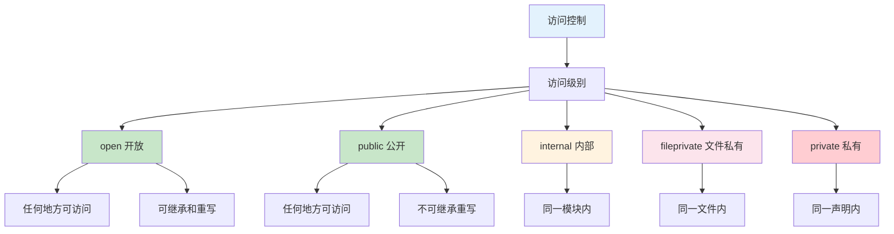
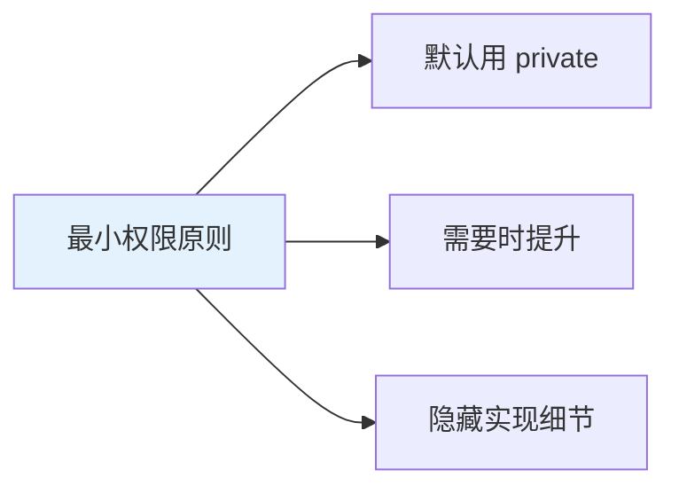

# 第15课：访问控制

## 📖 学习目标
- 理解访问控制的概念
- 掌握五种访问级别
- 学会在适当的地方使用访问控制
- 了解模块和源文件的概念

---

## 什么是访问控制？

访问控制限制了其他代码对你代码的访问。这让你可以隐藏实现细节，并指定一个可用的接口。

### 访问级别层次图



### 访问级别对比

| 访问级别 | 关键字 | 范围 | 使用场景 |
|----------|--------|------|----------|
| 开放 | `open` | 任何地方 | 框架公开类 |
| 公开 | `public` | 任何地方 | 框架公开 API |
| 内部 | `internal` | 同一模块 | 默认级别 |
| 文件私有 | `fileprivate` | 同一文件 | 文件内共享 |
| 私有 | `private` | 同一声明 | 实现细节 |

### 访问控制原则图



---

## 访问级别

Swift 提供了五种访问级别：

| 访问级别 | 关键字 | 说明 |
|----------|--------|------|
| 开放 | `open` | 可以在任何地方访问，可以被继承和重写 |
| 公开 | `public` | 可以在任何地方访问，但不能在模块外被继承或重写 |
| 内部 | `internal` | 默认级别，在同一模块内可以访问 |
| 文件私有 | `fileprivate` | 在同一源文件内可以访问 |
| 私有 | `private` | 在同一声明内可以访问 |

---

## 模块和源文件

### 模块

模块是一个代码分发单元——一个框架或应用程序。使用 `import` 关键字导入模块。

```swift
import UIKit  // 导入 UIKit 模块
import Foundation  // 导入 Foundation 模块
```

### 源文件

源文件是 Swift 模块中的单个源代码文件。

---

## 各访问级别示例

### private

**private 是什么？简单来说，只有自己能用，别人看不到。**

```swift
class BankAccount {
    private var balance: Double = 0  // 私有属性，外部不能直接访问

    func deposit(_ amount: Double) {  // 公开方法，外部可以调用
        if amount > 0 {
            balance += amount
        }
    }

    func withdraw(_ amount: Double) -> Bool {
        if amount > 0 && amount <= balance {
            balance -= amount
            return true
        }
        return false
    }

    func getBalance() -> Double {  // 通过方法间接访问
        return balance
    }
}

let account = BankAccount()
account.deposit(1000)
print(account.getBalance())  // 1000
// print(account.balance)  // ❌ 错误：balance 是私有的
```

**为什么用 private？**
- 保护数据不被意外修改
- 隐藏实现细节
- 提供更好的封装

### fileprivate

```swift
struct TrackedString {
    fileprivate(set) var numberOfEdits = 0
    var value: String = "" {
        didSet {
            numberOfEdits += 1
        }
    }
}

var trackedString = TrackedString()
trackedString.value = "Hello"
trackedString.value += " World"
print(trackedString.numberOfEdits)  // 2
```

### internal（默认）

```swift
// 默认是 internal
class Logger {
    func log(_ message: String) {
        print("[LOG] \(message)")
    }
}

// 在同一模块内可以访问
let logger = Logger()
logger.log("应用启动")
```

### public

```swift
// public 可以在任何模块访问
public class NetworkManager {
    public init() {}

    public func fetchData(from url: String) -> String {
        return "数据来自 \(url)"
    }
}

let manager = NetworkManager()
print(manager.fetchData(from: "https://example.com"))
```

### open

```swift
// open 可以在任何模块访问、继承和重写
open class BaseViewController {
    open func viewDidLoad() {
        print("基础视图加载")
    }
}

// 可以在其他模块继承
class MyViewController: BaseViewController {
    override func viewDidLoad() {
        super.viewDidLoad()
        print("自定义视图加载")
    }
}
```

---

## 访问控制实践

### 结构体的访问控制

```swift
public struct Person {
    public var name: String
    public var age: Int

    // 内部实现细节
    private var id: String

    public init(name: String, age: Int) {
        self.name = name
        self.age = age
        self.id = UUID().uuidString
    }

    // 公开方法
    public func introduce() -> String {
        return "我叫\(name)，今年\(age)岁"
    }

    // 私有方法
    private func generateID() -> String {
        return UUID().uuidString
    }
}
```

### 类的访问控制

```swift
public class DatabaseManager {
    // 公开属性
    public var isConnected: Bool = false

    // 私有属性
    private var connection: String?
    private let logger = Logger()

    // 公开初始化器
    public init() {}

    // 公开方法
    public func connect() {
        connection = "数据库连接"
        isConnected = true
        logger.log("数据库已连接")
    }

    // 文件私有方法
    fileprivate func disconnect() {
        connection = nil
        isConnected = false
        logger.log("数据库已断开")
    }

    // 私有方法
    private func executeQuery(_ query: String) -> String {
        logger.log("执行查询：\(query)")
        return "查询结果"
    }
}
```

### 协议的访问控制

```swift
public protocol DataSource {
    associatedtype Item

    var items: [Item] { get }
    func item(at index: Int) -> Item?
}

public class ArrayDataSource<T>: DataSource {
    public typealias Item = T

    public var items: [T]

    public init(items: [T]) {
        self.items = items
    }

    public func item(at index: Int) -> T? {
        guard index >= 0 && index < items.count else {
            return nil
        }
        return items[index]
    }
}
```

---

## 访问控制最佳实践

### 1. 最小权限原则

```swift
// 不好的做法：过度暴露
class User {
    var name: String = ""
    var email: String = ""
    var password: String = ""  // 不应该公开！
}

// 好的做法：最小权限
class User {
    var name: String = ""
    var email: String = ""
    private var password: String = ""  // 私有

    public func validatePassword(_ password: String) -> Bool {
        return self.password == password
    }
}
```

### 2. 隐藏实现细节

```swift
// 公开接口
public protocol Cache {
    func get(key: String) -> String?
    func set(key: String, value: String)
    func remove(key: String)
}

// 内部实现
public class MemoryCache: Cache {
    private var storage: [String: String] = [:]
    private let queue = DispatchQueue(label: "cache.queue")

    public init() {}

    public func get(key: String) -> String? {
        return queue.sync { storage[key] }
    }

    public func set(key: String, value: String) {
        queue.sync { storage[key] = value }
    }

    public func remove(key: String) {
        queue.sync { storage.removeValue(forKey: key) }
    }
}
```

### 3. 使用 fileprivate 限制文件访问

```swift
// NetworkManager.swift
public class NetworkManager {
    public func fetchData(from url: String, completion: @escaping (String) -> Void) {
        let task = createTask(url: url, completion: completion)
        task.resume()
    }

    // 仅在本文件内可访问
    fileprivate func createTask(url: String, completion: @escaping (String) -> Void) -> URLSessionDataTask {
        return URLSession.shared.dataTask(with: URL(string: url)!) { _, _, _ in
            completion("数据")
        }
    }
}

// 在同一文件中可以访问 createTask
extension NetworkManager {
    func prefetchData(from url: String) {
        let task = createTask(url: url) { _ in }
        task.resume()
    }
}
```

---

## getter 和 setter 的访问控制

可以为 getter 和 setter 设置不同的访问级别。

```swift
public struct TrackedString {
    // setter 是 private，getter 是 public
    public private(set) var numberOfEdits = 0

    public var value: String = "" {
        didSet {
            numberOfEdits += 1
        }
    }

    public init() {}
}

var tracked = TrackedString()
tracked.value = "Hello"
tracked.value += " World"
print(tracked.numberOfEdits)  // 2
// tracked.numberOfEdits = 10  // 错误：setter 是私有的
```

### 不同访问级别的 getter/setter

```swift
public class MyClass {
    // public getter, private setter
    public private(set) var publicProperty = "public"

    // internal getter, fileprivate setter
    internal fileprivate(set) var internalProperty = "internal"

    // fileprivate getter, private setter
    fileprivate private(set) var fileprivateProperty = "fileprivate"
}
```

---

## 初始化器的访问控制

```swift
public class SomeClass {
    public var name: String

    // 公开初始化器
    public init(name: String) {
        self.name = name
    }

    // 便利初始化器可以有更低的访问级别
    internal convenience init() {
        self.init(name: "默认")
    }
}

// 也可以限制初始化器
public class SecretClass {
    var secret: String

    // 私有初始化器，只能通过工厂方法创建
    private init(secret: String) {
        self.secret = secret
    }

    public static func create() -> SecretClass {
        return SecretClass(secret: "秘密")
    }
}
```

---

## 📝 练习题

### 练习1：私有属性
创建一个 `Temperature` 结构体，将 `celsius` 属性设为私有，提供公开的 `fahrenheit` 计算属性和 `setCelsius()` 方法。

```swift
// 在这里写你的代码

```

### 练习2：文件私有
创建一个 `Counter` 结构体，使用 `fileprivate(set)` 限制 `count` 属性的写入，只在本文件内可以修改。

```swift
// 在这里写你的代码

```

### 练习3：公开接口
设计一个公开的 `Stack` 类，隐藏内部实现，只暴露必要的公开接口。

```swift
// 在这里写你的代码

```

### 练习4：协议访问控制
定义一个公开的 `Describable` 协议，让一个公开的类遵循它。

```swift
// 在这里写你的代码

```

### 练习5：getter/setter 访问控制
创建一个 `User` 类，`name` 属性公开读取但私有设置，`age` 属性公开读取和设置。

```swift
// 在这里写你的代码

```

### 练习6：工厂模式
使用私有初始化器和公开的静态工厂方法创建一个 `Database` 类。

```swift
// 在这里写你的代码

```

### 练习7：访问控制与继承
创建一个 `BaseClass`，使用 `open` 关键字允许子类重写某些方法。

```swift
// 在这里写你的代码

```

### 练习8：综合练习
设计一个完整的用户管理系统：
1. 定义公开的 `User` 结构体（公开属性、私有敏感信息）
2. 定义公开的 `UserManager` 类（公开接口、私有实现）
3. 使用适当的访问控制隐藏实现细节

```swift
// 在这里写你的代码

```

---

## ✅ 练习题参考答案

> 💡 **提示：** 建议先独立完成练习，再查看答案

---


### 练习1
```swift
public struct Temperature {
    private var celsius: Double

    public var fahrenheit: Double {
        return celsius * 9 / 5 + 32
    }

    public var kelvin: Double {
        return celsius + 273.15
    }

    public init(celsius: Double) {
        self.celsius = celsius
    }

    public mutating func setCelsius(_ value: Double) {
        celsius = value
    }
}

var temp = Temperature(celsius: 100)
print(temp.fahrenheit)  // 212.0
temp.setCelsius(0)
print(temp.fahrenheit)  // 32.0
```

### 练习2
```swift
struct Counter {
    fileprivate(set) var count: Int = 0

    mutating func increment() {
        count += 1
    }

    mutating func decrement() {
        if count > 0 {
            count -= 1
        }
    }
}

var counter = Counter()
counter.increment()
counter.increment()
print(counter.count)  // 2
// counter.count = 10  // 如果在同一文件内可以，否则不行
```

### 练习3
```swift
public class Stack<T> {
    private var items: [T] = []

    public init() {}

    public func push(_ item: T) {
        items.append(item)
    }

    public func pop() -> T? {
        return items.isEmpty ? nil : items.removeLast()
    }

    public var top: T? {
        return items.last
    }

    public var isEmpty: Bool {
        return items.isEmpty
    }

    public var count: Int {
        return items.count
    }
}

let stack = Stack<Int>()
stack.push(1)
stack.push(2)
print(stack.top!)  // 2
print(stack.count)  // 2
```

### 练习4
```swift
public protocol Describable {
    func describe() -> String
}

public class Product: Describable {
    public var name: String
    public var price: Double

    public init(name: String, price: Double) {
        self.name = name
        self.price = price
    }

    public func describe() -> String {
        return "\(name) - ¥\(price)"
    }
}

let product = Product(name: "iPhone", price: 9999)
print(product.describe())  // iPhone - ¥9999.0
```

### 练习5
```swift
public class User {
    public private(set) var name: String
    public var age: Int

    public init(name: String, age: Int) {
        self.name = name
        self.age = age
    }

    // 只能通过这个方法修改 name
    public func updateName(_ newName: String) {
        guard !newName.isEmpty else { return }
        name = newName
    }
}

let user = User(name: "小明", age: 18)
print(user.name)  // 小明
// user.name = "小红"  // 错误：setter 是私有的
user.updateName("小红")
print(user.name)  // 小红
user.age = 19  // 可以直接修改
```

### 练习6
```swift
public class Database {
    private var connectionString: String
    private var isConnected: Bool = false

    // 私有初始化器
    private init(connectionString: String) {
        self.connectionString = connectionString
    }

    // 工厂方法
    public static func createSQLite(path: String) -> Database {
        let db = Database(connectionString: "sqlite://\(path)")
        db.connect()
        return db
    }

    public static func createMySQL(host: String, port: Int) -> Database {
        let db = Database(connectionString: "mysql://\(host):\(port)")
        db.connect()
        return db
    }

    private func connect() {
        isConnected = true
        print("已连接到：\(connectionString)")
    }

    public func disconnect() {
        isConnected = false
        print("已断开连接")
    }
}

// let db = Database(connectionString: "test")  // 错误：私有初始化器
let sqlite = Database.createSQLite(path: "/data/db.sqlite")
let mysql = Database.createMySQL(host: "localhost", port: 3306)
```

### 练习7
```swift
open class Animal {
    public var name: String

    public init(name: String) {
        self.name = name
    }

    // open 允许子类重写
    open func speak() -> String {
        return "\(name) 发出声音"
    }

    // public 不允许子类重写（在其他模块）
    public func describe() -> String {
        return "动物：\(name)"
    }
}

class Dog: Animal {
    override func speak() -> String {
        return "\(name) 汪汪叫"
    }
}

class Cat: Animal {
    override func speak() -> String {
        return "\(name) 喵喵叫"
    }
}

let dog = Dog(name: "旺财")
print(dog.speak())    // 旺财 汪汪叫
print(dog.describe()) // 动物：旺财

let cat = Cat(name: "咪咪")
print(cat.speak())    // 咪咪 喵喵叫
```

### 练习8
```swift
public struct User {
    public let id: String
    public var name: String
    public var email: String

    // 私有敏感信息
    private var password: String
    private var socialSecurityNumber: String?

    public init(name: String, email: String, password: String) {
        self.id = UUID().uuidString
        self.name = name
        self.email = email
        self.password = password
    }

    public func validatePassword(_ password: String) -> Bool {
        return self.password == password
    }

    public mutating func updatePassword(old: String, new: String) -> Bool {
        if validatePassword(old) {
            password = new
            return true
        }
        return false
    }
}

public class UserManager {
    private var users: [String: User] = [:]
    private var currentUser: User?

    public init() {}

    public func register(name: String, email: String, password: String) -> User {
        let user = User(name: name, email: email, password: password)
        users[user.id] = user
        return user
    }

    public func login(email: String, password: String) -> Bool {
        if let user = users.values.first(where: { $0.email == email }) {
            if user.validatePassword(password) {
                currentUser = user
                return true
            }
        }
        return false
    }

    public func logout() {
        currentUser = nil
    }

    public var isLoggedIn: Bool {
        return currentUser != nil
    }

    public var currentUserName: String? {
        return currentUser?.name
    }
}

// 使用示例
let manager = UserManager()
let user = manager.register(name: "小明", email: "xiaoming@example.com", password: "12345678")

print(manager.login(email: "xiaoming@example.com", password: "12345678"))  // true
print(manager.isLoggedIn)          // true
print(manager.currentUserName ?? "")  // 小明

manager.logout()
print(manager.isLoggedIn)  // false
```


---

## 🎯 小结

| 访问级别 | 关键字 | 范围 |
|----------|--------|------|
| 开放 | `open` | 任何地方，可继承重写 |
| 公开 | `public` | 任何地方 |
| 内部 | `internal` | 同一模块 |
| 文件私有 | `fileprivate` | 同一文件 |
| 私有 | `private` | 同一声明 |

**最佳实践：**
- 默认使用 `private` 或 `fileprivate`
- 只在需要时使用更高的访问级别
- 隐藏实现细节，暴露简洁接口
- 使用 `public private(set)` 限制写入

---

**上一课：[第14课：泛型](第14课：泛型.md)**
**下一课：[第16课：可选类型](第16课：可选类型.md)**
