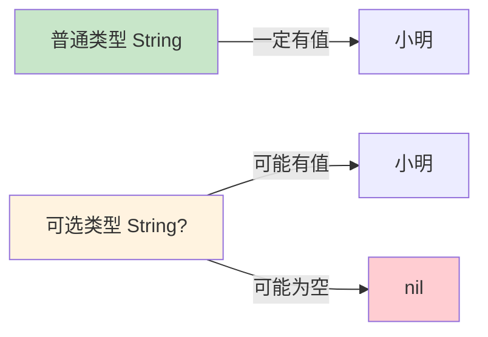
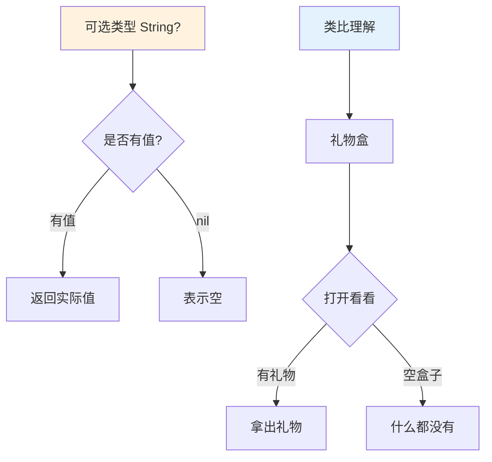
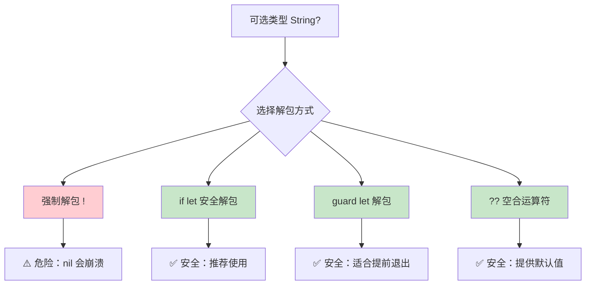
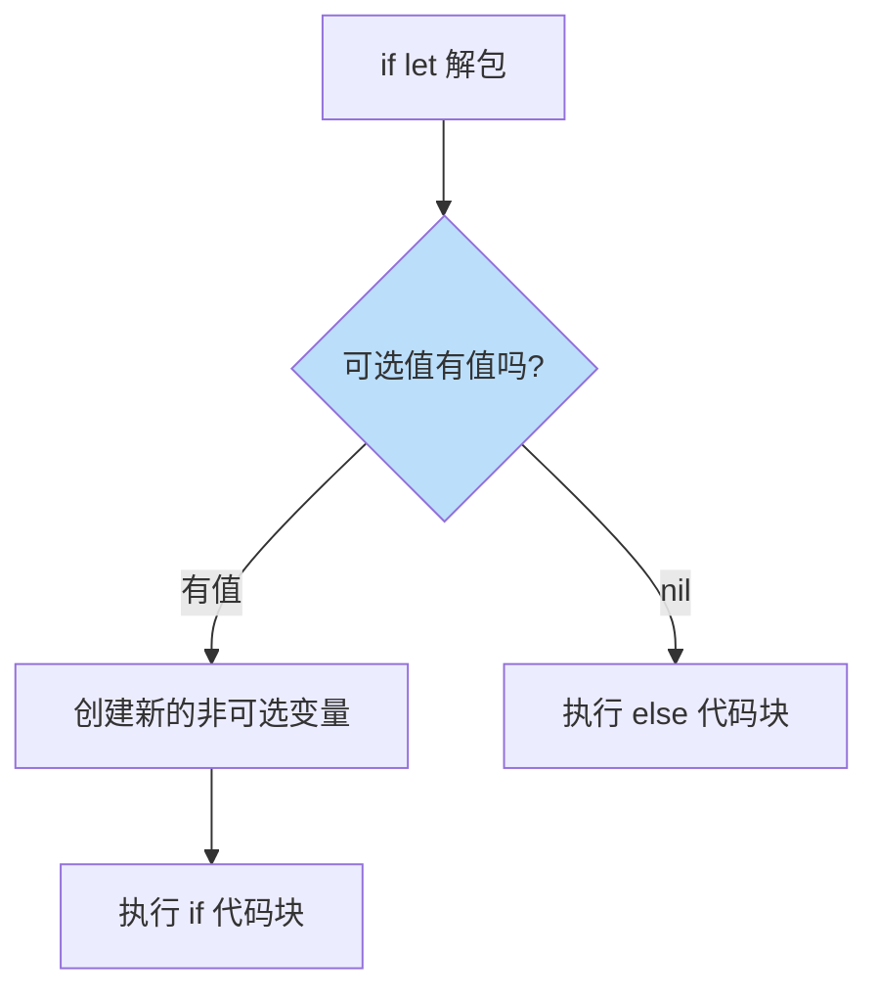
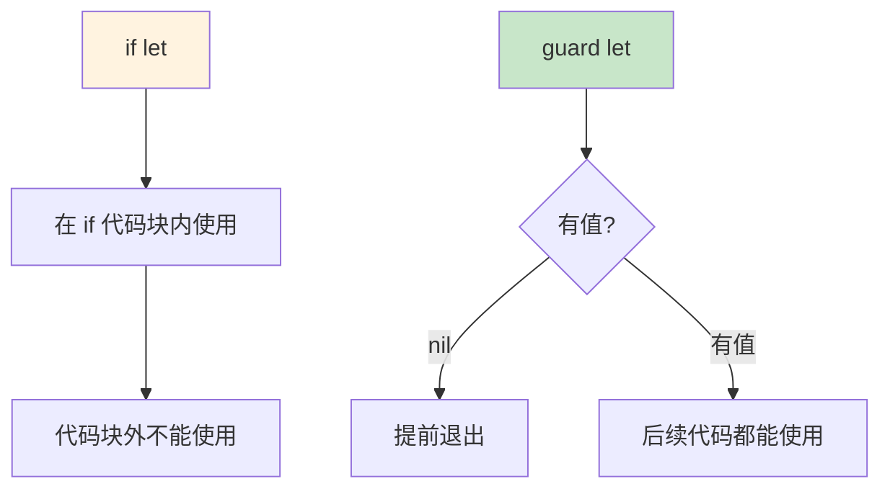

# 第16课：可选类型

## 📖 学习目标
- 理解可选类型的概念
- 学会解包可选值
- 掌握可选绑定
- 了解隐式解包可选

---

## 什么是可选类型？

**可选类型是什么？通俗地讲，可选类型就是一个"可能有值，也可能没有值"的盒子。**

想象一下这个生活场景：

> 你有一个盒子，里面可能装着东西，也可能是空的。
> - **普通类型**：盒子里**一定有东西**，你伸手进去一定能拿到
> - **可选类型**：盒子里**可能有东西，也可能是空的**，你伸手进去不一定能拿到

### 为什么需要可选类型？

**因为现实中很多事情是"不确定"的！**

```swift
// 场景1：从字典查找
let scores = ["小明": 90, "小红": 85]
let score = scores["小张"]  // 小张的成绩存在吗？不确定！

// 场景2：类型转换
let text = "Hello"
let number = Int(text)  // "Hello"能转成数字吗？不能！

// 场景3：用户输入
let userInput = textField.text  // 用户可能什么都没输入

// 场景4：网络请求
let data = fetchData()  // 网络可能断了，拿不到数据
```

**在这些情况下，我们需要一种类型来表示"可能有值，也可能没有值"。**

### 可选类型的本质

**可选类型就像一个"带标签的盒子"：**

```
普通类型 String：
┌─────────┐
│  "小明"  │  ← 一定有值
└─────────┘

可选类型 String?：
┌─────────┐
│ ? 标签   │  ← 告诉你"可能为空"
│  "小明"  │  ← 有值的时候
└─────────┘

或者：

┌─────────┐
│ ? 标签   │
│   nil   │  ← 没有值的时候
└─────────┘
```

### 可选类型的声明

```swift
// 普通变量：不能为 nil
var name: String = "小明"
// name = nil  // ❌ 错误！普通类型不能为 nil

// 可选变量：可以为 nil
var optionalName: String? = "小明"
optionalName = nil  // ✅ 正确！可选类型可以为空

// 注意：类型后面加 ? 就变成了可选类型
var age: Int = 18      // 普通 Int，不能为 nil
var optionalAge: Int? = 18  // 可选 Int?，可以为 nil
```

### 可选类型概念图



### 为什么需要可选类型？

```mermaid
graph TD
    A[现实中的不确定性] --> B[字典查找：键可能不存在]
    A --> C[类型转换：可能失败]
    A --> D[用户输入：可能为空]
    A --> E[网络请求：可能失败]

    B --> F[需要一种类型来表示"可能没有值"]
    C --> F
    D --> F
    E --> F
    F --> G[可选类型 Optional]

    style G fill:#e3f2fd
```

### 🔴 可选类型的本质



---

## nil

`nil` 表示没有值。

```swift
// 声明可选变量但不赋值，默认为 nil
var name: String?
print(name ?? "无值")  // 无值

// 赋值
name = "小明"
print(name ?? "无值")  // 小明

// 设为 nil
name = nil
print(name ?? "无值")  // 无值
```

---

## 解包可选值（核心概念！）

可选类型不能直接使用，必须先"解包"才能获取里面的值。

### 解包方式对比图



### 强制解包（!）- ⚠️ 危险操作

```swift
var name: String? = "小明"

// 强制解包
let unwrappedName = name!
print(unwrappedName)  // 小明

// 如果值为 nil，强制解包会崩溃！
name = nil
// let crash = name!  // 💥 运行时错误！程序崩溃！
```

> ⚠️ **警告：** 尽量避免使用强制解包 `!`，除非你 100% 确定有值！

### 安全解包：if let（推荐！）

```swift
var name: String? = "小明"

if let unwrappedName = name {
    print("名字：\(unwrappedName)")  // 名字：小明
} else {
    print("没有名字")
}

// 值为 nil 时
name = nil
if let unwrappedName = name {
    print("名字：\(unwrappedName)")
} else {
    print("没有名字")  // 没有名字
}
```

### if let 解包流程图



### 多个可选绑定

```swift
var name: String? = "小明"
var age: Int? = 18

if let name = name, let age = age {
    print("\(name) 今年 \(age) 岁")  // 小明 今年 18 岁
}

// 其中一个为 nil
name = nil
if let name = name, let age = age {
    print("\(name) 今年 \(age) 岁")
} else {
    print("信息不完整")  // 信息不完整
}
```

### guard let - 提前退出模式

```swift
func greet(name: String?) {
    guard let name = name else {
        print("没有提供名字")
        return  // 提前退出函数
    }
    // 这里 name 已经解包，可以直接使用
    print("你好，\(name)！")
}

greet(name: "小明")  // 你好，小明！
greet(name: nil)     // 没有提供名字
```

### guard let vs if let 对比



| 特性 | if let | guard let |
|------|--------|-----------|
| 使用场景 | 条件执行 | 提前退出 |
| 解包后变量作用域 | 仅在 if 代码块内 | 后续所有代码 |
| 代码风格 | 嵌套较深 | 扁平化 |

---

## 可选链

使用 `?` 安全地访问可选值的属性和方法。

### 基本语法

```swift
class Person {
    var name: String
    var address: Address?

    init(name: String) {
        self.name = name
    }
}

class Address {
    var city: String

    init(city: String) {
        self.city = city
    }
}

let person = Person(name: "小明")

// 使用可选链
let city = person.address?.city
print(city ?? "未知")  // 未知（因为 address 为 nil）

// 赋值后
person.address = Address(city: "北京")
let city2 = person.address?.city
print(city2 ?? "未知")  // 北京
```

### 可选链调用方法

```swift
class Calculator {
    func add(_ a: Int, _ b: Int) -> Int {
        return a + b
    }
}

var calculator: Calculator? = Calculator()

// 使用可选链调用方法
let result = calculator?.add(5, 3)
print(result ?? 0)  // 8

calculator = nil
let result2 = calculator?.add(5, 3)
print(result2 ?? 0)  // 0
```

### 多级可选链

```swift
class Company {
    var name: String
    var ceo: Person?

    init(name: String) {
        self.name = name
    }
}

class Person {
    var name: String
    var address: Address?

    init(name: String) {
        self.name = name
    }
}

class Address {
    var city: String

    init(city: String) {
        self.city = city
    }
}

let company = Company(name: "苹果公司")
company.ceo = Person(name: "Tim Cook")
company.ceo?.address = Address(city: "库比蒂诺")

// 多级可选链
let ceoCity = company.ceo?.address?.city
print(ceoCity ?? "未知")  // 库比蒂诺
```

---

## nil 合并运算符（??）

### 基本用法

```swift
let name: String? = nil
let displayName = name ?? "匿名"
print(displayName)  // 匿名

let name2: String? = "小明"
let displayName2 = name2 ?? "匿名"
print(displayName2)  // 小明
```

### 链式使用

```swift
let a: String? = nil
let b: String? = nil
let c: String? = "Hello"

let result = a ?? b ?? c ?? "默认值"
print(result)  // Hello
```

### 实际应用

```swift
// 字典查找
let scores = ["小明": 90]
let score = scores["小张"] ?? 0
print(score)  // 0

// 类型转换
let text = "Hello"
let number = Int(text) ?? 0
print(number)  // 0

// 默认值
func greet(name: String?) {
    let displayName = name ?? "朋友"
    print("你好，\(displayName)！")
}

greet(name: "小明")  // 你好，小明！
greet(name: nil)     // 你好，朋友！
```

---

## 隐式解包可选

使用 `!` 声明的可选类型，访问时自动解包。

```swift
// 声明隐式解包可选
let assumedString: String! = "隐式解包可选"
let implicitString: String = assumedString  // 自动解包

// 等价于
let optionalString: String? = "可选"
let explicitString: String = optionalString!  // 需要显式解包
```

### 使用场景

```swift
// Interface Builder 连接
@IBOutlet weak var label: UILabel!

// 确定在使用前一定有值
class ViewController {
    var tableView: UITableView!

    func setup() {
        tableView = UITableView()
        // 可以直接使用，不需要解包
        tableView.delegate = self
    }
}
```

### ⚠️ 注意事项

```swift
var optionalString: String! = nil
// let crash = optionalString + "test"  // 💥 崩溃！

// 安全的做法
if let string = optionalString {
    print(string)
}
```

---

## 可选模式匹配

### 使用 if case

```swift
let number: Int? = 42

if case .some(let value) = number {
    print("有值：\(value)")
}

if case let value? = number {
    print("有值：\(value)")
}
```

### 在 switch 中使用

```swift
let number: Int? = 42

switch number {
case .some(let value):
    print("有值：\(value)")
case .none:
    print("无值")
}

// 简化写法
switch number {
case let value?:
    print("有值：\(value)")
case nil:
    print("无值")
}
```

---

## 可选类型与集合

```swift
// 可选数组
var numbers: [Int]? = [1, 2, 3]
print(numbers?.count ?? 0)  // 3

numbers = nil
print(numbers?.count ?? 0)  // 0

// 数组中的可选值
var names: [String?] = ["小明", nil, "小红", nil]

// 过滤 nil
let validNames = names.compactMap { $0 }
print(validNames)  // ["小明", "小红"]
```

---

## 📝 练习题

### 练习1：基本可选
声明一个可选整数变量，先赋值再设为 nil，分别打印两种情况。

```swift
// 在这里写你的代码

```

### 练习2：安全解包
使用 `if let` 安全解包一个可选字符串，如果为 nil 则打印默认值。

```swift
// 在这里写你的代码

```

### 练习3：guard let
编写一个函数，使用 `guard let` 解包可选参数，如果为 nil 则提前返回。

```swift
// 在这里写你的代码

```

### 练习4：可选链
创建一个类层次结构（Person -> Address -> City），使用可选链安全访问嵌套属性。

```swift
// 在这里写你的代码

```

### 练习5：nil 合并运算符
使用 `??` 运算符为多个可选值提供默认值。

```swift
// 在这里写你的代码

```

### 练习6：可选数组处理
给定一个可选值数组 `[1, nil, 2, nil, 3]`，使用 `compactMap` 过滤掉 nil 并计算总和。

```swift
// 在这里写你的代码

```

### 练习7：多个可选绑定
编写一个函数，接受三个可选参数，使用 `if let` 同时解包它们。

```swift
// 在这里写你的代码

```

### 练习8：综合练习
设计一个用户资料系统：
1. 定义 `Profile` 结构体，包含可选属性（地址、电话、邮箱等）
2. 使用可选链安全访问这些属性
3. 使用 `??` 提供默认值
4. 使用 `guard let` 验证必填字段

```swift
// 在这里写你的代码

```

---

## ✅ 练习题参考答案

> 💡 **提示：** 建议先独立完成练习，再查看答案

---


### 练习1
```swift
var number: Int? = 42
print(number ?? "无值")  // 42

number = nil
print(number ?? "无值")  // 无值
```

### 练习2
```swift
var name: String? = "小明"

if let name = name {
    print("名字：\(name)")
} else {
    print("名字未知")
}

name = nil
if let name = name {
    print("名字：\(name)")
} else {
    print("名字未知")  // 名字未知
}
```

### 练习3
```swift
func processName(_ name: String?) {
    guard let name = name else {
        print("名字为空")
        return
    }
    print("处理名字：\(name)")
}

processName("小明")  // 处理名字：小明
processName(nil)     // 名字为空
```

### 练习4
```swift
class City {
    var name: String
    init(name: String) { self.name = name }
}

class Address {
    var street: String
    var city: City?
    init(street: String) { self.street = street }
}

class Person {
    var name: String
    var address: Address?
    init(name: String) { self.name = name }
}

let person = Person(name: "小明")
person.address = Address(street: "长安街")
person.address?.city = City(name: "北京")

let cityName = person.address?.city?.name ?? "未知城市"
print(cityName)  // 北京
```

### 练习5
```swift
let name: String? = nil
let nickname: String? = nil
let username: String? = "user123"
let defaultName = "匿名用户"

let displayName = name ?? nickname ?? username ?? defaultName
print(displayName)  // user123
```

### 练习6
```swift
let numbers: [Int?] = [1, nil, 2, nil, 3]
let validNumbers = numbers.compactMap { $0 }
let sum = validNumbers.reduce(0, +)
print("总和：\(sum)")  // 总和：6
```

### 练习7
```swift
func processInfo(name: String?, age: Int?, city: String?) {
    if let name = name, let age = age, let city = city {
        print("\(name)，\(age)岁，来自\(city)")
    } else {
        print("信息不完整")
    }
}

processInfo(name: "小明", age: 18, city: "北京")
// 输出：小明，18岁，来自北京

processInfo(name: "小明", age: nil, city: "北京")
// 输出：信息不完整
```

### 练习8
```swift
struct Profile {
    var name: String
    var email: String?
    var phone: String?
    var address: Address?

    struct Address {
        var street: String?
        var city: String?
        var zipCode: String?
    }

    func displayInfo() {
        print("姓名：\(name)")
        print("邮箱：\(email ?? "未填写")")
        print("电话：\(phone ?? "未填写")")
        print("地址：\(address?.city ?? "未填写")")
    }
}

func createProfile(name: String?, email: String?, phone: String?) -> Profile? {
    guard let name = name, !name.isEmpty else {
        print("错误：姓名不能为空")
        return nil
    }

    return Profile(
        name: name,
        email: email,
        phone: phone
    )
}

// 测试
if let profile = createProfile(name: "小明", email: "test@example.com", phone: nil) {
    profile.displayInfo()
    // 输出：
    // 姓名：小明
    // 邮箱：test@example.com
    // 电话：未填写
    // 地址：未填写
}

if let profile = createProfile(name: nil, email: nil, phone: nil) {
    profile.displayInfo()
} else {
    print("创建失败")
    // 输出：错误：姓名不能为空
    // 输出：创建失败
}
```


---

## 🎯 小结

| 概念 | 语法 | 说明 |
|------|------|------|
| 可选类型 | `Type?` | 可能有值，可能为 nil |
| 强制解包 | `value!` | 危险！崩溃风险 |
| if let | `if let x = optional` | 安全解包 |
| guard let | `guard let x = optional` | 提前退出 |
| 可选链 | `optional?.property` | 安全访问 |
| nil 合并 | `optional ?? default` | 提供默认值 |
| 隐式解包 | `Type!` | 自动解包 |

**最佳实践：**
- 优先使用 `if let` 或 `guard let` 解包
- 避免强制解包 `!`
- 使用 `??` 提供合理的默认值
- 使用可选链安全访问嵌套属性

---

**上一课：[第15课：访问控制](第15课：访问控制.md)**

## 🎉 恭喜完成 Swift 入门教程！

你已经学习了 Swift 编程的基础知识：
1. 变量和常量
2. 数据类型
3. 字符串操作
4. 运算符
5. 控制流（条件语句）
6. 控制流（循环）
7. 集合类型
8. 函数
9. 闭包
10. 结构体和类
11. 枚举
12. 协议
13. 错误处理
14. 泛型
15. 访问控制
16. 可选类型

**下一步学习建议：**
- 实践项目开发
- 学习 iOS/macOS 开发框架
- 阅读 Swift 官方文档
- 参与开源项目
