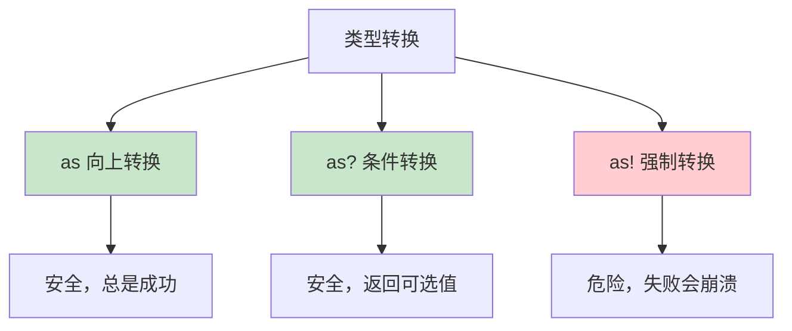

# 第17课：类型转换和类型检查

## 📖 学习目标
- 掌握类型检查（is）
- 学会类型转换（as, as?, as!）
- 理解 Any 和 AnyObject 类型
- 了解类型别名（typealias）
- 能够在实际项目中正确使用类型转换
- 避免类型转换的常见陷阱

---

## 为什么需要类型转换？

在 Swift 中，有时候你需要：
- 检查一个对象是什么类型
- 将一个对象转换成另一种类型
- 处理不同类型的值

### 为什么这样设计？

Swift 是一门**强类型语言**，编译器在编译时就会检查类型安全。但现实中，我们经常需要处理**运行时才能确定类型**的数据：
- 从网络 API 获取的 JSON 数据，值的类型在编译时未知
- 从集合中取出的元素，可能是多种类型之一
- 使用继承体系时，变量声明为父类，但实际可能是子类

类型转换系统让我们在保持类型安全的同时，灵活处理这些场景。

### 生活类比：快递分拣

想象快递站的分拣过程：
- **类型检查（is）**：看看包裹是普通件还是加急件
- **类型转换（as）**：把普通件当成加急件处理

更形象的比喻：你去参加一个化装舞会，所有人都戴着面具。
- **`is`** 就像问："你是小红吗？"（检查身份）
- **`as?`** 就像说："如果你是小红，请把面具摘下来让我看看"（安全地尝试）
- **`as!`** 就像直接把对方的面具扯下来（如果认错人就尴尬了）

---

## 类型检查（is）

使用 `is` 关键字检查一个值是否属于某个类型。

### 基本语法

```swift
值 is 类型
// 返回 true 或 false
```

### 为什么用 `is` 而不是比较类型名？

Swift 选择用 `is` 关键字而非方法调用，是因为：
1. **可读性强**：`animal is Dog` 读起来像自然语言
2. **编译时检查**：如果 `Dog` 不存在，编译器会报错
3. **性能优化**：编译器可以对 `is` 检查进行优化

### 示例

```swift
// 定义基类 Animal
class Animal {
    var name: String                          // 动物名字
    init(name: String) { self.name = name }   // 初始化方法
}

// 定义子类 Dog
class Dog: Animal {
    func bark() { print("汪汪") }             // 狗特有的方法
}

// 定义子类 Cat
class Cat: Animal {
    func meow() { print("喵喵") }             // 猫特有的方法
}

// 创建一个 Dog 实例，但声明为 Animal 类型
let animal: Animal = Dog(name: "旺财")

// 使用 is 进行类型检查
if animal is Dog {
    print("\(animal.name) 是一只狗")           // 条件为真，执行这里
} else if animal is Cat {
    print("\(animal.name) 是一只猫")           // 不会执行
}
// 输出：旺财 是一只狗
```

### 类型检查的实际应用

```swift
// 创建一个包含不同类型的数组
let things: [Any] = [1, "Hello", 3.14, true, Dog(name: "小黑")]

// 遍历数组，使用 is 检查每个元素的类型
for thing in things {
    if thing is Int {
        print("整数：\(thing)")                // 整数类型
    } else if thing is String {
        print("字符串：\(thing)")              // 字符串类型
    } else if thing is Double {
        print("浮点数：\(thing)")              // 浮点数类型
    } else if thing is Bool {
        print("布尔值：\(thing)")              // 布尔类型
    } else if thing is Dog {
        print("狗狗")                         // Dog 类型
    }
}
```

### 为什么 `is` 不能检查具体泛型类型？

```swift
let numbers = [1, 2, 3]
// print(numbers is [Int])  // ❌ 这样写没问题
// 但下面的不行：
// print(numbers is Array<Int>)  // 某些情况下有限制

// 原因：Swift 的泛型在运行时会被"类型擦除"
// 编译器无法在运行时区分 Array<Int> 和 Array<Double>
// 但可以区分 Array 和 Dictionary
print(numbers is [Int])     // true
print(numbers is [String])  // false
```

---

## 类型转换（as）

Swift 提供了三种类型转换方式：

| 转换方式 | 说明 | 安全性 | 返回类型 |
|----------|------|--------|----------|
| `as` | 向上转换或相同类型转换 | ✅ 安全 | 目标类型 |
| `as?` | 条件转换，返回可选值 | ✅ 安全 | 目标类型? |
| `as!` | 强制转换，失败会崩溃 | ⚠️ 危险 | 目标类型 |

### 1. as - 向上转换（Upcast）

```swift
// 定义类层次结构
class Animal {
    var name: String
    init(name: String) { self.name = name }
}

class Dog: Animal {
    func bark() { print("汪汪") }
}

// 创建 Dog 实例
let dog = Dog(name: "旺财")

// Dog 转换为 Animal（向上转换，总是成功）
let animal = dog as Animal
print(animal.name)  // 旺财

// 这种转换是安全的，因为 Dog 是 Animal 的子类
// 就像说"狗是动物"——这是永远正确的
```

### 为什么需要向上转换？

向上转换在以下场景很有用：
1. **统一集合类型**：把不同子类放入同一个数组
2. **方法参数匹配**：方法接受父类类型，传入子类
3. **隐藏实现细节**：对外暴露父类接口，内部使用子类

```swift
// 场景：统一处理不同类型的宠物
let dog = Dog(name: "旺财")
let cat = Cat(name: "咪咪")

// 向上转换，放入同一个数组
let animals: [Animal] = [dog as Animal, cat as Animal]
// 等价于：
// let animals: [Animal] = [dog, cat]  // Swift 会自动向上转换
```

### 2. as? - 条件转换（推荐！）

```swift
let animal: Animal = Dog(name: "旺财")

// 尝试转换为 Dog
// as? 返回 Optional<Dog>，转换失败返回 nil
if let dog = animal as? Dog {
    dog.bark()           // 成功转换，可以调用 Dog 特有的方法
    print("转换成功")
} else {
    print("转换失败")
}

// 尝试转换为 Cat（会失败）
if let cat = animal as? Cat {
    cat.meow()           // 不会执行
} else {
    print("不是猫")       // 执行这里，因为 animal 实际是 Dog
}
// 输出：不是猫
```

### 为什么 `as?` 是推荐方式？

```swift
// as? 结合 if let 是最安全的模式
let animal: Animal = Dog(name: "旺财")

// ✅ 推荐：安全，不会崩溃
if let dog = animal as? Dog {
    dog.bark()
}

// ❌ 不推荐：如果类型不对会崩溃
let dog = animal as! Dog  // 危险！
```

### 3. as! - 强制转换（危险！）

```swift
let animal: Animal = Dog(name: "旺财")

// 强制转换（如果类型不对会崩溃！）
let dog = animal as! Dog
dog.bark()  // 汪汪

// 危险情况
// let cat = animal as! Cat  // 💥 运行时崩溃！
// 错误信息：Could not cast value of type 'Dog' to 'Cat'
```

### 什么时候可以使用 `as!`？

`as!` 并非完全不能用，但只在以下场景使用：
1. **你 100% 确定类型**：比如从特定 API 返回的数据
2. **性能敏感的代码**：`as!` 比 `as?` 稍快
3. **调试阶段**：快速验证想法

```swift
// 可以接受的 as! 使用场景
func processAPIResponse(_ response: Any) {
    // 假设我们确定 API 总是返回字典
    let dict = response as! [String: Any]
    // ...
}

// 更好的写法
func processAPIResponseSafely(_ response: Any) {
    guard let dict = response as? [String: Any] else {
        print("无效的响应格式")
        return
    }
    // 安全地使用 dict
}
```

### 类型转换对比



### is / as? / as! / switch 使用场景对比表

| 场景 | 推荐方式 | 原因 | 示例 |
|------|----------|------|------|
| 只需要判断类型 | `is` | 简洁，不需要转换结果 | `if animal is Dog` |
| 需要调用子类方法 | `as?` + `if let` | 安全，转换失败不崩溃 | `if let dog = animal as? Dog` |
| 需要在 switch 中处理多种类型 | `switch` + `as` | 结构清晰，覆盖所有分支 | `switch value { case let n as Int: ... }` |
| 100% 确定类型（性能敏感） | `as!` | 避免可选值解包开销 | `let dict = json as! [String: Any]` |
| 集合中筛选特定类型 | `is` + `filter` | 函数式风格，简洁 | `animals.filter { $0 is Dog }` |
| 集合中转换并筛选 | `compactMap` + `as?` | 一步到位，去除 nil | `animals.compactMap { $0 as? Dog }` |

```swift
// 示例：不同场景选择不同方式

let animals: [Animal] = [Dog(name: "旺财"), Cat(name: "咪咪"), Dog(name: "小黑")]

// 场景1：统计狗的数量（只需要判断类型）
let dogCount = animals.filter { $0 is Dog }.count
print("狗的数量：\(dogCount)")  // 2

// 场景2：获取所有的狗（需要转换结果）
let dogs = animals.compactMap { $0 as? Dog }
dogs.forEach { $0.bark() }

// 场景3：根据不同类型执行不同操作（switch 更清晰）
for animal in animals {
    switch animal {
    case let dog as Dog:
        print("\(dog.name) 说：汪汪")
    case let cat as Cat:
        print("\(cat.name) 说：喵喵")
    default:
        print("未知动物")
    }
}
```

---

## Any 和 AnyObject

### AnyObject

`AnyObject` 只能表示**类类型**的实例。

```swift
// 定义一个类
class MyClass {
    var value = 42
}

// 定义一个结构体
struct MyStruct {
    var value = 42
}

// AnyObject 只接受类实例
var objects: [AnyObject] = []
objects.append(MyClass())       // ✅ 类可以
// objects.append(MyStruct())   // ❌ 编译错误！结构体不行
```

### 为什么 AnyObject 只接受类？

`AnyObject` 的设计源于 Objective-C 的历史：
1. Objective-C 中所有对象都是类实例
2. `AnyObject` 对应 Objective-C 的 `id` 类型
3. 用于与 Objective-C API 交互

### Any

`Any` 可以表示**任何类型**，包括函数类型。

```swift
// Any 可以存储任意类型
var things: [Any] = []
things.append(1)                    // Int
things.append("Hello")              // String
things.append(3.14)                  // Double
things.append(true)                  // Bool
things.append(MyClass())             // 类
things.append(MyStruct(value: 100))  // 结构体
things.append({ print("闭包") })    // 闭包

// 甚至可以存储函数
func greet() { print("你好") }
things.append(greet as Any)          // 函数类型
```

### 为什么 Swift 需要 Any 和 AnyObject？

```swift
// Any 的使用场景
// 1. 与动态类型系统交互（如 JSON 解析）
let jsonString = """
{"name": "张三", "age": 25, "hobbies": ["读书", "游泳"]}
"""
// 解析后的 JSON 是 [String: Any] 类型

// 2. 存储异构数据
var cache: [String: Any] = [:]
cache["user"] = "张三"
cache["count"] = 42
cache["isValid"] = true

// 3. 泛型约束的补充
func log(_ value: Any) {
    print("日志：\(value)")
}
```

### Any 的实际应用

```swift
// 一个通用的类型打印函数
func printTypeInfo(_ value: Any) {
    // 使用 switch 和 as 进行模式匹配
    switch value {
    case let int as Int:           // 尝试转换为 Int
        print("整数：\(int)")
    case let string as String:     // 尝试转换为 String
        print("字符串：\(string)")
    case let double as Double:     // 尝试转换为 Double
        print("浮点数：\(double)")
    case let bool as Bool:         // 尝试转换为 Bool
        print("布尔值：\(bool)")
    default:                       // 其他类型
        print("其他类型：\(type(of: value))")
    }
}

// 测试
printTypeInfo(42)       // 整数：42
printTypeInfo("Hello")  // 字符串：Hello
printTypeInfo(3.14)     // 浮点数：3.14
printTypeInfo(true)     // 布尔值：true
```

### Any vs AnyObject 详细对比

| 特性 | Any | AnyObject |
|------|-----|-----------|
| 可以存储值类型 | ✅ 是 | ❌ 否 |
| 可以存储类实例 | ✅ 是 | ✅ 是 |
| 可以存储函数/闭包 | ✅ 是 | ❌ 否 |
| 可以存储结构体 | ✅ 是 | ❌ 否 |
| 可以存储枚举 | ✅ 是 | ❌ 否 |
| 对应 Objective-C 类型 | 无直接对应 | `id` |
| 典型用途 | 泛型容器、JSON 处理 | OC API 交互 |

---

## 与 Objective-C 的对比

如果你有 Objective-C 背景，理解 Swift 的类型系统会更容易。

### id vs Any / AnyObject

```objective-c
// Objective-C 中的 id 类型
id object = @"Hello";    // 可以指向任何对象
id number = @42;
id array = @[@1, @2, @3];
```

```swift
// Swift 中的等价写法
var object: Any = "Hello"        // Any 对应 id（但更广）
var number: AnyObject = MyClass() // AnyObject 更接近 id
```

### 关键区别

| 特性 | Objective-C `id` | Swift `Any` | Swift `AnyObject` |
|------|------------------|-------------|-------------------|
| 类型安全 | 运行时检查 | 编译时检查 | 编译时检查 |
| 值类型支持 | ❌ 不支持 | ✅ 支持 | ❌ 不支持 |
| 方法调用 | 可调用任意方法 | 需要转换后调用 | 需要转换后调用 |
| 空值 | 可以为 nil | 需要 Optional | 需要 Optional |

### 混合编程中的类型转换

```swift
// 从 Objective-C API 接收数据
// 假设 ocArray 是从 OC 代码传过来的 NSArray
let ocArray: NSArray = [1, "Hello", 3.14] as NSArray

// 在 Swift 中处理
for item in ocArray {
    if let intValue = item as? Int {
        print("整数：\(intValue)")
    } else if let stringValue = item as? String {
        print("字符串：\(stringValue)")
    }
}

// OC 的 NSDictionary 转换为 Swift 字典
let ocDict: NSDictionary = ["name": "张三", "age": 25] as NSDictionary
if let swiftDict = ocDict as? [String: Any] {
    print("名字：\(swiftDict["name"] ?? "未知")")
}
```

### Bridge（桥接）机制

```swift
// Swift 和 OC 之间有自动桥接
let swiftString = "Hello"           // Swift String
let nsString = swiftString as NSString  // 转换为 NSString
let backToSwift = nsString as String    // 转换回 Swift String

// 数组桥接
let swiftArray = [1, 2, 3]          // Swift Array
let nsArray = swiftArray as NSArray    // 转换为 NSArray
let backArray = nsArray as? [Int]      // 转换回 Swift Array
```

---

## 类型别名（Typealias）

使用 `typealias` 为现有类型创建一个新名字。

### 基本用法

```swift
// 为类型创建别名
typealias AudioSample = UInt16       // 音频采样类型
typealias Point = (x: Double, y: Double)  // 坐标点类型
typealias CompletionHandler = (Bool) -> Void  // 完成回调类型

// 使用别名
var sample: AudioSample = 32767      // 等同于 var sample: UInt16 = 32767
let origin: Point = (0.0, 0.0)       // 使用元组别名
let handler: CompletionHandler = { success in
    print("完成：\(success)")         // 使用闭包别名
}
```

### 为什么使用 Typealias？

```swift
// 不用 typealias 的代码
func fetchData(url: String, completion: @escaping (Result<([String: Any], HTTPURLResponse?), Error>) -> Void) {
    // ...
}

// 使用 typealias 后
typealias JSONDictionary = [String: Any]
typealias APIResponse = (data: JSONDictionary, response: HTTPURLResponse?)
typealias APICompletion = (Result<APIResponse, Error>) -> Void

func fetchData(url: String, completion: @escaping APICompletion) {
    // 代码更清晰
}
```

### Typealias 的常见用途

```swift
// 用途1：简化复杂泛型
typealias StringDictionary = [String: String]
typealias IntMatrix = [[Int]]
typealias EventHandler = (Event) -> Void

// 用途2：语义化命名
typealias UserID = Int
typealias Email = String
typealias Timestamp = TimeInterval

// 使用语义化类型
func sendEmail(to email: Email, from sender: Email) {
    // 代码意图更清晰
}

// 用途3：平台适配
#if os(iOS)
typealias PlatformColor = UIColor
#elseif os(macOS)
typealias PlatformColor = NSColor
#endif

// 用途4：协议组合
typealias Codableable = Codable & Sendable
```

### 实际应用

```swift
// 简化复杂类型
typealias JSONDictionary = [String: Any]
typealias UserCompletion = (Result<User, Error>) -> Void

func fetchUser(id: Int, completion: @escaping UserCompletion) {
    // ...
}

// 使用别名让代码更清晰
let data: JSONDictionary = [
    "name": "张三",
    "age": 25,
    "email": "zhangsan@example.com"
]
```

---

## 常见错误（Common Mistakes）

### 错误1：过度使用 `as!`

```swift
// ❌ 错误写法：强制转换可能崩溃
let animal: Animal = Dog(name: "旺财")
let cat = animal as! Cat  // 💥 运行时崩溃！

// ✅ 正确写法：使用 as? 安全转换
if let cat = animal as? Cat {
    cat.meow()
} else {
    print("不是猫，转换失败")
}
```

### 错误2：忘记处理转换失败的情况

```swift
// ❌ 错误写法：忽略 as? 返回的 nil
let animal: Animal = Dog(name: "旺财")
let dog = animal as? Dog  // dog 是 Optional<Dog>
dog?.bark()  // 可以调用，但如果转换失败就什么都不做

// ✅ 正确写法：使用 if let 或 guard let
if let dog = animal as? Dog {
    dog.bark()  // 明确处理成功情况
} else {
    print("转换失败，需要处理")  // 明确处理失败情况
}

// ✅ 或者使用 guard
func processAnimal(_ animal: Animal) {
    guard let dog = animal as? Dog else {
        print("不是狗，无法处理")
        return
    }
    dog.bark()  // 这里 dog 已经解包，可以直接使用
}
```

### 错误3：在 switch 中忘记 default 分支

```swift
// ❌ 错误写法：没有覆盖所有可能的类型
let value: Any = 42

switch value {
case let int as Int:
    print("整数：\(int)")
case let string as String:
    print("字符串：\(string)")
// 忘记了 default 分支！
}

// ✅ 正确写法：添加 default 分支
switch value {
case let int as Int:
    print("整数：\(int)")
case let string as String:
    print("字符串：\(string)")
default:
    print("其他类型：\(type(of: value))")  // 处理未知类型
}
```

### 错误4：混淆 `is` 和 `as?` 的使用场景

```swift
// ❌ 错误写法：使用 as? 但不需要转换结果
let animal: Animal = Dog(name: "旺财")

if (animal as? Dog) != nil {
    print("是狗")  // 这样写可以，但不推荐
}

// ✅ 正确写法：如果只需要判断类型，用 is
if animal is Dog {
    print("是狗")  // 更简洁，意图更清晰
}

// ✅ 如果需要使用转换后的结果，用 as?
if let dog = animal as? Dog {
    dog.bark()  // 需要调用 Dog 特有的方法
}
```

---

## 实战应用

### 场景1：处理 JSON 数据

```swift
// 模拟从 API 获取的 JSON 数据
let jsonString = """
{
    "name": "张三",
    "age": 25,
    "isStudent": false,
    "scores": [85, 92, 78],
    "address": {
        "city": "北京",
        "zipCode": "100000"
    }
}
"""

// 解析 JSON
if let jsonData = jsonString.data(using: .utf8) {
    // 将 JSON 转换为字典
    if let json = try? JSONSerialization.jsonObject(with: jsonData) as? [String: Any] {
        // 安全地提取各种类型的值
        let name = json["name"] as? String ?? "未知"
        let age = json["age"] as? Int ?? 0
        let isStudent = json["isStudent"] as? Bool ?? false
        let scores = json["scores"] as? [Int] ?? []
        
        print("姓名：\(name)")
        print("年龄：\(age)")
        print("是否学生：\(isStudent)")
        print("成绩：\(scores)")
        
        // 处理嵌套字典
        if let address = json["address"] as? [String: Any] {
            let city = address["city"] as? String ?? "未知"
            print("城市：\(city)")
        }
    }
}
```

### 场景2：处理 API 响应

```swift
// 定义 API 响应的类型别名
typealias APIResponse = [String: Any]
typealias APIResult = Result<APIResponse, Error>

// 模拟网络请求
func fetchUserProfile(userId: Int, completion: @escaping (APIResult) -> Void) {
    // 模拟不同的响应情况
    let responses: [Any] = [
        ["name": "张三", "age": 25],                    // 成功
        ["error": "用户不存在", "code": 404],            // 错误
        "Invalid JSON",                                 // 无效数据
        [1, 2, 3]                                       // 错误格式
    ]
    
    // 模拟随机响应
    let response = responses[userId % responses.count]
    
    // 安全地处理响应
    if let dict = response as? [String: Any] {
        if let error = dict["error"] as? String {
            // 处理错误响应
            let code = dict["code"] as? Int ?? -1
            completion(.failure(NSError(domain: "API", code: code, userInfo: [NSLocalizedDescriptionKey: error])))
        } else {
            // 处理成功响应
            completion(.success(dict))
        }
    } else {
        // 响应格式错误
        completion(.failure(NSError(domain: "API", code: -1, userInfo: [NSLocalizedDescriptionKey: "无效的响应格式"])))
    }
}

// 使用示例
fetchUserProfile(userId: 0) { result in
    switch result {
    case .success(let data):
        print("获取成功：\(data)")
    case .failure(let error):
        print("获取失败：\(error.localizedDescription)")
    }
}
```

### 场景3：构建类型安全的容器

```swift
// 一个简单的类型安全容器
class TypeSafeContainer {
    private var storage: [String: Any] = [:]  // 内部存储
    
    // 存储值（类型安全）
    func store<T>(_ value: T, forKey key: String) {
        storage[key] = value
    }
    
    // 获取值（类型安全）
    func retrieve<T>(forKey key: String, as type: T.Type) -> T? {
        return storage[key] as? T
    }
    
    // 检查值的类型
    func hasValue<T>(forKey key: String, ofType type: T.Type) -> Bool {
        return storage[key] is T
    }
}

// 使用示例
let container = TypeSafeContainer()

// 存储不同类型的值
container.store("张三", forKey: "name")
container.store(25, forKey: "age")
container.store(true, forKey: "isStudent")
container.store([85, 92, 78], forKey: "scores")

// 安全地获取值
if let name = container.retrieve(forKey: "name", as: String.self) {
    print("姓名：\(name)")
}

if let age = container.retrieve(forKey: "age", as: Int.self) {
    print("年龄：\(age)")
}

// 类型不匹配会返回 nil
if let age = container.retrieve(forKey: "age", as: String.self) {
    print("这行不会执行")
} else {
    print("age 不是 String 类型")
}

// 检查类型
print("name 是 String 类型：\(container.hasValue(forKey: "name", ofType: String.self))")  // true
print("name 是 Int 类型：\(container.hasValue(forKey: "name", ofType: Int.self))")        // false
```

### 场景4：事件处理系统

```swift
// 定义事件类型
enum EventType {
    case click
    case scroll
    case submit
}

// 事件处理器
class EventSystem {
    // 存储不同类型的事件处理器
    private var handlers: [EventType: (Any) -> Void] = [:]
    
    // 注册事件处理器
    func registerHandler(for event: EventType, handler: @escaping (Any) -> Void) {
        handlers[event] = handler
    }
    
    // 触发事件
    func fireEvent(_ event: EventType, data: Any) {
        handlers[event]?(data)
    }
}

// 使用示例
let eventSystem = EventSystem()

// 注册点击事件处理器
eventSystem.registerHandler(for: .click) { data in
    if let position = data as? (x: Int, y: Int) {
        print("点击位置：(\(position.x), \(position.y))")
    }
}

// 注册提交事件处理器
eventSystem.registerHandler(for: .submit) { data in
    if let formData = data as? [String: Any] {
        print("表单数据：\(formData)")
    }
}

// 触发事件
eventSystem.fireEvent(.click, data: (x: 100, y: 200))
eventSystem.fireEvent(.submit, data: ["username": "张三", "password": "123456"])
```

---

## 📝 练习题

### 练习1：类型检查
创建一个包含不同类型元素的数组，使用 `is` 检查每个元素的类型，并统计每种类型的数量。

```swift
// 在这里写你的代码

```

### 练习2：类型转换
创建一个 Animal 类和它的子类 Dog、Cat，使用 `as?` 安全地转换类型，并调用子类特有的方法。

```swift
// 在这里写你的代码

```

### 练习3：Any 类型
编写一个函数，接受 Any 类型参数，根据实际类型执行不同操作。

```swift
// 在这里写你的代码

```

### 练习4：类型别名
使用 typealias 简化复杂的闭包类型，并实现一个简单的网络请求函数。

```swift
// 在这里写你的代码

```

### 练习5：处理 JSON 数据
编写一个函数，处理包含混合类型值的 JSON 数据（模拟），使用类型转换安全地提取数据。

```swift
// 提示：JSON 数据可能包含 String, Int, Double, Bool, Array, Dictionary 等类型
// 需要使用 as? 安全地转换每种类型

```

### 练习6：类型安全容器
实现一个类型安全的容器类，可以存储和检索不同类型的值，要求：
1. 使用泛型确保类型安全
2. 使用 Any 作为内部存储
3. 使用 as? 进行安全转换

```swift
// 在这里写你的代码

```

---

## ✅ 练习题参考答案

> 💡 **提示：** 建议先独立完成练习，再查看答案

---

### 练习1

```swift
// 创建包含不同类型的数组
let items: [Any] = [1, "Hello", 3.14, true, [1, 2, 3], "World", 42, false]

// 统计变量
var intCount = 0      // 整数计数
var stringCount = 0   // 字符串计数
var doubleCount = 0   // 浮点数计数
var boolCount = 0     // 布尔计数
var arrayCount = 0    // 数组计数

// 遍历数组，使用 is 检查类型
for item in items {
    if item is Int {
        intCount += 1
        print("整数：\(item)")
    } else if item is String {
        stringCount += 1
        print("字符串：\(item)")
    } else if item is Double {
        doubleCount += 1
        print("浮点数：\(item)")
    } else if item is Bool {
        boolCount += 1
        print("布尔值：\(item)")
    } else if item is [Int] {
        arrayCount += 1
        print("整数数组：\(item)")
    }
}

// 打印统计结果
print("\n统计结果：")
print("整数：\(intCount) 个")
print("字符串：\(stringCount) 个")
print("浮点数：\(doubleCount) 个")
print("布尔值：\(boolCount) 个")
print("数组：\(arrayCount) 个")
```

### 练习2

```swift
// 定义类层次结构
class Animal {
    var name: String
    init(name: String) { self.name = name }
}

class Dog: Animal {
    func bark() { print("\(name)：汪汪！") }  // 狗叫
}

class Cat: Animal {
    func meow() { print("\(name)：喵喵！") }  // 猫叫
}

class Bird: Animal {
    func fly() { print("\(name)：展翅高飞！") }  // 鸟飞
}

// 创建动物数组
let animals: [Animal] = [
    Dog(name: "旺财"),
    Cat(name: "咪咪"),
    Dog(name: "小黑"),
    Bird(name: "小鹦")
]

// 遍历数组，使用 as? 安全转换
for animal in animals {
    // 尝试转换为 Dog
    if let dog = animal as? Dog {
        print("\(dog.name) 是狗")
        dog.bark()  // 调用 Dog 特有的方法
    }
    // 尝试转换为 Cat
    else if let cat = animal as? Cat {
        print("\(cat.name) 是猫")
        cat.meow()  // 调用 Cat 特有的方法
    }
    // 尝试转换为 Bird
    else if let bird = animal as? Bird {
        print("\(bird.name) 是鸟")
        bird.fly()  // 调用 Bird 特有的方法
    }
    // 未知类型
    else {
        print("\(animal.name) 是未知动物")
    }
}
```

### 练习3

```swift
// 定义一个通用的值处理函数
func processValue(_ value: Any) {
    // 使用 switch 和 as 进行模式匹配
    switch value {
    // 处理整数
    case let number as Int:
        if number > 0 {
            print("正整数：\(number)")        // 正数
        } else if number < 0 {
            print("负整数：\(number)")        // 负数
        } else {
            print("零")                      // 零
        }
    
    // 处理字符串
    case let text as String:
        if text.isEmpty {
            print("空字符串")                // 空字符串
        } else {
            print("字符串：\(text)，长度：\(text.count)")  // 非空字符串
        }
    
    // 处理布尔值
    case let flag as Bool:
        print(flag ? "真" : "假")            // 布尔值
    
    // 处理浮点数
    case let decimal as Double:
        print("浮点数：\(decimal)")
    
    // 处理数组
    case let array as [Any]:
        print("数组，包含 \(array.count) 个元素")
    
    // 处理字典
    case let dict as [String: Any]:
        print("字典，包含 \(dict.count) 个键值对")
    
    // 未知类型
    default:
        print("未知类型：\(type(of: value))")
    }
}

// 测试
processValue(42)           // 正整数：42
processValue(-10)          // 负整数：-10
processValue(0)            // 零
processValue("Hello")      // 字符串：Hello，长度：5
processValue("")           // 空字符串
processValue(true)         // 真
processValue(3.14)         // 浮点数：3.14
processValue([1, 2, 3])   // 数组，包含 3 个元素
processValue(["key": "value"])  // 字典，包含 1 个键值对
```

### 练习4

```swift
// 定义类型别名
typealias JSON = [String: Any]                    // JSON 字典类型
typealias APICompletion = (Result<JSON, Error>) -> Void  // API 完成回调
typealias UserID = Int                             // 用户 ID 类型

// 定义一个简单的错误类型
enum APIError: Error {
    case notFound          // 未找到
    case invalidResponse   // 无效响应
}

// 模拟网络请求
func fetchUserData(userId: UserID, completion: @escaping APICompletion) {
    // 模拟不同的用户数据
    let users: [UserID: JSON] = [
        1: ["name": "张三", "age": 25, "email": "zhangsan@example.com"],
        2: ["name": "李四", "age": 30, "email": "lisi@example.com"]
    ]
    
    // 模拟网络延迟
    DispatchQueue.global().async {
        // 检查用户是否存在
        if let userData = users[userId] {
            // 成功：返回用户数据
            completion(.success(userData))
        } else {
            // 失败：返回错误
            completion(.failure(APIError.notFound))
        }
    }
}

// 使用示例
fetchUserData(userId: 1) { result in
    // 处理结果
    switch result {
    case .success(let data):
        // 成功获取数据
        if let name = data["name"] as? String,
           let age = data["age"] as? Int {
            print("用户信息：\(name)，\(age) 岁")
        }
    case .failure(let error):
        // 获取失败
        print("错误：\(error.localizedDescription)")
    }
}

// 等待异步操作完成（仅用于演示）
sleep(1)
```

### 练习5

```swift
// 模拟 JSON 解析函数
func parseJSON(_ jsonString: String) -> [String: Any]? {
    // 将字符串转换为 Data
    guard let data = jsonString.data(using: .utf8) else {
        print("无法转换字符串")
        return nil
    }
    
    // 解析 JSON
    do {
        // 尝试解析为字典
        if let json = try JSONSerialization.jsonObject(with: data) as? [String: Any] {
            return json
        }
    } catch {
        print("JSON 解析错误：\(error)")
    }
    return nil
}

// 提取 JSON 数据的函数
func extractData(from json: [String: Any]) {
    print("=== 开始提取数据 ===")
    
    // 提取字符串
    if let name = json["name"] as? String {
        print("姓名：\(name)")
    }
    
    // 提取整数
    if let age = json["age"] as? Int {
        print("年龄：\(age)")
    }
    
    // 提取布尔值
    if let isStudent = json["isStudent"] as? Bool {
        print("是否学生：\(isStudent)")
    }
    
    // 提取浮点数
    if let gpa = json["gpa"] as? Double {
        print("GPA：\(gpa)")
    }
    
    // 提取数组
    if let hobbies = json["hobbies"] as? [String] {
        print("爱好：\(hobbies.joined(separator: "、"))")
    }
    
    // 提取嵌套字典
    if let address = json["address"] as? [String: Any] {
        if let city = address["city"] as? String,
           let zipCode = address["zipCode"] as? String {
            print("地址：\(city)，邮编 \(zipCode)")
        }
    }
    
    print("=== 数据提取完成 ===")
}

// 测试
let jsonString = """
{
    "name": "张三",
    "age": 25,
    "isStudent": true,
    "gpa": 3.85,
    "hobbies": ["读书", "游泳", "编程"],
    "address": {
        "city": "北京",
        "zipCode": "100000"
    }
}
"""

if let json = parseJSON(jsonString) {
    extractData(from: json)
}
```

### 练习6

```swift
// 实现类型安全容器
class TypeSafeContainer {
    // 内部存储使用 Any 类型
    private var storage: [String: Any] = [:]
    
    // 存储值（使用泛型确保类型信息）
    func store<T>(_ value: T, forKey key: String) {
        storage[key] = value
        print("存储 \(key): \(value) (类型: \(T.self))")
    }
    
    // 获取值（使用 as? 安全转换）
    func retrieve<T>(forKey key: String, as type: T.Type) -> T? {
        // 检查键是否存在
        guard let value = storage[key] else {
            print("键 \(key) 不存在")
            return nil
        }
        
        // 尝试转换为目标类型
        if let typedValue = value as? T {
            return typedValue
        } else {
            print("类型不匹配：期望 \(T.self)，实际是 \(type(of: value))")
            return nil
        }
    }
    
    // 检查值是否存在且类型正确
    func hasValue<T>(forKey key: String, ofType type: T.Type) -> Bool {
        guard let value = storage[key] else {
            return false
        }
        return value is T
    }
    
    // 打印所有存储的值
    func printAll() {
        print("\n=== 容器内容 ===")
        for (key, value) in storage {
            print("\(key): \(value) (类型: \(type(of: value)))")
        }
        print("================\n")
    }
}

// 使用示例
let container = TypeSafeContainer()

// 存储不同类型的值
container.store("张三", forKey: "name")           // String
container.store(25, forKey: "age")                // Int
container.store(true, forKey: "isStudent")        // Bool
container.store([85, 92, 78], forKey: "scores")   // [Int]
container.store(3.85, forKey: "gpa")              // Double

// 打印容器内容
container.printAll()

// 安全地获取值
if let name = container.retrieve(forKey: "name", as: String.self) {
    print("姓名：\(name)")  // 姓名：张三
}

if let age = container.retrieve(forKey: "age", as: Int.self) {
    print("年龄：\(age)")  // 年龄：25
}

// 类型不匹配的情况
if let age = container.retrieve(forKey: "age", as: String.self) {
    print("这行不会执行")
} else {
    print("age 不是 String 类型")  // 会打印这行
}

// 检查类型
print("name 是 String：\(container.hasValue(forKey: "name", ofType: String.self))")  // true
print("name 是 Int：\(container.hasValue(forKey: "name", ofType: Int.self))")        // false
print("age 存在：\(container.hasValue(forKey: "age", ofType: Int.self))")             // true
print("未知键存在：\(container.hasValue(forKey: "unknown", ofType: String.self))")    // false
```

---

## 🎯 小结

| 概念 | 说明 | 用途 |
|------|------|------|
| `is` | 类型检查 | 检查值是否属于某个类型 |
| `as` | 向上转换 | 子类转父类，总是成功 |
| `as?` | 条件转换 | 安全转换，返回可选值 |
| `as!` | 强制转换 | 危险，失败会崩溃 |
| `Any` | 任意类型 | 可以表示任何类型 |
| `AnyObject` | 类类型 | 只能表示类实例 |
| `typealias` | 类型别名 | 为类型创建新名字 |

**最佳实践：**
- ✅ 优先使用 `as?` 安全转换
- ❌ 避免使用 `as!` 强制转换
- ✅ 使用 `typealias` 简化复杂类型
- ✅ 使用 `Any` 时注意类型检查
- ✅ 使用 `is` 进行简单的类型判断
- ✅ 使用 `switch` + `as` 处理多种类型

**关键记忆点：**
1. `is` 只判断类型，不转换
2. `as?` 安全转换，返回 Optional
3. `as!` 强制转换，可能崩溃
4. `Any` 比 `AnyObject` 更通用
5. `typealias` 让代码更清晰

---

**上一课：[第16课：可选类型](第16课：可选类型.md)**

**下一课：[第18课：guard语句详解](第18课：guard语句详解.md)**
