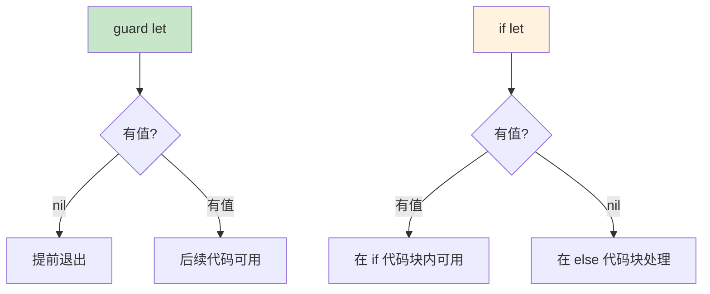

# 第18课：guard 语句详解

## 📖 学习目标
- 深入理解 guard 语句的用途
- 掌握 guard let 和 guard 的使用
- 理解 guard 与 if let 的区别
- 学会在实际场景中使用 guard
- 掌握 guard 在循环和闭包中的用法
- 了解 guard 的常见错误并学会避免

---

## 什么是 guard 语句？

**guard 语句是什么？可以这样理解：guard 就是一个"守门员"，它检查条件是否满足，不满足就直接拒绝。**

### 生活类比：门禁系统

想象你去公司上班：
- **guard**：门口的保安检查你的工牌
  - 有工牌 → 进去上班
  - 没工牌 → 直接回家，不用进去了
- **if let**：进入办公室后再检查
  - 有工牌 → 在办公室工作
  - 没工牌 → 在办公室里想办法

**guard 的特点：条件不满足就提前退出，不会继续执行后面的代码。**

### 为什么需要 guard？

在 Swift 之前，程序员经常写出这样的"金字塔噩梦"代码：

```swift
// ❌ 嵌套地狱：代码向右不断缩进，难以阅读
func doSomething(data: String?) {
    if let data = data {
        if !data.isEmpty {
            if data.count > 5 {
                if data.hasPrefix("A") {
                    // 终于到了核心逻辑，但已经缩进了5层！
                    print("处理数据：\(data)")
                } else {
                    print("前缀不对")
                }
            } else {
                print("太短了")
            }
        } else {
            print("空的")
        }
    } else {
        print("nil")
    }
}
```

guard 语句的出现就是为了解决这个问题。用 guard 重写后：

```swift
// ✅ 扁平化：代码从左到右排列，逻辑清晰
func doSomething(data: String?) {
    guard let data = data else {
        print("nil")
        return
    }
    guard !data.isEmpty else {
        print("空的")
        return
    }
    guard data.count > 5 else {
        print("太短了")
        return
    }
    guard data.hasPrefix("A") else {
        print("前缀不对")
        return
    }
    // 核心逻辑在最外层，零缩进！
    print("处理数据：\(data)")
}
```

---

## guard 的基本语法

```swift
guard 条件 else {
    // 条件不满足时执行
    // 必须退出：return, break, continue, throw
    return
}
// 条件满足时继续执行
```

### 语法要点

1. **guard 关键字**后面跟一个布尔表达式
2. **else 块**是必须的，不能省略
3. **else 块必须退出**当前作用域，使用以下关键字之一：
   - `return` — 从函数或闭包返回
   - `break` — 跳出循环
   - `continue` — 继续下一次循环
   - `throw` — 抛出错误
4. guard 解包的变量在**后续代码中可用**（这是和 if let 的关键区别）

### 示例

```swift
func greet(name: String?) {
    guard let name = name else {
        print("名字为空")
        return  // 提前退出
    }
    // 这里 name 已经解包，可以直接使用
    print("你好，\(name)！")
}

greet(name: "小明")  // 你好，小明！
greet(name: nil)     // 名字为空
```

### guard 不解包只检查条件

guard 不仅可以解包可选类型，也可以只检查布尔条件：

```swift
func checkAge(_ age: Int?) {
    // guard let 解包
    guard let age = age else {
        print("年龄为空")
        return
    }

    // guard 直接检查布尔条件（不解包）
    guard age >= 18 else {
        print("未成年，禁止入内")
        return
    }

    print("欢迎，你已经 \(age) 岁了")
}

checkAge(25)   // 欢迎，你已经 25 岁了
checkAge(15)   // 未成年，禁止入内
checkAge(nil)  // 年龄为空
```

---

## guard let vs if let

### 核心区别



### 代码对比

```swift
// 使用 if let
func processUser1(user: String?) {
    if let user = user {
        // 只有在这个代码块内 user 才可用
        print("用户：\(user)")
        // ... 更多代码
        // ... 更多代码
    } else {
        print("用户为空")
        return
    }
    // 这里 user 不可用！
}

// 使用 guard let
func processUser2(user: String?) {
    guard let user = user else {
        print("用户为空")
        return
    }
    // 这里 user 可用！
    print("用户：\(user)")
    // ... 更多代码
    // ... 更多代码
    // 全部代码都能使用 user
}
```

### 选择建议

| 场景 | 推荐使用 | 原因 |
|------|----------|------|
| 需要提前退出 | `guard let` | 代码更清晰 |
| 条件不满足要处理 | `if let` | 可以在 else 中处理 |
| 多个条件都要满足 | `guard let` | 避免嵌套 |
| 只在特定情况使用 | `if let` | 更灵活 |

### guard vs if let 详细对比表

下表从多个维度全面对比 `guard let` 和 `if let`，帮助你在实际开发中做出正确的选择。

| 对比维度 | `guard let` | `if let` |
|----------|-------------|----------|
| **基本语法** | `guard let x = opt else { return }` | `if let x = opt { ... }` |
| **解包变量的作用域** | guard 语句之后的所有代码 | 仅在 if 的花括号内部 |
| **条件不满足时** | 必须退出（return/break/continue/throw） | 进入 else 分支（可选） |
| **else 分支** | 必须有，且必须包含退出语句 | 可选，没有也能编译 |
| **代码风格** | 扁平化，先排除异常情况 | 嵌套式，先处理正常情况 |
| **适用场景** | 函数开头的参数校验 | 条件性的代码块执行 |
| **多个可选值解包** | 多个 guard 语句，每个独立检查 | 多个 if let 用逗号连接 |
| **代码可读性** | 减少嵌套，逻辑线性 | 适合短小的条件判断 |
| **在循环中** | 配合 continue/break 使用 | 配合整个循环体使用 |
| **典型用法** | "卫语句"模式，先排除不可能 | "条件绑定"模式，先确认可能 |
| **嵌套层数** | 始终保持 0 层嵌套 | 每多一个 if let 增加一层 |
| **错误信息位置** | 每个 guard 的 else 块中 | else 块或 if 块之后 |

### 如何选择？决策流程图

```
你需要检查一个可选值吗？
    │
    ├── 是 → 这个值在后续代码中都需要使用吗？
    │           │
    │           ├── 是 → 用 guard let（解包后的变量在后续代码中可用）
    │           │
    │           └── 否 → 只在一小段代码中使用？
    │                       │
    │                       ├── 是 → 用 if let（在 if 块内使用）
    │                       │
    │                       └── 否 → 用 guard let（更安全，不会忘记处理）
    │
    └── 否 → 检查的是布尔条件？
                │
                ├── 是 → 条件不满足需要退出？→ 用 guard
                │
                └── 否 → 条件满足才执行？→ 用 if
```

---

## guard 的实际应用

### 应用1：输入验证

```swift
func register(username: String?, password: String?, email: String?) {
    guard let username = username, !username.isEmpty else {
        print("用户名不能为空")
        return
    }

    guard let password = password, password.count >= 6 else {
        print("密码长度不能少于6位")
        return
    }

    guard let email = email, email.contains("@") else {
        print("邮箱格式不正确")
        return
    }

    // 所有条件都满足，执行注册
    print("注册成功：\(username), \(email)")
}

register(username: "张三", password: "123456", email: "zhangsan@example.com")
// 输出：注册成功：张三, zhangsan@example.com

register(username: nil, password: "123456", email: "test@example.com")
// 输出：用户名不能为空
```

### 应用2：网络请求

```swift
func fetchData(from urlString: String?) {
    guard let urlString = urlString else {
        print("URL 为空")
        return
    }

    guard let url = URL(string: urlString) else {
        print("URL 格式不正确")
        return
    }

    guard url.scheme == "https" else {
        print("只支持 HTTPS")
        return
    }

    // 所有检查通过，开始网络请求
    print("开始请求：\(url)")
}
```

### 应用3：数组操作

```swift
func getFirstElement(of array: [Int]?) -> Int? {
    guard let array = array, !array.isEmpty else {
        print("数组为空")
        return nil
    }

    return array.first
}

let numbers = [1, 2, 3]
print(getFirstElement(of: numbers) ?? 0)  // 1
print(getFirstElement(of: []) ?? 0)       // 数组为空, 0
print(getFirstElement(of: nil) ?? 0)       // 数组为空, 0
```

---

## guard 与多个条件

```swift
func processOrder(quantity: Int?, price: Double?, discount: Double?) {
    guard let quantity = quantity, quantity > 0 else {
        print("数量必须大于0")
        return
    }

    guard let price = price, price > 0 else {
        print("价格必须大于0")
        return
    }

    guard let discount = discount, discount >= 0 && discount <= 1 else {
        print("折扣必须在0到1之间")
        return
    }

    let total = Double(quantity) * price * discount
    print("订单总价：\(total)")
}

processOrder(quantity: 5, price: 100, discount: 0.8)
// 输出：订单总价：400.0

processOrder(quantity: 0, price: 100, discount: 0.8)
// 输出：数量必须大于0
```

---

## guard 与 where 子句

在循环中，guard 可以配合 `where` 子句使用，实现更精细的条件过滤。`where` 子句让 guard 在解包的同时添加额外的约束条件。

### 基本用法

```swift
let numbers: [Int?] = [1, nil, 3, nil, 5, nil, 7, 8, 10, 12]

// 只处理偶数且非 nil 的元素
for number in numbers {
    // guard let + where 同时解包并检查条件
    guard let number = number, number % 2 == 0 else {
        continue  // 跳过 nil 和奇数
    }
    print("偶数：\(number)")
}
// 输出：
// 偶数：8
// 偶数：10
// 偶数：12
```

### 用 where 过滤字符串

```swift
let names: [String?] = ["Alice", nil, "Bob", "", "Charlie", "  ", "David"]

for name in names {
    // 解包 + 检查非空 + 检查长度
    guard let name = name, !name.trimmingCharacters(in: .whitespaces).isEmpty,
          name.count >= 3 else {
        continue
    }
    print("有效名字：\(name)")
}
// 输出：
// 有效名字：Alice
// 有效名字：Charlie
// 有效名字：David
```

### 用 where 处理字典

```swift
let scores: [String: Int?] = [
    "张三": 85,
    "李四": nil,
    "王五": 42,
    "赵六": 91,
    "钱七": nil
]

for (name, score) in scores {
    guard let score = score, score >= 60 else {
        continue  // 跳过 nil 和不及格的
    }
    print("\(name) 及格了，分数：\(score)")
}
// 输出（顺序可能不同）：
// 张三 及格了，分数：85
// 赵六 及格了，分数：91
```

### guard + where 的多条件过滤

```swift
struct Product {
    let name: String
    let price: Double?
    let inStock: Bool
}

let products = [
    Product(name: "手机", price: 2999, inStock: true),
    Product(name: "耳机", price: nil, inStock: true),       // 没有价格
    Product(name: "平板", price: 3999, inStock: false),     // 缺货
    Product(name: "充电器", price: 49, inStock: true),
    Product(name: "数据线", price: 19, inStock: true),
]

// 筛选：有价格、在售、且价格低于100的商品
for product in products {
    guard let price = product.price, product.inStock, price < 100 else {
        continue
    }
    print("促销商品：\(product.name)，价格：¥\(price)")
}
// 输出：
// 促销商品：充电器，价格：¥49
// 促销商品：数据线，价格：¥19
```

---

## guard 在闭包中的使用

闭包中使用 guard 时，退出语句必须用 `return`，而不是 `break` 或 `continue`。这是闭包和循环的一个重要区别。

### 闭包中的 guard 用 return

```swift
// 在闭包中，guard 的 else 块必须用 return
let processName: (String?) -> String = { name in
    guard let name = name, !name.isEmpty else {
        return "未知用户"  // 从闭包返回，不是从函数返回
    }
    return "你好，\(name)"
}

print(processName("小明"))  // 你好，小明
print(processName(nil))     // 未知用户
print(processName(""))      // 未知用户
```

### 闭包中 guard 与 break/continue 的区别

```swift
// ❌ 错误：闭包中不能使用 break 和 continue
let numbers = [1, 2, 3, 4, 5]
let result = numbers.map { number -> String in
    guard number % 2 == 0 else {
        // break  // ❌ 编译错误！闭包中不能用 break
        // continue  // ❌ 编译错误！闭包中不能用 continue
        return "奇数"  // ✅ 闭包中只能用 return
    }
    return "偶数\(number)"
}
print(result)  // ["奇数", "偶数2", "奇数", "偶数4", "奇数"]
```

### 在 map/filter/reduce 中使用 guard

```swift
// 使用 guard 在 map 中安全处理可选值
let optionalNames: [String?] = ["Alice", nil, "Bob", "", "Charlie", nil]

// 将可选名字转换为问候语，nil 和空字符串变成默认问候
let greetings = optionalNames.map { name -> String in
    guard let name = name, !name.isEmpty else {
        return "你好，陌生人"
    }
    return "你好，\(name)"
}
print(greetings)
// ["你好，Alice", "你好，陌生人", "你好，Bob", "你好，陌生人", "你好，Charlie", "你好，陌生人"]

// 使用 guard 在 filter 中过滤
let scores: [Int?] = [85, nil, 42, 91, nil, 76, 55, 100]
let passingScores = scores.filter { score in
    guard let score = score, score >= 60 else {
        return false  // 过滤掉 nil 和不及格的
    }
    return true
}
print(passingScores)  // [Optional(85), Optional(91), Optional(76), Optional(100)]
```

### 逃逸闭包中的 guard

```swift
// 逃逸闭包中也可以使用 guard
func performTask(completion: @escaping (Result<String, Error>) -> Void) {
    let data: String? = "处理结果"

    // 模拟异步操作
    DispatchQueue.main.async {
        guard let data = data else {
            // 逃逸闭包中用 return 退出闭包
            completion(.failure(NSError(domain: "Error", code: -1)))
            return
        }
        completion(.success(data))
    }
}
```

---

## guard 与 early return 模式

"提前返回"（Early Return）是一种重要的编程设计模式，guard 语句是实现这种模式的最佳工具。

### 什么是 Early Return？

Early Return 的核心思想是：**在函数开头就把所有异常情况处理掉，尽早退出，让正常逻辑留在函数末尾。**

对比两种代码风格：

```swift
// ❌ 风格1：嵌套式（Deep Nesting）
// 正常逻辑在最深层，需要一直读到最里面才知道函数做什么
func process(_ input: String?) -> String? {
    if let input = input {
        if !input.isEmpty {
            if input.count >= 3 {
                if input.hasPrefix("OK") {
                    // 核心逻辑终于在这里
                    return "已处理: \(input)"
                } else {
                    return nil
                }
            } else {
                return nil
            }
        } else {
            return nil
        }
    } else {
        return nil
    }
}

// ✅ 风格2：Early Return（提前返回）
// 正常逻辑在函数最外层，一眼就能看到核心功能
func process(_ input: String?) -> String? {
    guard let input = input else { return nil }
    guard !input.isEmpty else { return nil }
    guard input.count >= 3 else { return nil }
    guard input.hasPrefix("OK") else { return nil }

    // 核心逻辑在最外层，零嵌套
    return "已处理: \(input)"
}
```

### Early Return 的优势

```swift
// 1. 代码可读性更高：正常路径一目了然
func calculateDiscount(total: Double, isVIP: Bool, couponCode: String?) -> Double {
    // 先排除所有无效情况
    guard total > 0 else { return 0 }
    guard isVIP else { return 0 }

    // 处理优惠券逻辑
    if let coupon = couponCode, coupon == "SAVE20" {
        return total * 0.2  // VIP + 优惠券，打8折
    }
    return total * 0.1  // VIP 无优惠券，打9折
}

// 2. 减少认知负担：每个 guard 独立处理一种错误
func connectToServer(host: String?, port: Int?) -> Bool {
    guard let host = host, !host.isEmpty else {
        print("错误：主机名为空")
        return false  // 读到这里就知道：主机名为空就退出
    }
    guard let port = port, port > 0, port <= 65535 else {
        print("错误：端口号无效")
        return false  // 读到这里就知道：端口无效就退出
    }
    // 到这里可以确信：host 和 port 都是有效的
    print("连接到 \(host):\(port)")
    return true
}

// 3. 容易添加新的验证条件
// 如果需要新增一个检查，只需要加一个 guard，不需要改变缩进
func saveFile(name: String?, content: String?, maxSize: Int) -> Bool {
    guard let name = name, !name.isEmpty else { return false }
    guard let content = content else { return false }
    guard content.count <= maxSize else { return false }
    // 如果将来需要新增检查，直接在这里加一个 guard
    // guard name.hasSuffix(".txt") else { return false }
    print("保存文件：\(name)")
    return true
}
```

### Early Return 在实际项目中的应用

```swift
// 一个典型的服务端请求处理函数
struct Request {
    let method: String?
    let path: String?
    let headers: [String: String]?
    let body: Data?
}

struct Response {
    let statusCode: Int
    let message: String
}

func handleRequest(_ request: Request) -> Response {
    // 用 guard 逐个检查请求的各个部分
    guard let method = request.method else {
        return Response(statusCode: 400, message: "缺少请求方法")
    }

    guard method == "GET" || method == "POST" else {
        return Response(statusCode: 405, message: "不支持的方法: \(method)")
    }

    guard let path = request.path, !path.isEmpty else {
        return Response(statusCode: 400, message: "缺少请求路径")
    }

    guard path.hasPrefix("/api/") else {
        return Response(statusCode: 404, message: "路径不存在: \(path)")
    }

    // 所有验证通过，处理业务逻辑
    return Response(statusCode: 200, message: "请求成功: \(method) \(path)")
}
```

---

## 常见错误与陷阱

### 错误1：忘记 guard 的 else 块必须退出

这是初学者最常犯的错误。guard 的 else 块必须包含退出语句（return、break、continue 或 throw），否则编译器会报错。

```swift
// ❌ 编译错误：guard body may not fall through
func check(value: Int?) {
    guard let value = value else {
        print("值为空")
        // 忘记写 return！编译器会报错
    }
    print("值为：\(value)")
}

// ✅ 正确写法
func check(value: Int?) {
    guard let value = value else {
        print("值为空")
        return  // 必须有退出语句
    }
    print("值为：\(value)")
}
```

```swift
// 在循环中用 continue
for i in 0..<10 {
    guard i % 2 == 0 else {
        continue  // 跳过奇数
    }
    print(i)
}

// 在循环中用 break
for i in 0..<100 {
    guard i < 5 else {
        break  // 到 5 就停止
    }
    print(i)
}
```

### 错误2：该用 if let 时却用了 guard

并非所有场景都适合用 guard。当可选值只在一小段代码中使用时，if let 更合适。

```swift
// ❌ 不太合适：name 只在一行中使用，却用了 guard
func printGreeting(name: String?) {
    guard let name = name else {
        return  // 这里 return 了，但其实没有 name 也可以做别的事情
    }
    // 只用了一次 name
    print("你好，\(name)")
    // 后面的代码与 name 无关，但因为 guard 导致 nil 时全部跳过了
}

// ✅ 更合适：用 if let
func printGreeting(name: String?) {
    if let name = name {
        print("你好，\(name)")
    } else {
        print("你好，陌生人")
    }
    // 后面的代码无论 name 是否为 nil 都会执行
}
```

```swift
// ✅ guard 适合的场景：name 在后续大量代码中都需要用到
func processUser(name: String?, age: Int?) {
    guard let name = name, let age = age else {
        print("信息不完整")
        return
    }

    // name 和 age 在下面大量代码中都被使用
    print("姓名：\(name)")
    print("年龄：\(age)")
    print("\(name) 今年 \(age) 岁")
    if age >= 18 {
        print("\(name) 已成年")
    } else {
        print("\(name) 未成年")
    }
}
```

### 错误3：过度嵌套 guard 语句

虽然 guard 的目的就是减少嵌套，但过多的 guard 也会让代码变得冗长。当有很多相关检查时，可以考虑合并。

```swift
// ❌ 不好：太多独立的 guard，代码冗长
func createUser(username: String?, password: String?, email: String?,
                phone: String?, address: String?) {
    guard let username = username else { return }
    guard !username.isEmpty else { return }
    guard username.count >= 3 else { return }
    guard let password = password else { return }
    guard !password.isEmpty else { return }
    guard password.count >= 6 else { return }
    guard let email = email else { return }
    guard email.contains("@") else { return }
    // ... 继续写下去

    print("用户创建成功")
}

// ✅ 好：合理合并相关条件
func createUser(username: String?, password: String?, email: String?) {
    // 将相关的解包和条件检查合并到一个 guard 中
    guard let username = username, !username.isEmpty, username.count >= 3 else {
        print("用户名无效（不能为空且长度>=3）")
        return
    }

    guard let password = password, !password.isEmpty, password.count >= 6 else {
        print("密码无效（不能为空且长度>=6）")
        return
    }

    guard let email = email, email.contains("@") else {
        print("邮箱格式不正确")
        return
    }

    print("用户创建成功：\(username)")
}
```

### 错误4：在 guard let 中重复使用相同变量名

```swift
// ⚠️ 容易困惑：变量名遮蔽（shadowing）
func process(value: Int?) {
    // 这里的 value 是 Int?
    guard let value = value else {
        // 这里的 value 还是 Int?（原始值）
        return
    }
    // 这里的 value 是 Int（解包后的值）
    print(value)
}

// 虽然 Swift 允许这样做，但要注意：
// - guard let value = value 中，等号右边的 value 是原始的 Int?
// - 等号左边的 value 是解包后的 Int
// - 编译器通过上下文能区分，但阅读代码时要注意
```

### 错误5：guard 中使用复杂表达式导致可读性差

```swift
// ❌ 不好：一个 guard 里塞了太多条件
guard let user = user, let token = token,
      !user.name.isEmpty, user.age >= 18,
      token.count > 10, token.hasPrefix("Bearer"),
      user.email.contains("@") else {
    return
}

// ✅ 好：拆分成多个 guard，每个 guard 的意图清晰
guard let user = user else { return }
guard let token = token else { return }
guard !user.name.isEmpty, user.age >= 18 else {
    print("用户信息无效")
    return
}
guard token.hasPrefix("Bearer"), token.count > 10 else {
    print("Token 格式错误")
    return
}
```

---

## guard 的最佳实践

### 1. 保持扁平化

```swift
// ❌ 不好：嵌套太深
func processUser1(user: String?) {
    if let user = user {
        if !user.isEmpty {
            if user.count >= 3 {
                print("用户有效：\(user)")
            } else {
                print("用户名太短")
            }
        } else {
            print("用户名为空")
        }
    } else {
        print("用户为 nil")
    }
}

// ✅ 好：使用 guard 扁平化
func processUser2(user: String?) {
    guard let user = user else {
        print("用户为 nil")
        return
    }

    guard !user.isEmpty else {
        print("用户名为空")
        return
    }

    guard user.count >= 3 else {
        print("用户名太短")
        return
    }

    print("用户有效：\(user)")
}
```

### 2. 提供有用的错误信息

```swift
func divide(_ a: Int?, by b: Int?) -> Int? {
    guard let a = a else {
        print("被除数为空")
        return nil
    }

    guard let b = b else {
        print("除数为空")
        return nil
    }

    guard b != 0 else {
        print("除数不能为0")
        return nil
    }

    return a / b
}
```

### 3. 在循环中使用 guard

```swift
let numbers = [1, nil, 3, nil, 5, nil, 7]

for number in numbers {
    guard let number = number else {
        continue  // 跳过 nil
    }
    print("数字：\(number)")
}
// 输出：
// 数字：1
// 数字：3
// 数字：5
// 数字：7
```

---

## 实战应用

### 实战1：API 响应验证

在实际开发中，从服务器获取的数据往往是可选类型，使用 guard 可以优雅地进行层层验证。

```swift
// 模拟 API 返回的 JSON 数据
struct APIResponse {
    let statusCode: Int?
    let message: String?
    let data: [String: Any]?
}

func handleAPIResponse(_ response: APIResponse) {
    // 第一步：检查状态码
    guard let statusCode = response.statusCode else {
        print("错误：未收到状态码")
        return
    }

    // 第二步：检查状态码是否表示成功
    guard statusCode == 200 else {
        print("请求失败，状态码：\(statusCode)")

        // 如果有错误信息，打印出来
        if let message = response.message {
            print("错误信息：\(message)")
        }
        return
    }

    // 第三步：检查是否有数据
    guard let data = response.data else {
        print("错误：响应数据为空")
        return
    }

    // 第四步：从数据中提取具体字段
    guard let userName = data["username"] as? String else {
        print("错误：缺少用户名字段")
        return
    }

    guard let userId = data["id"] as? Int else {
        print("错误：缺少用户ID字段")
        return
    }

    // 所有验证通过，处理数据
    print("获取用户成功：\(userName) (ID: \(userId))")
}

// 测试用例
let successResponse = APIResponse(
    statusCode: 200,
    message: "OK",
    data: ["username": "张三", "id": 12345]
)
handleAPIResponse(successResponse)
// 输出：获取用户成功：张三 (ID: 12345)

let failResponse = APIResponse(
    statusCode: 404,
    message: "用户不存在",
    data: nil
)
handleAPIResponse(failResponse)
// 输出：请求失败，状态码：404
// 输出：错误信息：用户不存在
```

### 实战2：表单多字段验证

用户注册、登录等场景需要验证多个字段，guard 非常适合这种"逐步验证"的模式。

```swift
struct RegistrationForm {
    let username: String?
    let password: String?
    let confirmPassword: String?
    let email: String?
    let age: Int?
}

enum ValidationError: Error {
    case emptyUsername
    case shortUsername
    case emptyPassword
    case shortPassword
    case passwordMismatch
    case invalidEmail
    case invalidAge
}

func validateForm(_ form: RegistrationForm) throws -> String {
    // 验证用户名
    guard let username = form.username, !username.isEmpty else {
        throw ValidationError.emptyUsername
    }
    guard username.count >= 3 else {
        throw ValidationError.shortUsername
    }

    // 验证密码
    guard let password = form.password, !password.isEmpty else {
        throw ValidationError.emptyPassword
    }
    guard password.count >= 8 else {
        throw ValidationError.shortPassword
    }

    // 验证确认密码
    guard let confirmPwd = form.confirmPassword, confirmPwd == password else {
        throw ValidationError.passwordMismatch
    }

    // 验证邮箱
    guard let email = form.email,
          email.contains("@"), email.contains(".") else {
        throw ValidationError.invalidEmail
    }

    // 验证年龄
    guard let age = form.age, age >= 18, age <= 120 else {
        throw ValidationError.invalidAge
    }

    // 所有验证通过
    return "注册成功！欢迎 \(username)，邮箱：\(email)"
}

// 测试
let validForm = RegistrationForm(
    username: "zhangsan",
    password: "secure123",
    confirmPassword: "secure123",
    email: "zhangsan@example.com",
    age: 25
)

do {
    let result = try validateForm(validForm)
    print(result)  // 注册成功！欢迎 zhangsan，邮箱：zhangsan@example.com
} catch {
    print("验证失败：\(error)")
}

let invalidForm = RegistrationForm(
    username: "ab",
    password: "123",
    confirmPassword: "456",
    email: "invalid",
    age: 15
)

do {
    let result = try validateForm(invalidForm)
    print(result)
} catch {
    print("验证失败：\(error)")  // 验证失败：shortUsername
}
```

### 实战3：文件处理与错误处理

```swift
enum FileError: Error {
    case fileNotFound
    case unreadable
    case emptyFile
    case invalidFormat
    case lineTooLong(Int)
}

struct TextFile {
    let name: String?
    let content: String?
    let encoding: String?
}

func processTextFile(_ file: TextFile) throws -> [String] {
    // 检查文件名
    guard let name = file.name, !name.isEmpty else {
        throw FileError.fileNotFound
    }

    // 检查文件内容
    guard let content = file.content else {
        throw FileError.unreadable
    }

    guard !content.isEmpty else {
        throw FileError.emptyFile
    }

    // 检查编码格式
    guard let encoding = file.encoding,
          (encoding == "UTF-8" || encoding == "ASCII") else {
        throw FileError.invalidFormat
    }

    // 按行分割，同时验证每一行
    let lines = content.components(separatedBy: "\n")
    var validLines: [String] = []

    for (index, line) in lines.enumerated() {
        // 在循环中使用 guard + throw
        guard line.count <= 1000 else {
            throw FileError.lineTooLong(index + 1)
        }

        guard !line.trimmingCharacters(in: .whitespaces).isEmpty else {
            continue  // 跳过空行
        }

        validLines.append(line)
    }

    guard !validLines.isEmpty else {
        throw FileError.emptyFile
    }

    print("文件 \(name) 处理完成，共 \(validLines.count) 行")
    return validLines
}

// 测试
let goodFile = TextFile(name: "data.txt", content: "第一行\n第二行\n第三行", encoding: "UTF-8")
do {
    let lines = try processTextFile(goodFile)
    print("读取到 \(lines.count) 行")
} catch {
    print("处理失败：\(error)")
}

let badFile = TextFile(name: nil, content: "内容", encoding: "UTF-8")
do {
    let lines = try processTextFile(badFile)
    print("读取到 \(lines.count) 行")
} catch {
    print("处理失败：\(error)")  // 处理失败：fileNotFound
}
```

---

## 📝 练习题

### 练习1：基础 guard
编写一个函数，使用 guard 检查年龄是否有效（大于0且小于150）。

```swift
// 在这里写你的代码

```

### 练习2：多个条件
编写一个函数，使用 guard 检查用户名、密码和邮箱是否有效。

```swift
// 在这里写你的代码

```

### 练习3：数组操作
编写一个函数，使用 guard 安全地获取数组中指定索引的元素。

```swift
// 在这里写你的代码

```

### 练习4：实际应用
编写一个登录函数，使用 guard 进行输入验证，然后验证用户名和密码是否匹配。

```swift
// 在这里写你的代码

```

### 练习5：循环中的 guard 与 where
编写一个函数，接收一个 `[Int?]` 数组，使用 guard 和 for-in 循环：
1. 跳过所有 nil 值
2. 跳过所有负数
3. 只打印 10 到 100 之间的数字
4. 最后返回符合条件的数字之和

```swift
// 在这里写你的代码

```

### 练习6：guard 与错误处理
编写一个函数 `parseAge(from string: String?)`，要求：
1. 使用 guard 检查字符串不为 nil 且不为空
2. 使用 guard 将字符串转换为整数（使用 `Int()`）
3. 使用 guard 检查年龄在 0 到 150 之间
4. 使用 `throw` 抛出不同的错误（定义一个 `AgeError` 枚举）
5. 成功时返回年龄值

```swift
// 在这里写你的代码

```

---

## ✅ 练习题参考答案

> 💡 **提示：** 建议先独立完成练习，再查看答案

---

### 练习1

```swift
// 思路：用三个 guard 分别检查 nil、下限、上限
func validateAge(_ age: Int?) -> Bool {
    // 第一步：解包可选值，确保 age 不为 nil
    guard let age = age else {
        print("年龄为空")
        return false  // guard 的 else 必须退出，这里用 return
    }

    // 第二步：检查年龄下限
    guard age > 0 else {
        print("年龄必须大于0")
        return false
    }

    // 第三步：检查年龄上限
    // 到这里 age 一定是 Int 类型，可以直接使用
    guard age < 150 else {
        print("年龄不能超过150")
        return false
    }

    // 所有检查通过，age 一定是 (0, 150) 范围内的整数
    print("年龄有效：\(age)")
    return true
}

// 测试
validateAge(25)    // 年龄有效：25
validateAge(-5)    // 年龄必须大于0
validateAge(200)   // 年龄不能超过150
validateAge(nil)   // 年龄为空
```

### 练习2

```swift
// 思路：每个字段一个 guard，提供明确的错误信息
func validateUser(username: String?, password: String?, email: String?) -> Bool {
    // 检查用户名：先解包，再检查非空
    guard let username = username, !username.isEmpty else {
        print("用户名不能为空")
        return false
    }

    // 检查用户名长度：上一步已经解包了，这里可以直接用
    guard username.count >= 3 else {
        print("用户名长度不能少于3位")
        return false
    }

    // 检查密码：解包 + 非空
    guard let password = password, !password.isEmpty else {
        print("密码不能为空")
        return false
    }

    // 检查密码强度
    guard password.count >= 6 else {
        print("密码长度不能少于6位")
        return false
    }

    // 检查邮箱：解包 + 包含 @ 符号
    guard let email = email, email.contains("@") else {
        print("邮箱格式不正确")
        return false
    }

    // 所有字段都验证通过
    print("验证通过")
    return true
}

// 测试
validateUser(username: "zhangsan", password: "123456", email: "test@example.com")  // 验证通过
validateUser(username: "ab", password: "123456", email: "test@example.com")       // 用户名长度不能少于3位
validateUser(username: nil, password: "123456", email: "test@example.com")        // 用户名不能为空
```

### 练习3

```swift
// 思路：先检查数组，再检查索引范围
func getElement(at index: Int, from array: [Int]?) -> Int? {
    // 第一步：确保数组不为 nil
    guard let array = array else {
        print("数组为空")
        return nil
    }

    // 第二步：索引不能为负数
    guard index >= 0 else {
        print("索引不能为负数")
        return nil
    }

    // 第三步：索引不能超出数组范围
    // 到这里 array 一定是 [Int]，可以直接用 array.count
    guard index < array.count else {
        print("索引超出范围，数组长度为 \(array.count)")
        return nil
    }

    // 所有检查通过，安全地返回元素
    return array[index]
}

let numbers = [10, 20, 30, 40, 50]
print(getElement(at: 2, from: numbers) ?? 0)   // 30
print(getElement(at: 10, from: numbers) ?? 0)   // 索引超出范围，数组长度为 5, 0
print(getElement(at: -1, from: numbers) ?? 0)   // 索引不能为负数, 0
print(getElement(at: 0, from: nil) ?? 0)        // 数组为空, 0
```

### 练习4

```swift
// 思路：先用 guard 验证输入，再用 guard 检查用户存在性和密码正确性
let validUsers = ["张三": "123456", "李四": "abcdef"]

func login(username: String?, password: String?) {
    // 第一步：验证用户名输入
    guard let username = username, !username.isEmpty else {
        print("用户名不能为空")
        return
    }

    // 第二步：验证密码输入
    guard let password = password, !password.isEmpty else {
        print("密码不能为空")
        return
    }

    // 第三步：检查用户是否存在（字典查找返回可选值）
    guard let storedPassword = validUsers[username] else {
        print("用户不存在")
        return
    }

    // 第四步：验证密码是否匹配
    guard storedPassword == password else {
        print("密码错误")
        return
    }

    // 所有验证通过
    print("登录成功，欢迎 \(username)")
}

// 测试各种情况
login(username: "张三", password: "123456")  // 登录成功，欢迎 张三
login(username: "张三", password: "wrong")  // 密码错误
login(username: "王五", password: "123456") // 用户不存在
login(username: nil, password: "123456")    // 用户名不能为空
login(username: "张三", password: nil)      // 密码不能为空
```

### 练习5

```swift
// 思路：在循环中使用 guard 跳过不满足条件的元素
// guard 的 else 块在循环中使用 continue
func sumValidNumbers(in numbers: [Int?]) -> Int {
    var sum = 0

    for number in numbers {
        // 跳过 nil 值
        guard let number = number else {
            continue  // 循环中用 continue 跳过当前迭代
        }

        // 跳过负数
        guard number >= 0 else {
            continue
        }

        // 只保留 10 到 100 之间的数字
        guard number >= 10, number <= 100 else {
            continue
        }

        // 所有条件满足，累加并打印
        print("有效数字：\(number)")
        sum += number
    }

    return sum
}

// 测试
let testNumbers: [Int?] = [5, 15, nil, -3, 50, 200, nil, 80, 0, 100, 10, -1, 7]
let result = sumValidNumbers(in: testNumbers)
print("符合条件的数字之和：\(result)")
// 输出：
// 有效数字：15
// 有效数字：50
// 有效数字：80
// 有效数字：100
// 有效数字：10
// 符合条件的数字之和：255
```

### 练习6

```swift
// 思路：定义错误枚举，用 guard + throw 逐层验证

// 第一步：定义错误类型
enum AgeError: Error {
    case nilInput              // 输入为 nil
    case emptyInput            // 输入为空字符串
    case notANumber(String)    // 不是有效数字（附带原始字符串）
    case outOfRange(Int)       // 超出范围（附带解析出的值）
}

// 第二步：编写解析函数
func parseAge(from string: String?) throws -> Int {
    // guard 1：检查输入不为 nil
    guard let string = string else {
        throw AgeError.nilInput  // guard + throw：抛出错误而不是 return
    }

    // guard 2：检查字符串不为空
    guard !string.isEmpty else {
        throw AgeError.emptyInput
    }

    // guard 3：尝试将字符串转换为整数
    guard let age = Int(string) else {
        throw AgeError.notANumber(string)  // 附带原始输入，方便调试
    }

    // guard 4：检查年龄范围
    guard age >= 0, age <= 150 else {
        throw AgeError.outOfRange(age)  // 附带解析出的值
    }

    // 所有验证通过，返回年龄
    return age
}

// 第三步：测试各种情况
let testInputs: [String?] = ["25", "-5", "200", "abc", "", nil, "0", "150"]

for input in testInputs {
    do {
        let age = try parseAge(from: input)
        print("'\(input ?? "nil")' → 年龄：\(age)")
    } catch AgeError.nilInput {
        print("'\(input ?? "nil")' → 错误：输入为 nil")
    } catch AgeError.emptyInput {
        print("'\(input ?? "nil")' → 错误：输入为空字符串")
    } catch AgeError.notANumber(let str) {
        print("'\(str)' → 错误：不是有效数字")
    } catch AgeError.outOfRange(let val) {
        print("'\(input ?? "nil")' → 错误：年龄 \(val) 超出范围")
    } catch {
        print("'\(input ?? "nil")' → 未知错误：\(error)")
    }
}

// 输出：
// '25' → 年龄：25
// '-5' → 错误：年龄 -5 超出范围
// '200' → 错误：年龄 200 超出范围
// 'abc' → 错误：不是有效数字
// '' → 错误：输入为空字符串
// 'nil' → 错误：输入为 nil
// '0' → 年龄：0
// '150' → 年龄：150
```

---

## 🎯 小结

| 概念 | 说明 |
|------|------|
| `guard` | 守门员，条件不满足就提前退出 |
| `guard let` | 安全解包，条件不满足就退出 |
| `guard` vs `if let` | guard 用于提前退出，if let 用于条件执行 |
| `guard` + `where` | 在循环中同时解包和过滤 |
| `guard` 在闭包中 | 用 return 退出闭包，不能用 break/continue |
| Early Return | 先处理异常，核心逻辑留在最后 |

### guard vs if let 快速对照

| 维度 | guard let | if let |
|------|-----------|--------|
| 解包变量作用域 | 后续所有代码 | 仅 if 块内 |
| else 分支 | 必须有，必须退出 | 可选 |
| 代码风格 | 扁平化 | 嵌套式 |
| 最佳场景 | 函数开头参数校验 | 条件性代码块 |

**最佳实践：**
- ✅ 使用 guard 保持代码扁平化
- ✅ 提供有用的错误信息
- ✅ 多个条件用 guard 更清晰
- ✅ 在循环中配合 continue/break 使用
- ✅ 在闭包中配合 return 使用
- ❌ 避免在 guard 的 else 中写复杂逻辑
- ❌ 避免当 if let 更合适时强行使用 guard
- ❌ 避免一个 guard 中塞太多条件

**记忆口诀：**
> - **guard = 守门员**：检查条件，不满足就拒绝
> - **if let = 条件判断**：满足条件才执行
> - **guard + 循环 = 过滤器**：跳过不需要的元素
> - **guard + 闭包 = 快速返回**：不满足条件就返回默认值

---

**上一课：[第17课：类型转换和类型检查](第17课：类型转换和类型检查.md)**

**下一课：[第19课：断言和先决条件](第19课：断言和先决条件.md)**
