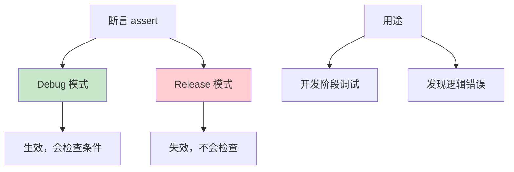
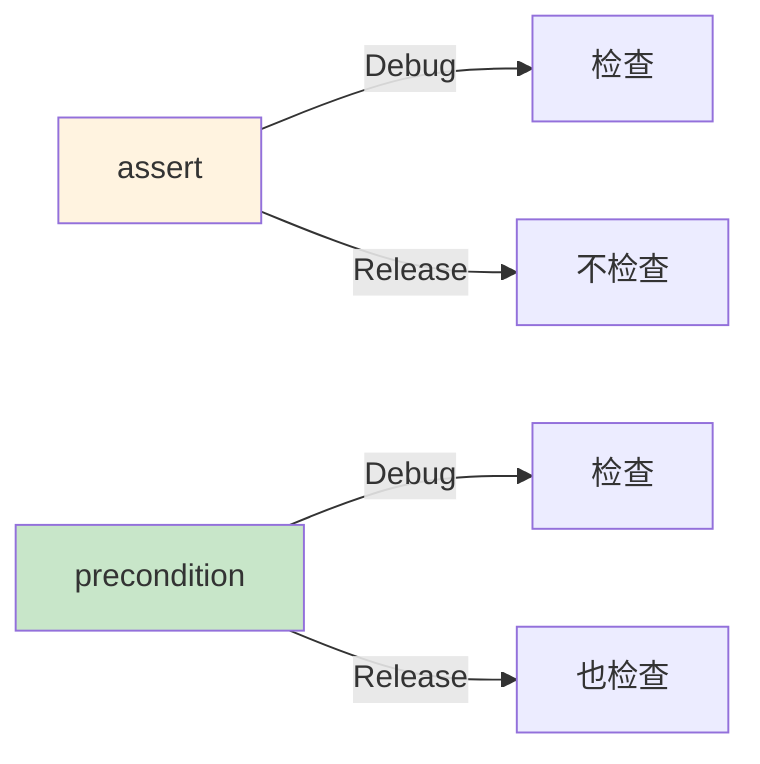

# 第19课：断言和先决条件

## 📖 学习目标
- 理解断言（assert）的用途及其底层机制
- 掌握先决条件（precondition）的使用
- 理解 assertionFailure 和 preconditionFailure 的区别
- 了解 fatalError 的使用场景
- 学会在开发中使用调试工具
- 掌握断言相关 API 的选择策略

---

## 什么是断言和先决条件？

**断言和先决条件是什么？简单来说，它们是代码中的"检查点"，用来确保程序按预期运行。**

### 生活类比：质量检查

想象工厂的生产线：
- **断言（assert）**：开发阶段的质量检查，发现问题就停机检查
- **先决条件（precondition）**：生产阶段的质量检查，发现问题就停止生产
- **fatalError**：紧急停机，程序必须终止

---

## 断言（assert）

断言用于**开发阶段**的调试，只在 Debug 模式下生效。

### 基本语法

```swift
assert(条件, "错误信息")
assert(条件)  // 没有错误信息
```

### 示例

```swift
let age = -5

// 检查年龄是否有效
assert(age >= 0, "年龄不能为负数")
// 💥 程序崩溃，显示：年龄不能为负数

// 检查数组索引
let numbers = [1, 2, 3]
let index = 5
assert(index < numbers.count, "索引超出范围")
// 💥 程序崩溃，显示：索引超出范围
```

### 断言的特点



### 底层机制：assert 在 Debug 和 Release 中的行为

很多初学者只知道"assert 在 Release 中不生效"，但不了解背后到底发生了什么。我们来深入看看。

#### 编译器如何处理 assert

当你写下这行代码时：

```swift
assert(age >= 0, "年龄不能为负数")
```

编译器会根据构建配置做不同的处理：

**Debug 模式下（未开启优化）：**

编译器会将 assert 保留为完整的条件检查代码。大致等价于：

```swift
// 编译器生成的伪代码
if !(age >= 0) {
    // 触发断言失败处理
    // 1. 打印错误信息："年龄不能为负数"
    // 2. 打印文件名和行号
    // 3. 调用 trap 指令（如 __builtin_trap）
    // 4. 程序终止
}
```

在汇编层面，Debug 模式下的 assert 大致对应以下流程：
1. 执行条件比较指令（如 ARM64 上的 `cmp` 或 x86 上的 `test`）
2. 根据比较结果做条件跳转（`beq` / `je`）
3. 如果条件为 false，跳转到断言失败处理代码
4. 处理代码调用 `_assertionFailure` 函数，最终触发 `trap`（硬件中断指令）
5. 调试器（LLDB）捕获这个中断，程序暂停

**Release 模式下（开启优化，如 -O）：**

编译器会**完全移除** assert 语句，生成的代码中根本不包含任何条件检查。这意味着：
- 不会有条件比较指令
- 不会有分支跳转
- 不会调用 `_assertionFailure`
- **零运行时开销**

这就是为什么 assert 适合放在频繁调用的函数中——在 Release 构建中，它们不会对性能产生任何影响。

#### 为什么 Release 中要移除 assert？

Swift 的设计哲学是：
- assert 用于检查**程序员自己的错误**（如违反了内部逻辑约束）
- 如果代码写对了，assert 的条件永远为 true
- 既然永远为 true，检查就是多余的，可以安全移除
- 移除后可以提升运行时性能

```swift
// 例如这个函数在 Release 中被调用 100 万次
func processItem(at index: Int, in array: [Int]) -> Int {
    assert(index >= 0 && index < array.count, "索引越界")
    // 如果 assert 不被移除，每次调用都会执行两次比较和分支
    // 移除后，函数体只剩下必要的计算
    return array[index] * 2
}
```

#### 实际观察：用汇编验证

如果你想亲自验证，可以在 Xcode 中这样做：
1. 选择 Product → Perform Action → Assemble，查看 Debug 和 Release 下的汇编输出
2. 在 Debug 汇编中搜索 `assertionFailure`，你会发现对应的函数调用
3. 切换到 Release 汇编，这些调用完全消失

---

### 实际应用

```swift
func calculateDiscount(price: Double, discount: Double) -> Double {
    // 确保折扣在合理范围内
    assert(discount >= 0 && discount <= 1, "折扣必须在0到1之间")

    return price * discount
}

// 正常情况
let result1 = calculateDiscount(price: 100, discount: 0.8)
print(result1)  // 80.0

// 异常情况（开发阶段会崩溃）
// let result2 = calculateDiscount(price: 100, discount: 1.5)
// 💥 断言失败：折扣必须在0到1之间
```

---

## assertionFailure

`assertionFailure` 是 assert 家族的另一个成员。它的特殊之处在于：**它不检查任何条件，无条件地触发断言失败。**

### 基本语法

```swift
assertionFailure("错误信息")
```

### 使用场景

`assertionFailure` 用于那些**理论上不应该被执行到的代码路径**。当你已经通过其他逻辑（如 switch 语句）排除了所有合法情况后，用 `assertionFailure` 标记剩余的"不可能"分支。

```swift
enum Direction {
    case north, south, east, west
}

func describeDirection(_ direction: Direction) -> String {
    switch direction {
    case .north:
        return "向北"
    case .south:
        return "向南"
    case .east:
        return "向东"
    case .west:
        return "向西"
    // 注意：这里没有 default 分支
    // 因为我们已经覆盖了所有情况
    }
}
```

但如果 switch 没有覆盖所有情况，你可能需要一个"兜底"分支：

```swift
enum Priority {
    case low, medium, high
    // 假设未来可能会添加新值
}

func priorityColor(_ priority: Priority) -> String {
    switch priority {
    case .low:
        return "绿色"
    case .medium:
        return "黄色"
    case .high:
        return "红色"
    @unknown default:
        // 未来添加了新的 Priority 值时，这里会被执行
        assertionFailure("未处理的优先级：\(priority)")
        return "灰色"  // 返回一个安全的默认值
    }
}
```

### assertionFailure vs fatalError

这两者看起来很像，但有关键区别：

| 特性 | assertionFailure | fatalError |
|------|------------------|------------|
| Debug 模式 | 崩溃 | 崩溃 |
| Release 模式 | **不崩溃**（被移除） | **崩溃** |
| 典型用途 | 标记理论不可达的路径 | 标记绝对不应该执行的代码 |
| 安全性 | 更安全（Release 中不会崩溃） | 更严格（始终崩溃） |

```swift
// assertionFailure：适合可能因为未来代码变化而到达的路径
func getEmoji(for mood: Mood) -> String {
    switch mood {
    case .happy: return "😊"
    case .sad: return "😢"
    case .angry: return "😠"
    @unknown default:
        assertionFailure("未知的情绪类型")
        return "❓"  // Release 中会返回这个默认值
    }
}

// fatalError：适合绝对不应该到达的路径
func forceUnwrap(_ value: Int?) -> Int {
    guard let value = value else {
        fatalError("值为 nil，这是一个编程错误")
    }
    return value
}
```

---

## 先决条件（precondition）

先决条件在 **Debug 和 Release 模式下都生效**，用于检查程序运行时的必要条件。

### 基本语法

```swift
precondition(条件, "错误信息")
precondition(条件)  // 没有错误信息
```

### 示例

```swift
func divide(_ a: Int, by b: Int) -> Int {
    // 先决条件：除数不能为0
    precondition(b != 0, "除数不能为0")

    return a / b
}

// 正常情况
let result = divide(10, by: 2)
print(result)  // 5

// 异常情况（Release 模式也会崩溃）
// let result2 = divide(10, by: 0)
// 💥 先决条件失败：除数不能为0
```

### assert vs precondition

| 特性 | assert | precondition |
|------|--------|--------------|
| Debug 模式 | ✅ 生效 | ✅ 生效 |
| Release 模式 | ❌ 失效 | ✅ 生效 |
| 用途 | 开发调试 | 运行时检查 |
| 性能影响 | 无（Release） | 有 |



---

## preconditionFailure

与 `assertionFailure` 类似，`preconditionFailure` 是 `precondition` 的无条件版本——**它不检查任何条件，始终触发先决条件失败。**

### 基本语法

```swift
preconditionFailure("错误信息")
```

### 什么时候用 preconditionFailure？

当你在某个分支中**已经确定**条件不满足，需要立即终止程序时：

```swift
struct PositiveNumber {
    let value: Int

    init(_ number: Int) {
        if number > 0 {
            self.value = number
        } else {
            preconditionFailure("必须传入正数，收到的是：\(number)")
        }
    }
}

// 正常使用
let n = PositiveNumber(42)
print(n.value)  // 42

// 异常使用
// let bad = PositiveNumber(-5)
// 💥 先决条件失败：必须传入正数，收到的是：-5
```

### preconditionFailure vs fatalError

这两个函数在效果上非常相似——都会无条件终止程序。但它们在**语义**上有区别：

| 函数 | 语义含义 | 使用场景 |
|------|----------|----------|
| `preconditionFailure` | "先决条件不满足，无法继续" | 函数参数不合法、对象状态异常 |
| `fatalError` | "发生了不可恢复的错误" | 未实现的方法、不应该到达的代码 |

```swift
// preconditionFailure：强调前置条件不满足
func squareRoot(_ number: Double) -> Double {
    guard number >= 0 else {
        preconditionFailure("不能对负数求平方根")
    }
    return sqrt(number)
}

// fatalError：强调不应该到达这里
class Animal {
    func speak() -> String {
        fatalError("子类必须重写 speak 方法")
    }
}
```

在实际开发中，很多开发者会混用 `preconditionFailure` 和 `fatalError`。从运行效果来看，两者没有区别。选择哪个主要看你想表达的意图：
- 如果是**参数或状态检查失败**，用 `preconditionFailure` 语义更清晰
- 如果是**不应该到达的代码路径**，用 `fatalError` 更合适

---

## fatalError

`fatalError` 会**无条件终止程序**，用于表示"不应该到达这里"。

### 基本用法

```swift
func processValue(_ value: Int) -> String {
    switch value {
    case 0...10:
        return "小"
    case 11...100:
        return "中"
    case 101...1000:
        return "大"
    default:
        fatalError("不支持的值：\(value)")
    }
}
```

### 实际应用

```swift
// 未实现的方法
class Animal {
    func speak() -> String {
        fatalError("子类必须实现 speak 方法")
    }
}

class Dog: Animal {
    override func speak() -> String {
        return "汪汪"
    }
}

class Cat: Animal {
    override func speak() -> String {
        return "喵喵"
    }
}

let dog = Dog()
print(dog.speak())  // 汪汪

// let animal = Animal()
// print(animal.speak())  // 💥 fatalError：子类必须实现 speak 方法
```

---

## 何时使用？

### 使用场景对比

| 场景 | 推荐使用 | 原因 |
|------|----------|------|
| 开发阶段检查逻辑错误 | `assert` | 只在调试时检查 |
| 运行时必须满足的条件 | `precondition` | Release 也要检查 |
| 不应该到达的代码 | `fatalError` | 无条件终止 |
| 用户输入验证 | 正常错误处理 | 不应该崩溃 |

### 示例：选择合适的检查方式

```swift
// 1. 开发阶段的逻辑检查（assert）
func processIndex(_ index: Int, array: [Int]) {
    assert(index >= 0 && index < array.count, "索引越界")
    // 正常处理
}

// 2. 运行时必须满足的条件（precondition）
func squareRoot(_ number: Double) -> Double {
    precondition(number >= 0, "不能对负数求平方根")
    return sqrt(number)
}

// 3. 不应该到达的代码（fatalError）
func handleUnknownCase(_ value: String) -> Int {
    switch value {
    case "A": return 1
    case "B": return 2
    case "C": return 3
    default:
        fatalError("未处理的值：\(value)")
    }
}

// 4. 用户输入验证（正常错误处理）
func validateEmail(_ email: String) -> Bool {
    return email.contains("@")
}
```

---

## 如何选择：决策流程图

面对一个需要"检查"的场景，到底该用哪个 API？以下是文字版的决策流程：

**第一步：这个检查是关于什么的？**

→ 如果是**用户输入、网络数据、文件内容等外部数据**：
  使用正常的错误处理机制（`throw`、`Result`、返回 `nil`/`Bool`）。永远不要用断言来验证外部数据，因为外部数据是不可控的。

→ 如果是**程序员自己写代码时应该遵守的规则**：
  进入第二步。

**第二步：这个规则在 Release 构建中也需要检查吗？**

→ 如果是**仅在开发阶段有意义的内部逻辑检查**（如索引范围、数组非空）：
  使用 `assert`。这些检查在 Release 中被移除，因为如果代码写对了，它们永远为 true。

→ 如果是**运行时必须遵守的安全约束**（如除数不为零、数组索引不越界）：
  使用 `precondition`。即使在 Release 中也要检查，因为违反这些约束会导致未定义行为。

**第三步：这个代码路径意味着什么？**

→ 如果是**理论上不应该到达，但编译器要求你处理的分支**：
  使用 `assertionFailure`。例如 `@unknown default` 分支。

→ 如果是**绝对不应该到达的代码**（如未实现的抽象方法）：
  使用 `fatalError`。程序到了这里就说明有严重的编程错误。

→ 如果是**参数或状态检查失败，无法安全继续执行**：
  使用 `preconditionFailure`。语义上表示"前置条件不满足"。

**速查表：**

```
外部数据验证？     → throw / Result / 返回 nil
开发阶段逻辑检查？ → assert
运行时安全约束？   → precondition
理论不可达分支？   → assertionFailure
绝对不可达代码？   → fatalError
参数状态检查失败？ → preconditionFailure
```

---

## 常见错误

在使用断言和先决条件时，很多开发者会犯以下错误。了解这些陷阱可以帮助你写出更健壮的代码。

### 错误1：用 assert 验证用户输入

这是最常见的错误。assert 在 Release 模式下会被移除，如果用来验证用户输入，就等于在生产环境完全不做检查。

```swift
// ❌ 错误示范
func setAge(_ age: Int) {
    assert(age >= 0 && age <= 150, "年龄不合法")
    self.age = age
    // 问题：Release 模式下，age = -100 也不会报错！
}

// ✅ 正确做法
enum AgeError: Error {
    case negative
    case tooLarge
}

func setAge(_ age: Int) throws {
    guard age >= 0 else {
        throw AgeError.negative
    }
    guard age <= 150 else {
        throw AgeError.tooLarge
    }
    self.age = age
}
```

**原则：** 对于任何可能来自外部（用户输入、API 响应、文件数据）的数据，永远使用正常的错误处理机制，而不是断言。

### 错误2：在生产代码中滥用 fatalError

有些开发者为了省事，用 `fatalError` 来处理所有"不应该发生"的情况。这在生产环境中很危险——程序会直接崩溃，用户体验极差。

```swift
// ❌ 错误示范
func loadImage(named name: String) -> UIImage {
    guard let image = UIImage(named: name) else {
        fatalError("图片 \(name) 不存在")
        // 生产环境中如果资源丢失，直接崩溃
    }
    return image
}

// ✅ 正确做法
enum ImageError: Error {
    case notFound(String)
}

func loadImage(named name: String) throws -> UIImage {
    guard let image = UIImage(named: name) else {
        throw ImageError.notFound(name)
    }
    return image
}

// 或者返回可选值
func loadImage(named name: String) -> UIImage? {
    return UIImage(named: name)
}
```

**原则：** `fatalError` 只用于那些如果执行到这里就说明程序有根本性 bug 的情况，而不是用来处理"可能失败"的操作。

### 错误3：断言信息没有意义

模糊的错误信息会让调试变得极其困难。当你在凌晨3点被一个生产事故叫醒时，看到"断言失败"四个字，你会非常崩溃。

```swift
// ❌ 错误示范
assert(index < count)
assert(valid)
precondition(success)

// ✅ 正确做法
assert(index < count, "数组索引越界：index=\(index), count=\(count)")
assert(valid, "用户状态无效：userId=\(user.id), state=\(user.state)")
precondition(success, "网络请求失败：url=\(url), statusCode=\(statusCode)")
```

**原则：** 断言信息应该包含足够的上下文——什么变量出了问题、它们的值是什么、在什么操作中发生的。

### 错误4：混淆 assert 和 precondition

很多开发者不理解两者的核心区别，随意选择使用。

```swift
// ❌ 错误示范：用 assert 检查运行时必须满足的条件
func divide(_ a: Int, by b: Int) -> Int {
    assert(b != 0, "除数不能为0")  // Release 中被移除！
    return a / b
    // 问题：Release 模式下除以0会导致未定义行为
}

// ❌ 错误示范：用 precondition 检查开发阶段的逻辑
func processItems(_ items: [String]) {
    precondition(items.count > 0, "数组不应该为空")
    // 问题：如果这只是内部逻辑，用 precondition 增加了不必要的运行时开销
}

// ✅ 正确做法
func divide(_ a: Int, by b: Int) -> Int {
    precondition(b != 0, "除数不能为0")  // Release 也要检查
    return a / b
}

func processItems(_ items: [String]) {
    assert(items.count > 0, "数组不应该为空")  // 仅开发阶段检查
    // 处理逻辑
}
```

**原则：**
- `assert` → 检查"我的代码写对了吗"（开发阶段）
- `precondition` → 检查"程序能安全运行吗"（运行时）

---

## 调试技巧

### 1. 使用 assert 进行调试

```swift
func calculateAverage(numbers: [Int]) -> Double {
    assert(!numbers.isEmpty, "数组不能为空")

    let sum = numbers.reduce(0, +)
    return Double(sum) / Double(numbers.count)
}
```

### 2. 使用 precondition 防止非法状态

```swift
class BankAccount {
    private var balance: Double

    init(initialBalance: Double) {
        precondition(initialBalance >= 0, "初始余额不能为负")
        self.balance = initialBalance
    }

    func withdraw(_ amount: Double) {
        precondition(amount > 0, "取款金额必须大于0")
        precondition(amount <= balance, "余额不足")

        balance -= amount
    }
}
```

### 3. 使用 fatalError 标记未完成代码

```swift
// TODO: 实现这个功能
func advancedFeature() {
    fatalError("此功能尚未实现")
}
```

### 4. 使用断言与断点配合调试

断言失败时程序会崩溃，但有时候你想在崩溃之前检查更多上下文信息。这时候可以配合断点使用。

#### 方法一：在 assert 之前设置断点

```swift
func processOrder(_ order: Order) {
    // 在这里设置一个断点（点击行号左侧）
    // 当断言失败时，程序会在断点处暂停，你可以检查所有变量
    assert(order.items.count > 0, "订单必须包含至少一个商品")

    let total = order.items.reduce(0) { $0 + $1.price }
    // ...
}
```

#### 方法二：使用条件断点模拟 assert

在 Xcode 中，你可以给断点添加条件：
1. 右键点击断点 → Edit Breakpoint
2. 在 Condition 中输入条件表达式，例如 `order.items.count == 0`
3. 勾选 "Automatically continue after evaluating actions" 可以让它只记录日志而不暂停

#### 方法三：在断言消息中添加断点动作

```swift
// 你可以在断点的 Action 中添加日志输出
// 当条件满足时，断点会自动打印变量值，而不是直接崩溃
assert(balance >= 0, "余额变为负数，当前余额：\(balance)")
```

### 5. 使用 LLDB 调试断言失败

当断言失败导致程序暂停时，LLDB 调试器是你最好的工具。

#### 常用 LLDB 命令

```bash
# 查看当前断点处的所有变量
(lldb) frame variable

# 查看某个特定变量的值
(lldb) print balance
(lldb) po order.items  # po = print object，适合打印对象

# 查看调用栈（知道是怎么走到这里的）
(lldb) bt  # backtrace 的缩写

# 查看特定线程的调用栈
(lldb) thread backtrace

# 继续执行到下一个断点
(lldb) continue

# 单步执行（进入函数内部）
(lldb) step

# 单步执行（不进入函数内部）
(lldb) next
```

#### 使用 LLDB 表达式

在断言失败暂停时，你还可以执行 LLDB 表达式来进一步调查：

```swift
// 假设断言失败：assert(index < count, "索引越界")
// 在 LLDB 中你可以：
(lldb) expression let arr = [1, 2, 3]
(lldb) expression print(arr.count)
(lldb) expression print(index)
```

#### 设置符号断点捕获所有断言失败

如果你想在**任何**断言失败时都暂停（而不是等崩溃后才看到），可以设置符号断点：
1. 在 Xcode 中，打开 Breakpoint Navigator（Cmd + 8）
2. 点击左下角的 "+" 按钮
3. 选择 "Symbolic Breakpoint"
4. Symbol 填入：`Swift._assertionFailure`
5. 这样每次断言失败时，程序都会在调用 `_assertionFailure` 函数时暂停

### 6. 使用 os_log 进行生产环境安全日志记录

在生产环境中，你不应该使用断言来记录问题，而应该使用 `os_log` 进行安全的日志记录。

```swift
import os.log

// 创建一个日志对象
private let logger = Logger(subsystem: "com.example.myapp", category: "network")

func fetchData(from url: URL) async throws -> Data {
    logger.info("开始请求：\(url.absoluteString)")

    let (data, response) = try await URLSession.shared.data(from: url)

    guard let httpResponse = response as? HTTPURLResponse else {
        logger.error("响应类型错误：\(type(of: response))")
        throw NetworkError.invalidResponse
    }

    logger.debug("收到响应：statusCode=\(httpResponse.statusCode)")

    guard (200...299).contains(httpResponse.statusCode) else {
        logger.warning("HTTP 错误：\(httpResponse.statusCode)，URL：\(url.absoluteString)")
        throw NetworkError.httpError(httpResponse.statusCode)
    }

    return data
}
```

#### os_log 的优势

```swift
// ❌ 不要在生产代码中这样做
func riskyOperation() {
    // print 在生产环境中可能被移除，而且没有日志级别
    print("正在执行危险操作")

    // 断言会崩溃
    assert(isValid, "状态无效")
}

// ✅ 推荐做法
private let logger = Logger(subsystem: Bundle.main.bundleIdentifier ?? "app", category: "operations")

func riskyOperation() {
    logger.info("正在执行危险操作")

    guard isValid else {
        logger.error("状态无效：\(describeCurrentState())")
        // 优雅地处理错误，而不是崩溃
        return
    }
}
```

#### 日志级别选择

```swift
// 按严重程度从低到高
logger.debug("调试信息，仅在开发时有用")      // Debug 级别
logger.info("正常操作信息")                    // Info 级别
logger.warning("警告，可能有问题")             // Warning 级别
logger.error("错误，操作失败但程序可继续")     // Error 级别
logger.fatal("致命错误，程序可能无法继续")     // Fatal 级别
```

---

## 实战应用

### 场景1：状态机验证

在实现状态机时，断言可以帮助你验证状态转换是否合法。

```swift
enum OrderState {
    case created
    case paid
    case shipped
    case delivered
    case cancelled
}

class Order {
    private(set) var state: OrderState = .created

    func pay() {
        // 只有 created 状态才能支付
        assert(state == .created, "订单状态错误：只能在 created 状态下支付，当前状态：\(state)")
        state = .paid
    }

    func ship() {
        assert(state == .paid, "订单状态错误：只能在 paid 状态下发货，当前状态：\(state)")
        state = .shipped
    }

    func deliver() {
        precondition(state == .shipped, "订单状态错误：只能在 shipped 状态下确认收货，当前状态：\(state)")
        state = .delivered
    }

    func cancel() {
        // created 和 paid 状态都可以取消
        precondition(
            state == .created || state == .paid,
            "订单状态错误：只能在 created 或 paid 状态下取消，当前状态：\(state)"
        )
        state = .cancelled
    }
}
```

在这个例子中：
- `pay()` 和 `ship()` 使用 `assert`，因为状态转换的正确性应该在开发阶段就保证
- `deliver()` 和 `cancel()` 使用 `precondition`，因为这些操作涉及实际业务逻辑，需要在 Release 中也验证

### 场景2：API 契约强制执行

当你编写一个供他人使用的 API 时，断言可以帮助调用者遵守 API 契约。

```swift
/// 从数组中获取指定范围的元素
/// - Parameters:
///   - array: 源数组
///   - range: 范围，必须在数组边界内
/// - Returns: 范围内的元素
func slice<T>(_ array: [T], range: Range<Int>) -> [T] {
    // API 契约：调用者必须传入合法的范围
    precondition(range.lowerBound >= 0, "range 的下界不能为负数：\(range.lowerBound)")
    precondition(range.upperBound <= array.count, "range 的上界超出数组长度：上界=\(range.upperBound), 数组长度=\(array.count)")

    return Array(array[range])
}

// 正常使用
let numbers = [1, 2, 3, 4, 5]
let result = slice(numbers, range: 1..<3)
print(result)  // [2, 3]

// 违反 API 契约
// let bad = slice(numbers, range: 3..<10)
// 💥 先决条件失败：range 的上界超出数组长度
```

### 场景3：开发阶段与生产阶段的安全网

一个好的模式是同时使用 `assert` 和 `precondition`——在开发阶段做更严格的检查，在生产阶段只做必要的检查。

```swift
class Cache<Key: Hashable, Value> {
    private var storage: [Key: Value] = [:]
    private let maxSize: Int

    init(maxSize: Int) {
        precondition(maxSize > 0, "缓存大小必须大于0")
        self.maxSize = maxSize
    }

    func set(_ value: Value, for key: Key) {
        // 开发阶段检查：调用者是否遵守了使用约定
        assert(Thread.isMainThread, "set 方法必须在主线程调用")

        // 运行时检查：缓存是否已满
        if storage.count >= maxSize {
            // 淘汰最旧的条目
            if let oldestKey = storage.keys.first {
                storage.removeValue(forKey: oldestKey)
            }
        }

        storage[key] = value
    }

    func get(_ key: Key) -> Value? {
        assert(Thread.isMainThread, "get 方法必须在主线程调用")
        return storage[key]
    }
}
```

在这个例子中：
- `assert(Thread.isMainThread)` 只在开发阶段检查线程安全性，因为多线程访问 UI 组件是一个常见的开发错误
- `precondition(maxSize > 0)` 在运行时也检查，因为缓存大小为 0 是一个逻辑错误，后续代码会出问题

---

## 📝 练习题

### 练习1：assert 使用
编写一个函数，使用 assert 检查输入的数组不为空。

```swift
// 在这里写你的代码

```

### 练习2：precondition 使用
编写一个函数，使用 precondition 检查价格和数量都大于0。

```swift
// 在这里写你的代码

```

### 练习3：fatalError 使用
编写一个 Animal 基类，使用 fatalError 确保子类必须实现 speak 方法。

```swift
// 在这里写你的代码

```

### 练习4：综合应用
编写一个计算器类，使用合适的断言和先决条件进行输入验证。

```swift
// 在这里写你的代码

```

### 练习5：assertionFailure 使用
编写一个函数，接受一个 `Color` 枚举（包含 red、green、blue），使用 switch 和 `@unknown default` 配合 `assertionFailure` 处理未知颜色，返回一个默认的十六进制颜色字符串。

```swift
// 在这里写你的代码

```

### 练习6：实战场景——用户注册验证
设计一个用户注册系统，区分哪些验证应该用断言/先决条件（内部逻辑检查），哪些应该用正常的错误处理（用户输入验证）。要求：
- 验证用户名长度（用户输入 → 错误处理）
- 验证密码强度（用户输入 → 错误处理）
- 验证内部数据库连接状态（内部逻辑 → 断言）
- 验证加密函数参数合法性（内部逻辑 → 先决条件）

```swift
// 在这里写你的代码

```

---

## ✅ 练习题参考答案

> 💡 **提示：** 建议先独立完成练习，再查看答案

---

### 练习1
```swift
func processArray(_ array: [Int]) {
    assert(!array.isEmpty, "数组不能为空")

    let sum = array.reduce(0, +)
    print("数组总和：\(sum)")
}

processArray([1, 2, 3, 4, 5])  // 数组总和：15
// processArray([])  // 💥 断言失败：数组不能为空
```

### 练习2
```swift
func calculateTotal(price: Double, quantity: Int) -> Double {
    precondition(price > 0, "价格必须大于0")
    precondition(quantity > 0, "数量必须大于0")

    return price * Double(quantity)
}

print(calculateTotal(price: 100, quantity: 3))  // 300.0
// calculateTotal(price: -100, quantity: 3)  // 💥 先决条件失败
```

### 练习3
```swift
class Animal {
    func speak() -> String {
        fatalError("子类必须实现 speak 方法")
    }
}

class Dog: Animal {
    override func speak() -> String {
        return "汪汪"
    }
}

class Cat: Animal {
    override func speak() -> String {
        return "喵喵"
    }
}

let dog = Dog()
print(dog.speak())  // 汪汪

// let animal = Animal()
// print(animal.speak())  // 💥 fatalError
```

### 练习4
```swift
class Calculator {
    func add(_ a: Double, _ b: Double) -> Double {
        return a + b
    }

    func subtract(_ a: Double, _ b: Double) -> Double {
        return a - b
    }

    func multiply(_ a: Double, _ b: Double) -> Double {
        return a * b
    }

    func divide(_ a: Double, by b: Double) -> Double {
        precondition(b != 0, "除数不能为0")
        return a / b
    }

    func squareRoot(_ number: Double) -> Double {
        precondition(number >= 0, "不能对负数求平方根")
        return sqrt(number)
    }
}

let calc = Calculator()
print(calc.add(10, 20))       // 30.0
print(calc.divide(10, by: 2)) // 5.0
print(calc.squareRoot(16))    // 4.0
// calc.divide(10, by: 0)     // 💥 先决条件失败
// calc.squareRoot(-16)       // 💥 先决条件失败
```

### 练习5
```swift
enum Color {
    case red, green, blue
}

func hexString(for color: Color) -> String {
    switch color {
    case .red:
        return "#FF0000"
    case .green:
        return "#00FF00"
    case .blue:
        return "#0000FF"
    @unknown default:
        assertionFailure("未知的颜色类型：\(color)")
        return "#000000"  // 返回黑色作为默认值
    }
}

print(hexString(for: .red))    // #FF0000
print(hexString(for: .green))  // #00FF00
```

### 练习6
```swift
import Foundation

// 用户输入验证 —— 使用正常的错误处理
enum RegistrationError: Error {
    case usernameTooShort(Int)
    case usernameTooLong(Int)
    case passwordTooWeak
    case passwordTooShort(Int)
}

// 内部工具类 —— 使用断言和先决条件
class EncryptionService {
    func hash(_ input: String, rounds: Int) -> String {
        // 先决条件：rounds 必须是正数（这是 API 契约）
        precondition(rounds > 0, "加密轮数必须大于0，收到：\(rounds)")
        precondition(!input.isEmpty, "不能对空字符串加密")

        // 模拟加密逻辑
        return "hashed_\(input)_\(rounds)"
    }
}

class DatabaseManager {
    private var isConnected = false

    func connect() {
        isConnected = true
    }

    func saveUser(username: String, hashedPassword: String) {
        // 断言：开发阶段确保数据库已连接
        // 如果到了这里数据库还没连接，说明代码逻辑有问题
        assert(isConnected, "数据库未连接就尝试保存用户")
        print("用户 \(username) 已保存到数据库")
    }
}

// 注册函数
func registerUser(
    username: String,
    password: String,
    db: DatabaseManager,
    encryption: EncryptionService
) throws {
    // 用户输入验证 —— 必须用错误处理，不能崩溃
    guard username.count >= 3 else {
        throw RegistrationError.usernameTooShort(username.count)
    }
    guard username.count <= 20 else {
        throw RegistrationError.usernameTooLong(username.count)
    }
    guard password.count >= 8 else {
        throw RegistrationError.passwordTooShort(password.count)
    }
    guard password.contains(where: { $0.isUppercase }) &&
          password.contains(where: { $0.isNumber }) else {
        throw RegistrationError.passwordTooWeak
    }

    // 内部逻辑 —— 使用断言和先决条件
    let hashedPassword = encryption.hash(password, rounds: 10000)
    db.saveUser(username: username, hashedPassword: hashedPassword)
}

// 使用示例
let db = DatabaseManager()
db.connect()
let encryption = EncryptionService()

do {
    try registerUser(
        username: "alice",
        password: "StrongPass123",
        db: db,
        encryption: encryption
    )
    print("注册成功")
} catch {
    print("注册失败：\(error)")
}
```

---

## 🎯 小结

| 工具 | 用途 | 何时生效 |
|------|------|----------|
| `assert` | 开发调试 | 仅 Debug |
| `assertionFailure` | 标记理论不可达的分支 | 仅 Debug |
| `precondition` | 运行时检查 | Debug + Release |
| `preconditionFailure` | 标记先决条件不满足 | Debug + Release |
| `fatalError` | 无条件终止 | 总是生效 |

**选择指南：**
- ✅ 开发阶段检查逻辑错误 → `assert`
- ✅ 理论上不应该到达的分支 → `assertionFailure`
- ✅ 运行时必须满足的条件 → `precondition`
- ✅ 先决条件不满足时终止 → `preconditionFailure`
- ✅ 不应该到达的代码 → `fatalError`
- ❌ 用户输入验证 → 正常错误处理，不要崩溃

**最佳实践：**
- 断言用于开发阶段，不应该影响用户体验
- 先决条件用于保护关键逻辑
- fatalError 用于标记未完成或不可能的情况
- 用户输入永远不要用断言处理
- 断言信息要包含足够的上下文（变量名和值）
- 生产环境使用 os_log 记录日志，而不是 print 或断言

---

**上一课：[第18课：guard语句详解](第18课：guard语句详解.md)**

**下一课：[第20课：Range和区间](第20课：Range和区间.md)**
