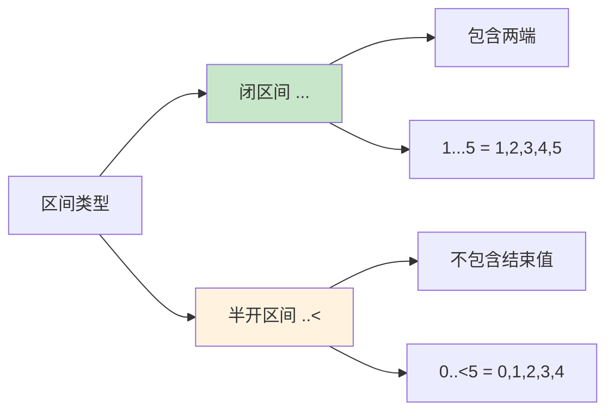

# 第20课：Range 和区间

## 📖 学习目标
- 理解 Range 和 ClosedRange 的区别
- 学会使用 `...` 和 `..<` 运算符
- 掌握区间的常见用法
- 了解如何检查值是否在区间内
- 掌握五种区间类型的区别与适用场景
- 学会在字符串中安全使用区间
- 避免区间使用中的常见错误

---

## 什么是区间？

**区间是什么？通俗地讲，区间就是"从哪到哪"的一段连续数字。**

比如：
- "1 到 10" 就是一个区间
- "从周一到周五" 也是一个区间

### 生活类比：楼层

想象一栋楼：
- **闭区间** `[1, 10]`：从 1 楼到 10 楼，**包括 1 楼和 10 楼**
- **半开区间** `[1, 10)`：从 1 楼到 10 楼，**包括 1 楼，但不包括 10 楼**

---

## 两种基础区间类型

### 1. 闭区间（ClosedRange）使用 `...`

**语法：** `起始值...结束值`

**特点：** 包含起始值和结束值

```swift
// 闭区间：1 到 5，包含 1 和 5
let range1 = 1...5
print(range1)  // 1...5

// 遍历闭区间
for i in 1...5 {
    print(i, terminator: " ")
}
// 输出：1 2 3 4 5
```

**代码解读：**
- `1...5` 表示从 1 到 5（包含 1, 2, 3, 4, 5）
- 使用 `for-in` 循环可以遍历区间中的每个数字

### 2. 半开区间（Range）使用 `..<`

**语法：** `起始值..<结束值`

**特点：** 包含起始值，但不包含结束值

```swift
// 半开区间：0 到 5，包含 0，但不包含 5
let range2 = 0..<5
print(range2)  // 0..<5

// 遍历半开区间
for i in 0..<5 {
    print(i, terminator: " ")
}
// 输出：0 1 2 3 4
```

**代码解读：**
- `0..<5` 表示从 0 到 5（包含 0, 1, 2, 3, 4，不包含 5）
- 这在处理数组索引时特别有用（因为索引从 0 开始）

---

## 两种基础区间的区别



| 类型 | 语法 | 包含起始值 | 包含结束值 | 示例 |
|------|------|-----------|-----------|------|
| 闭区间 | `...` | ✅ | ✅ | `1...5` = 1,2,3,4,5 |
| 半开区间 | `..<` | ✅ | ❌ | `0..<5` = 0,1,2,3,4 |

---

## Range 类型深入讲解

Swift 中一共有 **五种** 区间类型。除了上面介绍的 `ClosedRange` 和 `Range`（半开区间），还有三种**单侧区间**（One-Sided Range）。理解它们的区别是正确使用区间的关键。

### 五种区间类型一览

```swift
// 1. ClosedRange<T> —— 闭区间
// 语法：start...end
// 包含 start 和 end
let closed: ClosedRange<Int> = 1...5
// 代表的值：1, 2, 3, 4, 5

// 2. Range<T> —— 半开区间
// 语法：start..<end
// 包含 start，不包含 end
let halfOpen: Range<Int> = 1..<5
// 代表的值：1, 2, 3, 4

// 3. PartialRangeFrom<T> —— 从某值开始到无穷
// 语法：start...
// 包含 start，没有上界
let from: PartialRangeFrom<Int> = 5...
// 代表的值：5, 6, 7, 8, ...（无限）

// 4. PartialRangeThrough<T> —— 从负无穷到某值（闭）
// 语法：...end
// 没有下界，包含 end
let through: PartialRangeThrough<Int> = ...5
// 代表的值：..., 3, 4, 5（包含5）

// 5. PartialRangeUpTo<T> —— 从负无穷到某值（开）
// 语法：..<end
// 没有下界，不包含 end
let upTo: PartialRangeUpTo<Int> = ..<5
// 代表的值：..., 3, 4（不包含5）
```

### 单侧区间的实际用途

单侧区间在 Swift 中非常实用，尤其是在数组切片和 switch 匹配中。

```swift
// ---- 数组切片 ----
let scores = [60, 75, 88, 92, 55, 70, 95]

// 取从索引 2 开始的所有元素
let fromIndex2 = scores[2...]    // [88, 92, 55, 70, 95]

// 取到索引 4（不包含4）之前的所有元素
let beforeIndex4 = scores[..<4]  // [60, 75, 88, 92]

// 取到索引 3（包含3）的所有元素
let throughIndex3 = scores[...3] // [60, 75, 88, 92]

print(Array(fromIndex2))    // [88, 92, 55, 70, 95]
print(Array(beforeIndex4))  // [60, 75, 88, 92]
print(Array(throughIndex3)) // [60, 75, 88, 92]
```

```swift
// ---- switch 中使用单侧区间 ----
let temperature = -5

switch temperature {
case ...0:
    print("零下温度，注意保暖！")
case 1..<10:
    print("有点冷")
case 10..<25:
    print("温度适宜")
case 25...:
    print("高温预警！")
default:
    break
}
// 输出：零下温度，注意保暖！
```

### PartialRangeFrom 的注意事项

`PartialRangeFrom` 没有上界，因此在 `for-in` 循环中使用它会导致**无限循环**，必须格外小心。

```swift
// ⚠️ 危险！这会导致无限循环，永远不停止
// for i in 5... {
//     print(i)  // 5, 6, 7, 8, ... 永远不会停
// }

// 正确用法：配合 prefix、prefix(while:) 等方法限制数量
let result = (1...).prefix(5)
print(Array(result))  // [1, 2, 3, 4, 5]

// 配合 prefix(while:) 使用
let evenNumbers = (1...).prefix(while: { $0 <= 10 })
print(Array(evenNumbers))  // [1, 2, 3, 4, 5, 6, 7, 8, 9, 10]
```

### 区间类型完整对比表

| 类型名称 | Swift 类型 | 语法 | 包含起始值 | 包含结束值 | 有下界 | 有上界 | 典型用途 |
|----------|-----------|------|-----------|-----------|--------|--------|---------|
| 闭区间 | `ClosedRange<T>` | `a...b` | ✅ | ✅ | ✅ | ✅ | 固定范围遍历、switch 匹配 |
| 半开区间 | `Range<T>` | `a..<b` | ✅ | ❌ | ✅ | ✅ | 数组索引遍历、循环计数 |
| 从某值开始 | `PartialRangeFrom<T>` | `a...` | ✅ | — | ✅ | ❌ | 数组切片到末尾、过滤大于某值 |
| 到某值（闭） | `PartialRangeThrough<T>` | `...b` | — | ✅ | ❌ | ✅ | 过滤小于等于某值 |
| 到某值（开） | `PartialRangeUpTo<T>` | `..<b` | — | ❌ | ❌ | ✅ | 数组取前N个、过滤小于某值 |

**选择建议：**
- 需要遍历一个已知的完整范围 → `ClosedRange`（`...`）
- 需要遍历数组索引 → `Range`（`..<`）
- 需要从某值取到末尾 → `PartialRangeFrom`（`a...`）
- 需要取前 N 个元素 → `PartialRangeUpTo`（`..<n`）
- 需要匹配"小于等于某值" → `PartialRangeThrough`（`...b`）

---

## 区间的常见用法

### 1. 在 for 循环中使用

```swift
// 打印 1 到 10 的数字
for i in 1...10 {
    print(i, terminator: " ")
}
// 输出：1 2 3 4 5 6 7 8 9 10

// 打印 0 到 9 的数字（数组索引常用）
for i in 0..<10 {
    print(i, terminator: " ")
}
// 输出：0 1 2 3 4 5 6 7 8 9
```

### 2. 遍历数组

```swift
let fruits = ["苹果", "香蕉", "橙子", "葡萄"]

// 使用半开区间遍历数组索引
for i in 0..<fruits.count {
    print("\(i): \(fruits[i])")
}
// 输出：
// 0: 苹果
// 1: 香蕉
// 2: 橙子
// 3: 葡萄
```

### 3. 检查值是否在区间内

```swift
let age = 25

// 检查年龄是否在 18 到 60 之间
if 18...60 ~= age {
    print("成年人")
} else {
    print("不是成年人")
}
// 输出：成年人

// 使用 contains 方法
let range = 1...10
print(range.contains(5))   // true
print(range.contains(15))  // false
```

### 4. 在 switch 中使用区间

```swift
let score = 85

switch score {
case 90...100:
    print("优秀")
case 80..<90:
    print("良好")
case 70..<80:
    print("中等")
case 60..<70:
    print("及格")
default:
    print("不及格")
}
// 输出：良好
```

### 5. 创建数组切片

```swift
let numbers = [10, 20, 30, 40, 50]

// 获取索引 1 到 3 的元素（不包含 3）
let slice = numbers[1..<3]
print(Array(slice))  // [20, 30]

// 获取索引 2 到末尾的元素
let suffix = numbers[2...]
print(Array(suffix))  // [30, 40, 50]

// 获取开头到索引 3 的元素（不包含 3）
let prefix = numbers[..<3]
print(Array(prefix))  // [10, 20, 30]
```

---

## 区间的高级用法

### 1. 倒序区间

```swift
// 倒序遍历
for i in (1...5).reversed() {
    print(i, terminator: " ")
}
// 输出：5 4 3 2 1

// 或者使用 stride
for i in stride(from: 5, through: 1, by: -1) {
    print(i, terminator: " ")
}
// 输出：5 4 3 2 1
```

### 2. 步长遍历（stride）

```swift
// 使用 stride 函数
// stride(from: 起始值, to: 结束值, by: 步长)
for i in stride(from: 0, to: 10, by: 2) {
    print(i, terminator: " ")
}
// 输出：0 2 4 6 8

// stride(from:through:by:) 包含结束值
for i in stride(from: 0, through: 10, by: 2) {
    print(i, terminator: " ")
}
// 输出：0 2 4 6 8 10
```

**`stride(from:to:by:)` 与 `stride(from:through:by:)` 的区别：**
- `to`：不包含结束值（类似 `..<`）
- `through`：包含结束值（类似 `...`）

```swift
// 对比两个版本的区别
print("stride to 5:")
for i in stride(from: 1, to: 5, by: 1) {
    print(i, terminator: " ")
}
// 输出：1 2 3 4（不包含5）

print("\nstride through 5:")
for i in stride(from: 1, through: 5, by: 1) {
    print(i, terminator: " ")
}
// 输出：1 2 3 4 5（包含5）
```

### 3. 浮点数区间

```swift
// 浮点数也可以创建区间
let range = 0.0...1.0
print(range.contains(0.5))  // true

// 使用 stride 遍历浮点数
for i in stride(from: 0.0, through: 1.0, by: 0.2) {
    print(String(format: "%.1f", i), terminator: " ")
}
// 输出：0.0 0.2 0.4 0.6 0.8 1.0
```

---

## 区间与集合操作

区间不仅仅是用来循环的，它还提供了一系列实用的方法来进行集合操作。

### contains —— 检查值是否在区间内

```swift
let validRange = 1...100

// 使用 contains 方法
print(validRange.contains(50))    // true
print(validRange.contains(0))     // false
print(validRange.contains(100))   // true
print(validRange.contains(101))   // false

// 使用 ~= 运算符（模式匹配运算符）
print(validRange ~= 50)           // true
print(validRange ~= 101)          // false

// 两者的区别：~= 更常用于 switch/case 匹配
// contains 更常用于 if 条件判断
```

### clamped —— 将值限制在区间内

`clamped(to:)` 方法可以将一个值"夹"在指定区间内。如果值小于区间起点，返回起点；如果大于区间终点，返回终点。

```swift
let limits = 1...10

print(5.clamped(to: limits))    // 5   （在区间内，原样返回）
print(0.clamped(to: limits))    // 1   （小于起点，返回起点）
print(15.clamped(to: limits))   // 10  （大于终点，返回终点）
print((-3).clamped(to: limits)) // 1   （小于起点，返回起点）

// 实际应用：限制音量范围
var volume = 150
let volumeRange = 0...100
volume = volume.clamped(to: volumeRange)
print("音量：\(volume)")  // 音量：100

// 实际应用：限制亮度范围
var brightness = -20
let brightnessRange = 0...100
brightness = brightness.clamped(to: brightnessRange)
print("亮度：\(brightness)")  // 亮度：0
```

### 区间重叠检查

可以使用 `overlaps(_:)` 方法检查两个区间是否有重叠部分。

```swift
let rangeA = 1...10
let rangeB = 5...15
let rangeC = 11...20

print(rangeA.overlaps(rangeB))  // true  （5-10 重叠）
print(rangeA.overlaps(rangeC))  // false （没有重叠）
print(rangeB.overlaps(rangeC))  // true  （11-15 重叠）

// 实际应用：检查时间段是否冲突
let meeting1 = 9...11     // 上午 9 点到 11 点
let meeting2 = 10...12    // 上午 10 点到 12 点
let meeting3 = 14...16    // 下午 2 点到 4 点

if meeting1.overlaps(meeting2) {
    print("会议1和会议2时间冲突！")  // 会执行
}

if meeting1.overlaps(meeting3) {
    print("会议1和会议3时间冲突！")
} else {
    print("会议1和会议3时间不冲突")  // 会执行
}
```

---

## String 的区间与索引

### 为什么不能直接用 Int 下标访问字符串？

在 Swift 中，`String` 不能直接用整数下标访问，这是因为 Swift 的字符串是基于 **Unicode 标量** 存储的，不同字符占用的字节数不同。

```swift
let greeting = "Hello, 世界！"

// ❌ 错误！String 不支持 Int 下标
// let char = greeting[0]  // 编译错误

// ✅ 正确方式：使用 String.Index
let startIndex = greeting.startIndex
let firstChar = greeting[startIndex]
print(firstChar)  // H
```

### 使用区间截取字符串

要使用区间截取字符串，必须使用 `String.Index` 类型，而不是 `Int`。

```swift
let text = "Hello, Swift!"

// ✅ 正确方式：使用 String.Index
let start = text.index(text.startIndex, offsetBy: 7)
let end = text.index(text.startIndex, offsetBy: 12)
let substring = text[start..<end]
print(substring)  // Swift

// 也可以用这种简洁写法
let swift = text[text.index(text.startIndex, offsetBy: 7)..<text.index(text.startIndex, offsetBy: 12)]
print(swift)  // Swift

// 获取前缀
let hello = text[..<text.index(text.startIndex, offsetBy: 5)]
print(hello)  // Hello

// 获取后缀
let fromSwift = text[text.index(text.startIndex, offsetBy: 7)...]
print(fromSwift)  // Swift!
```

### 封装一个安全的字符串截取方法

为了避免每次都写很长的 `index` 调用，可以封装一个扩展。

```swift
extension String {
    /// 安全地使用 Int 范围截取字符串
    subscript(range: Range<Int>) -> Substring {
        let startIndex = index(self.startIndex, offsetBy: range.lowerBound)
        let endIndex = index(self.startIndex, offsetBy: range.upperBound)
        return self[startIndex..<endIndex]
    }

    /// 安全地使用闭区间截取字符串
    subscript(range: ClosedRange<Int>) -> Substring {
        let startIndex = index(self.startIndex, offsetBy: range.lowerBound)
        let endIndex = index(self.startIndex, offsetBy: range.upperBound + 1)
        return self[startIndex..<endIndex]
    }
}

let message = "Hello, World!"

// 现在可以用 Int 下标了
print(message[0..<5])   // Hello
print(message[7...12])  // World
```

### 字符串区间的注意事项

```swift
let emoji = "🎉🎊🎈🎁"

// 表情符号可能占用多个 Unicode 标量
// 使用 prefix 和 suffix 更安全
print(emoji.prefix(2))  // 🎉🎊
print(emoji.suffix(2))  // 🎈🎁

// ⚠️ 用 offsetBy 时要注意：每个 emoji 算一个 Character
let startIdx = emoji.startIndex
let endIdx = emoji.index(startIdx, offsetBy: 2)
print(emoji[startIdx..<endIdx])  // 🎉🎊
```

---

## 区间的实际应用

### 应用1：生成随机数

```swift
// 生成 1 到 100 的随机数
let random = Int.random(in: 1...100)
print("随机数：\(random)")

// 生成 0.0 到 1.0 的随机浮点数
let randomDouble = Double.random(in: 0...1)
print("随机浮点数：\(randomDouble)")
```

### 应用2：数组切片

```swift
let letters = ["a", "b", "c", "d", "e", "f"]

// 获取前 3 个元素
let firstThree = letters[..<3]
print(Array(firstThree))  // ["a", "b", "c"]

// 获取后 3 个元素
let lastThree = letters[3...]
print(Array(lastThree))  // ["d", "e", "f"]

// 获取中间的元素
let middle = letters[1..<4]
print(Array(middle))  // ["b", "c", "d"]
```

### 应用3：范围检查

```swift
func isValidAge(_ age: Int) -> Bool {
    return 0...150 ~= age
}

print(isValidAge(25))   // true
print(isValidAge(-5))   // false
print(isValidAge(200))  // false
```

### 应用4：BMI 计算器（区间匹配）

```swift
func calculateBMI(weight: Double, height: Double) -> String {
    let bmi = weight / (height * height)
    let bmiRounded = (bmi * 10).rounded() / 10  // 保留一位小数

    let category: String
    switch bmi {
    case ..<18.5:
        category = "偏瘦"
    case 18.5..<24.0:
        category = "正常"
    case 24.0..<28.0:
        category = "偏胖"
    case 28.0...:
        category = "肥胖"
    default:
        category = "未知"
    }

    return "BMI: \(bmiRounded)，分类：\(category)"
}

print(calculateBMI(weight: 70, height: 1.75))  // BMI: 22.9，分类：正常
print(calculateBMI(weight: 50, height: 1.75))  // BMI: 16.3，分类：偏瘦
print(calculateBMI(weight: 85, height: 1.70))  // BMI: 29.4，分类：肥胖
```

### 应用5：游戏难度等级

```swift
struct GameLevel {
    let playerScore: Int

    var difficulty: String {
        switch playerScore {
        case 0..<100:
            return "新手（铜牌）"
        case 100..<500:
            return "熟练（银牌）"
        case 500..<1000:
            return "精通（金牌）"
        case 1000..<5000:
            return "大师（铂金）"
        case 5000...:
            return "传奇（钻石）"
        default:
            return "未知"
        }
    }

    var healthBonus: Int {
        switch playerScore {
        case ..<100:
            return 0
        case 100..<500:
            return 10
        case 500..<1000:
            return 25
        case 1000...:
            return 50
        default:
            return 0
        }
    }
}

let player = GameLevel(playerScore: 750)
print("难度：\(player.difficulty)")        // 难度：精通（金牌）
print("生命值加成：\(player.healthBonus)")   // 生命值加成：25
```

### 应用6：日期范围过滤

```swift
// 模拟月份天数过滤
func getSeason(month: Int) -> String {
    switch month {
    case 3...5:
        return "春天"
    case 6...8:
        return "夏天"
    case 9...11:
        return "秋天"
    case 12, 1, 2:  // 注意：12、1、2 是离散值，不是连续区间
        return "冬天"
    default:
        return "无效月份"
    }
}

print(getSeason(month: 4))   // 春天
print(getSeason(month: 7))   // 夏天
print(getSeason(month: 11))  // 秋天
print(getSeason(month: 1))   // 冬天

// 模拟一周中的工作日判断
func isWeekday(_ day: Int) -> Bool {
    switch day {
    case 1...5:
        return true   // 周一到周五
    case 6...7:
        return false  // 周六和周日
    default:
        return false
    }
}

for day in 1...7 {
    let type = isWeekday(day) ? "工作日" : "周末"
    print("第\(day)天：\(type)")
}
```

### 应用7：分页逻辑

```swift
/// 分页计算工具
struct PaginationHelper {
    let totalItems: Int
    let itemsPerPage: Int

    /// 总页数
    var totalPages: Int {
        return (totalItems + itemsPerPage - 1) / itemsPerPage  // 向上取整
    }

    /// 获取某一页的项目索引范围
    func itemRange(forPage page: Int) -> Range<Int>? {
        // 检查页码是否有效
        guard page >= 1 && page <= totalPages else {
            return nil
        }

        let startIndex = (page - 1) * itemsPerPage
        let endIndex = min(startIndex + itemsPerPage, totalItems)
        return startIndex..<endIndex
    }

    /// 验证页码是否有效
    func isValidPage(_ page: Int) -> Bool {
        return 1...totalPages ~= page
    }
}

let paginator = PaginationHelper(totalItems: 47, itemsPerPage: 10)

print("总页数：\(paginator.totalPages)")  // 总页数：5
print("第1页有效：\(paginator.isValidPage(1))")  // true
print("第6页有效：\(paginator.isValidPage(6))")  // false

if let range = paginator.itemRange(forPage: 1) {
    print("第1页项目范围：\(range)")  // 0..<10
}
if let range = paginator.itemRange(forPage: 5) {
    print("第5页项目范围：\(range)")  // 40..<47
}
```

---

## 🚨 常见错误（避坑指南）

### 错误1：Off-by-one（差一错误）

这是使用区间时最常见的错误。混淆 `...` 和 `..<` 会导致多取或少取一个元素。

```swift
let items = ["A", "B", "C", "D", "E"]

// ❌ 错误：想取前3个元素，但用了闭区间
let wrong = items[...2]    // 包含索引2，实际取了3个：A, B, C
// 这里 ...2 其实是正确的！但如果你写成 1...3 就会出错

// ❌ 经典错误：循环次数不对
// 想循环 5 次（索引 0 到 4）
for i in 0...5 {  // ❌ 错误！这会循环 6 次（0, 1, 2, 3, 4, 5）
    print(i)
}

// ✅ 正确写法
for i in 0..<5 {  // 正确！循环 5 次（0, 1, 2, 3, 4）
    print(i)
}

// ❌ 经典错误：数组越界
let arr = [10, 20, 30]
// for i in 0...arr.count {  // ❌ 错误！arr.count 是 3，但 arr[3] 越界
//     print(arr[i])
// }

// ✅ 正确写法
for i in 0..<arr.count {  // 0, 1, 2
    print(arr[i])
}

// ✅ 更推荐的写法：使用 enumerated()
for (index, value) in arr.enumerated() {
    print("\(index): \(value)")
}
```

**记忆口诀：**
- 数组索引用 `..<`（半开区间），因为索引从 0 到 count-1
- 闭区间 `...` 包含两端，数数时要多算一个

### 错误2：浮点数区间的精度问题

浮点数存在精度问题，不应该依赖浮点数区间的精确边界。

```swift
// ⚠️ 浮点数精度问题示例
let floatRange = 0.0...1.0

// 看起来应该正好在区间内，但可能有精度误差
let value = 0.1 + 0.2  // 实际上是 0.30000000000000004
print(value)             // 0.30000000000000004
print(floatRange.contains(value))  // true（在这个例子中碰巧没问题）

// 但浮点数 stride 可能产生意外结果
for i in stride(from: 0.0, through: 1.0, by: 0.1) {
    // 最后一个值可能不是精确的 1.0
    print(String(format: "%.20f", i))
}
// 你可能看到 0.999999999999999888978 而不是 1.0

// ✅ 安全做法：使用整数运算，最后再转换为浮点数
for i in 0...10 {
    let value = Double(i) / 10.0
    print(String(format: "%.1f", value))
}
// 输出：0.0 0.1 0.2 ... 1.0（精确）
```

### 错误3：忘记区间是泛型类型

区间是泛型类型 `Range<T>`，其中 `T` 必须遵循 `Comparable` 协议。不能混用不同类型的区间。

```swift
// ❌ 错误：区间两端类型不一致
// let range = 1...5.0  // 编译错误！Int 和 Double 不能混用

// ✅ 正确：确保两端类型一致
let intRange = 1...5          // ClosedRange<Int>
let doubleRange = 1.0...5.0   // ClosedRange<Double>

// ❌ 错误：自定义类型不能直接创建区间
// struct MyType { let value: Int }
// let myRange = MyType(value: 1)...MyType(value: 5)
// 编译错误！MyType 没有遵循 Comparable

// ✅ 正确：让自定义类型遵循 Comparable
struct Score: Comparable {
    let value: Int

    // Comparable 要求实现 < 运算符
    static func < (lhs: Score, rhs: Score) -> Bool {
        return lhs.value < rhs.value
    }
}

let scoreRange = Score(value: 60)...Score(value: 100)
let myScore = Score(value: 85)
print(scoreRange.contains(myScore))  // true
```

### 错误4：用 Int 下标访问 String（初学者最常犯的错误）

```swift
let word = "Hello"

// ❌ 错误：String 不支持 Int 下标
// let char = word[0]  // 编译错误！

// ❌ 错误：不能直接用 Int 范围截取字符串
// let sub = word[0..<3]  // 编译错误！

// ✅ 正确方式1：使用 String.Index
let idx = word.index(word.startIndex, offsetBy: 0)
print(word[idx])  // H

// ✅ 正确方式2：转换为字符数组
let chars = Array(word)
print(chars[0])  // H
print(chars[0..<3].map { String($0) }.joined())  // Hel

// ✅ 正确方式3：使用 prefix/suffix
print(word.prefix(3))  // Hel
print(word.suffix(2))  // lo

// ✅ 正确方式4：使用 dropFirst/dropLast
print(word.dropFirst(2))  // llo
print(word.dropLast(2))   // Hel
```

---

## 📝 练习题

### 练习1：基础区间
使用闭区间打印 1 到 20 的所有数字。

```swift
// 在这里写你的代码

```

### 练习2：数组遍历
使用半开区间遍历数组 `["红", "绿", "蓝", "黄"]`，打印每个元素及其索引。

```swift
// 在这里写你的代码

```

### 练习3：范围检查
编写一个函数，检查一个数字是否在 1 到 100 之间（包含 1 和 100）。

```swift
// 在这里写你的代码

```

### 练习4：成绩等级
使用 switch 和区间，根据分数打印等级：
- 90-100：A
- 80-89：B
- 70-79：C
- 60-69：D
- 0-59：F

```swift
// 在这里写你的代码

```

### 练习5：倒序打印
使用倒序区间打印 10 到 1 的数字。

```swift
// 在这里写你的代码

```

### 练习6：stride 步长遍历
使用 `stride` 函数完成以下任务：
1. 打印 0 到 20 之间所有的偶数
2. 打印 20 到 0 之间所有的奇数（倒序）
3. 打印 0.0 到 5.0 之间步长为 0.5 的所有值（保留一位小数）

```swift
// 在这里写你的代码

```

### 练习7：学生成绩系统
构建一个简单的学生成绩评级系统，要求：
1. 定义一个函数 `gradeStudent(score: Int) -> String`，使用 switch 和区间返回评级
2. 评级规则：90-100 为 "A（优秀）"，80-89 为 "B（良好）"，70-79 为 "C（中等）"，60-69 为 "D（及格）"，0-59 为 "F（不及格）"，其他为 "无效分数"
3. 定义一个函数 `classSummary(scores: [Int]) -> Void`，统计并打印各等级人数

```swift
// 在这里写你的代码

```

---

## ✅ 练习题参考答案

> 💡 **提示：** 建议先独立完成练习，再查看答案

---

### 练习1
```swift
// 使用闭区间 1...20 遍历并打印
for i in 1...20 {
    print(i, terminator: " ")
}
// 输出：1 2 3 4 5 6 7 8 9 10 11 12 13 14 15 16 17 18 19 20
```

### 练习2
```swift
let colors = ["红", "绿", "蓝", "黄"]

// 使用半开区间遍历，因为数组索引从 0 开始
for i in 0..<colors.count {
    print("\(i): \(colors[i])")
}
// 输出：
// 0: 红
// 1: 绿
// 2: 蓝
// 3: 黄
```

### 练习3
```swift
// 使用 ~= 运算符进行范围匹配
func isInRange(_ number: Int) -> Bool {
    return 1...100 ~= number
}

print(isInRange(50))   // true
print(isInRange(0))    // false
print(isInRange(101))  // false
```

### 练习4
```swift
// 使用 switch 和区间进行成绩等级判定
let score = 85

switch score {
case 90...100:       // 闭区间，包含 90 和 100
    print("A")
case 80..<90:        // 半开区间，包含 80，不包含 90
    print("B")
case 70..<80:
    print("C")
case 60..<70:
    print("D")
case 0..<60:
    print("F")
default:             // 处理负数或超过 100 的情况
    print("无效分数")
}
// 输出：B
```

### 练习5
```swift
// 方式1：使用 reversed() 将区间反转
for i in (1...10).reversed() {
    print(i, terminator: " ")
}
// 输出：10 9 8 7 6 5 4 3 2 1

// 方式2：使用 stride 从大到小遍历
for i in stride(from: 10, through: 1, by: -1) {
    print(i, terminator: " ")
}
// 输出：10 9 8 7 6 5 4 3 2 1
```

### 练习6
```swift
// 任务1：打印 0 到 20 之间所有的偶数
// 使用 stride(from:to:by:)，步长为 2
// to: 不包含结束值，所以用 22 来确保包含 20
print("0到20的偶数：")
for i in stride(from: 0, through: 20, by: 2) {
    print(i, terminator: " ")
}
// 输出：0 2 4 6 8 10 12 14 16 18 20

// 任务2：打印 20 到 0 之间所有的奇数（倒序）
// 步长为 -2，从 19 开始到 1
print("\n20到0的奇数：")
for i in stride(from: 19, through: 1, by: -2) {
    print(i, terminator: " ")
}
// 输出：19 17 15 13 11 9 7 5 3 1

// 任务3：打印 0.0 到 5.0 之间步长为 0.5 的所有值
// 使用 String(format:) 控制输出格式
print("\n0.0到5.0步长0.5：")
for i in stride(from: 0.0, through: 5.0, by: 0.5) {
    print(String(format: "%.1f", i), terminator: " ")
}
// 输出：0.0 0.5 1.0 1.5 2.0 2.5 3.0 3.5 4.0 4.5 5.0
```

### 练习7
```swift
// 函数1：根据分数返回评级字符串
func gradeStudent(score: Int) -> String {
    switch score {
    case 90...100:
        return "A（优秀）"
    case 80..<90:
        return "B（良好）"
    case 70..<80:
        return "C（中等）"
    case 60..<70:
        return "D（及格）"
    case 0..<60:
        return "F（不及格）"
    default:
        return "无效分数"
    }
}

// 函数2：统计各等级人数
func classSummary(scores: [Int]) {
    // 初始化各等级计数器
    var countA = 0
    var countB = 0
    var countC = 0
    var countD = 0
    var countF = 0
    var invalid = 0

    // 遍历所有分数，按等级分类计数
    for score in scores {
        switch score {
        case 90...100:
            countA += 1
        case 80..<90:
            countB += 1
        case 70..<80:
            countC += 1
        case 60..<70:
            countD += 1
        case 0..<60:
            countF += 1
        default:
            invalid += 1
        }
    }

    // 打印统计结果
    print("=== 班级成绩统计 ===")
    print("总人数：\(scores.count)")
    print("A（优秀）：\(countA) 人")
    print("B（良好）：\(countB) 人")
    print("C（中等）：\(countC) 人")
    print("D（及格）：\(countD) 人")
    print("F（不及格）：\(countF) 人")
    if invalid > 0 {
        print("无效分数：\(invalid) 人")
    }
}

// 测试数据
let classScores = [95, 82, 73, 65, 55, 88, 91, 76, 42, 68, 100, 85]

// 测试 gradeStudent
print(gradeStudent(score: 95))   // A（优秀）
print(gradeStudent(score: 73))   // C（中等）
print(gradeStudent(score: -5))   // 无效分数

// 测试 classSummary
classSummary(scores: classScores)
// 输出：
// === 班级成绩统计 ===
// 总人数：12
// A（优秀）：3 人
// B（良好）：3 人
// C（中等）：2 人
// D（及格）：2 人
// F（不及格）：2 人
```

---

## 🎯 小结

### 五种区间类型总览

| 类型名称 | Swift 类型 | 语法 | 包含起始值 | 包含结束值 | 典型用途 |
|----------|-----------|------|-----------|-----------|---------|
| 闭区间 | `ClosedRange<T>` | `a...b` | ✅ | ✅ | 固定范围遍历、switch 匹配 |
| 半开区间 | `Range<T>` | `a..<b` | ✅ | ❌ | 数组索引遍历、循环计数 |
| 从某值开始 | `PartialRangeFrom<T>` | `a...` | ✅ | — | 数组切片到末尾 |
| 到某值（闭） | `PartialRangeThrough<T>` | `...b` | — | ✅ | 过滤小于等于某值 |
| 到某值（开） | `PartialRangeUpTo<T>` | `..<b` | — | ❌ | 数组取前N个 |

### 常见用法总结

- ✅ `for-in` 循环遍历
- ✅ 检查值是否在范围内（`contains` 或 `~=`）
- ✅ `switch` 语句中使用
- ✅ 数组切片
- ✅ `clamped(to:)` 限制值范围
- ✅ `overlaps(_:)` 检查区间重叠
- ✅ `stride` 自定义步长遍历

### 选择建议

- 遍历数组索引 → 使用 `0..<array.count`
- 遍历固定范围 → 使用 `1...10`
- 需要包含结束值 → 使用 `...`
- 不需要包含结束值 → 使用 `..<`
- 需要自定义步长 → 使用 `stride(from:to/through:by:)`
- 需要限制值范围 → 使用 `clamped(to:)`
- 字符串截取 → 使用 `String.Index`，不要用 `Int`

### 避坑清单

- ⚠️ 数组索引遍历用 `..<`，不要用 `...`（容易越界）
- ⚠️ 浮点数区间有精度问题，关键场景用整数替代
- ⚠️ 区间两端类型必须一致（都是 `Int` 或都是 `Double`）
- ⚠️ `String` 不能直接用 `Int` 下标，要用 `String.Index`
- ⚠️ `PartialRangeFrom` 在 `for-in` 中使用会导致无限循环

---

**上一课：[第19课：断言和先决条件](第19课：断言和先决条件.md)**

**下一课：[第21课：Swift编码规范](第21课：Swift编码规范.md)**
