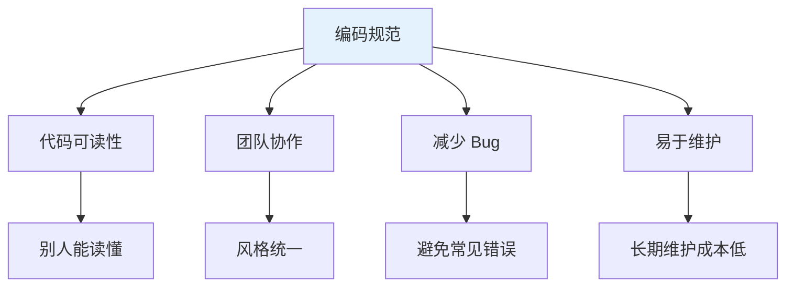

# 第21课：Swift 编码规范

## 📖 学习目标
- 掌握 Swift 命名规范
- 了解代码格式最佳实践
- 学会编写清晰的注释
- 避免常见的编码错误
- 养成良好的编程习惯

---

## 为什么需要编码规范？

**编码规范是什么？简单来说，编码规范就是写代码的"礼仪"，让大家都能读懂你的代码。**

想象一下：
- **没有规范**：每个人写代码的风格都不一样，读别人的代码像在读外语
- **有规范**：大家遵循同样的规则，代码像一本统一风格的书

### 编码规范的好处



---

## 命名规范

### 1. 驼峰命名法（Camel Case）

Swift 使用驼峰命名法，有两种形式：

| 类型 | 规则 | 示例 |
|------|------|------|
| 小驼峰 | 首字母小写 | `firstName`, `getUserInfo()` |
| 大驼峰 | 首字母大写 | `Person`, `NetworkManager` |

### 2. 变量和常量命名

**规则：**
- 使用有意义的名字
- 使用小驼峰命名法
- 避免缩写（除非是常用缩写）

```swift
// ✅ 好的命名
var userName = "张三"
let maximumRetryCount = 3
var isLoggedIn = true

// ❌ 不好的命名
var un = "张三"          // 太短，不知道是什么
let mrc = 3             // 缩写不清晰
var flag = true         // 太模糊
```

### 3. 函数命名

**规则：**
- 使用动词开头
- 描述函数的功能
- 使用小驼峰命名法

```swift
// ✅ 好的命名
func fetchUserData() { }
func calculateArea(width: Double, height: Double) -> Double { }
func isValidEmail(_ email: String) -> Bool { }

// ❌ 不好的命名
func data() { }           // 不知道做什么
func calc(w: Double, h: Double) -> Double { }  // 缩写不清晰
func check(_ s: String) -> Bool { }  // 太模糊
```

### 4. 类型命名

**规则：**
- 使用名词
- 使用大驼峰命名法
- 协议通常以 `-able`、`-ible` 或 `-ing` 结尾

```swift
// ✅ 好的命名
struct UserProfile { }
class NetworkManager { }
protocol Drawable { }
protocol Identifiable { }

// ❌ 不好的命名
struct Data { }           // 太通用
class Manager { }         // 不知道管理什么
```

### 5. 布尔值命名

**规则：**
- 使用 `is`、`has`、`can`、`should` 等前缀
- 让人一眼就知道是布尔值

```swift
// ✅ 好的命名
var isLoggedIn = true
var hasPermission = false
var canEdit = true
var shouldRefresh = false

// ❌ 不好的命名
var login = true          // 不知道是布尔值
var permission = false    # 不清晰
```

---

## 代码格式

### 1. 缩进

使用 **4 个空格** 进行缩进（Xcode 默认设置）。

```swift
// ✅ 正确的缩进
func calculateArea(width: Double, height: Double) -> Double {
    let area = width * height
    return area
}

// ❌ 错误的缩进
func calculateArea(width: Double, height: Double) -> Double {
let area = width * height
return area
}
```

### 2. 大括号

**规则：**
- 左大括号 `{` 放在同一行
- 右大括号 `}` 单独一行

```swift
// ✅ 正确
if condition {
    // 代码
} else {
    // 代码
}

// ❌ 错误
if condition
{
    // 代码
}
else
{
    // 代码
}
```

### 3. 空格

**规则：**
- 运算符两边加空格
- 逗号后面加空格
- 冒号后面加空格

```swift
// ✅ 正确
let sum = a + b
let names = ["张三", "李四", "王五"]
let point = Point(x: 10, y: 20)

// ❌ 错误
let sum=a+b
let names = ["张三","李四","王五"]
let point = Point(x:10, y:20)
```

### 4. 空行

**规则：**
- 函数之间加空行
- 逻辑代码块之间加空行
- 不要超过 2 个连续空行

```swift
// ✅ 正确
func fetchData() {
    // 代码
}

func processData() {
    // 代码
}

// ❌ 错误
func fetchData() {
    // 代码
}
func processData() {
    // 代码
}
```

### 5. 行长度

**规则：**
- 每行不超过 120 个字符
- 超过时换行

```swift
// ✅ 正确
func fetchUserData(
    userId: String,
    completion: @escaping (Result<User, Error>) -> Void
) {
    // 代码
}

// ❌ 太长
func fetchUserData(userId: String, completion: @escaping (Result<User, Error>) -> Void) {
    // 代码
}
```

---

## 注释规范

### 1. 单行注释

```swift
// 计算圆的面积
let area = Double.pi * radius * radius

// 检查用户是否登录
if isLoggedIn {
    // 显示主页
}
```

### 2. 多行注释

```swift
/*
 * 计算两点之间的距离
 * 使用勾股定理：c² = a² + b²
 * 返回两点之间的直线距离
 */
func distance(from p1: Point, to p2: Point) -> Double {
    let dx = p2.x - p1.x
    let dy = p2.y - p1.y
    return sqrt(dx * dx + dy * dy)
}
```

### 3. 文档注释

```swift
/// 计算两个数的和
///
/// - Parameters:
///   - a: 第一个加数
///   - b: 第二个加数
/// - Returns: 两个数的和
///
/// - Example:
///   ```
///   let result = add(3, 5)  // 返回 8
///   ```
func add(_ a: Int, _ b: Int) -> Int {
    return a + b
}
```

### 4. MARK 注释

使用 `// MARK: -` 来组织代码结构：

```swift
class ViewController: UIViewController {

    // MARK: - Properties

    var name: String = ""
    var age: Int = 0

    // MARK: - Lifecycle

    override func viewDidLoad() {
        super.viewDidLoad()
    }

    // MARK: - Actions

    @objc func buttonTapped() {
        // 代码
    }

    // MARK: - Private Methods

    private func setupUI() {
        // 代码
    }
}
```

---

## 最佳实践

### 1. 使用 `let` 优先

```swift
// ✅ 好：使用 let
let name = "张三"
let age = 18

// ❌ 不好：不必要的 var
var name = "张三"
var age = 18
```

**为什么？**
- `let` 声明的常量不会被意外修改
- 编译器可以优化
- 代码意图更清晰

### 2. 使用类型推断

```swift
// ✅ 好：让 Swift 推断类型
let name = "张三"           // 推断为 String
let age = 18               // 推断为 Int
let height = 1.75          // 推断为 Double

// ❌ 不好：不必要的类型标注
let name: String = "张三"
let age: Int = 18
let height: Double = 1.75
```

**什么时候需要类型标注？**
- 当类型不明显时
- 当需要特定类型时（如 `Float` 而不是 `Double`）

### 3. 使用 guard 提前退出

```swift
// ✅ 好：使用 guard
func processUser(user: User?) {
    guard let user = user else {
        print("用户为空")
        return
    }

    // 使用 user
    print(user.name)
}

// ❌ 不好：嵌套 if
func processUser(user: User?) {
    if let user = user {
        print(user.name)
    } else {
        print("用户为空")
    }
}
```

### 4. 避免强制解包

```swift
// ❌ 危险：强制解包
let name = optionalName!  // 如果为 nil 会崩溃

// ✅ 安全：使用 if let
if let name = optionalName {
    print(name)
}

// ✅ 安全：使用 guard
guard let name = optionalName else {
    return
}
print(name)

// ✅ 安全：使用 ??
let name = optionalName ?? "默认值"
```

### 5. 使用枚举代替魔术数字

```swift
// ❌ 不好：魔术数字
if status == 1 {
    // 处理成功
} else if status == 2 {
    // 处理失败
} else if status == 3 {
    // 处理加载中
}

// ✅ 好：使用枚举
enum Status {
    case success
    case failure
    case loading
}

if status == .success {
    // 处理成功
} else if status == .failure {
    // 处理失败
} else if status == .loading {
    // 处理加载中
}
```

### 6. 使用协议定义接口

```swift
// ✅ 好：使用协议
protocol UserService {
    func fetchUser(id: String) -> User?
    func saveUser(_ user: User)
}

class APIService: UserService {
    func fetchUser(id: String) -> User? { }
    func saveUser(_ user: User) { }
}

class MockService: UserService {
    func fetchUser(id: String) -> User? { }
    func saveUser(_ user: User) { }
}
```

### 7. 避免代码重复

```swift
// ❌ 不好：重复代码
func calculateAreaOfCircle(radius: Double) -> Double {
    return Double.pi * radius * radius
}

func calculateAreaOfSquare(side: Double) -> Double {
    return side * side
}

// ✅ 好：使用协议和泛型
protocol Shape {
    func area() -> Double
}

struct Circle: Shape {
    var radius: Double
    func area() -> Double {
        return Double.pi * radius * radius
    }
}

struct Square: Shape {
    var side: Double
    func area() -> Double {
        return side * side
    }
}
```

---

## 常见错误避免

### 1. 忘记处理可选值

```swift
// ❌ 错误
let text: String? = nil
print(text.count)  // 编译错误

// ✅ 正确
let text: String? = nil
print(text?.count ?? 0)
```

### 2. 忽略警告

```swift
// ❌ 不好：忽略警告
let unusedVariable = 10

// ✅ 好：删除或使用
let usedVariable = 10
print(usedVariable)
```

### 3. 过度使用全局变量

```swift
// ❌ 不好：全局变量
var globalCounter = 0

// ✅ 好：使用类或结构体封装
class Counter {
    private var count = 0

    func increment() {
        count += 1
    }
}
```

### 4. 硬编码

```swift
// ❌ 不好：硬编码
let url = "https://api.example.com/users"

// ✅ 好：使用常量
enum API {
    static let baseURL = "https://api.example.com"
    static let usersEndpoint = "/users"
}
```

### 5. 过长的函数

```swift
// ❌ 不好：函数太长
func processOrder() {
    // 100 行代码...
}

// ✅ 好：拆分成小函数
func processOrder() {
    validateOrder()
    calculateTotal()
    applyDiscount()
    saveOrder()
    sendConfirmation()
}
```

---

## 代码组织

### 1. 文件结构

```swift
// MARK: - 导入
import UIKit

// MARK: - 类定义
class ViewController: UIViewController {

    // MARK: - 常量
    private enum Constants {
        static let cellHeight: CGFloat = 60
    }

    // MARK: - 属性
    private var items: [String] = []

    // MARK: - 生命周期
    override func viewDidLoad() {
        super.viewDidLoad()
        setupUI()
    }

    // MARK: - 公开方法
    func configure(with items: [String]) {
        self.items = items
    }

    // MARK: - 私有方法
    private func setupUI() {
        // 代码
    }
}
```

### 2. 扩展组织

```swift
// MARK: - UITableViewDataSource
extension ViewController: UITableViewDataSource {
    func tableView(_ tableView: UITableView, numberOfRowsInSection section: Int) -> Int {
        return items.count
    }

    func tableView(_ tableView: UITableView, cellForRowAt indexPath: IndexPath) -> UITableViewCell {
        // 代码
    }
}

// MARK: - UITableViewDelegate
extension ViewController: UITableViewDelegate {
    func tableView(_ tableView: UITableView, didSelectRowAt indexPath: IndexPath) {
        // 代码
    }
}
```

---

## 📝 练习题

### 练习1：命名改进
改进以下代码的命名：

```swift
var n = "张三"
var a = 18
func f() -> Bool {
    return a >= 18
}
```

```swift
// 在这里写你的改进代码

```

### 练习2：代码格式
格式化以下代码：

```swift
func calculate(a:Int,b:Int)->Int{let sum=a+b;return sum}
```

```swift
// 在这里写你的格式化代码

```

### 练习3：添加注释
为以下函数添加文档注释：

```swift
func divide(_ a: Double, by b: Double) -> Double? {
    guard b != 0 else { return nil }
    return a / b
}
```

```swift
// 在这里写你的带注释代码

```

### 练习4：重构代码
使用最佳实践重构以下代码：

```swift
func processUser(name: String?, age: Int?) {
    if name != nil {
        if age != nil {
            if age! >= 18 {
                print("成年人：\(name!)")
            } else {
                print("未成年人：\(name!)")
            }
        }
    }
}
```

```swift
// 在这里写你的重构代码

```

### 练习5：代码组织
将以下代码组织成良好的结构：

```swift
class ViewController: UIViewController {
    var name: String = ""
    override func viewDidLoad() { super.viewDidLoad(); setupUI() }
    func setupUI() { }
    func loadData() { }
    func tableView(_ tableView: UITableView, numberOfRowsInSection section: Int) -> Int { return 0 }
    func tableView(_ tableView: UITableView, cellForRowAt indexPath: IndexPath) -> UITableViewCell { return UITableViewCell() }
}
```

```swift
// 在这里写你的组织代码

```

---

## ✅ 练习题参考答案

> 💡 **提示：** 建议先独立完成练习，再查看答案

---

### 练习1
```swift
var userName = "张三"
var userAge = 18

func isAdult() -> Bool {
    return userAge >= 18
}
```

### 练习2
```swift
func calculate(a: Int, b: Int) -> Int {
    let sum = a + b
    return sum
}
```

### 练习3
```swift
/// 执行除法运算
///
/// - Parameters:
///   - a: 被除数
///   - b: 除数
/// - Returns: 除法结果，如果除数为 0 则返回 nil
///
/// - Example:
///   ```
///   let result = divide(10, by: 2)  // 返回 5.0
///   let error = divide(10, by: 0)   // 返回 nil
///   ```
func divide(_ a: Double, by b: Double) -> Double? {
    guard b != 0 else { return nil }
    return a / b
}
```

### 练习4
```swift
func processUser(name: String?, age: Int?) {
    guard let name = name else {
        print("用户名为空")
        return
    }

    guard let age = age else {
        print("年龄为空")
        return
    }

    if age >= 18 {
        print("成年人：\(name)")
    } else {
        print("未成年人：\(name)")
    }
}
```

### 练习5
```swift
class ViewController: UIViewController {

    // MARK: - Properties

    var name: String = ""

    // MARK: - Lifecycle

    override func viewDidLoad() {
        super.viewDidLoad()
        setupUI()
    }

    // MARK: - Private Methods

    private func setupUI() {
        // 代码
    }

    private func loadData() {
        // 代码
    }
}

// MARK: - UITableViewDataSource

extension ViewController: UITableViewDataSource {
    func tableView(_ tableView: UITableView, numberOfRowsInSection section: Int) -> Int {
        return 0
    }

    func tableView(_ tableView: UITableView, cellForRowAt indexPath: IndexPath) -> UITableViewCell {
        return UITableViewCell()
    }
}
```

---

## 🎯 小结

### 命名规范
| 类型 | 规则 | 示例 |
|------|------|------|
| 变量/常量 | 小驼峰 | `userName`, `maxCount` |
| 函数 | 小驼峰，动词开头 | `fetchData()`, `isValid()` |
| 类型 | 大驼峰 | `User`, `NetworkManager` |
| 布尔值 | `is`/`has`/`can` 前缀 | `isLoggedIn`, `hasPermission` |

### 代码格式
- ✅ 使用 4 空格缩进
- ✅ 运算符两边加空格
- ✅ 函数之间加空行
- ✅ 每行不超过 120 字符

### 最佳实践
- ✅ 优先使用 `let`
- ✅ 使用类型推断
- ✅ 使用 `guard` 提前退出
- ❌ 避免强制解包
- ❌ 避免魔术数字
- ❌ 避免代码重复

**记忆口诀：**
> - **命名要清晰**：一看就知道是什么
> - **格式要统一**：缩进、空格、空行
> - **注释要说明**：为什么这样做
> - **代码要简洁**：避免重复，职责单一

---

**上一课：[第20课：Range和区间](第20课：Range和区间.md)**

**下一课：[第22课：常见错误和调试](第22课：常见错误和调试.md)**
